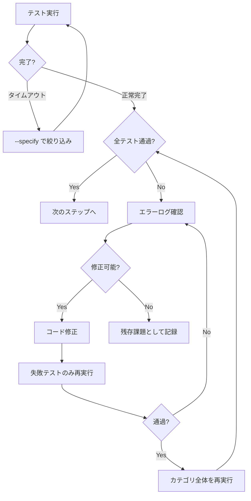

  失敗を調査して修正するループを回す。
  「全テストを実行して」「プロジェクト全体を検証して」「テスト失敗を修正して」と
  ユーザーが依頼した場合に使用する。
---

# Run All Tests

全てのビルドとテストを実行し、失敗があれば原因を調査して修正し、再度テストするループを回す。

> [!IMPORTANT]
> テスト実行の詳細ルール（Linux/Remote-SSH 対応、エラー修正フロー、タイムアウト方針等）は
> `prompts/rules/testing-rules.md` を参照すること。

---

## Phase 1: Full Build & Unit Test

プロジェクト全体のビルドと単体テストを実行する。
統合テストは最新のビルド成果物に対して行うため、**必ずこのフェーズを先に通す**。

// turbo
./scripts/process/build.sh

- 失敗した場合 → エラーログを確認し修正 → `build.sh` を再実行
- 全て通過するまで繰り返す

## Phase 2: 選択的実行プランの作成

`integration_test.sh` は全カテゴリを一括実行すると非常に長時間かかるため、**選択的実行プラン**を立ててカテゴリ単位で分割実行する。

### 2.1 利用可能なカテゴリの発見

カテゴリは将来追加される可能性があるため、**決め打ちせず毎回動的に発見する**。

1. **ヘルプ出力を確認**:
   ```bash
   ./scripts/process/integration_test.sh --help
   ```
   `Available categories:` の行からカテゴリ一覧を取得する。

2. **バックエンドテストディレクトリを走査**:
   ```bash
   ls -d features/backend/tests/*/
   ```
   `testdata` 等のテスト非対象ディレクトリを除外する。

3. **フロントエンド（GUI）テストの有無を確認**:
   `features/frontend/scripts/integration_test.sh` が存在すれば `gui` カテゴリも対象。

4. **カテゴリ実行順序の確認**:
   `features/backend/scripts/integration_test.sh` 内の `GO_CATEGORY_ORDER` 配列から推奨順序を取得。

> **重要**: 常にこの動的発見の結果を使用すること。ワークフロー内のハードコードされたカテゴリ名は使わない。

### 2.2 実行プランの策定

1. 発見した全カテゴリについて実行順序を決定する。
2. テストケースが多い場合は `--specify` で正規表現フィルタを使い分割する。

```
実行プラン:
1. {category_a} : --categories "{category_a}"
2. {category_b} : --categories "{category_b}"
...
N. gui          : --categories "gui"
```

## Phase 3: 選択的実行ループ

プランに沿って、各ステップを順番に実行する。



### 修正時の注意事項

- 修正は最小限にとどめる。
- 修正完了時には `git commit` でこまめにコミットする。
- 修正後はまず `--specify` で失敗テストのみ再実行 → 通過後にカテゴリ全体を再実行。

## Phase 4: 最終確認

全カテゴリのテストが通過したら、全体を通しで再確認する。

> **判断**: Phase 3 で修正が一切なかった場合、Phase 4 はスキップしてよい。
> 修正があった場合はリグレッション確認のため必ず実施する。

## Phase 5: 結果レポート & Push

全フェーズ完了後、以下をユーザーに報告する:

- **ビルド結果**: 成功 / 失敗回数
- **テスト結果**: カテゴリごとの成功 / 失敗テスト数
- **修正内容**: 修正したファイルと変更の概要
- **残存課題**: 解決できなかった問題がある場合はその詳細

全テスト成功後に `git push` を実施する。失敗状態ではプッシュしない。
