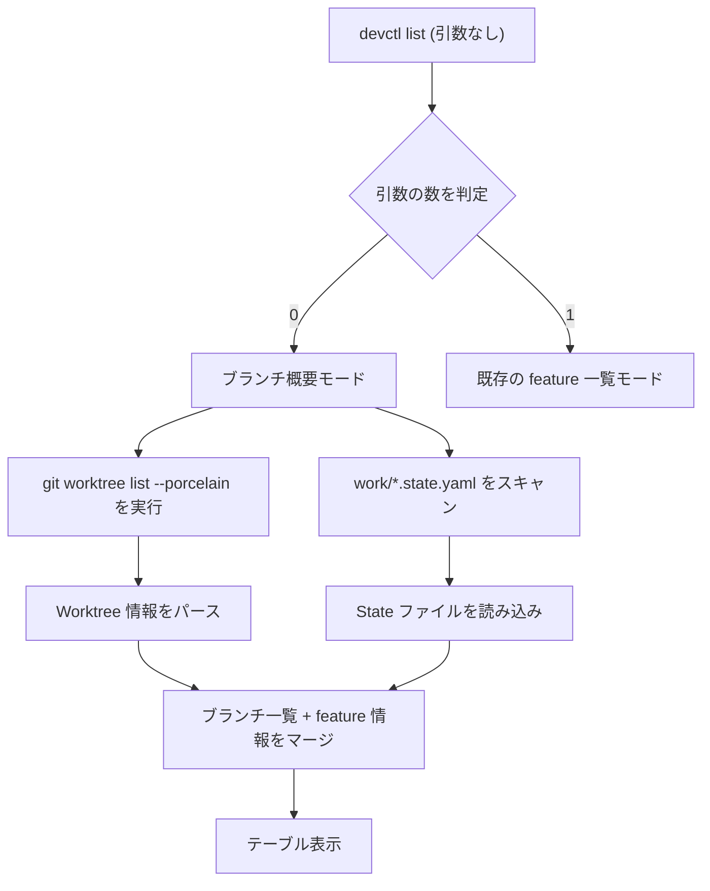

# devctl list コマンドの強化: 引数なし実行でブランチ・feature 一覧表示

## 背景 (Background)

現在の `devctl list` コマンドは `<branch>` 引数が必須であり、特定のブランチ配下の feature 一覧を表示する機能のみを持つ。引数なしで実行するとエラーが発生する:

```
$ ./bin/devctl list
Error: accepts 1 arg(s), received 0
```

一方、ユーザーは `devctl list` を**引数なしで手軽に実行**して、現在 Worktree 化されているブランチの一覧と各ブランチの feature 一覧を俯瞰的に確認したいというニーズがある。

### 現在の状態

- `devctl list <branch>`: 特定ブランチの feature 一覧を state ファイルから表示 ✅
- `devctl list` (引数なし): エラー ❌

### 関連する情報源

- **state ファイル** (`work/<branch>.state.yaml`): ブランチごとの feature 情報を保持
- **`git worktree list`**: 現在の Git Worktree 一覧を表示
- **`work/` ディレクトリ**: Worktree が作成されるディレクトリ

## 要件 (Requirements)

### 必須要件

1. **`devctl list` を引数なしで実行できるようにする**
   - `cobra.ExactArgs(1)` → `cobra.MaximumNArgs(1)` に変更
   - 引数なしの場合は「ブランチ概要モード」として動作する

2. **ブランチ概要モードの表示内容**
   - Worktree 化されているブランチの一覧を表示する
   - 各ブランチに紐づく feature の情報（存在する場合）を表示する
   - 情報源として以下の2つを組み合わせる:
     - `git worktree list --porcelain` の出力（実際の Worktree 一覧）
     - `work/*.state.yaml` ファイル（feature 情報）

3. **表示フォーマット**
   - カラム順: `BRANCH`, `FEATURES`, `PATH`
   - `PATH` カラムは `--path` フラグを付けた場合のみ表示する
   - feature がある場合は、feature 名とステータスを表示（例: `devctl[active]`）
   - 見やすいテーブル形式で出力

4. **既存の `devctl list <branch>` の動作は変更しない**
   - 引数が1つ指定された場合は、従来通り特定ブランチの feature 詳細を表示する

5. **`--json` フラグによる JSON 出力のサポート**
   - 引数なしモード・ブランチ指定モード両方で JSON 出力に対応する
   - マシンリーダブルな形式で同等の情報を出力する

6. **`--path` フラグによる PATH 表示**
   - 引数なしモードで `--path` を付けると `PATH` カラムを追加表示する

## 実現方針 (Implementation Approach)

### アーキテクチャ概要



### 主要な変更箇所

#### 1. `cmd/list.go`
- `cobra.ExactArgs(1)` → `cobra.MaximumNArgs(1)` に変更
- `runList` 関数に分岐を追加:
  - `len(args) == 0` → `runListBranches()` (新規関数)
  - `len(args) == 1` → 既存のロジック

#### 2. 新規関数 `runListBranches`
- `git worktree list --porcelain` を実行して Worktree 一覧を取得
- `work/*.state.yaml` を glob で検索して state ファイルを読み込み
- 両者をマージしてテーブル形式で出力

#### 3. `InitContext` の呼び出し調整
- 引数なしの場合、`InitContext` は branch が必須のため呼び出し方を調整する必要がある
- ブランチ概要モードでは `InitContext` を使わず、軽量な初期化のみ行う

### 出力イメージ

**デフォルト（`--path` なし）:**

```
Branches:
BRANCH                  FEATURES
feat-catalog            (no state)
feat-devctl-list-up     devctl[active]
main                    (main worktree)
```

**`--path` 付き:**

```
Branches:
BRANCH                  FEATURES             PATH
feat-catalog            (no state)           C:/Users/yamya/myprog/tokotachi/work/feat-catalog
feat-devctl-list-up     devctl[active]       C:/Users/yamya/myprog/tokotachi/work/feat-devctl-list-up
main                    (main worktree)      C:/Users/yamya/myprog/tokotachi
```

**`--json` 付き:**

```json
[
  {"branch": "feat-catalog", "path": "C:/Users/.../work/feat-catalog", "features": []},
  {"branch": "feat-devctl-list-up", "path": "C:/Users/.../work/feat-devctl-list-up", "features": [{"name": "devctl", "status": "active"}]},
  {"branch": "main", "path": "C:/Users/.../tokotachi", "features": [], "main_worktree": true}
]
```

> [!NOTE]
> `main` ブランチ（ベアリポジトリの worktree）は参考情報として表示するが、feature 操作の対象外であることを示す。

## 検証シナリオ (Verification Scenarios)

### シナリオ 1: 引数なしで list を実行

1. `devctl list` を引数なしで実行する
2. 現在 Worktree 化されているブランチの一覧が表示される
3. 各ブランチについて、ブランチ名、パス、feature 情報が表示される
4. エラーが発生しない

### シナリオ 2: 既存動作の後方互換性

1. `devctl list <branch>` を既存のブランチ名で実行する
2. 従来通り、そのブランチの feature 一覧が表示される
3. 出力フォーマットが変更されていない

### シナリオ 3: state ファイルがないブランチ

1. Worktree は存在するが state ファイルがないブランチがある状態で `devctl list` を実行
2. そのブランチが一覧に表示される
3. feature 情報の列には「(no state)」などの表記が表示される

### シナリオ 4: Worktree がないが state ファイルがある場合

1. state ファイルは残っているが Worktree が削除された場合
2. state ファイルの情報はブランチ一覧に表示されないか、orphaned として表示される

## テスト項目 (Testing for the Requirements)

### 単体テスト

| 要件 | テスト内容 | テストファイル |
|------|-----------|--------------|
| R1 | 引数0個で cobra がエラーを返さないこと | `cmd/list_test.go` (新規) |
| R2 | `git worktree list --porcelain` 出力のパース | `cmd/list_test.go` (新規) |
| R2 | state ファイルの glob スキャン結果と worktree のマージ | `cmd/list_test.go` (新規) |
| R4 | 引数1個で従来の feature 一覧が返ること | `cmd/list_test.go` (新規) |
| R5 | `--json` フラグで JSON 出力が返ること | `cmd/list_test.go` (新規) |
| R6 | `--path` フラグで PATH カラムが追加されること | `cmd/list_test.go` (新規) |
| R6 | `--path` なしで PATH カラムが表示されないこと | `cmd/list_test.go` (新規) |

### ビルド検証

```bash
# 全体ビルド & 単体テスト
./scripts/process/build.sh
```

### 統合テスト

```bash
# 統合テスト実行
./scripts/process/integration_test.sh
```
