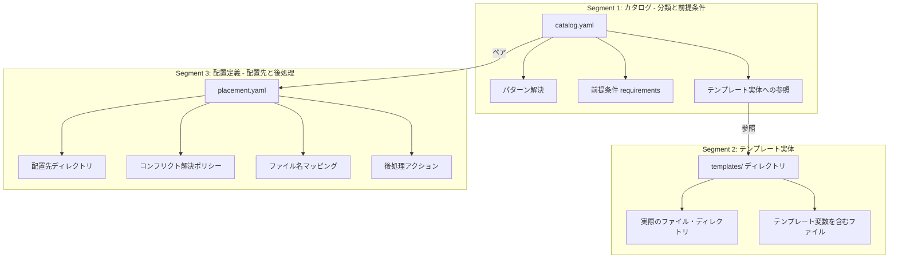
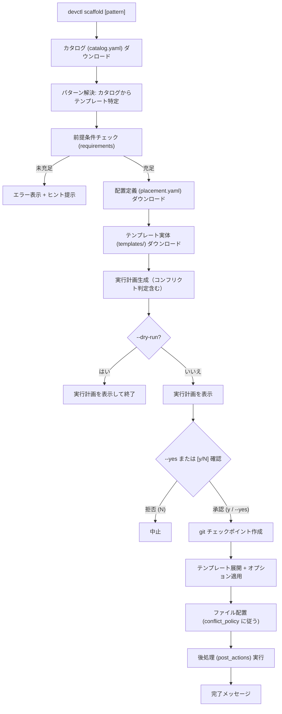
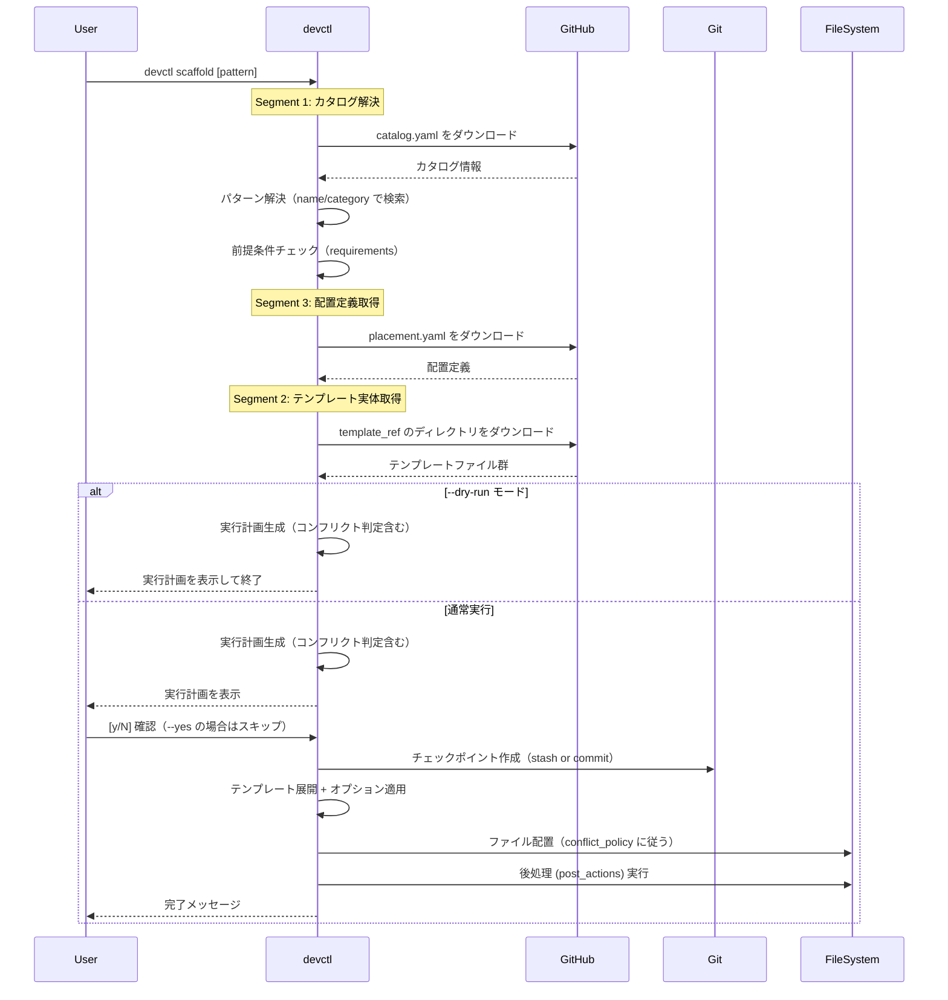
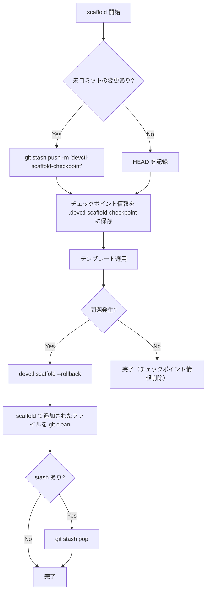

# devctl scaffold コマンド

## 背景 (Background)

`tokotachi` プロジェクトでは、新しいリポジトリや機能を開始する際に、毎回同じディレクトリ構造を手作業で作成する必要がある。これは時間がかかるだけでなく、構造の不統一やファイルの作り忘れの原因にもなる。

現状、標準的なプロジェクト構成（`features/`, `prompts/`, `scripts/`, `shared/`, `work/`）は暗黙的に期待されているが、それを自動生成する仕組みが存在しない。

さらに将来的には、各featureに対してもテンプレートを展開する需要がある（例: `features go-standard` で Go 標準構成を生成）。これらのテンプレートは数が増える可能性が高く、devctl バイナリに内包すると管理・拡張に限界がある。

そこで、**外部リポジトリからテンプレート（scaffold）をダウンロードして適用する仕組み**を導入する。テンプレートの管理は **3 つのセグメント**（分類+前提条件 / テンプレート実体 / 配置先+後処理）に分離し、柔軟で拡張可能な設計とする。

## 要件 (Requirements)

### 必須要件 (Must)

#### R1: 基本コマンド

- `devctl scaffold` をサブコマンドとして追加する。
- 引数なし（パターン未指定）の場合、外部リポジトリから**デフォルトテンプレート**をダウンロードして適用する。
- パターン指定・未指定にかかわらず、**すべてのテンプレートは外部リポジトリから取得**する。

#### R2: デフォルトのプロジェクト構成

パターン未指定時にデフォルトテンプレートが適用される。テンプレートの内容（ディレクトリ構造・ファイル）は **外部リポジトリ (`tokotachi-scaffolds`) に定義される**。

現時点で想定されるデフォルト構成:

```
features/
features/README.md
prompts/
prompts/phases/README.md
prompts/phases/000-foundation/
prompts/phases/000-foundation/ideas/.gitkeep
prompts/phases/000-foundation/plans/.gitkeep
prompts/rules/.gitkeep
scripts/.gitkeep
shared/README.md
shared/libs/README.md
work/README.md
```

- devctl 側にこの構成をハードコードしない。テンプレートの変更は外部リポジトリの更新のみで反映される。

#### R3: メタデータ駆動の後処理

- `.gitignore` へのエントリ追加などの後処理は、テンプレートのメタデータ（配置定義）で宣言的に定義する。
- devctl はメタデータを読み取り、指定されたアクションを実行する。
- すでに存在するエントリは重複追加しない。
- これにより、どのテンプレートでもメタデータで柔軟に後処理を指定できる。

#### R4: パターン指定によるテンプレート展開

- `devctl scaffold [pattern]` で任意のパターンを指定できる。
- パターンはカテゴリ＋サブパターンの形式をサポートする:
  - `devctl scaffold features`（カテゴリのみ）
  - `devctl scaffold features go-standard`（カテゴリ+サブパターン）
- **コマンド引数とリポジトリ内のフォルダ構造は直接マッピングしない**。分類メタデータを介した間接参照で解決する。

#### R5: 外部リポジトリからのダウンロード

- **すべてのテンプレート**を、外部リポジトリ `https://github.com/axsh/tokotachi-scaffolds` からダウンロードする。
- パターン未指定時は、カタログのトップレベルで定義された `default_scaffold` のテンプレートを自動選択する。
- このリポジトリをデフォルトのソースとする。

#### R6: 前提条件チェック

- テンプレートの適用前に、現在のフォルダ構成が前提条件を満たしているかチェックする。
- 例: `features/go-standard` テンプレートは `features/` ディレクトリの存在を要求する。
- 前提条件が満たされない場合はエラーメッセージを表示し、必要なテンプレート（例: `default`）の事前適用を促す。

#### R7: コンフリクト解決ポリシー

- テンプレート展開時に既存ファイル/ディレクトリとの衝突が発生した場合の振る舞いを、配置定義で指定する。
- サポートするポリシー:
  - `skip`: 既存ファイルがあればスキップ（デフォルト）
  - `overwrite`: 既存ファイルを上書き
  - `append`: 既存ファイルに追記
  - `error`: 既存ファイルがあればエラーで中止

#### R8: 実行計画の表示とユーザー確認

- scaffold は実行前に必ず**実行計画（dry-run 相当）**を表示する。実行計画には以下を含む:
  - 作成されるファイル・ディレクトリの一覧
  - **コンフリクト判定結果**（R7）: 既存ファイルとの衝突がある場合、各ファイルごとに適用されるポリシー（skip/overwrite/append/error）を明示
  - 後処理アクションの内容（`.gitignore` への追加等）
- 実行計画表示後、`[y/N]` でユーザーの確認を取る。拒否時は何もしない。
- `--dry-run` フラグ: 実行計画の表示のみで終了（確認プロンプトも表示しない）。
- `--yes` フラグ: `[y/N]` 確認をスキップし、即座に実行する。

#### R9: チェックポイントとロールバック

- テンプレート適用前に **git を利用したチェックポイント** を作成する。
- 適用後に問題が発生した場合、ロールバックで適用前の状態に復元できる。
- `devctl scaffold --rollback` で直前の scaffold 操作を取り消す。

#### R10: テンプレートオプション

- テンプレートごとにカタログ（`catalog.yaml`）で定義された**オプション変数**を、`devctl` コマンドのフラグとして指定できる。
  - 例: `devctl scaffold features go-standard --Name my-feature --GoModule github.com/example/my-feature`
- オプション値はテンプレート内のファイル内容やフォルダ名、配置定義の `base_dir` 等に Go template 構文（`{{.Name}}`）で埋め込まれる。
- **必須オプションが未指定の場合**: インタラクティブにプロンプトを表示してユーザーに入力を求める。
  - 例: `? Name (Feature name): ` のように、オプションの `description` をヒントとして表示する。
- デフォルト値が設定されているオプションは、未指定時にデフォルト値が適用される。

#### R11: 利用可能テンプレート一覧

- `devctl scaffold --list` で、利用可能なテンプレートの一覧を表示する。

#### R12: リポジトリ変更オプション

- `--repo <url>` フラグで、テンプレートのソースリポジトリを指定できる。

#### R13: Loading アニメーション

- 外部リポジトリへのアクセス中（カタログ取得、メタデータ取得、テンプレートダウンロード等）は、CLI 上にスピナー（Loading アニメーション）を表示する。
- 処理中であることをユーザーに視覚的にフィードバックし、フリーズと誤認させない。
- 各フェーズごとに進捗メッセージを更新する（例: `⠋ Fetching catalog...` → `⠙ Downloading template...`）。

#### R14: テンプレートの多言語対応

- devctl は実行環境のロケール（`LANG`, `LC_ALL` 環境変数、Windows のシステムロケール）を検出する。
- テンプレートに言語別バージョンが存在する場合、それを優先的に取得する。
- **ロケールオーバーレイ方式**: テンプレートセットを言語ごとに丸ごと複製しない。テンプレートディレクトリ内を `base/` と `locale.{lang}/` に分け、言語固有のファイルのみを差分で上書きする。
  - `base/` はテンプレート作成者の得意な言語で実装してよい（英語必須ではない）。
  - 例: `project-default/base/features/README.md` + `project-default/locale.ja/features/README.md`
- 解決順序: **`locale.{lang}/` → `base/`**。`locale.{lang}/` が存在すればその中のファイルを優先、存在しなければ `base/` にフォールバック。
- `--lang <locale>` フラグで明示的にロケールを指定することも可能。

## 実現方針 (Implementation Approach)

### 3 セグメント設計

外部リポジトリ (`tokotachi-scaffolds`) のテンプレート管理は、**3 つのセグメント**に分離する。これが設計の核心である。



#### Segment 1: カタログ（分類 + 前提条件）

コマンド引数からテンプレートを特定し、適用可能かどうかを判定する。

**役割**:
- devctl のサブコマンド引数（`devctl scaffold features go-standard`）からテンプレートを検索・特定する
- テンプレート適用の前提条件（必要なディレクトリ・ファイルの存在）を定義する
- テンプレート実体の場所を参照（ポイント）する

**重要**: コマンド引数とリポジトリ内のフォルダ構造は直接マッピングしない。カタログが間接参照レイヤーとして機能する。

#### Segment 2: テンプレート実体

実際に展開されるファイル・ディレクトリの原本。

**役割**:
- テンプレートファイルの実体を保持する
- テンプレート変数（`{{.Name}}` 等）を含むファイルも配置できる
- カタログからの参照先として機能する
- **ロケールオーバーレイ**: テンプレートディレクトリ内に `base/`（言語中立）と `locale.{lang}/`（言語固有差分）を並べる。解決順序は `locale.{lang}/ → base/`。`base/` の言語はテンプレート作成者の自由。

#### Segment 3: 配置定義（配置先 + 後処理）

テンプレートをどこに、どのように配置し、追加で何を行うかを定義する。

**役割**:
- テンプレートの配置先（リポジトリルートからの相対パス）を指定する
- 既存ファイルとのコンフリクト解決ポリシーを定義する
- ファイル名のマッピング（テンプレートファイル名 → 実際のファイル名）を定義する
- `.gitignore` 編集などの後処理アクションを宣言する

---

### 外部リポジトリ (`tokotachi-scaffolds`) の設計

#### リポジトリ構造

```
tokotachi-scaffolds/
  catalog.yaml                 # カタログ（Segment 1: 分類 + 前提条件 + 参照）
  templates/                   # テンプレート実体（Segment 2）
    project-default/           # デフォルトプロジェクト構成
      base/                    # ベース（作成者の得意な言語で実装）
        features/
          README.md
        prompts/
          phases/
            README.md
            000-foundation/
              ideas/.gitkeep
              plans/.gitkeep
          rules/.gitkeep
        scripts/.gitkeep
        shared/
          README.md
          libs/
            README.md
        work/
          README.md
      locale.ja/               # 日本語オーバーレイ（差分ファイルのみ）
        features/
          README.md
        prompts/
          phases/
            README.md
        shared/
          README.md
          libs/
            README.md
        work/
          README.md
    feature-go/                # Go feature テンプレート
      base/
        feature.yaml.tmpl
        go.mod.tmpl
        main.go.tmpl
        internal/
          ...
    feature-python/            # Python feature テンプレート
      base/
        ...
  placements/                  # 配置定義（Segment 3: 配置先 + 後処理）
    default.yaml               # デフォルト構成の配置定義
    features-go-standard.yaml  # Go feature の配置定義
    features-python.yaml       # Python feature の配置定義
```

> [!NOTE]
> 各テンプレートディレクトリ内に `base/` と `locale.{lang}/` を並べる。
> `base/` の言語はテンプレート作成者の得意な言語でよい（英語必須ではない）。
> `locale.{lang}/` には `base/` と同じディレクトリ構造で、差異のあるファイルのみを配置。
> 解決順序: `locale.{lang}/` のファイル → `base/` のファイル。
> 例: `locale.en` が存在しない場合は `base/` のみ使用。`locale.ja` が存在する場合は `locale.ja` → `base` の順に解決。

> [!IMPORTANT]
> テンプレート名（`devctl scaffold default`）はカタログ内の `name` フィールドで解決され、
> リポジトリのフォルダ名（`templates/project-default/`）に直接マッピングしない。
> これにより、フォルダ構造のリファクタリングがコマンド体系に影響しない。

#### Segment 1: カタログ形式 (`catalog.yaml`)

```yaml
# catalog.yaml - テンプレートの分類・検索・前提条件
version: "1.0.0"

# パターン未指定時に適用されるデフォルトテンプレート（トップレベルで一意に指定）
default_scaffold: "default"

scaffolds:
  - name: "default"
    category: "root"
    description: "tokotachi 標準プロジェクト構成"
    # Segment 2 への参照: テンプレート実体の場所
    template_ref: "templates/project-default"
    # Segment 3 への参照: 配置定義の場所
    placement_ref: "placements/default.yaml"
    # 前提条件: なし（新規リポジトリに適用するため）
    requirements:
      directories: []
      files: []

  # features カテゴリ: Go 標準構成
  - name: "go-standard"
    category: "features"
    description: "Go 標準構成の feature テンプレート"
    template_ref: "templates/feature-go"
    placement_ref: "placements/features-go-standard.yaml"
    requirements:
      directories:
        - "features/"            # features/ が存在しなければ展開不可
      files: []
    # テンプレートオプション（動的に適用される変数）
    options:
      - name: "Name"
        description: "Feature name"
        required: true
      - name: "GoModule"
        description: "Go module path"
        required: false
        default: "github.com/axsh/tokotachi/features/{{.Name}}"
```

**パターン解決の仕組み**:

| コマンド | 解決方法 |
|---------|---------|
| `devctl scaffold` | `default_scaffold` で指定された名前のエントリを選択 |
| `devctl scaffold default` | `name: "default"` に一致 |
| `devctl scaffold features` | `category: "features"` の一覧を表示し選択を促す |
| `devctl scaffold features go-standard` | `category: "features"` かつ `name: "go-standard"` に一致 |

**前提条件チェック**:

```
requirements:
  directories:
    - "features/"      # このディレクトリが存在しなければエラー
  files:
    - ".devrc.yaml"    # このファイルが存在しなければエラー
```

前提条件が満たされない場合のエラー例:

```
Error: prerequisite not met for scaffold "go-standard"
  Missing directory: features/
  Hint: Run "devctl scaffold default" first to create the base project structure.
```

#### Segment 2: テンプレート実体

テンプレート実体は `templates/` 以下にフラットまたは階層的に配置される。カタログの `template_ref` によって参照される。

```
templates/
  project-default/       # カタログから template_ref: "templates/project-default" で参照
    features/
      README.md
    prompts/
      ...
  feature-go/            # カタログから template_ref: "templates/feature-go" で参照
    feature.yaml.tmpl
    go.mod.tmpl
    ...
```

- テンプレートの実フォルダ名はカタログ経由でのみ解決されるため、自由に命名できる。
- `.tmpl` 拡張子のファイルは Go template として処理される（Phase 3 で実装）。

#### Segment 3: 配置定義 (`placement.yaml`)

テンプレートをどこに・どのように配置し、追加で何を行うかを定義する。

##### default テンプレートの配置定義例

```yaml
# placements/default.yaml
version: "1.0.0"

# 配置先ベースディレクトリ（リポジトリルートからの相対パス）
base_dir: "."

# コンフリクト解決ポリシー（デフォルト）
conflict_policy: "skip"    # skip | overwrite | append | error

# テンプレート適用の設定
template_config:
  template_extension: ".tmpl"
  strip_extension: true

# ファイル名マッピング（テンプレート内のファイル名 → 実際のファイル名）
# ファイル名のテンプレート化が難しいケースに対応
file_mappings: []
#  - source: "dot-gitignore"      # テンプレート内のファイル名
#    target: ".gitignore"          # 実際のファイル名

# 後処理アクション
post_actions:
  # .gitignore への追記
  gitignore_entries:
    - "work/*"
  # 将来拡張: 他のアクション
  # shell_commands: []
  # file_permissions: []
```

##### features テンプレートの配置定義例

```yaml
# placements/features-go-standard.yaml
version: "1.0.0"

base_dir: "features/{{.Name}}"
conflict_policy: "error"     # feature ディレクトリが既存ならエラー

template_config:
  template_extension: ".tmpl"
  strip_extension: true

file_mappings:
  - source: "feature.yaml.tmpl"
    target: "feature.yaml"

post_actions:
  gitignore_entries: []
```

**コンフリクト解決ポリシーの詳細**:

| ポリシー | 振る舞い | ユースケース |
|---------|---------|------------|
| `skip` | 既存ファイルがあればスキップし、新規ファイルのみ作成 | デフォルト構成（冪等に実行可能） |
| `overwrite` | 既存ファイルを上書き | テンプレートの更新を強制適用 |
| `append` | 既存ファイルの末尾に追加 | 設定ファイルへの追記 |
| `error` | 既存ファイルがあればエラーで中止 | 新規作成専用テンプレート |

---

### devctl 側の設計

#### コマンド構造

```go
// cmd/scaffold.go
var scaffoldCmd = &cobra.Command{
    Use:   "scaffold [category] [name]",
    Short: "Generate project structure from templates",
    Long:  "Scaffold creates directory structures and files from predefined templates.",
    Args:  cobra.MaximumNArgs(2),  // [category] [name]
    RunE:  runScaffold,
}
```

フラグ:
- `--dry-run`: 実行計画の表示のみ（確認プロンプトなし、ファイル操作なし）
- `--yes`: `[y/N]` 確認をスキップして即座に実行
- `--rollback`: 直前の scaffold 操作を取り消す
- `--list`: 利用可能なテンプレートの一覧表示
- `--repo <url>`: テンプレートリポジトリの指定（将来）

#### パッケージ構成

```
features/devctl/internal/scaffold/
  scaffold.go      // メインロジック（Scaffold 関数、全体のオーケストレーション）
  catalog.go       // カタログ（Segment 1）の取得・パース・パターン解決
  downloader.go    // 外部リポジトリからのダウンロード
  placement.go     // 配置定義（Segment 3）のパース・検証
  applier.go       // テンプレートの適用（Segment 2 → Segment 3 に基づく配置）
  checkpoint.go    // git を利用したチェックポイント・ロールバック
```

---

### テンプレート展開の処理フロー



#### シーケンス図



---

### チェックポイントとロールバック

git を活用して、scaffold 操作の安全性を確保する。

#### チェックポイントの仕組み

テンプレート適用前に、現在のワーキングツリーの状態を保存する:

1. **未コミットの変更がない場合**: 現在の HEAD コミットをチェックポイントとして記録する。scaffold で作成されたファイルは `git clean` + `git checkout` でロールバック可能。
2. **未コミットの変更がある場合**: `git stash` で現在の変更を退避してからテンプレートを適用する。ロールバック時は scaffold で追加されたファイルを削除し、stash を復元する。



#### チェックポイント情報ファイル

```yaml
# .devctl-scaffold-checkpoint (一時ファイル、成功時に自動削除)
created_at: "2026-03-08T18:45:00+09:00"
scaffold_name: "default"
head_commit: "abc1234"
stash_ref: "stash@{0}"    # stash が作成された場合のみ
files_created:
  - "features/README.md"
  - "prompts/phases/README.md"
  - ...
files_modified:
  - path: ".gitignore"
    action: "append"
    original_content_hash: "sha256:..."
```

---

### ダウンロード方式

外部リポジトリからテンプレートを取得する方式:

1. **GitHub API (推奨)**: GitHub Contents API を使用して、必要なファイルのみをダウンロードする。
   - `GET /repos/{owner}/{repo}/contents/{path}` で `catalog.yaml` を取得
   - 指定パターンに対応する `placement.yaml` とテンプレートディレクトリのみをダウンロード
   - リポジトリ全体をクローンする必要がない
2. **フォールバック**: `git clone --depth 1 --sparse` を使ったスパースクローン

---

### 段階的な実装戦略

#### Phase 1: 基本機能 + 外部リポジトリ連携（本仕様の対象）

- `tokotachi-scaffolds` リポジトリの作成（`default` テンプレートのみ）
- 3セグメント設計: `catalog.yaml` + `templates/` + `placements/`
- `devctl scaffold` コマンドの実装
- GitHub API を使ったダウンロード機能
- カタログのパース・パターン解決
- 前提条件チェック
- 配置定義に基づくファイル展開（`conflict_policy: skip`）
- 後処理（`.gitignore` エントリ追加）
- `--dry-run` モード
- git チェックポイント・ロールバック

#### Phase 2: テンプレート拡張

- `tokotachi-scaffolds` に追加テンプレート（`features/go-standard` 等）
- パターン引数の完全サポート（カテゴリ＋サブパターン）
- `--list` によるテンプレート一覧表示
- `file_mappings` によるファイル名マッピング
- `conflict_policy` の全ポリシー実装（`overwrite`, `append`, `error`）

#### Phase 3: テンプレートエンジン

- Go template によるオプション適用（`{{.Name}}` 等の変数展開）
- `--repo` による代替リポジトリ指定

## 検証シナリオ (Verification Scenarios)

### シナリオ 1: デフォルト構成の生成（外部リポジトリ経由）

1. 空のディレクトリで `git init` した後、`devctl scaffold` を実行する
2. devctl が外部リポジトリ (`tokotachi-scaffolds`) から `catalog.yaml` をダウンロードする
3. `default: true` のテンプレートを自動選択する
4. `placement.yaml` とテンプレート実体をダウンロードする
5. R2 で定義した全ディレクトリ・ファイルが作成されることを確認する
6. `.gitignore` に `work/*` が追加されることを確認する（`post_actions` による）
7. 各 README.md ファイルに適切な内容が入っていることを確認する

### シナリオ 2: 冪等性の確認（conflict_policy: skip）

1. `devctl scaffold` を一度実行する
2. いくつかのファイルを編集する（README.md の内容を変更するなど）
3. `devctl scaffold` を再度実行する
4. 編集したファイルが上書きされていないことを確認する（`skip` ポリシー）
5. 新しいファイルのみが追加されることを確認する

### シナリオ 3: 前提条件チェック

1. `features/` ディレクトリが存在しない状態で `devctl scaffold features go-standard` を実行する
2. 前提条件エラーが表示されることを確認する
3. エラーメッセージに「Run `devctl scaffold default` first」のヒントが含まれることを確認する

### シナリオ 4: Dry-run モード

1. `devctl scaffold --dry-run` を実行する
2. 作成予定のファイル・ディレクトリの一覧が表示されることを確認する
3. 実際にはファイルが作成されていないことを確認する

### シナリオ 5: チェックポイントとロールバック

1. 既存のリポジトリで `devctl scaffold` を実行する
2. チェックポイント情報ファイル（`.devctl-scaffold-checkpoint`）が作成されていることを確認する
3. `devctl scaffold --rollback` を実行する
4. scaffold で追加されたファイルが削除され、元の状態に戻ることを確認する

### シナリオ 6: .gitignore への重複追加防止

1. `.gitignore` にすでに `work/*` が含まれる状態で `devctl scaffold` を実行する
2. `.gitignore` に `work/*` が重複して追加されないことを確認する

### シナリオ 7: パターン指定（Phase 2 以降）

1. `devctl scaffold features go-standard --Name my-feature` を実行する
2. `features/my-feature/` 以下に Go 標準構成が生成されることを確認する
3. テンプレート内の `{{.Name}}` が `my-feature` に置換されていることを確認する

## テスト項目 (Testing for the Requirements)

### 単体テスト

| 対象要件 | テスト内容 | 検証方法 |
|---------|----------|---------|
| R1 | scaffold コマンドが正しく登録される | `scripts/process/build.sh` |
| R2 | 外部リポジトリからダウンロードしたテンプレートが展開される | `scripts/process/build.sh` |
| R3 | `post_actions.gitignore_entries` に基づく `.gitignore` 追加 | `scripts/process/build.sh` |
| R3 | `.gitignore` への重複追加防止 | `scripts/process/build.sh` |
| R4 | カタログからのパターン解決（name, category） | `scripts/process/build.sh` |
| R6 | 前提条件チェック（requirements の satisfied/unsatisfied）| `scripts/process/build.sh` |
| R7 | コンフリクト解決ポリシー（skip, error）| `scripts/process/build.sh` |
| R8 | Dry-run モードでファイルが作成されない | `scripts/process/build.sh` |
| R9 | チェックポイント作成・ロールバック | `scripts/process/build.sh` |

### 統合テスト

| 対象要件 | テスト内容 | 検証方法 |
|---------|----------|---------|
| R1 + R2 + R3 | 空リポジトリで `devctl scaffold` を実行し、期待する構成が生成される | `scripts/process/integration_test.sh` |
| R2 + R7 | 2 回目の実行で既存ファイルが上書きされない（skip ポリシー） | `scripts/process/integration_test.sh` |
| R6 | 前提条件未達時にエラーが発生する | `scripts/process/integration_test.sh` |
| R8 | Dry-run の出力が正しい | `scripts/process/integration_test.sh` |
| R9 | ロールバックで scaffold 前の状態に戻る | `scripts/process/integration_test.sh` |

### ビルド検証

```bash
# 全体ビルド & 単体テスト
scripts/process/build.sh

# 統合テスト
scripts/process/integration_test.sh
```
