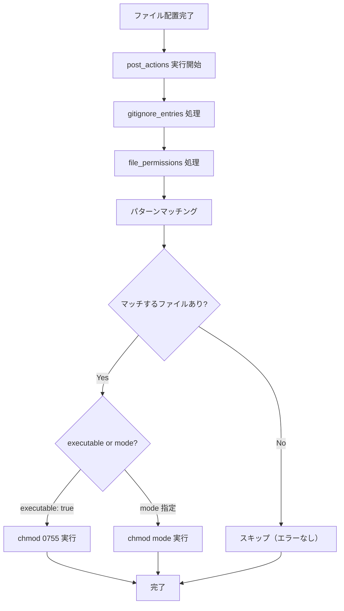

# post_actions: file_permissions 機能

## 背景 (Background)

`devctl scaffold` コマンドでは、テンプレートの配置定義（`placement.yaml`）の `post_actions` セクションで、テンプレート適用後の後処理を宣言的に定義できる。現在は `gitignore_entries` のみが実装されている。

しかし、scaffold で生成されるファイルの中にはシェルスクリプト（`scripts/` 配下の `.sh` ファイルなど）が含まれるケースがある。Git はファイルの実行権限（executable bit）を追跡する機能を持っているが、テンプレートファイルをダウンロード・配置するだけでは実行権限が付与されない。

また、シークレットファイル（SSH 鍵、認証情報ファイル等）のように、他ユーザーからの読み取りを制限すべきファイルを scaffold で生成する場合もある。こうしたファイルにはデフォルトよりも厳しいパーミッション（`0600` 等）を設定する必要がある。

手動で `chmod` を実行する手順を毎回行うのは煩雑であり、権限設定の忘れはスクリプトの動作不良やセキュリティリスクに直結する。そのため、テンプレートの配置定義内でファイルパーミッションを宣言的に指定できるようにすることで、scaffold の完全自動化を実現する。

> [!NOTE]
> 既存の仕様書 [000-Scaffold-Command.md](file://prompts/phases/000-foundation/ideas/feat-devctl-scafford/000-Scaffold-Command.md) において、`file_permissions` は将来拡張としてコメントで言及済み（R3, Segment 3 配置定義）。
> また、[000-Reference-Manual.md](file://prompts/phases/000-foundation/refs/tokotachi-scaffolds/000-Reference-Manual.md) の後処理アクションセクションにも将来の拡張ポイントとして記載済み。

## 要件 (Requirements)

### 必須要件 (Must)

#### FP-R1: placement.yaml での file_permissions 定義

- `post_actions` セクションに `file_permissions` フィールドを追加する。
- 各エントリは以下の情報を持つ:
  - `pattern`: 対象ファイルを指定するグロブパターン（`base_dir` からの相対パス）
  - `executable`: `true` の場合、実行権限を付与する（`chmod +x` 相当、`mode: "0755"` の糖衣構文）
  - `mode`: 8進数文字列でパーミッションを明示指定する（例: `"0755"`, `"0600"`, `"0644"`）
- `executable` と `mode` は排他的に指定する。両方指定された場合は `mode` が優先される。
- どちらも未指定の場合はエラーとする。

```yaml
# placements/default.yaml の例
post_actions:
  gitignore_entries:
    - "work/*"
  file_permissions:
    # executable: true は mode: "0755" の糖衣構文
    - pattern: "scripts/**/*.sh"
      executable: true
    - pattern: "scripts/**/*.bash"
      executable: true
    # mode で明示的にパーミッションを指定（シークレットファイル等）
    - pattern: "secrets/**/*"
      mode: "0600"
    - pattern: "config/*.yaml"
      mode: "0644"
```

#### FP-R2: グロブパターンによるファイルマッチング

- `pattern` は Go の `filepath.Match` 互換のグロブパターンをサポートする。
- `**` による再帰的なディレクトリマッチングもサポートする（`doublestar` ライブラリ等を使用）。
- マッチするファイルが存在しない場合はエラーにせず、スキップする（警告も不要）。

#### FP-R3: パーミッションの適用

- **`executable: true` の場合**:
  - `mode: "0755"` と同等に処理される。
  - **Windows**: 追加で `git update-index --chmod=+x` を実行して Git 上での実行権限を記録する。
- **`mode` 指定の場合**:
  - **Unix 系 OS**: `os.Chmod(path, mode)` で指定されたパーミッションを設定する。
  - **Windows**: `os.Chmod` は限定的にしか機能しないため、Git 経由でパーミッションを記録する。
    - `mode` に実行ビットが含まれる場合（`0755`, `0700` 等）: `git update-index --chmod=+x` を実行。
    - それ以外: `git update-index --chmod=-x` を実行（読み取り専用等）。
- パーミッションの適用はテンプレートのファイル配置完了後、後処理フェーズで実行する。
- **バリデーション**: `mode` の値は 3〜4 桁の 8 進数文字列であること（`"0755"`, `"0600"`, `"644"` 等）。不正な値はパース時にエラーとする。

#### FP-R4: 実行計画への表示

- `--dry-run` やユーザー確認前の実行計画表示において、`file_permissions` による変更も表示する。
- `executable: true` の場合は `chmod +x`、`mode` 指定の場合は `chmod <mode>` と表示する。
- 表示例:
  ```
  Post-actions:
    .gitignore: add "work/*"
    chmod +x: scripts/setup.sh
    chmod +x: scripts/build.sh
    chmod 0600: secrets/api-key.txt
    chmod 0644: config/settings.yaml
  ```

#### FP-R5: チェックポイント情報への記録

- チェックポイント情報ファイル（`.devctl-scaffold-checkpoint`）に、権限変更の情報を記録する。
- ロールバック時にファイルが削除される場合は権限復元は不要（ファイル自体が削除されるため）。

#### FP-R6: 冪等性

- 既に指定されたパーミッションが設定されているファイルに対して再度同じ設定を適用してもエラーにならない。
- 冪等に実行可能であること。

## 実現方針 (Implementation Approach)

### 配置定義スキーマの拡張

`placement.yaml` の `post_actions` に `file_permissions` を追加する:

```yaml
post_actions:
  gitignore_entries: [...]
  file_permissions:
    - pattern: "scripts/**/*.sh"    # グロブパターン
      executable: true              # 実行権限を付与 (= mode: "0755")
    - pattern: "secrets/**/*"       # シークレットファイル
      mode: "0600"                  # オーナーのみ読み書き
```

### devctl 側の変更

1. **`placement.go`**: `PostActions` 構造体に `FilePermissions` フィールドを追加
2. **`applier.go`**: 後処理フェーズに `applyFilePermissions()` を追加
3. **`scaffold.go`**: 実行計画の生成・表示に `file_permissions` の情報を含める

### 処理フロー



### tokotachi-scaffolds 側の変更

- [001-Default-Template-Spec.md](file://prompts/phases/000-foundation/refs/tokotachi-scaffolds/001-Default-Template-Spec.md) の `placements/default.yaml` に `file_permissions` の定義を追加（デフォルトテンプレートには `scripts/.gitkeep` のみなので、現時点では空配列）。
- [000-Reference-Manual.md](file://prompts/phases/000-foundation/refs/tokotachi-scaffolds/000-Reference-Manual.md) のスキーマ定義と後処理セクションを更新し、`file_permissions` を正式なフィールドとして記載。

## 検証シナリオ (Verification Scenarios)

### シナリオ 1: スクリプトへの実行権限付与（executable: true）

1. テンプレートに `scripts/setup.sh` と `scripts/build.sh` が含まれる scaffold を用意する
2. `placement.yaml` の `file_permissions` に `pattern: "scripts/**/*.sh"`, `executable: true` を定義する
3. `devctl scaffold` を実行する
4. 生成された `scripts/setup.sh` と `scripts/build.sh` に実行権限が付与されていることを確認する（`ls -la` で `-rwxr-xr-x` を確認）

### シナリオ 2: シークレットファイルへの制限パーミッション（mode: "0600"）

1. テンプレートに `secrets/api-key.txt` が含まれる scaffold を用意する
2. `placement.yaml` の `file_permissions` に `pattern: "secrets/**/*"`, `mode: "0600"` を定義する
3. `devctl scaffold` を実行する
4. 生成された `secrets/api-key.txt` のパーミッションが `0600`（`-rw-------`）であることを確認する

### シナリオ 3: dry-run での表示確認

1. `file_permissions` が定義された scaffold に対して `devctl scaffold --dry-run` を実行する
2. 実行計画に `chmod +x: scripts/setup.sh` や `chmod 0600: secrets/api-key.txt` 等が表示されることを確認する
3. 実際にはファイルが作成されておらず、権限も変更されていないことを確認する

### シナリオ 4: マッチするファイルが存在しない場合

1. `file_permissions` に `pattern: "scripts/**/*.py"` を定義するが、`.py` ファイルはテンプレートに含まれない
2. scaffold を実行する
3. エラーが発生せず正常に完了することを確認する

### シナリオ 5: 冪等性の確認

1. `devctl scaffold` を一度実行してパーミッションを設定する
2. `devctl scaffold` を再度実行する
3. エラーが発生せず正常に完了することを確認する

### シナリオ 6: ロールバック

1. `devctl scaffold` を実行する
2. `devctl scaffold --rollback` を実行する
3. scaffold で追加されたファイル（スクリプト含む）が削除されることを確認する

### シナリオ 7: executable と mode の排他バリデーション

1. `file_permissions` に `executable: true` と `mode: "0700"` を同時に定義する
2. `mode` が優先され、`0700` が適用されることを確認する

## テスト項目 (Testing for the Requirements)

### 単体テスト

| 対象要件 | テスト内容 | 検証方法 |
|---------|----------|--------|
| FP-R1 | `file_permissions`（executable / mode）が正しくパースされる | `scripts/process/build.sh` |
| FP-R1 | executable と mode の排他制御が正しく動作する | `scripts/process/build.sh` |
| FP-R1 | どちらも未指定の場合にバリデーションエラーが発生する | `scripts/process/build.sh` |
| FP-R2 | グロブパターンが正しくファイルにマッチする | `scripts/process/build.sh` |
| FP-R2 | マッチなしの場合にエラーが発生しない | `scripts/process/build.sh` |
| FP-R3 | `executable: true` で `0755` が適用される | `scripts/process/build.sh` |
| FP-R3 | `mode: "0600"` で指定パーミッションが適用される | `scripts/process/build.sh` |
| FP-R3 | 不正な mode 値（`"999"`, `"abc"`）でパースエラーが発生する | `scripts/process/build.sh` |
| FP-R4 | 実行計画に `chmod +x` / `chmod <mode>` が含まれる | `scripts/process/build.sh` |
| FP-R5 | チェックポイント情報に権限変更情報が記録される | `scripts/process/build.sh` |
| FP-R6 | 既にパーミッションが設定済みのファイルへの再適用がエラーにならない | `scripts/process/build.sh` |

### 統合テスト

| 対象要件 | テスト内容 | 検証方法 |
|---------|----------|--------|
| FP-R1 + FP-R3 | scaffold 実行後にスクリプトファイルに実行権限が付与される | `scripts/process/integration_test.sh` |
| FP-R1 + FP-R3 | scaffold 実行後にシークレットファイルに `0600` が設定される | `scripts/process/integration_test.sh` |
| FP-R4 | dry-run で `chmod +x` / `chmod 0600` が表示される | `scripts/process/integration_test.sh` |
| FP-R6 | 2 回連続の scaffold 実行でエラーが発生しない | `scripts/process/integration_test.sh` |

### ビルド検証

```bash
# 全体ビルド & 単体テスト
scripts/process/build.sh

# 統合テスト
scripts/process/integration_test.sh
```
