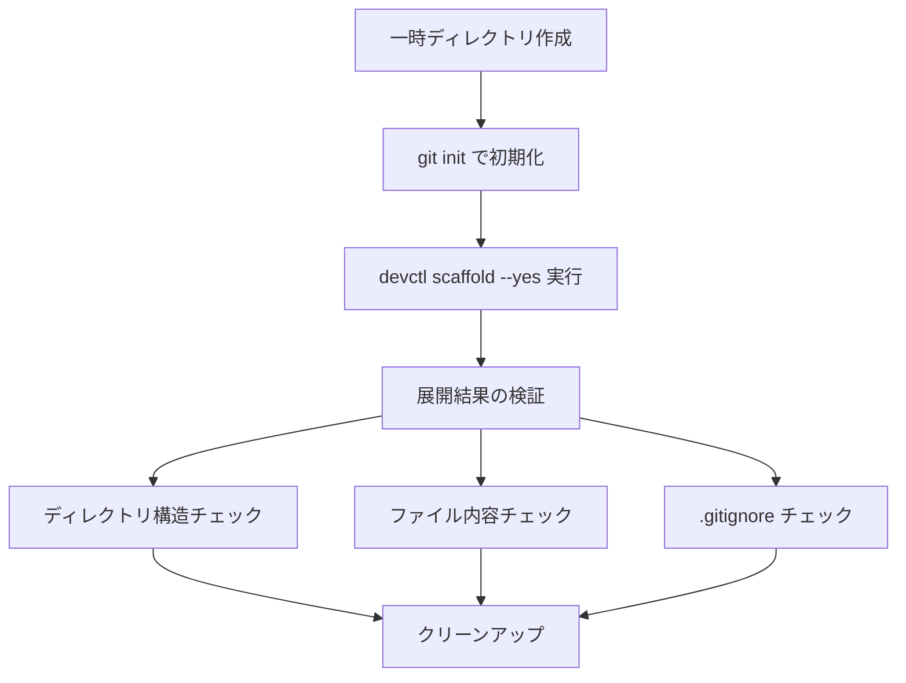

# Scaffold 統合テスト（実リポジトリ使用）

## 背景 (Background)

現在、`scaffold` パッケージのテストはすべてユニットテストで構成されており、`httptest.NewServer` によるモックHTTPサーバーやインメモリデータを使用している。各コンポーネント（`downloader`, `catalog`, `placement`, `applier`, `template` 等）は個別にテストされているが、**実際の GitHub リポジトリ（`axsh/tokotachi-scaffolds`）へアクセスし、テンプレートのダウンロードからファイル配置までの一連のフローを通しで検証するテストが存在しない**。

`tokotachi-scaffolds` リポジトリが完成したことで、実リポジトリに対する統合テストを作成し、エンドツーエンドでの動作を保証する必要がある。

### 現在の問題点

1. モックではリポジトリのYAML構造やディレクトリレイアウトの不整合を検出できない
2. GitHub Contents APIの実際のレスポンス形式との差異が見逃される可能性がある
3. カタログ → テンプレートダウンロード → 配置という全体フローの結合テストがない

---

## 要件 (Requirements)

### 必須要件

1. **実リポジトリへのアクセス**: `https://github.com/axsh/tokotachi-scaffolds` に対して実際にHTTPリクエストを送信し、カタログ・テンプレート・配置定義をダウンロードする
2. **一時ディレクトリでのテスト実行**: テストは `tmp/` 以下に一時ディレクトリを作成し、そこにテンプレートを展開する。テスト終了後はクリーンアップする
3. **default テンプレートの検証**: `devctl scaffold`（パターン指定なし）相当のフローを実行し、`default` テンプレートが正しく展開されることを検証する
4. **カタログの取得と解析の検証**: 実リポジトリから取得した `catalog.yaml` が正しくパースでき、期待されるエントリ（`default` テンプレート）が含まれていることを確認する
5. **配置定義の取得と解析の検証**: `placements/default.yaml` が正しく取得・パースできることを確認する
6. **テンプレートファイルのダウンロードと展開**: `templates/project-default/base/` 以下のファイル群がすべてダウンロードされ、期待されるディレクトリ構造で配置されることを確認する
7. **ロケールオーバーレイの検証**: `locale.ja` オーバーレイが存在する場合に正しくマージされ、README.md ファイルが日本語版で上書きされることを確認する
8. **後処理アクション（post_actions）の検証**: `.gitignore` への `work/*` エントリ追記が正しく動作することを確認する
9. **テストの配置先**: `tests/integration-test/` 配下に配置し、既存の統合テスト基盤で実行可能にする

### 任意要件

- GitHub API のレートリミットによるテスト失敗時の適切なスキップ処理
- テストの実行にネットワーク接続が必須である旨のドキュメント

---

## 実現方針 (Implementation Approach)

### テストの構成

統合テストは `tests/integration-test/devctl_scaffold_test.go` に作成する。既存の統合テストパターン（`helpers_test.go` のヘルパー関数使用）に準拠する。

### テスト方法

`scaffold` パッケージの公開APIを直接呼び出すのではなく、**ビルド済みの `devctl` バイナリを使用して `devctl scaffold` コマンドを実際に実行する**。これにより、CLI層からの真のE2Eテストとなる。

ただし、`devctl scaffold` コマンドはインタラクティブな確認プロンプト（`[y/N]`）があるため、テストでは `--yes` フラグを使用してスキップする。

### テストの流れ



### テストケース一覧

| テストケース | 検証内容 |
|---|---|
| `TestScaffoldDefault_CreatesExpectedStructure` | default テンプレート展開後のディレクトリ構造 |
| `TestScaffoldDefault_FileContents` | 展開されたファイルの内容（README.md等） |
| `TestScaffoldDefault_GitignorePostAction` | `.gitignore` に `work/*` が追記される |
| `TestScaffoldDefault_IdempotentSkip` | 2回実行しても既存ファイルがスキップされる（冪等性） |
| `TestScaffoldList_ReturnsEntries` | `devctl scaffold list` でカタログ一覧が取得できる |

### 作業ディレクトリ

テスト用の一時ディレクトリは Go の `t.TempDir()` を使用する。`t.TempDir()` はテスト終了後に自動クリーンアップされるため、手動のクリーンアップは不要。

> [!NOTE]
> `t.TempDir()` はプロジェクトの `tmp/` ディレクトリではなく、OS のテンポラリディレクトリに作成される。これはプロジェクト構成を汚さないため安全である。

### ネットワーク依存への対処

GitHub API にアクセスするため、ネットワーク接続がない環境や、API レートリミットに達した場合はテストをスキップする。テストの冒頭で簡単な接続チェックを行い、到達不能な場合は `t.Skip()` で明示的にスキップする。

---

## 検証シナリオ (Verification Scenarios)

### シナリオ1: default テンプレートの展開

1. 一時ディレクトリを作成する
2. `git init` で git リポジトリとして初期化する（`devctl scaffold` は git リポジトリ内で動作するため）
3. `devctl scaffold --yes` を実行する
4. 以下のディレクトリ・ファイルが作成されていることを確認する:
   - `features/README.md`
   - `prompts/phases/README.md`
   - `prompts/phases/000-foundation/ideas/.gitkeep`
   - `prompts/phases/000-foundation/plans/.gitkeep`
   - `prompts/rules/.gitkeep`
   - `scripts/.gitkeep`
   - `shared/README.md`
   - `shared/libs/README.md`
   - `work/README.md`
5. `.gitignore` に `work/*` エントリが含まれていることを確認する

### シナリオ2: 冪等性の確認

1. シナリオ1と同じディレクトリに対して `devctl scaffold --yes` を再度実行する
2. コマンドがエラーなく完了することを確認する
3. ファイルの内容が変更されていないことを確認する（skip ポリシー）

### シナリオ3: scaffold list の確認

1. `devctl scaffold list` を実行する
2. 出力に `default` テンプレートの情報が含まれることを確認する

---

## テスト項目 (Testing for the Requirements)

### 自動テスト

すべてのテストは統合テストとして実装し、以下のコマンドで実行する:

```bash
# 統合テストの実行
./scripts/process/integration_test.sh --categories "integration-test" --specify "TestScaffold"
```

| 要件 | テストケース | 検証スクリプト |
|---|---|---|
| 実リポジトリアクセス | `TestScaffoldDefault_CreatesExpectedStructure` | `integration_test.sh` |
| ディレクトリ構造 | `TestScaffoldDefault_CreatesExpectedStructure` | `integration_test.sh` |
| ファイル内容 | `TestScaffoldDefault_FileContents` | `integration_test.sh` |
| post_actions | `TestScaffoldDefault_GitignorePostAction` | `integration_test.sh` |
| 冪等性 | `TestScaffoldDefault_IdempotentSkip` | `integration_test.sh` |
| scaffold list | `TestScaffoldList_ReturnsEntries` | `integration_test.sh` |

### ビルド検証

統合テスト実行前にビルドが通ることを確認:

```bash
./scripts/process/build.sh
```
