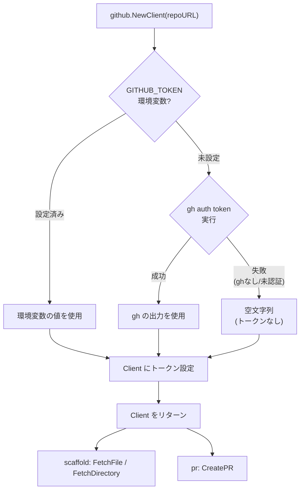

# GitHub Token 自動取得 & GitHub 操作の共通化

## 背景 (Background)

現在の `devctl scaffold` コマンドは、GitHub API へのアクセスに `GITHUB_TOKEN` 環境変数を必要とする。プライベートリポジトリ（`axsh/tokotachi-scaffolds`）からカタログやテンプレートをダウンロードする際、トークンが未設定だと HTTP 403 エラーが発生する。

```
$ ./bin/devctl scaffold --list
Error: failed to fetch catalog.yaml: HTTP 403
```

ユーザーは毎回 `export GITHUB_TOKEN=$(gh auth token)` を手動で実行する必要があり、これは煩雑かつ忘れやすいオペレーションである。

一方で、`devctl` の各コマンドにおける GitHub 操作は分散している:

| コマンド | GitHub 操作 | 実装方式 | 配置場所 |
|---|---|---|---|
| `scaffold` | リポジトリからファイル取得 | HTTP API 直接呼び出し | `scaffold/downloader.go` |
| `pr` | Pull Request 作成 | `gh` CLI 直接実行 | `action/pr.go` |

これらは同じ「GitHub へのアクセス」でありながら、認証方式もアクセス方式も異なり、独立して実装されている。将来的なアクセス方式の統一や認証の一元管理を考慮し、GitHub 操作を共通パッケージに集約する必要がある。

## 要件 (Requirements)

### 必須要件

1. **`gh auth token` によるフォールバック取得**: `GITHUB_TOKEN` 環境変数が未設定の場合、`gh auth token` コマンドを内部で実行してトークンを自動取得する
2. **環境変数の優先**: `GITHUB_TOKEN` が明示的に設定されている場合は、そちらを優先する（CI環境等での利用を想定）
3. **エラーハンドリング**: `gh` コマンドが存在しない、または未認証の場合は、適切なエラーメッセージを表示する
4. **既存テストへの影響なし**: トークン取得ロジックの変更が、既存の単体テスト・統合テストを破壊しないこと
5. **GitHub 操作の共通パッケージ化**: GitHub へのアクセス操作そのものを `github` パッケージに集約する
   - HTTP リクエスト（リポジトリコンテンツ取得）を `github.Client` に移動
   - `gh` CLI による PR 作成を `github.Client` のメソッドとしてラップ
   - **高次の操作インターフェイスを定義**し、内部実装（HTTP API / `gh` CLI）を呼び出し元に意識させない
   - 将来的にインターフェイスを変えずに内部アクセス方式を差し替えられる設計とする

### 任意要件

6. **verbose ログ**: `--verbose` フラグ有効時に、トークンの取得元（環境変数 or `gh` コマンド）をログに出力する

## 実現方針 (Implementation Approach)

### `github.Client` - GitHub 操作の集約

`features/devctl/internal/github/` パッケージを新設し、GitHub への全アクセス操作を集約する。

```go
// Client は GitHub 操作を集約する。
// 内部実装（HTTP API / gh CLI）は隠蔽され、将来的に差し替え可能。
type Client struct {
    owner    string
    repo     string
    branch   string
    token    string
    client   *http.Client
    baseURL  string
    // gh CLI 操作用
    cmdRunner CmdRunner // cmdexec.Runner を抽象化
}

// NewClient はリポジトリ URL から Client を作成する。
// トークンは自動解決される（GITHUB_TOKEN → gh auth token → 空）
func NewClient(repoURL string, opts ...ClientOption) (*Client, error)

// === リポジトリコンテンツ操作 ===
// scaffold の downloader.go から移動

// FetchFile はリポジトリから単一ファイルを取得する。
func (c *Client) FetchFile(path string) ([]byte, error)

// FetchDirectory はディレクトリ配下の全ファイルを再帰取得する。
func (c *Client) FetchDirectory(path string) ([]DownloadedFile, error)

// === PR 操作 ===
// action の pr.go から移動

// CreatePR は Pull Request を作成する。
func (c *Client) CreatePR(workDir string) error
```

### `DownloadedFile` の取り扱い

`scaffold.DownloadedFile` は `scaffold` パッケージ内で広く使用されている（`applier.go`, `locale.go`, テスト多数）。循環依存を避けつつ波及を最小化するため:

- `github` パッケージに `DownloadedFile` を定義する
- `scaffold` パッケージでは `github.DownloadedFile` を型エイリアスとして定義する: `type DownloadedFile = github.DownloadedFile`
- これにより既存のコードは変更不要

### 呼び出し元の変更

- **`scaffold.go`**: `NewGitHubDownloader(repoURL)` → `github.NewClient(repoURL)` に変更。`github.Client` は `scaffold.Downloader` インターフェイスを暗黙的に満たす
- **`action/pr.go`**: `cmdexec.ResolveCommand` + `RunInteractiveWithOpts` の直接呼び出し → `github.Client.CreatePR(workDir)` に変更

### トークン解決ロジック（`github` パッケージ内部）

```
1. GITHUB_TOKEN 環境変数
2. gh auth token コマンドの出力
3. 空文字列 (トークンなし → 公開リポジトリのみアクセス可)
```

### 処理フロー



## 検証シナリオ (Verification Scenarios)

1. `GITHUB_TOKEN` を未設定の状態で `./bin/devctl scaffold --list` を実行し、`gh auth login` 済みであれば正常にカタログが表示されることを確認する
2. `GITHUB_TOKEN` を明示設定した状態で `./bin/devctl scaffold --list` を実行し、環境変数のトークンが優先されることを確認する
3. `GITHUB_TOKEN` 未設定かつ `gh` コマンドが PATH にない状態で実行し、HTTP 403 エラーが発生することを確認する（公開リポジトリでない場合）

## テスト項目 (Testing for the Requirements)

### 単体テスト

| 要件 | テスト内容 | 検証方法 |
|------|-----------|----------|
| 1 | `resolveToken()` が `GITHUB_TOKEN` 未設定時に `gh auth token` を呼び出す | `github_test.go` に新規テスト追加 |
| 2 | `GITHUB_TOKEN` 設定時に環境変数の値が返される | `github_test.go` に新規テスト追加 |
| 3 | `gh` コマンド失敗時に空文字列が返される | `github_test.go` に新規テスト追加 |
| 5 | `Client.FetchFile` / `FetchDirectory` が動作する | 既存テストを `github_test.go` に移行 |
| 5 | `Client.CreatePR` が動作する | `github_test.go` に新規テスト追加 |

### ビルド・テスト実行

```bash
# 全体ビルド・単体テスト
scripts/process/build.sh

# 統合テスト
scripts/process/integration_test.sh
```
