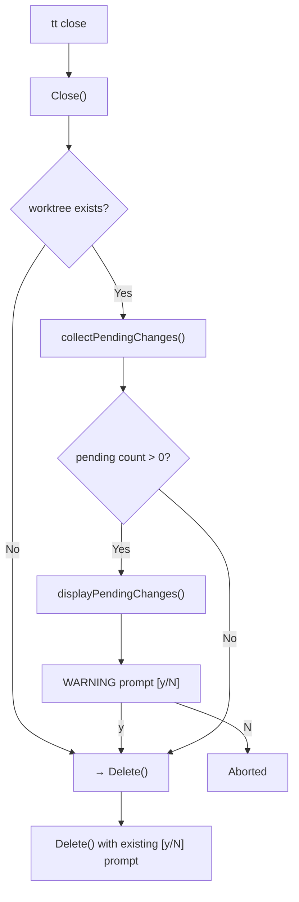

# tt close ガードレール: 保留中の変更の警告表示

## 背景 (Background)

`tt close` コマンドは worktree とブランチを削除するシンタックスシュガーだが、現状では削除対象の worktree に未保存の変更（未コミット、未プッシュなど）が残っていても、一般的な `[y/N]` 確認のみで削除が実行される。

これにより、以下のリスクがある:

- 未追跡ファイル（新規作成したがまだ `git add` していないファイル）が失われる
- ステージされていない変更が失われる
- ステージ済みだが未コミットの変更が失われる
- コミット済みだが未プッシュの変更がリモートに残らず失われる

ユーザーが削除の判断をする前に、これらの保留中の変更の詳細を表示することで、意図しないデータ損失を防止する。

## 要件 (Requirements)

### 必須要件

1. **保留中の変更の検出**: worktree ディレクトリ内で以下の4カテゴリの変更を検出する:
   - **(1) 未追跡ファイル**: `git ls-files --others --exclude-standard` で検出
   - **(2) ステージされていない変更**: `git diff --name-only` で検出
   - **(3) ステージ済み・未コミット**: `git diff --cached --name-only` で検出
   - **(4) 未プッシュのコミット**: `git log @{upstream}..HEAD --oneline` で検出（upstream が設定されていない場合はスキップまたは全コミットを対象）

2. **表示の制限**: 各カテゴリの一覧は **最大10行** まで表示し、10行を超えた場合は省略して合計件数を表示する。
   - 例: `... and 5 more (15 total)`

3. **`--verbose` オプション**: `--verbose` フラグが指定されている場合は、省略せずに全件を表示する。

4. **警告メッセージ**: 4カテゴリの合計件数が1件以上の場合、**英語で** 以下のような警告メッセージを表示する:
   - 例: `WARNING: Found X pending change(s) in worktree. Are you sure you want to delete? [y/N]: `
   - ユーザーが `y` / `yes` を入力した場合のみ、次のステップに進む
   - それ以外の入力、または入力なしの場合は中断（`Aborted.`）

5. **2段階確認**: 警告に対して `y` を入力した後、既存の `Delete` アクション内の `Proceed? [y/N]` 確認も **引き続き表示される**。つまり合計2回の確認が入る。
   - **ただし `--yes` フラグが指定されている場合**: 両方の確認をスキップする（既存の動作を維持）

6. **実装箇所**: この警告ロジックは `Close` アクション内（`Delete` に委譲する前）に配置する。`Delete` 単体で呼ばれた場合にも同様の警告を出すかは、この仕様のスコープ外とする（将来的に検討）。

### 任意要件

- 各カテゴリのヘッダーにアイコンや色付けを行い、視認性を向上させる（ターミナルカラー対応の場合）
- ネストされた worktree がある場合、子 worktree の変更も再帰的にチェックするかは将来的な検討対象とする

## 実現方針 (Implementation Approach)

### アーキテクチャ



### 主要な変更対象

1. **`features/tt/internal/action/close.go`**:
   - `CloseOptions` に `Verbose bool` フィールドを追加
   - `Close()` メソッド内、`Delete()` 呼び出しの前に保留変更チェックロジックを追加
   - 新しいヘルパー関数の追加:
     - `collectPendingChanges(cmdRunner, worktreePath) PendingChanges`: git コマンドを実行して4カテゴリの変更を収集
     - `displayPendingChanges(logger, changes, verbose)`: 変更一覧を整形して表示
     - `confirmPendingChanges(stdin) bool`: 警告メッセージの確認プロンプト

2. **`features/tt/cmd/close.go`**:
   - `--verbose` フラグの追加
   - `CloseOptions` に `Verbose` を渡す

3. **`features/tt/internal/action/close_test.go`**:
   - 保留変更の検出・表示・確認ロジックのユニットテストを追加

### データ構造

```go
// PendingChanges holds categorized pending changes in a worktree.
type PendingChanges struct {
    UntrackedFiles   []string // untracked files
    UnstagedChanges  []string // unstaged modifications
    StagedChanges    []string // staged but uncommitted
    UnpushedCommits  []string // committed but not pushed
}

// TotalCount returns total number of pending items.
func (p PendingChanges) TotalCount() int {
    return len(p.UntrackedFiles) + len(p.UnstagedChanges) +
           len(p.StagedChanges) + len(p.UnpushedCommits)
}
```

### Git コマンドの実行

worktree ディレクトリ内で実行するため、`cmdexec.RunOption` の `Dir` フィールドを使用して作業ディレクトリを指定する:

```go
gitCmd := cmdexec.ResolveCommand("TT_CMD_GIT", "git")
opts := cmdexec.RunOption{Dir: worktreePath, QuietCmd: true, FailLevelSet: true, FailLevel: log.LevelDebug, FailLabel: "SKIP"}

// 未追跡ファイル
out, _ := runner.RunWithOpts(opts, gitCmd, "ls-files", "--others", "--exclude-standard")

// ステージされていない変更
out, _ = runner.RunWithOpts(opts, gitCmd, "diff", "--name-only")

// ステージ済み・未コミット
out, _ = runner.RunWithOpts(opts, gitCmd, "diff", "--cached", "--name-only")

// 未プッシュコミット
out, _ = runner.RunWithOpts(opts, gitCmd, "log", "@{upstream}..HEAD", "--oneline")
```

### 表示例

```
== Pending changes in worktree work/feat-my-branch ==

Untracked files (3):
  new_file.go
  tmp/debug.log
  docs/note.md

Unstaged changes (1):
  internal/action/close.go

Staged changes (0):
  (none)

Unpushed commits (12):
  abc1234 Fix close command
  def5678 Add verbose flag
  ...
  ... and 2 more (12 total)

WARNING: Found 16 pending change(s) in worktree. Are you sure you want to delete? [y/N]:
```

## 検証シナリオ (Verification Scenarios)

### シナリオ1: 保留変更がある場合の警告表示

1. `tt open test-guardrail` で worktree を作成
2. worktree 内で新規ファイルを作成（未追跡ファイル）
3. 既存ファイルを編集して保存（ステージされていない変更）
4. 別のファイルを `git add` する（ステージ済み・未コミット）
5. さらに別の変更をコミットするがプッシュしない（未プッシュコミット）
6. `tt close test-guardrail` を実行
7. 4カテゴリの変更一覧が表示されることを確認
8. `WARNING: Found X pending change(s)...` メッセージが表示されることを確認
9. `N` を入力 → 中断されることを確認

### シナリオ2: 保留変更がない場合

1. worktree を作成し、何も変更しない
2. `tt close` を実行
3. 保留変更の警告が表示されず、既存の `Proceed? [y/N]` のみ表示されることを確認

### シナリオ3: `--verbose` オプション

1. worktree 内に11件以上の未追跡ファイルを作成
2. `tt close test-verbose` を実行 → 10行で省略されることを確認
3. `tt close test-verbose --verbose` を実行 → 全件表示されることを確認

### シナリオ4: `--yes` オプション

1. 保留変更がある状態で `tt close test-yes --yes` を実行
2. 警告は表示されるが、確認プロンプトはスキップされ、自動的に進行することを確認

### シナリオ5: 2段階確認の動作

1. 保留変更がある状態で `tt close test-confirm` を実行
2. 最初の警告プロンプトで `y` を入力
3. 次に既存の `Proceed? [y/N]` プロンプトが表示されることを確認
4. `y` を入力 → 削除が実行されることを確認

## テスト項目 (Testing for the Requirements)

### 単体テスト (`close_test.go`)

以下のテストケースを `features/tt/internal/action/close_test.go` に追加する:

| テストケース | 検証内容 |
|---|---|
| `TestClose_PendingChanges_ShowsWarning` | 保留変更がある場合に警告が表示され、`N` で中断される |
| `TestClose_NoPendingChanges_NoWarning` | 保留変更がない場合は警告をスキップして `Delete` に進む |
| `TestClose_PendingChanges_ConfirmYes_ProcedsToDelete` | 警告で `y` を入力後、`Delete` に委譲される |
| `TestClose_Verbose_ShowsAllItems` | `--verbose` 時に全件表示される |
| `TestClose_TruncateAt10_ShowsMore` | 11件以上で省略表示される |
| `TestClose_YesFlag_SkipsPendingPrompt` | `--yes` フラグで保留変更の確認をスキップ |

### ビルド・実行コマンド

```bash
# 全体ビルド & 単体テスト
scripts/process/build.sh

# close テストのみ実行
cd features/tt && go test ./internal/action/ -run TestClose -v
```
