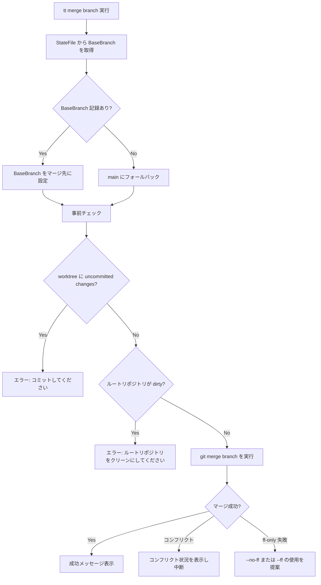

# ローカルマージ機能 (`tt merge`)

## 背景 (Background)

### 現在の課題

`tt` コマンドの現在のワークフローでは、コードのマージに GitHub PR を経由する必要がある:

```
tt open → コード編集 → git add/commit/push → tt pr → GitHub PR マージ → tt close → git pull → ビルド
```

このフローには以下の問題がある:

- **オーバーヘッド**: 個人開発や小規模な変更でも push → PR → マージ → pull のラウンドトリップが必要
- **ネットワーク依存**: オフライン環境では作業完了できない
- **摩擦**: レビュー不要な変更でも PR を作成する手間がかかる

### 目指す姿

ローカルだけでマージまで完結するワークフローを `tt merge` コマンドとして提供する:

```
tt open → コード編集 → git add/commit → tt merge → tt close → ビルド
```

既存の `tt pr` による GitHub PR ワークフローは引き続き利用可能（ハイブリッド対応）。

---

## 要件 (Requirements)

### 必須要件

#### R1: `StateFile` への `BaseBranch` フィールド追加

- `tt open <branch>` 実行時に、親ブランチ（worktree 作成元のブランチ）を `StateFile` に記録する
- 親ブランチの取得方法: `git rev-parse --abbrev-ref HEAD`
- YAML フィールド名: `base_branch`

```yaml
# work/<branch>.state.yaml
branch: feat-xxx
base_branch: main        # 新規フィールド
created_at: 2026-03-15T...
code_status:
  status: local
```

```go
type StateFile struct {
    Branch     string                  `yaml:"branch"`
    BaseBranch string                  `yaml:"base_branch,omitempty"` // 新規追加
    CreatedAt  time.Time               `yaml:"created_at"`
    Features   map[string]FeatureState `yaml:"features,omitempty"`
    CodeStatus *CodeStatus             `yaml:"code_status,omitempty"`
}
```

#### R2: `tt merge <branch>` コマンドの新設

新コマンド `tt merge` を追加し、ローカルマージを実行する。

**基本動作:**

```bash
# デフォルト（--ff-only）
tt merge <branch>

# マージコミットを必ず作成
tt merge <branch> --no-ff

# git 標準動作に任せる
tt merge <branch> --ff
```

**処理フロー:**



#### R3: マージ戦略オプション

| オプション | git フラグ | 動作 |
|-----------|-----------|------|
| なし（デフォルト） | `--ff-only` | fast-forward のみ。main に他の変更がない場合に成功。失敗時は `--no-ff` / `--ff` の使用を提案 |
| `--no-ff` | `--no-ff` | 常にマージコミットを作成。ブランチ作業の統合点を履歴に残す |
| `--ff` | (git デフォルト) | fast-forward 可能ならする、不可能ならマージコミットを作成 |

#### R4: 事前チェック

以下の条件がすべて満たされない場合、マージを実行しない:

1. **worktree 内の uncommitted changes がないこと**: `git status --porcelain` で確認
2. **ルートリポジトリ（BaseBranch 側）が dirty でないこと**: ルートリポジトリで `git status --porcelain` を確認

#### R5: コンフリクト処理

- コンフリクト発生時は `git merge` の出力をそのまま表示
- マージを中断し（`git merge --abort` は実行しない）、ユーザーにルートリポジトリでの手動解決を促す
- コンフリクトファイルのリストを表示する

#### R6: 誤マージ防止

- `StateFile.BaseBranch` に記録されたブランチ以外へのマージはデフォルトで拒否
- 意図的に別ブランチへマージする場合は `--target <branch>` オプションを使用（Phase 2）

### 任意要件（Phase 2 以降）

- **R7**: `--squash` オプション（複数コミットを1つにまとめてマージ）
- **R8**: `--target <branch>` オプション（BaseBranch 以外へのマージ）
- **R9**: `tt merge --push` オプション（マージ後にリモートへ push）
- **R10**: `CodeStatusMerged` ステータスの追加

---

## 実現方針 (Implementation Approach)

### アーキテクチャ

`tt merge` は `tt pr` と対称的な位置づけとなる新コマンド。既存のアーキテクチャ（`cmd/` → `pkg/action/` → `pkg/worktree/`）に従う。

#### 新規ファイル

| ファイル | 役割 |
|---------|------|
| `features/tt/cmd/merge.go` | cobra コマンド定義・フラグ解析 |
| `pkg/action/merge.go` | マージビジネスロジック |

#### 変更ファイル

| ファイル | 変更内容 |
|---------|---------|
| `pkg/state/state.go` | `StateFile` に `BaseBranch` フィールド追加 |
| `features/tt/cmd/open.go` | worktree 作成時に `BaseBranch` をステートに記録 |
| `features/tt/cmd/root.go` | `mergeCmd` をルートコマンドに登録 |

### 実行コンテキスト

`tt merge` はルートリポジトリ（親ブランチが checkout されている場所）で実行される想定。worktree 内からの実行ではないため、git の「同一ブランチを複数 worktree で checkout できない」制約には該当しない。

```bash
cd <repo-root>       # main ブランチが checkout 済み
tt merge feat-xxx     # 内部で git merge feat-xxx を実行
```

### `tt close` との連携

マージ済みブランチは `git branch -d` で削除可能なため、`tt close` 時に `--force` フラグ不要。既存の close 動作で対応済み。

---

## 検証シナリオ (Verification Scenarios)

### シナリオ 1: 基本的なローカルマージフロー

1. `tt open test-merge` で worktree を作成
2. worktree 内でファイルを編集、`git add` + `git commit`
3. ルートリポジトリに戻り `tt merge test-merge` を実行
4. main ブランチにコミットが反映されていることを確認（`git log`）
5. `tt close test-merge` が `--force` なしで成功することを確認

### シナリオ 2: BaseBranch の記録と利用

1. `tt open test-base` で worktree を作成
2. `work/test-base.state.yaml` に `base_branch: main` が記録されていることを確認
3. `tt merge test-base` がマージ先として `main` を自動選択することを確認

### シナリオ 3: マージ戦略オプション

1. `tt open test-ff` で worktree を作成、コミットを追加
2. `tt merge test-ff` （デフォルト: `--ff-only`）が成功し、マージコミットが作られないことを確認
3. 別のブランチ `test-noff` で同様にコミットを追加
4. main に別のコミットを入れて、`tt merge test-noff` が `--ff-only` では失敗することを確認
5. `tt merge test-noff --no-ff` が成功し、マージコミットが作られることを確認

### シナリオ 4: 事前チェック

1. worktree 内に uncommitted changes がある状態で `tt merge` → エラーになること
2. ルートリポジトリに uncommitted changes がある状態で `tt merge` → エラーになること

### シナリオ 5: コンフリクト処理

1. main とブランチで同じファイルの同じ行を変更
2. `tt merge <branch> --ff` を実行
3. コンフリクト状況が表示されることを確認
4. マージが中断状態であることを確認

### シナリオ 6: dry-run

1. `tt merge <branch> --dry-run` を実行
2. 実際のマージは行われず、計画が表示されることを確認

---

## テスト項目 (Testing for the Requirements)

### 単体テスト

| 要件 | テスト対象 | テスト内容 |
|------|-----------|-----------|
| R1 | `pkg/state/state.go` | `BaseBranch` フィールドの YAML シリアライズ/デシリアライズ |
| R1 | `pkg/state/state.go` | `BaseBranch` が空の既存ステートファイルとの後方互換性 |
| R2 | `pkg/action/merge.go` | マージ成功時の正常フロー |
| R2 | `pkg/action/merge.go` | dry-run モードの動作 |
| R3 | `pkg/action/merge.go` | 各マージ戦略オプション（`--ff-only`, `--no-ff`, `--ff`）の git コマンド引数生成 |
| R4 | `pkg/action/merge.go` | uncommitted changes 検出時のエラー |
| R4 | `pkg/action/merge.go` | ルートリポジトリ dirty 時のエラー |
| R5 | `pkg/action/merge.go` | コンフリクト発生時のエラーメッセージとステータス |
| R6 | `pkg/action/merge.go` | BaseBranch 不一致時の拒否動作 |

### 自動検証コマンド

```bash
# 全体ビルド & 単体テスト
scripts/process/build.sh

# 統合テスト（必要に応じて）
scripts/process/integration_test.sh
```
