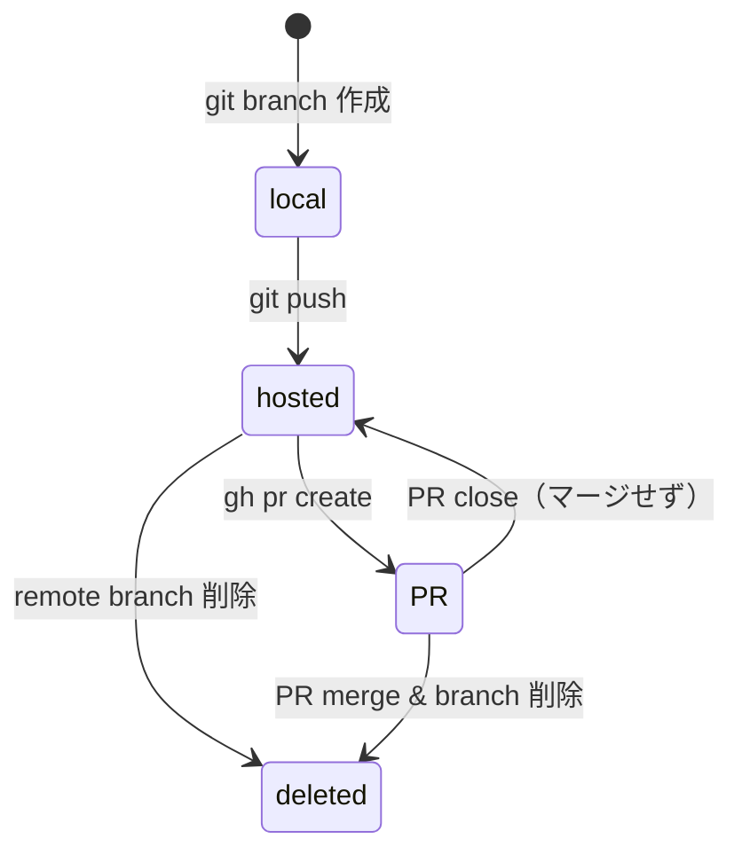

# `devctl list` コマンドへの CODE 列追加

## 背景 (Background)

現在の `devctl list` コマンドは、以下の列を表示する:

| 列名 | 説明 |
|------|------|
| `BRANCH` | ブランチ名 |
| `FEATURE` | フィーチャー名（カンマ区切り） |
| `STATE` | コンテナの状態（active, stopped 等） |
| `PATH` | ワークツリーのパス（`--path` オプション指定時のみ） |

課題として、ブランチがコードホスティングサービス（GitHub）上でどのように扱われているかが一覧から把握できない。ローカルにしかないのか、プッシュ済みなのか、PRが作成されているのか、リモートから削除されているのか、といった情報は開発ワークフローにおいて非常に重要である。

## 要件 (Requirements)

### 必須要件

#### R1: 列構成の変更

テーブル出力の列を以下のように変更する:

| 変更前 | 変更後 | 備考 |
|--------|--------|------|
| `STATE` | `CONTAINER` | 列名の変更のみ（内容は同一） |
| _(新設)_ | `CODE` | Code Hosting Service の状態を表示 |

列順: `BRANCH`, `FEATURE`, `CONTAINER`, `CODE`, `PATH`

#### R2: CODE 列のステータス定義

`CODE` 列は以下の状態を表示する:

| 状態 | 表示例 | 説明 |
|------|--------|------|
| `(local)` | `(local)` | ローカルブランチにのみ存在（リモートにプッシュされていない） |
| `hosted` | `hosted` | リモートブランチにプッシュ済み（PRは未作成） |
| `PR(Nm ago)` | `PR(3m ago)`, `PR(2h ago)`, `PR(5d ago)`, `PR(01/15)` | PRが作成されている。経過時間を表示 |
| `deleted` | `deleted` | リモートブランチが削除されている |

#### R3: PR 経過時間の表示フォーマット

PR作成からの経過時間を、以下のルールで簡易表示する:

| 条件 | フォーマット | 例 |
|------|------------|-----|
| 60分未満 | `{n}m ago` | `PR(3m ago)` |
| 60分以上 24時間未満 | `{n}h ago` | `PR(2h ago)` |
| 24時間以上 30日未満 | `{n}d ago` | `PR(5d ago)` |
| 30日以上 | 最終日付を簡易表示 | `PR(01/15)` |

#### R4: 状態遷移

基本的な状態遷移は以下のとおり:



#### R5: バックグラウンド更新プロセス

- `devctl list` 実行時に、**YAMLファイルに記録された最終更新日時**を確認する
- 最終更新から **5分以上**経過していた場合、**バックグラウンドで**更新プロセスを起動する
- バックグラウンドプロセスは親プロセス（`devctl list` 自体）とは切り離して動作して良い
- バックグラウンドプロセスには**タイムアウト**を設ける
- バックグラウンドプロセスの**重複起動を防止**する（ロックファイル等を利用）
- バックグラウンドプロセス実行中は、テーブル出力の後に `* update process is still running in the background.` のようなメッセージを表示する

#### R6: ブランチ単位の最終更新日時

- 各ブランチに個別の最終更新日時を持たせる
- ブランチ数が増加した際、部分更新が可能な設計とする

#### R7: `--update` オプション

- `devctl list --update` で、5分の待機時間なしに即座に状態を確認・更新する
- このオプション指定時はフォアグラウンドで実行して良い（バックグラウンド起動ではなく、結果を待つ）

### 任意要件

- JSON出力（`--json`）にも `CODE` 列相当のフィールドを含める
- main worktree は CODE 列を空白または `-` とする

## 実現方針 (Implementation Approach)

### アーキテクチャ概要

```
cmd/list.go
  ├── internal/listing/listing.go  (テーブル表示ロジック)
  ├── internal/state/state.go      (YAMLステートファイル)
  └── internal/github/github.go    (GitHub API / gh CLI)
        └── (新設) code_status.go  (CODE列のステータス取得・管理)
```

### 主要コンポーネント

#### 1. CODE ステータスの定義と永続化

`state.StateFile` または専用の YAML ファイルに、各ブランチのコードホスティング状態を保存する。

```yaml
# 例: StateFile への追加フィールド
branch: feat-xxx
code_status:
  status: "PR"          # local | hosted | PR | deleted
  pr_created_at: "2026-03-08T12:00:00Z"
  last_checked_at: "2026-03-09T01:00:00Z"
```

#### 2. GitHub ステータスチェッカー

`internal/github` パッケージに以下の機能を追加:
- リモートブランチの存在確認（`git ls-remote` or GitHub API）
- PR の存在・作成日時の取得（`gh pr list` or GitHub API）

#### 3. バックグラウンド更新

- ロックファイルベースの排他制御
- 自身のバイナリを `devctl _update-code-status` のようなサブコマンドで起動
- PIDファイルによる実行中チェック
- タイムアウト付き

#### 4. listing パッケージの変更

- `STATE` 列 → `CONTAINER` 列へのリネーム
- `CODE` 列の追加
- `BranchInfo` 構造体への `CodeStatus` フィールド追加

## 検証シナリオ (Verification Scenarios)

### シナリオ1: 基本的な列表示の確認

1. `devctl list` を実行する
2. ヘッダーに `BRANCH`, `FEATURE`, `CONTAINER`, `CODE`, が表示される（`PATH`は表示されない）
3. `STATE` という列名は表示されない

### シナリオ2: PATH列のオプション表示

1. `devctl list --path` を実行する
2. 上記列に加えて `PATH` 列が末尾に表示される

### シナリオ3: CODE列のステータス表示

1. ローカルのみのブランチは `(local)` と表示される
2. プッシュ済みのブランチは `hosted` と表示される
3. PRが作成されたブランチは `PR(Nm ago)` 形式で表示される
4. リモートブランチが削除されたブランチは `deleted` と表示される

### シナリオ4: PR経過時間の表示

1. PR作成から3分経過 → `PR(3m ago)`
2. PR作成から2時間経過 → `PR(2h ago)`
3. PR作成から5日経過 → `PR(5d ago)`
4. PR作成から31日以上経過 → `PR(01/15)` のような日付表示

### シナリオ5: バックグラウンド更新

1. 初回 `devctl list` を実行する
2. 最終更新から5分以上経過していれば、バックグラウンドで更新プロセスが起動する
3. 更新プロセス実行中に再度 `devctl list` を実行すると、テーブル下部に `* update process is still running in the background.` が表示される
4. バックグラウンドプロセスは重複起動しない

### シナリオ6: `--update` オプション

1. `devctl list --update` を実行する
2. 5分の有効期限を無視して即座に状態を取得・更新する
3. 更新完了後にテーブルが表示される

### シナリオ7: main worktree

1. main worktree（bare リポジトリ）の CODE 列は `-` と表示される

## テスト項目 (Testing for the Requirements)

### 単体テスト

#### listing パッケージ

| テスト | 対応要件 | 検証内容 |
|--------|----------|----------|
| `TestFormatTable_ContainerColumn` | R1 | ヘッダーに `CONTAINER` が表示され `STATE` が表示されない |
| `TestFormatTable_CodeColumn` | R2 | CODE 列に各ステータスが正しく表示される |
| `TestFormatTable_ColumnOrder` | R1 | 列順が `BRANCH, FEATURE, CONTAINER, CODE, PATH` |
| `TestPRTimeDisplay` | R3 | 各経過時間フォーマットが正しい |

#### code status パッケージ（新設予定）

| テスト | 対応要件 | 検証内容 |
|--------|----------|----------|
| `TestCodeStatusTransition` | R4 | 状態遷移が正しく動作する |
| `TestLastCheckedExpiry` | R5 | 5分経過判定が正しい |
| `TestLockFilePrevention` | R5 | 重複起動が防止される |

### ビルド・テスト実行コマンド

```bash
# 全体ビルド & 単体テスト
scripts/process/build.sh

# 統合テスト
scripts/process/integration_test.sh
```
