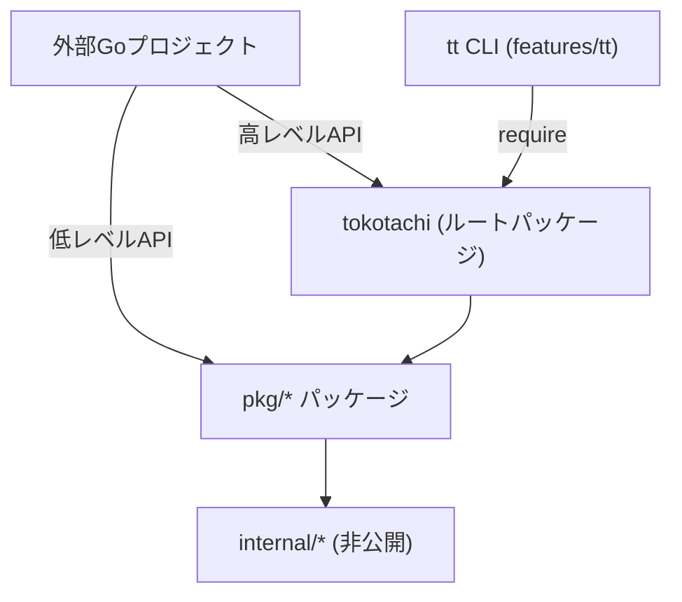

# 公開ライブラリモジュール化

## 背景 (Background)

`tokotachi` プロジェクトは、開発環境オーケストレーションツールとして `tt` というCLIを提供している。現在のコード構造は以下の通り:

- **エントリポイント**: `features/tt/main.go` → `cmd.Execute()`
- **CLIレイヤー**: `features/tt/cmd/` (18ファイル、Cobra依存)
- **ビジネスロジック**: `features/tt/internal/` (17パッケージ)
- **モジュールパス**: `github.com/axsh/tokotachi/features/tt`

現在の課題:

1. **`internal/` パッケージは外部からインポート不可**: Go の `internal` パッケージ規約により、`features/tt/internal/` 配下のパッケージは同モジュール外からはアクセスできない
2. **モジュールパスがCLI固有**: `github.com/axsh/tokotachi/features/tt` はCLI実装に紐づいており、ライブラリとして利用する際に不自然
3. **他のGoプロジェクトから組み込めない**: CLI以外の利用形態（ライブラリとして `require` して呼び出す等）が想定されていない

## 要件 (Requirements)

### 必須要件

1. **公開モジュールの提供**: `github.com/axsh/tokotachi` をGoモジュールパスとして、外部の Go プロジェクトから `go.mod` 内の `require` で指定できるようにする
2. **コマンド単位の高レベルAPI**: CLIの各コマンド（`open`, `up`, `scaffold` 等）と同等の操作を、1関数で呼び出せる高レベルAPIを提供する
3. **低レベルAPIの公開**: ビジネスロジックのパッケージ（`scaffold`, `worktree` 等）を `pkg/` ディレクトリに配置し、外部からインポート可能にする
4. **選択的公開**: 全パッケージを公開するのではなく、外部利用者にとって有用なパッケージのみを `pkg/` に配置し、内部ユーティリティは `internal/` に留める
5. **CLI (`tt`) との互換性維持**: 既存の `tt` CLI コマンドは引き続き動作すること。CLIが公開ライブラリを利用する形にリファクタリングする
6. **Go モジュールとしての正しい構成**: `go.mod` が `module github.com/axsh/tokotachi` となるルートモジュールを持つ

### 任意要件

- GoDoc 互換のドキュメントコメントの整備
- 利用例 (example) の提供
- バージョニングポリシーの策定 (SemVer)

## 実現方針 (Implementation Approach)

### アーキテクチャ概要

```
github.com/axsh/tokotachi/               ← ルートモジュール (go.mod)
├── go.mod                                ← module github.com/axsh/tokotachi
├── tokotachi.go                          ← 高レベルAPI (コマンド単位)
├── pkg/                                  ← 公開パッケージ (外部利用可)
│   ├── scaffold/                         ← テンプレート展開
│   ├── worktree/                         ← Git worktree管理
│   ├── action/                           ← コンテナ操作アクション
│   ├── resolve/                          ← 設定・パス解決
│   ├── detect/                           ← OS・エディタ検出
│   ├── state/                            ← 状態管理
│   ├── plan/                             ← 実行プラン構築
│   ├── matrix/                           ← マトリクス駆動ロジック
│   ├── editor/                           ← エディタ連携
│   ├── codestatus/                       ← コードステータス
│   └── doctor/                           ← 診断機能
├── internal/                             ← 非公開 (内部ユーティリティ)
│   ├── log/                              ← ロギング
│   ├── cmdexec/                          ← コマンド実行
│   ├── filelock/                         ← ファイルロック
│   ├── report/                           ← レポート生成 (CLI固有)
│   ├── listing/                          ← リスト表示 (CLI固有)
│   └── github/                           ← GitHub連携 (限定的)
└── features/
    └── tt/
        ├── go.mod                        ← module .../features/tt
        ├── main.go                       ← CLI エントリポイント
        └── cmd/                          ← Cobra コマンド定義
```

### パッケージ分類

| 分類 | 配置先 | パッケージ | 理由 |
|---|---|---|---|
| **公開** | `pkg/` | `scaffold`, `worktree`, `action`, `resolve`, `detect`, `state`, `plan`, `matrix`, `editor`, `codestatus`, `doctor` | 外部利用者が直接利用するビジネスロジック |
| **非公開** | `internal/` | `log`, `cmdexec`, `filelock`, `report`, `listing`, `github` | 内部ユーティリティまたはCLI固有の表示・レポート機能 |

### 高レベルAPI (コマンド単位)

ルートパッケージ `github.com/axsh/tokotachi` に、CLIコマンドと同等の操作を提供する関数を定義する:

```go
package tokotachi

// Open は create → up → editor を順に実行する (tt open 相当)
func Open(branch, feature string, opts OpenOptions) error

// Up はコンテナを起動する (tt up 相当)
func Up(branch, feature string, opts UpOptions) error

// Down はコンテナを停止する (tt down 相当)
func Down(branch, feature string, opts DownOptions) error

// Create はworktreeを作成する (tt create 相当)
func Create(branch string, opts CreateOptions) error

// Close はworktree削除 + コンテナ停止 (tt close 相当)
func Close(branch string, opts CloseOptions) error

// Scaffold はテンプレートからプロジェクト構造を生成する (tt scaffold 相当)
func Scaffold(category, name string, opts ScaffoldOptions) error

// Status はブランチの状態を表示する (tt status 相当)
func Status(branch string, opts StatusOptions) (*StatusResult, error)

// List はworktree一覧を返す (tt list 相当)
func List(opts ListOptions) ([]ListEntry, error)
```

### 低レベルAPI (パッケージ単位)

`pkg/` 配下のパッケージを直接インポートして利用:

```go
import (
    "github.com/axsh/tokotachi/pkg/scaffold"
    "github.com/axsh/tokotachi/pkg/worktree"
)
```

### 依存関係の流れ



### 外部プロジェクトでの利用イメージ

```go
// go.mod
module github.com/example/my-tool
require github.com/axsh/tokotachi v0.1.0
```

```go
package main

import (
    "github.com/axsh/tokotachi"                 // 高レベルAPI
    "github.com/axsh/tokotachi/pkg/scaffold"    // 低レベルAPI
)

func main() {
    // 高レベル: コマンド1つで完結
    tokotachi.Scaffold("go", "web-api", tokotachi.ScaffoldOptions{
        RepoRoot: "/path/to/project",
    })

    // 低レベル: 細かく制御
    opts := scaffold.RunOptions{
        Pattern:  []string{"go", "web-api"},
        RepoRoot: "/path/to/project",
    }
    plan, _ := scaffold.Run(opts)
    scaffold.Apply(plan, opts)
}
```

## 検証シナリオ (Verification Scenarios)

### シナリオ1: ルートモジュールのビルド確認

1. プロジェクトルートに `go.mod` (`module github.com/axsh/tokotachi`) を作成
2. `pkg/` に公開パッケージ、`internal/` に非公開パッケージを配置
3. `go build ./...` で全パッケージがコンパイルできることを確認

### シナリオ2: CLI の動作互換性確認

1. `features/tt/go.mod` に `require github.com/axsh/tokotachi` を追加（ローカル replace 使用）
2. `features/tt/cmd/` 内のインポートパスを更新
3. `features/tt/internal/` を削除
4. `cd features/tt && go build .` でCLIバイナリがビルドできることを確認
5. 既存の単体テストが全てパスすることを確認

### シナリオ3: 外部プロジェクトからの利用

1. 別ディレクトリに新しい Go プロジェクトを作成
2. `go.mod` 内で `require github.com/axsh/tokotachi` + `replace` ディレクティブでローカルパスを指定
3. 高レベルAPI と 低レベルAPI の両方をインポートして呼び出し
4. `go build` が成功することを確認

## テスト項目 (Testing for the Requirements)

### 自動化テスト

| テスト項目 | 検証コマンド | 対応要件 |
|---|---|---|
| ルートモジュールの全パッケージビルド | `cd <ルート> && go build ./...` | 要件1, 3, 4 |
| CLIのビルド確認 | `cd features/tt && go build .` | 要件5 |
| 既存単体テスト | `scripts/process/build.sh` | 要件5 |
| 既存統合テスト | `scripts/process/integration_test.sh` | 要件5 |
| 公開パッケージのテスト | `cd <ルート> && go test ./pkg/...` | 要件3 |
| 高レベルAPIのテスト | `cd <ルート> && go test ./...` | 要件2 |

### ビルドパイプラインによる検証

```bash
# 全体ビルド & 単体テスト
scripts/process/build.sh

# 統合テスト
scripts/process/integration_test.sh
```

> [!IMPORTANT]
> 公開パッケージへの移動後、全ての既存テストが変わらずパスすることが最低条件です。テストのインポートパスも合わせて更新が必要です。
