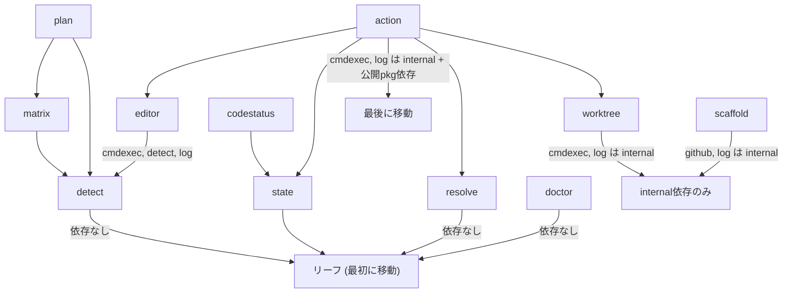

# 000-Public-Library-Module

> **Source Specification**: [000-Public-Library-Module.md](file://prompts/phases/000-foundation/ideas/feat-public-libs/000-Public-Library-Module.md)

## Goal Description

`tt` CLIのビジネスロジックを `github.com/axsh/tokotachi` モジュールとして外部公開する。`pkg/` ディレクトリに公開パッケージ、`internal/` に非公開パッケージを配置し、ルートパッケージに高レベルAPI（コマンド単位の関数）を提供する。

## User Review Required

> [!IMPORTANT]
> **公開/非公開パッケージの分類**: 以下の分類で進めます。変更があればご指摘ください。
> - **公開 (`pkg/`)**: `scaffold`, `worktree`, `action`, `resolve`, `detect`, `state`, `plan`, `matrix`, `editor`, `codestatus`, `doctor`
> - **非公開 (`internal/`)**: `log`, `cmdexec`, `filelock`, `report`, `listing`, `github`

> [!WARNING]
> **非公開パッケージの依存問題**: 公開パッケージの一部が非公開パッケージに依存しています（例: `action` → `cmdexec`, `log`; `scaffold` → `log`, `github`）。これらは公開パッケージの内部依存として同モジュール内でアクセス可能なため問題ありませんが、外部利用者がこれらを直接カスタマイズすることはできません。

## Requirement Traceability

| Requirement (from Spec) | Implementation Point (Section/File) |
| :--- | :--- |
| 要件1: 公開モジュールの提供 (`github.com/axsh/tokotachi`) | Proposed Changes > ルートモジュール構成 > `go.mod` |
| 要件2: コマンド単位の高レベルAPI | Proposed Changes > 高レベルAPI > `tokotachi.go` |
| 要件3: 低レベルAPIの公開 (`pkg/`) | Proposed Changes > 公開パッケージ移動 |
| 要件4: 選択的公開 | Proposed Changes > 公開/非公開分離 |
| 要件5: CLI互換性維持 | Proposed Changes > CLI リファクタリング > `features/tt/` |
| 要件6: Go モジュール正規構成 | Proposed Changes > ルートモジュール構成 |

## Proposed Changes

### ルートモジュール構成

#### [NEW] [go.mod](file://go.mod)
*   **Description**: ルートレベルの Go モジュール定義
*   **Technical Design**:
    ```go
    module github.com/axsh/tokotachi
    go 1.24.0
    
    require (
        github.com/bmatcuk/doublestar/v4 v4.10.0
        github.com/spf13/cobra v1.10.2
        github.com/stretchr/testify v1.11.1
        gopkg.in/yaml.v3 v3.0.1
    )
    ```
*   **Logic**: `features/tt/go.mod` と同じ依存関係をベースにする。`go.sum` も同時に生成する。

---

### 公開パッケージ移動 (`internal/` → `pkg/`)

以下の11パッケージを `features/tt/internal/` から `pkg/` に移動する。移動の手順は依存関係の下流（リーフ）から上流（ルート）の順で行う。

#### 依存関係グラフ（移動順序の根拠）



#### Phase 1: リーフパッケージ（依存なし）

##### [NEW] [pkg/detect/](file://pkg/detect/)
*   **Description**: `features/tt/internal/detect/` をコピー
*   **Technical Design**: OS検出、エディタ解決の機能。外部依存なし
*   **Logic**: パッケージ宣言 `package detect` のまま。インポートパス変更不要（リーフなので）

##### [NEW] [pkg/state/](file://pkg/state/)
*   **Description**: `features/tt/internal/state/` をコピー
*   **Technical Design**: ブランチ状態管理、状態ファイルの読み書き
*   **Logic**: 自己参照以外の internal 依存なし

##### [NEW] [pkg/resolve/](file://pkg/resolve/)
*   **Description**: `features/tt/internal/resolve/` をコピー
*   **Technical Design**: 設定ファイル読み込み、パス解決、devcontainer設定解決
*   **Logic**: internal 依存なし

##### [NEW] [pkg/doctor/](file://pkg/doctor/)
*   **Description**: `features/tt/internal/doctor/` をコピー
*   **Technical Design**: 環境診断チェック
*   **Logic**: internal 依存なし

#### Phase 2: 中間パッケージ（公開パッケージのみに依存）

##### [NEW] [pkg/matrix/](file://pkg/matrix/)
*   **Description**: `features/tt/internal/matrix/` をコピー
*   **Technical Design**: `detect` に依存
*   **Logic**: インポートパスを `github.com/axsh/tokotachi/pkg/detect` に変更

##### [NEW] [pkg/plan/](file://pkg/plan/)
*   **Description**: `features/tt/internal/plan/` をコピー
*   **Technical Design**: `detect`, `matrix` に依存
*   **Logic**: インポートパスを `github.com/axsh/tokotachi/pkg/detect`, `github.com/axsh/tokotachi/pkg/matrix` に変更

##### [NEW] [pkg/codestatus/](file://pkg/codestatus/)
*   **Description**: `features/tt/internal/codestatus/` をコピー
*   **Technical Design**: `state` と `filelock`(internal) に依存
*   **Logic**: `state` → `github.com/axsh/tokotachi/pkg/state`。`filelock` は `github.com/axsh/tokotachi/internal/filelock`

#### Phase 3: internal にも依存するパッケージ

##### [NEW] [pkg/worktree/](file://pkg/worktree/)
*   **Description**: `features/tt/internal/worktree/` をコピー
*   **Technical Design**: `cmdexec`(internal), `log`(internal) に依存
*   **Logic**: `cmdexec` → `github.com/axsh/tokotachi/internal/cmdexec`, `log` → `github.com/axsh/tokotachi/internal/log`

##### [NEW] [pkg/editor/](file://pkg/editor/)
*   **Description**: `features/tt/internal/editor/` をコピー
*   **Technical Design**: `cmdexec`(internal), `detect`(public), `log`(internal) に依存
*   **Logic**: `detect` → `github.com/axsh/tokotachi/pkg/detect`。internal は同モジュール内参照

##### [NEW] [pkg/scaffold/](file://pkg/scaffold/)
*   **Description**: `features/tt/internal/scaffold/` をコピー
*   **Technical Design**: `github`(internal), `log`(internal) に依存
*   **Logic**: internal 依存は同モジュール内参照

##### [NEW] [pkg/action/](file://pkg/action/)
*   **Description**: `features/tt/internal/action/` をコピー
*   **Technical Design**: 最も依存が多い。`cmdexec`(internal), `log`(internal), `editor`(public), `github`(internal), `resolve`(public), `state`(public), `worktree`(public) に依存
*   **Logic**: 公開パッケージは `github.com/axsh/tokotachi/pkg/xxx`、非公開は `github.com/axsh/tokotachi/internal/xxx` に変更

---

### 非公開パッケージ移動 (`features/tt/internal/` → ルート `internal/`)

#### [NEW] [internal/log/](file://internal/log/)
*   **Description**: `features/tt/internal/log/` をコピー。ロガー実装
*   **Logic**: 外部依存なし。パッケージ宣言と自己参照のみ更新

#### [NEW] [internal/cmdexec/](file://internal/cmdexec/)
*   **Description**: `features/tt/internal/cmdexec/` をコピー。コマンド実行ラッパー
*   **Logic**: `log`(internal) に依存 → `github.com/axsh/tokotachi/internal/log`

#### [NEW] [internal/filelock/](file://internal/filelock/)
*   **Description**: `features/tt/internal/filelock/` をコピー。ファイルロック機構
*   **Logic**: 外部依存なし

#### [NEW] [internal/github/](file://internal/github/)
*   **Description**: `features/tt/internal/github/` をコピー。GitHub API連携
*   **Logic**: `cmdexec`(internal) に依存 → `github.com/axsh/tokotachi/internal/cmdexec`

#### [NEW] [internal/report/](file://internal/report/)
*   **Description**: `features/tt/internal/report/` をコピー。実行レポート生成
*   **Logic**: `cmdexec`(internal) に依存 → `github.com/axsh/tokotachi/internal/cmdexec`

#### [NEW] [internal/listing/](file://internal/listing/)
*   **Description**: `features/tt/internal/listing/` をコピー。リスト表示ユーティリティ
*   **Logic**: `state`(public) に依存 → `github.com/axsh/tokotachi/pkg/state`

---

### 高レベルAPI

#### [NEW] [tokotachi.go](file://tokotachi.go)
*   **Description**: ルートパッケージ `package tokotachi` に高レベルAPI関数を定義
*   **Technical Design**:
    ```go
    package tokotachi

    // Client はライブラリの操作を行うメインの構造体
    type Client struct {
        RepoRoot string  // リポジトリルートパス
        Verbose  bool    // デバッグログ出力
        DryRun   bool    // ドライラン
    }

    // NewClient は新しいClientを作成する
    func NewClient(repoRoot string) *Client

    type OpenOptions struct {
        Editor string   // エディタ指定 (code|cursor|ag|claude)
    }
    func (c *Client) Open(branch, feature string, opts OpenOptions) error

    type UpOptions struct {
        SSH     bool   // SSHモード
        Rebuild bool   // イメージ再ビルド
        NoBuild bool   // ビルドスキップ
    }
    func (c *Client) Up(branch, feature string, opts UpOptions) error

    type DownOptions struct {}
    func (c *Client) Down(branch, feature string, opts DownOptions) error

    type CreateOptions struct {}
    func (c *Client) Create(branch string, opts CreateOptions) error

    type CloseOptions struct {
        Yes bool  // 確認スキップ
    }
    func (c *Client) Close(branch string, opts CloseOptions) error

    type ScaffoldOptions struct {
        RepoURL     string   // テンプレートリポジトリURL
        DryRun      bool
        Yes         bool
        Lang        string
        Values      []string // key=value オーバーライド
        UseDefaults bool
        SkipDeps    bool
        Force       bool
    }
    func (c *Client) Scaffold(category, name string, opts ScaffoldOptions) error

    type StatusOptions struct {}
    type StatusResult struct { /* state.StateFile の情報 */ }
    func (c *Client) Status(branch string, opts StatusOptions) (*StatusResult, error)

    type ListOptions struct {}
    type ListEntry struct { /* worktree一覧の1エントリ */ }
    func (c *Client) List(opts ListOptions) ([]ListEntry, error)
    ```
*   **Logic**: 各メソッドは `cmd/` パッケージの `runXxx` 関数と同等のロジックを実装する。ただし `cobra.Command` 依存は排除し、`pkg/` パッケージを直接呼び出す。Cobra のフラグパースは CLI レイヤーのみの責務とする。

---

### CLI リファクタリング

#### [MODIFY] [features/tt/go.mod](file://features/tt/go.mod)
*   **Description**: ルートモジュールへの依存を追加
*   **Technical Design**:
    ```go
    module github.com/axsh/tokotachi/features/tt
    go 1.24.0

    require (
        github.com/axsh/tokotachi v0.0.0  // ローカル replace
        github.com/spf13/cobra v1.10.2
        // ... 外部依存
    )

    replace github.com/axsh/tokotachi => ../..
    ```

#### [MODIFY] [features/tt/cmd/*.go](file://features/tt/cmd/) (全18ファイル)
*   **Description**: インポートパスを `internal/` から `pkg/` および `internal/` (ルートモジュール) に変更
*   **Technical Design**: 一括置換の規則:
    ```
    github.com/axsh/tokotachi/features/tt/internal/action    → github.com/axsh/tokotachi/pkg/action
    github.com/axsh/tokotachi/features/tt/internal/scaffold   → github.com/axsh/tokotachi/pkg/scaffold
    github.com/axsh/tokotachi/features/tt/internal/worktree   → github.com/axsh/tokotachi/pkg/worktree
    github.com/axsh/tokotachi/features/tt/internal/resolve    → github.com/axsh/tokotachi/pkg/resolve
    github.com/axsh/tokotachi/features/tt/internal/detect     → github.com/axsh/tokotachi/pkg/detect
    github.com/axsh/tokotachi/features/tt/internal/state      → github.com/axsh/tokotachi/pkg/state
    github.com/axsh/tokotachi/features/tt/internal/plan       → github.com/axsh/tokotachi/pkg/plan
    github.com/axsh/tokotachi/features/tt/internal/matrix     → github.com/axsh/tokotachi/pkg/matrix
    github.com/axsh/tokotachi/features/tt/internal/editor     → github.com/axsh/tokotachi/pkg/editor
    github.com/axsh/tokotachi/features/tt/internal/codestatus → github.com/axsh/tokotachi/pkg/codestatus
    github.com/axsh/tokotachi/features/tt/internal/doctor     → github.com/axsh/tokotachi/pkg/doctor
    github.com/axsh/tokotachi/features/tt/internal/log        → github.com/axsh/tokotachi/internal/log
    github.com/axsh/tokotachi/features/tt/internal/cmdexec    → github.com/axsh/tokotachi/internal/cmdexec
    github.com/axsh/tokotachi/features/tt/internal/report     → github.com/axsh/tokotachi/internal/report
    github.com/axsh/tokotachi/features/tt/internal/listing    → github.com/axsh/tokotachi/internal/listing
    github.com/axsh/tokotachi/features/tt/internal/filelock   → github.com/axsh/tokotachi/internal/filelock
    github.com/axsh/tokotachi/features/tt/internal/github     → github.com/axsh/tokotachi/internal/github
    ```

#### [DELETE] [features/tt/internal/](file://features/tt/internal/)
*   **Description**: 移動完了後、旧 `internal/` ディレクトリを削除

---

### ビルドスクリプト更新

#### [MODIFY] [scripts/process/build.sh](file://scripts/process/build.sh)
*   **Description**: `build_backend` がルートの `go.mod` を検出してルートモジュールのビルド・テストを実行するようになる。既存の動作にすでに対応済み（`go.mod` が存在すれば `go build ./...` + `go test ./...`）
*   **Logic**: ルートに `go.mod` が存在するようになるため、`build_backend` 関数が自動的にルートモジュールをビルドする。追加変更は不要の見込みだが、`internal/` のテストが `tests/` と混同されないよう確認が必要

## Step-by-Step Implementation Guide

### ステップ1: ルートモジュール初期化
1. プロジェクトルートに `go.mod` を作成 (`module github.com/axsh/tokotachi`)
2. `go mod tidy` で依存解決

### ステップ2: 非公開パッケージ移動 (6パッケージ)
1. `features/tt/internal/log/` → `internal/log/` にコピー
2. `features/tt/internal/cmdexec/` → `internal/cmdexec/` にコピー
3. `features/tt/internal/filelock/` → `internal/filelock/` にコピー
4. `features/tt/internal/github/` → `internal/github/` にコピー
5. `features/tt/internal/report/` → `internal/report/` にコピー
6. `features/tt/internal/listing/` → `internal/listing/` にコピー
7. 各ファイルのインポートパスを `github.com/axsh/tokotachi/internal/xxx` に更新
8. パッケージ間の依存 (`cmdexec` → `log`, `github` → `cmdexec`, `report` → `cmdexec`, `listing` → `state`) も更新

### ステップ3: 公開パッケージ移動 Phase 1 (リーフ: 4パッケージ)
1. `features/tt/internal/detect/` → `pkg/detect/` にコピー
2. `features/tt/internal/state/` → `pkg/state/` にコピー
3. `features/tt/internal/resolve/` → `pkg/resolve/` にコピー
4. `features/tt/internal/doctor/` → `pkg/doctor/` にコピー
5. インポートパス更新（リーフなので自己参照以外なし）
6. `go build ./...` でコンパイル確認

### ステップ4: 公開パッケージ移動 Phase 2 (中間: 3パッケージ)
1. `features/tt/internal/matrix/` → `pkg/matrix/` にコピー
2. `features/tt/internal/plan/` → `pkg/plan/` にコピー
3. `features/tt/internal/codestatus/` → `pkg/codestatus/` にコピー
4. インポートパスを `github.com/axsh/tokotachi/pkg/detect` 等に更新
5. `go build ./...` でコンパイル確認

### ステップ5: 公開パッケージ移動 Phase 3 (上流: 4パッケージ)
1. `features/tt/internal/worktree/` → `pkg/worktree/` にコピー
2. `features/tt/internal/editor/` → `pkg/editor/` にコピー
3. `features/tt/internal/scaffold/` → `pkg/scaffold/` にコピー
4. `features/tt/internal/action/` → `pkg/action/` にコピー
5. 各ファイルのインポートパスを更新（public → `pkg/xxx`, internal → `internal/xxx`）
6. `go build ./...` でコンパイル確認

### ステップ6: ルートモジュール検証
1. `go build ./...` で全パッケージビルド成功確認
2. `go test ./...` で全テスト成功確認
3. `go vet ./...` で静的解析成功確認

### ステップ7: 高レベルAPI実装
1. `tokotachi.go` にClient構造体とオプション型を定義
2. 各コマンド関数を `cmd/` の `runXxx` ロジックをベースに実装
3. テストを作成

### ステップ8: CLI リファクタリング
1. `features/tt/go.mod` に `require github.com/axsh/tokotachi` + `replace ../..` を追加
2. `features/tt/cmd/*.go` の全インポートパスを一括置換
3. `features/tt/internal/` を削除
4. `cd features/tt && go build .` でビルド確認
5. `cd features/tt && go test ./...` でテスト確認

### ステップ9: ビルドパイプライン検証
1. `./scripts/process/build.sh` を実行し、ルートモジュール + tt の両方がパスすることを確認

## Verification Plan

### Automated Verification

1. **Build & Unit Tests (全体)**:
    ```bash
    ./scripts/process/build.sh
    ```
    *   **Log Verification**: ルートモジュールのビルド (`build_backend`)と `features/tt` のビルド (`build_tt`) が両方 PASS であること

2. **Integration Tests**:
    ```bash
    ./scripts/process/integration_test.sh
    ```
    *   **Log Verification**: 既存の統合テストが全てパスすること（リグレッションなし）

3. **ルートモジュール単体確認**（ビルドスクリプト内で自動実行されるが、手動確認用）:
    *   `go build ./...` がエラー0で完了
    *   `go test ./...` が全テストパス
    *   `go vet ./...` がエラー0で完了

## Documentation

#### [MODIFY] [README.md](file://README.md)
*   **更新内容**: ライブラリとしての利用方法セクションを追加。`go get github.com/axsh/tokotachi` でのインストール方法、高レベルAPI/低レベルAPIの利用例を記載

#### [MODIFY] [features/tt/README.md](file://features/tt/README.md)
*   **更新内容**: CLI がルートモジュールのライブラリを利用していることの説明を追加
