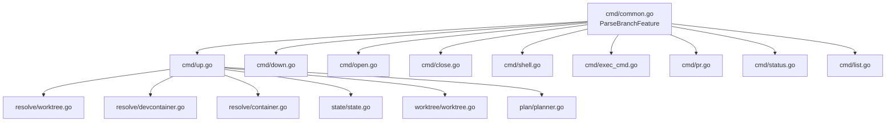

# CLIコマンド引数順序の変更とfeature省略対応

## 背景 (Background)

現在のdevctlのCLIコマンド体系は`devctl <command> <feature> [branch] [options]`という形式を取っている。これはfeature（機能）ごとにブランチを作成する前提に基づいた設計であるが、実際の運用ではリポジトリ全体で1つのブランチを操作しており、featureごとにブランチを作成しているわけではないことが判明した。

featureを指定する目的は、dev containerの起動対象を特定するためだけであり、git worktreeの作成やブランチ操作はリポジトリ全体のブランチに対して行っている。

この実態に合わせて、以下の2点を変更する：

1. **引数順序の変更**: `<feature> [branch]` → `<branch> [feature]` とし、ブランチが主要な操作対象であることを明示する
2. **feature省略対応**: `<branch>` のみの指定を可能にし、feature省略時はdev containerの起動をスキップする

## 要件 (Requirements)

### 必須要件

#### R1: CLI引数順序の変更

すべてのサブコマンドで、引数の順序を以下のように変更する：

| 変更前 | 変更後 |
|--------|--------|
| `devctl up <feature> [branch]` | `devctl up <branch> [feature]` |
| `devctl down <feature> [branch]` | `devctl down <branch> [feature]` |
| `devctl open <feature> [branch]` | `devctl open <branch> [feature]` |
| `devctl close <feature> [branch]` | `devctl close <branch> [feature]` |
| `devctl shell <feature> [branch]` | `devctl shell <branch> [feature]` |
| `devctl exec <feature> [branch] -- <cmd>` | `devctl exec <branch> [feature] -- <cmd>` |
| `devctl pr <feature> [branch]` | `devctl pr <branch> [feature]` |
| `devctl status <feature> [branch]` | `devctl status <branch> [feature]` |
| `devctl list <feature>` | `devctl list <branch>` |

#### R2: feature省略時の動作

`devctl <command> <branch>` のようにfeatureを省略した場合：

- **dev containerの起動・操作をスキップ**する
- git worktreeの作成・操作は通常通り行う
- `feature`フィールドは空文字列`""`として扱う

#### R3: feature指定時の動作（既存動作の維持）

`devctl <command> <branch> <feature>` のようにfeatureを指定した場合：

- 既存と同様にdev container の起動・操作を行う
- git worktreeの作成・操作を行う

#### R4: 各コマンドのfeature省略時の具体的動作

| コマンド | feature省略時の動作 |
|----------|---------------------|
| `up` | worktree作成のみ、container起動・devcontainer読込をスキップ、エディタ起動はworktreeパスに対して実行 |
| `down` | featureが無い→コンテナ名が解決不可→エラーまたは何もしない |
| `open` | worktreeパスに対してエディタ起動（container attach なし） |
| `close` | worktree削除＋ブランチ削除のみ、container停止をスキップ |
| `shell` | featureが無い→コンテナ名が解決不可→エラー |
| `exec` | featureが無い→コンテナ名が解決不可→エラー |
| `pr` | worktreeパスでPR作成（container不要なので変更なし） |
| `status` | worktreeの状態表示のみ、container状態の表示をスキップ |
| `list` | 引数をbranchに変更。ブランチに対応するworktreeを一覧表示 |

#### R5: `ParseFeatureBranch`の改名と引数解析ロジック変更

`common.go`の`ParseFeatureBranch`関数を`ParseBranchFeature`に改名し、以下の挙動に変更：

```go
// 変更前
func ParseFeatureBranch(args []string) (feature, branch string) {
    feature = args[0]
    if len(args) >= 2 {
        branch = args[1]
    } else {
        branch = feature  // branch省略時はfeature名をbranch名として使用
    }
    return
}

// 変更後
func ParseBranchFeature(args []string) (branch, feature string) {
    branch = args[0]
    if len(args) >= 2 {
        feature = args[1]
    }
    // feature省略時はfeature=""（空文字列）
    return
}
```

#### R6: feature有無の判定ヘルパー

`AppContext`にfeatureが指定されているかを判定するヘルパーメソッドを追加：

```go
// HasFeature returns true if a feature was specified.
func (ctx *AppContext) HasFeature() bool {
    return ctx.Feature != ""
}
```

#### R7: worktreeパス構造の変更

worktreeのパス構成を、ブランチを第一階層とする新しい構造に変更する。これにより、featureの有無によるパスの名前空間衝突を防ぐ：

| 条件 | 変更前 | 変更後 |
|------|--------|--------|
| feature指定あり | `work/<feature>/<branch>` | `work/<branch>/features/<feature>` |
| feature指定なし | （未対応） | `work/<branch>/all/` |

ディレクトリ構造例：
```
work/
├── feat-add-auth/           # ブランチ: feat-add-auth
│   ├── features/
│   │   └── devctl/          # feature: devctl
│   └── all/                 # feature省略時のworktree
└── main/                    # ブランチ: main
    └── all/                 # feature省略時のworktree
```

#### R8: ContainerName / ImageNameの扱い

featureが空の場合、`ContainerName`/`ImageName`は生成不可とする。各コマンドでfeatureが必要な操作を行う前に`HasFeature()`でチェックし、featureが無い場合はcontainer関連の操作をスキップするかエラーを返す。

#### R9: `open --up` オプションの追加

`open`コマンドに`--up`フラグを追加する。このフラグが指定された場合、エディタを開く前にcontainer（及びworktree）が起動していなければ、`up`相当の処理を自動実行する。

- **`--up`未指定時（既存動作）**: worktreeが存在しcontainerが起動済みであることを前提にエディタを開く
- **`--up`指定時**: containerが起動していない場合、まず`up`相当の処理（worktree作成→container起動）を実行してからエディタを開く
- `--up`は`feature`が指定されている場合のみ有効。featureが無い場合は`--up`を指定してもcontainer起動はスキップし、worktree作成のみ行った上でエディタを開く
- `--up`と`--attach`は共存可能とする

### 任意要件

#### O1: stateファイルのパス変更

stateファイルのパスも新しいworktree構造に合わせて変更する：

| 条件 | 変更前 | 変更後 |
|------|--------|--------|
| feature指定あり | `work/<feature>/<branch>.state.yaml` | `work/<branch>/features/<feature>.state.yaml` |
| feature指定なし | （未対応） | `work/<branch>/all.state.yaml` |

## 実現方針 (Implementation Approach)

### 影響範囲



### 主要コンポーネントの変更

1. **`cmd/common.go`**: 引数解析ロジック変更、`HasFeature()`追加
2. **`cmd/*.go`（各サブコマンド）**: Use文字列の変更、feature有無による分岐追加
3. **`resolve/worktree.go`**: feature省略時のパス解決ロジック追加
4. **`resolve/devcontainer.go`**: feature省略時のスキップ
5. **`resolve/container.go`**: feature空チェック
6. **`worktree/worktree.go`**: feature省略時のパス構成変更
7. **`state/state.go`**: feature省略時のstateファイルパス変更
8. **`plan/planner.go`**: feature省略時のplan構築ロジック（containerスキップ）

### 設計上の決定事項

- feature省略時、`AppContext.Feature`は空文字列`""`とする
- container関連操作はすべて`HasFeature()`チェックのガード付きとする
- worktreeの作成は`work/<branch>/features/<feature>`（feature有り）と`work/<branch>/all/`（feature無し）の2パターンをサポート
- `InitContext`の最低引数数を1に変更（現在は`feature name is required`エラー）

## 検証シナリオ (Verification Scenarios)

### シナリオ1: featureなしでupコマンド実行

1. `devctl up feat-some-branch` を `--dry-run` で実行
2. worktreeのみ作成される（`work/feat-some-branch/all/`）
3. container起動がスキップされる
4. stateファイルが`work/feat-some-branch/all.state.yaml`に保存される

### シナリオ2: featureありでupコマンド実行（既存動作）

1. `devctl up feat-some-branch devctl` を `--dry-run` で実行
2. worktreeが`work/feat-some-branch/features/devctl/`に作成される
3. container起動が行われる
4. stateファイルが`work/feat-some-branch/features/devctl.state.yaml`に保存される

### シナリオ3: featureなしでdownコマンド実行

1. `devctl down feat-some-branch` を実行
2. containerが無いため、適切なエラーメッセージまたはスキップされる

### シナリオ4: featureなしでcloseコマンド実行

1. `devctl close feat-some-branch` を実行
2. container停止がスキップされる
3. worktree削除は実行される
4. ブランチ削除は実行される

### シナリオ5: featureなしでopenコマンド実行

1. `devctl open feat-some-branch --editor cursor` を実行
2. worktreeパス（`work/feat-some-branch/all/`）に対してエディタが開かれる
3. container attachは試行されない

### シナリオ6: featureなしでprコマンド実行

1. `devctl pr feat-some-branch` を実行
2. worktreeパスでPR作成が実行される（containerは不要なので影響なし）

### シナリオ7: listコマンドのブランチベース一覧

1. `devctl list feat-some-branch` を実行
2. 当該ブランチに関連するworktreeが一覧表示される

### シナリオ8: open --up でcontainer未起動時に自動起動

1. containerが起動していない状態で `devctl open feat-some-branch devctl --editor cursor --up` を実行
2. containerが起動していないことを検出し、`up`相当の処理が実行される（worktree作成→container起動）
3. container起動後、エディタが開かれる

### シナリオ9: open --up でfeature省略時

1. `devctl open feat-some-branch --editor cursor --up` を実行（featureなし）
2. worktreeが存在しなければ作成される
3. container起動はスキップされる
4. エディタがworktreeパスに対して開かれる

## テスト項目 (Testing for the Requirements)

### 単体テスト

| 要件 | テスト対象 | 検証内容 |
|------|-----------|----------|
| R5 | `cmd/common_test.go` の `ParseBranchFeature` テスト | 引数1つ→branch設定・feature空、引数2つ→両方設定 |
| R6 | `cmd/common_test.go` の `HasFeature` テスト | feature空→false、feature有→true |
| R7 | `resolve/worktree_test.go` | feature空時のパス解決 |
| R8 | `resolve/container_test.go` | feature空時のcontainer名生成（エラーまたは空） |
| R9 | `cmd/open_test.go` | `--up`フラグ指定時にcontainer未起動→up実行→open実行の流れ |
| R4 | 各 `cmd/*_test.go` | feature省略時の各コマンド動作 |
| O1 | `state/state_test.go` | feature空時のstateファイルパス |

### 自動検証コマンド

```bash
# 全体ビルド & 単体テスト
scripts/process/build.sh

# 統合テスト
scripts/process/integration_test.sh
```
