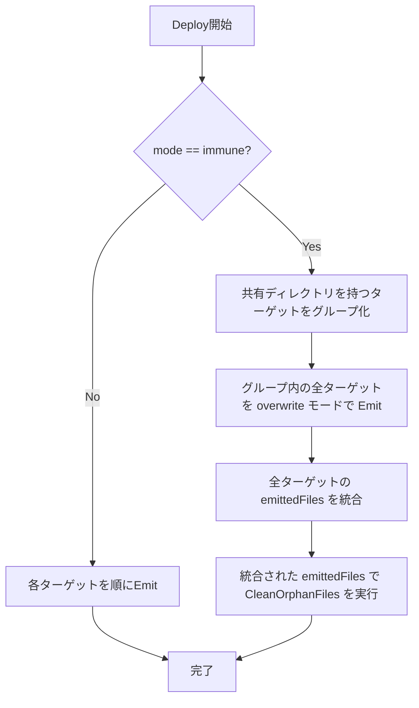

# Antigravity/Codex 統合デプロイ先 (.agents) 仕様

## 背景 (Background)

### 現状

Antigravity (Agy) と Codex は、`tt prompt deploy` においてそれぞれ独立したディレクトリにファイルをデプロイしている。

| Target | デプロイ先 (rules) | デプロイ先 (skills) | デプロイ先 (workflows) |
|---|---|---|---|
| antigravity | `.agent/rules/` | `.agent/skills/` | `.agent/workflows/` |
| codex | `.agents/rules/` | `.agents/skills/` | (なし: procedures を skills として emit) |

- 各ターゲットは独立した Emitter (`AntigravityEmitter`, `CodexEmitter`) を持ち、それぞれが独自の `Emit()` メソッドでファイルを生成する。
- `tt prompt deploy --target all` では、`KnownTargets` のアルファベット順（`antigravity` -> `claude-code` -> `codex` -> `cursor`）にシーケンシャルにデプロイが実行される。
- 各ターゲットの Emit は独立しており、他のターゲットの出力を意識しない。

### 変更の動機

Antigravity と Codex は `.agents` ディレクトリを共用するようになった。Antigravity の `.agent` と Codex の `.agents` は名前が異なるだけで機能的に同等であり、両者を統合して `.agents` に一本化する。

- Emitter 自体は引き続き Antigravity 用と Codex 用で分離を維持する（ターゲット固有の追加ファイルが存在しうるため）。
- Compile 後のファイル生成も、引き続きターゲット別に行う。
- **Deploy 時のディレクトリ統合とモード処理のみ変更する。**

### 課題

Deploy には 3 つの EmitMode が存在する:

| EmitMode | 動作 |
|---|---|
| `overwrite` | 同名ファイルを上書き。ユーザー追加ファイルは保持 |
| `skip` | 同名ファイルが存在する場合は書き込まない。ユーザー追加ファイルは保持 |
| `immune` | 全ファイルを上書き後、emit されなかったファイル（orphan）をターゲットディレクトリから削除 |

現状の `--target all` デプロイでは、各ターゲットがシーケンシャルに処理される。Antigravity と Codex が同じ `.agents` を共有する場合、以下の問題が発生する:

```
antigravity deploy (immune)
  -> .agents をクリーン
  -> Agy ファイルを書き込み

codex deploy (immune)
  -> .agents をクリーン  <-- ここで Agy のファイルが orphan として削除される!
  -> Codex ファイルを書き込み
```

overwrite/skip モードでは orphan 削除が行われないため問題は発生しないが、immune モードでは後から処理されるターゲットが先のターゲットの出力を orphan と見なして削除してしまう。

## 要件 (Requirements)

### 必須要件

1. **R1: デプロイ先統合** - Antigravity のデプロイ先を `.agent/` から `.agents/` に変更する。具体的には:
   - `antigravity.yaml` の `paths` を `.agents/rules/`, `.agents/skills/`, `.agents/workflows/` に変更する
   - `targetMetaDirs` の antigravity エントリを `.agents/.meta/` に変更する

2. **R2: immune モードの安全な処理順序** - immune モードで `--target all` を指定した場合、同一ディレクトリを共有するターゲット間で以下の処理順序を保証する:
   1. 先に orphan クリーンアップを実行する（全共有ターゲットの emittedFiles を統合した上で）
   2. その後、各ターゲットのファイルを overwrite で書き込む

3. **R3: ユーザー追加ファイルの適切な扱い** - 各モードにおけるユーザー追加ファイルの保護:
   - `overwrite`: ユーザー追加ファイルは保持される（変更なし）
   - `skip`: ユーザー追加ファイルは保持される（変更なし）
   - `immune`: マニフェストに定義されたファイル以外は削除される（`README.md`, `.gitkeep` を除く）。ただし **全共有ターゲットの出力を統合した上で** orphan 判定を行うため、他ターゲットのファイルは orphan と見なされない

4. **R4: 単独ターゲット指定時の動作** - `--target antigravity` や `--target codex` を単独で指定した場合も正しく動作すること。ただし、immune モードで単独ターゲットを指定した場合、そのターゲットが出力しないファイル（他ターゲット固有のファイル）は orphan と見なされて削除される可能性がある。これは想定内の動作とする。

5. **R5: Emitter の分離維持** - `AntigravityEmitter` と `CodexEmitter` は引き続き独立したクラスとして維持する。ターゲット固有の追加ファイルやフォーマットの違いに対応するため。

### 任意要件

6. **R6: AGENTS.md のインデックス統合** - 現在 Codex のみが `AGENTS.md` の marker セクションを管理しているが、Antigravity のファイルも `.agents/` に配置されるため、`AGENTS.md` に Antigravity 固有のファイル（workflows 等）も反映することを検討する。

## 実現方針 (Implementation Approach)

### 方針A: Deploy レイヤーでの統合（推奨）

immune モードの問題は Deploy パイプラインレイヤーで解決する。Emitter 自体は変更せず、Deploy の呼び出し側で処理順序を制御する。

#### 処理フロー



#### 具体的な変更箇所

1. **`antigravity.yaml`**: paths を `.agents/` に変更
2. **`pkg/resolve/target.go`**: `targetMetaDirs` の antigravity エントリを `.agents/.meta/` に変更（ただし Codex と共存するため、サブディレクトリで分離: `.agents/.meta/antigravity/` と `.agents/.meta/codex/`）
3. **`features/tt/cmd/prompt.go` の `runPromptDeploy`**: immune モード時に共有ディレクトリのターゲットをまとめて処理するロジックを追加
4. **Emitter インターフェース拡張**: `EmittedFiles()` を返すメソッドを追加するか、`Emit()` の戻り値に emittedFiles を含める
5. **`CleanOrphanFiles` の呼び出し元変更**: 各 Emitter の `Emit()` 内部ではなく、Deploy パイプラインから一括で呼び出す

### 方針B: Emitter 統合（不採用）

Antigravity と Codex の Emitter を統合する方法。ターゲット固有のファイルの扱いが複雑になるため不採用。

## 検証シナリオ (Verification Scenarios)

### シナリオ1: overwrite モードでの統合デプロイ

1. `tt prompt deploy --target all` を実行する（mode 未指定 = overwrite）
2. Antigravity のファイルが `.agents/rules/`, `.agents/skills/`, `.agents/workflows/` に書き出される
3. Codex のファイルが `.agents/rules/`, `.agents/skills/` に書き出される
4. Antigravity 固有のファイルと Codex 固有のファイルが両方とも `.agents/` 内に共存する
5. ユーザーが手動で追加したファイルが残っている

### シナリオ2: immune モードでの統合デプロイ

1. `.agents/rules/` にユーザーが手動で `user-custom.md` を追加する
2. `tt prompt deploy --target all --mode immune` を実行する
3. 全ターゲットの emittedFiles が統合される
4. `user-custom.md` は emittedFiles に含まれないため orphan として削除される
5. Antigravity のファイルと Codex のファイルは全て残っている（相互に削除されない）

### シナリオ3: skip モードでの統合デプロイ

1. `.agents/rules/` に Antigravity が出力するファイルと同名のファイルが存在する
2. `tt prompt deploy --target all --mode skip` を実行する
3. 既存のファイルは上書きされない
4. 新規ファイルのみ書き込まれる

### シナリオ4: 単独ターゲット指定

1. `tt prompt deploy --target antigravity` を実行する
2. Antigravity のファイルのみが `.agents/` に書き出される
3. Codex 固有のファイルは変更されない（overwrite/skip の場合）

### シナリオ5: immune + 単独ターゲット指定

1. `.agents/rules/` に Codex のファイルが既に存在する
2. `tt prompt deploy --target antigravity --mode immune` を実行する
3. Antigravity のファイルを書き出し、orphan クリーンアップを実行する
4. Codex 固有のファイルは orphan として削除される可能性がある（想定内の動作）

## テスト項目 (Testing for the Requirements)

### R1: デプロイ先統合

- **単体テスト**: `AntigravityEmitter.resolvePaths()` が `.agents/` を返すことを確認
- **単体テスト**: `antigravity.yaml` のパース結果に `.agents/` のパスが含まれることを確認

### R2: immune モードの安全な処理順序

- **単体テスト**: 共有ディレクトリを持つターゲットグループが正しく検出されることを確認
- **単体テスト**: immune モードで全ターゲットの emittedFiles が統合され、CleanOrphanFiles に渡されることを確認
- **統合テスト**: `--target all --mode immune` で Agy/Codex 両方のファイルが残ることを確認

### R3: ユーザー追加ファイルの適切な扱い

- **単体テスト**: overwrite モードでユーザー追加ファイルが残ることを確認（既存テストの拡張）
- **単体テスト**: immune モードで orphan ファイルが削除されることを確認（既存テストの拡張）

### R4: 単独ターゲット指定時の動作

- **単体テスト**: `--target antigravity` で Codex ファイルに影響がないことを確認

### ビルド・全体検証

1. ビルド + 単体テスト:
   ```
   scripts/process/build.sh --skip-frontend --skip-etc
   ```

2. バックエンド統合テスト（prompt deploy の動作確認）:
   ```
   scripts/process/integration_test.sh --categories "common"
   ```
