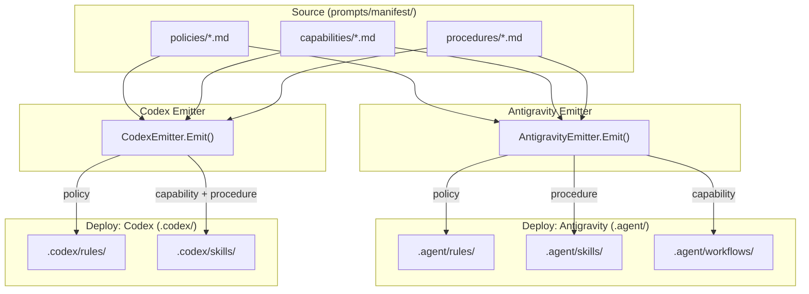

# 001-SeparateDeployPaths-AgyAndCodex

Antigravity (agy) と Codex のデプロイパスを分離し、各エージェントに最適化されたディレクトリ構成で出力するようにする。

## 背景 (Background)

### 現状の課題

Antigravity と Codex は、現在同じ `.agents/` ディレクトリをデプロイ先として共有している。

```
.agents/
  rules/     <- Antigravity と Codex が共用
  skills/    <- Antigravity と Codex が共用
```

しかし、両者は実行モデルが根本的に異なる:

- **Antigravity**: `rules/` と `skills/` に加え、`workflows/` の概念をサポートしている。Capabilities（自動実行される能力）と Procedures（ワークフロー手順）は本来異なる概念であり、skills に統合すべきではない
- **Codex**: `workflows` の概念が存在しない。全てを `rules/` と `skills/` で管理する設計

これまで Codex との共有を前提に、Antigravity 向けの capabilities と procedures を全て `skills/` にデプロイしていた。しかし Codex を `.codex/` に分離することで、この配慮が不要になり、Antigravity に完全特化したディレクトリ構成が可能になる。

### 具体的な問題点

1. **デプロイ先の競合**: `tt prompt update` で全ターゲットを順次処理するとき、Antigravity と Codex が同じ `.agents/` に書き込み、互いのファイルが混在する
2. **概念の不一致**: Antigravity の capabilities は実質的に workflows (自動トリガーされる手順) だが、skills にデプロイされているためユーザーにとって直感的でない
3. **Codex 独自機能の制約**: Codex は `AGENTS.md` のマーカーセクション管理など固有の機能を持つが、`.agents/` を共有しているため Antigravity 向けの不要なファイルも含まれる

## 要件 (Requirements)

### 必須要件 (MUST)

#### R1: デプロイパスの分離

| Target | 現状 | 変更後 |
|:---|:---|:---|
| **Antigravity** | `.agents/rules/`, `.agents/skills/` | `.agent/rules/`, `.agent/skills/`, `.agent/workflows/` |
| **Codex** | `.agents/rules/`, `.agents/skills/` | `.codex/rules/`, `.codex/skills/` |

- Antigravity と Codex のデプロイ先ディレクトリは完全に分離すること
- Antigravity のデプロイ先は `.agent/`（**単数形**）配下に変更する
- Codex のデプロイ先は `.codex/` 配下に変更する
- `.agents/`（**複数形**）は廃止し、使用しない

#### R2: Antigravity の capabilities を workflows にデプロイ

- `kind: capability` のエンティティは、Antigravity ターゲットにおいて `.agent/workflows/{id}/WORKFLOW.md` にデプロイすること（従来は `.agents/skills/{id}/SKILL.md`）
- `kind: procedure` のエンティティは `.agent/skills/{id}/SKILL.md` にデプロイする
- Branch Skills（far-knowledge 由来）は `.agent/skills/` にデプロイする

#### R3: Codex の AGENTS.md 管理

- Codex が管理する `AGENTS.md` のマーカーセクションは、新しいパス `.codex/` を参照するように更新すること
- `AGENTS.md` 自体はプロジェクトルートに残す

#### R4: ターゲット設定ファイルの更新

`prompts/manifest/targets/` 配下の YAML ファイルを更新すること:

**antigravity.yaml (変更後)**:
```yaml
apiVersion: agent.meta/v1
kind: target
id: antigravity
includes:
  policy: true
  capability: true
  procedure: true
  subagent: false
paths:
  rules: .agent/rules/
  skills: .agent/skills/
  workflows: .agent/workflows/
limits:
  rules:
    max_file_size: 12000
    on_exceed: warn
```

**codex.yaml (変更後)**:
```yaml
apiVersion: agent.meta/v1
kind: target
id: codex
includes:
  policy: true
  capability: true
  procedure: true
  subagent: false
paths:
  rules: .codex/rules/
  skills: .codex/skills/
index_file: AGENTS.md
```

#### R5: buildDir 出力の整合性

`tmp/dist/` 配下の出力構造も同様に分離すること:

```
tmp/dist/
  antigravity/
    .agent/rules/       <- policies
    .agent/skills/      <- procedures, branch skills
    .agent/workflows/   <- capabilities
  codex/
    .codex/rules/       <- policies
    .codex/skills/      <- capabilities, procedures
  cursor/
    .cursor/rules/      <- (変更なし)
    .cursor/skills/     <- (変更なし)
  claude-code/
    .claude/rules/      <- (変更なし)
    .claude/skills/     <- (変更なし)
```

#### R6: Cursor / Claude Code は変更なし

- Cursor (`.cursor/`) と Claude Code (`.claude/`) のデプロイパスおよび動作は変更しない

### 任意要件 (SHOULD)

#### R7: Antigravity の workflows frontmatter

Workflows にデプロイされるファイルの frontmatter は、skills と同じ `SkillFrontmatter` 構造で良い（Antigravity は skills も workflows も同じフォーマットを期待するため）。ただし、将来的に分けたくなった場合に備えてコード上は分離可能にしておくことが望ましい。

## 実現方針 (Implementation Approach)

### 変更対象コンポーネント

#### 1. ターゲット設定ファイル (`prompts/manifest/targets/`)

- `antigravity.yaml`: `paths` を `.agent/` 配下に変更し、`paths.workflows` を追加
- `codex.yaml`: `paths.rules` と `paths.skills` を `.codex/` 配下に変更

#### 2. Antigravity エミッタ (`features/tt/internal/prompt/emitter/antigravity.go`)

- デフォルトパスを `.agents/` から `.agent/` に変更
- `resolvePaths()` を 3 パス返却に変更（rules, skills, workflows）
- `Emit()` の capabilities 出力先を `skillsDir` から `workflowsDir` に変更
- 出力ファイル名を `SKILL.md` から `WORKFLOW.md` に変更（capabilities のみ）
- `EmitResult.TargetDirs` に `workflowsDir` を追加
- `CleanTargetDirs` に `workflowsDir` を追加

#### 3. Codex エミッタ (`features/tt/internal/prompt/emitter/codex.go`)

- `resolvePaths()` のデフォルトパスを `.codex/rules/`, `.codex/skills/` に変更
- AGENTS.md のマーカーセクション内の rules/skills パス参照を更新

#### 4. テンプレート変数解決 (`features/tt/internal/prompt/emitter/template.go`)

- `TargetPaths` 構造体に `Workflows` フィールドを追加
- `{{capability:id}}` の解決先を `workflows/` パスに変更（Antigravity ターゲットの場合）

#### 5. includes 設定 (`features/tt/internal/prompt/emitter/includes.go`)

- 変更不要（capability の include/exclude 制御は既存のまま機能する）

#### 6. ドリフト検出 (`Check()` メソッド)

- Antigravity の `Check()` で `workflowsDir` も検査対象に追加

### アーキテクチャ図



## 検証シナリオ (Verification Scenarios)

1. `tt prompt compile --target antigravity` を実行し、`tmp/dist/antigravity/` 配下に以下が生成されることを確認:
   - `.agent/rules/` に policies が出力される
   - `.agent/skills/` に procedures と branch skills が出力される
   - `.agent/workflows/` に capabilities が出力される
   - `.agent/workflows/{id}/WORKFLOW.md` の形式であること

2. `tt prompt compile --target codex` を実行し、`tmp/dist/codex/` 配下に以下が生成されることを確認:
   - `.codex/rules/` に policies が出力される
   - `.codex/skills/` に capabilities と procedures が出力される
   - `.agents/` には何も出力されないこと

3. `tt prompt update` を実行し、全ターゲットが順次処理されて互いの出力を破壊しないことを確認

4. `tt prompt deploy --target antigravity` を実行し、プロジェクトルートの `.agent/` に正しくデプロイされることを確認:
   - `.agent/workflows/pre-push-knowledge-check/WORKFLOW.md` が存在すること
   - `.agent/skills/build-pipeline/SKILL.md` が存在すること（procedure 由来）

5. `tt prompt deploy --target codex` を実行し、`.codex/` 配下に正しくデプロイされ、`AGENTS.md` のマーカーセクションが `.codex/` を参照していることを確認

## テスト項目 (Testing for the Requirements)

### ビルド・全体検証

1. ビルドと単体テスト:
   ```
   scripts/process/build.sh --skip-frontend --skip-etc
   ```

2. 変更影響範囲の統合テスト:
   ```
   scripts/process/integration_test.sh --categories "common" --specify "Prompt|Deploy|Compile|Update"
   ```

### 単体テスト対象

| 要件 | テスト |
|:---|:---|
| R1 (パス分離) | `antigravity_test.go`, `codex_test.go` の `resolvePaths` テスト |
| R2 (workflows デプロイ) | `antigravity_test.go` の `TestEmit_Antigravity` を更新し、capabilities が `workflows/` に出力されることを検証 |
| R3 (AGENTS.md) | `codex_test.go` の AGENTS.md マーカーテスト |
| R4 (target YAML) | 統合テストで `tt prompt compile` の出力を検証 |
| R5 (buildDir) | `compiler_test.go` で buildDir 構造を検証 |
