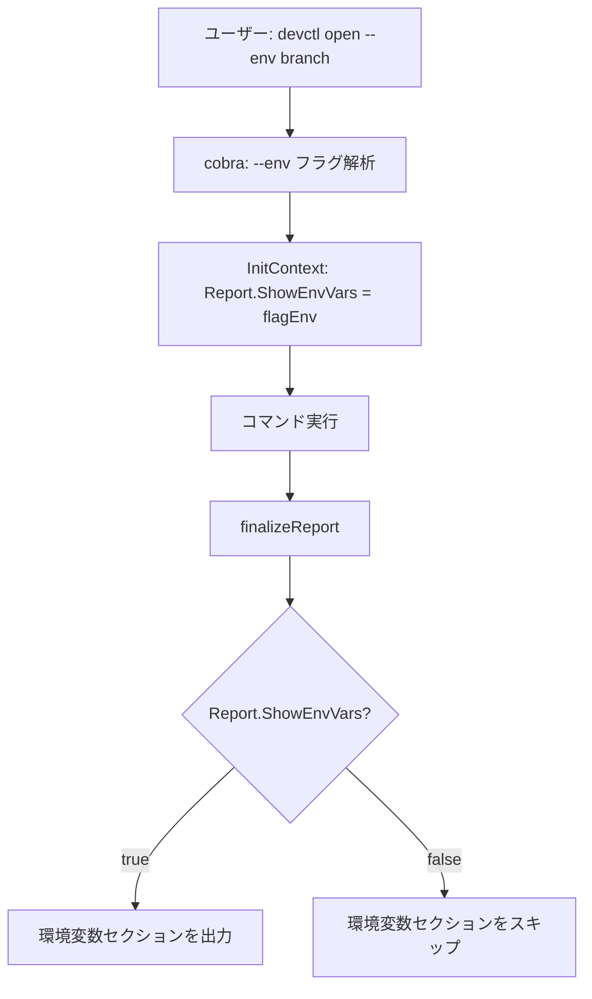

# `--env` オプションのグローバル化

## 背景 (Background)

現在、`devctl` の `--env` フラグは `list` コマンドにのみ実装されている。しかし、レポートを出力するすべてのコマンド（`open`, `close`, `up`, `down`, `status`, `shell`, `exec`, `pr`, `list`）で環境変数セクション（`## Environment Variables`）が**常に表示されてしまう**という問題がある。

### 問題の原因

1. `InitContext()` (`common.go` L83) が常に `CollectEnvVars()` を呼び出し、`Report.EnvVars` を設定する
2. `Report.Print()` (`report.go` L50-60) は `len(EnvVars) > 0` であれば常に環境変数セクションを出力する
3. `finalizeReport()` は `Report.Print()` を無条件に呼び出す

結果として、`devctl open fix-env-option` のような実行時に、ユーザーが `--env` を指定していなくても環境変数の一覧が毎回レポートに表示されてしまう。

### 現状の `--env` の位置づけ

- `list` コマンドの `runListBranches()` 内でのみ使用（L148-155）
- `list` のブランチ一覧表示モードは `InitContext` を使わないため、`--env` 指定時に独立して `Report` を生成して表示する実装になっている

## 要件 (Requirements)

### 必須要件

1. **`--env` をルートコマンドの PersistentFlags に移動する**  
   - すべてのサブコマンドで `--env` フラグを利用可能にする
   - `list` コマンドのローカルフラグ `flagListEnv` は削除する

2. **デフォルトで環境変数セクションを非表示にする**  
   - `--env` が指定されていない場合、レポートの `## Environment Variables` セクションは出力しない
   - `--env` が指定された場合のみ環境変数セクションを出力する

3. **すべてのレポート出力コマンドで `--env` が動作する**  
   - `finalizeReport()` を通じてレポートを出力するコマンド: `open`, `close`, `up`, `down`, `status`, `shell`, `exec`, `pr`, `list` (features)
   - `list` コマンドのブランチ一覧モード（`runListBranches`）

### 任意要件

- なし

## 実現方針 (Implementation Approach)

### 方針: `Report` 構造体に `ShowEnvVars` フラグを追加

環境変数の収集自体は引き続き行い（将来的な用途・デバッグ用途のため）、**表示のみを制御する** アプローチを採用する。

### 変更対象ファイル

#### 1. `cmd/root.go` — PersistentFlags に `--env` を追加

```go
var flagEnv bool

func init() {
    rootCmd.PersistentFlags().BoolVar(&flagEnv, "env", false, "Show environment variables in report")
}
```

#### 2. `internal/report/report.go` — `Report` 構造体に `ShowEnvVars` フィールドを追加

```go
type Report struct {
    // ...既存フィールド...
    ShowEnvVars   bool        // true の場合のみ環境変数セクションを表示
}
```

`Print` メソッドの環境変数セクション出力条件を変更:

```go
// Before
if len(r.EnvVars) > 0 {

// After
if r.ShowEnvVars && len(r.EnvVars) > 0 {
```

#### 3. `cmd/common.go` — `InitContext` で `flagEnv` を反映

```go
ctx.Report = &report.Report{
    Feature:     feature,
    Branch:      branch,
    EnvVars:     CollectEnvVars(),
    ShowEnvVars: flagEnv,  // グローバルフラグを設定
}
```

#### 4. `cmd/list.go` — ローカルフラグを削除し、グローバルフラグを利用

- `flagListEnv` の宣言と `init()` のフラグ登録を削除
- `runListBranches()` 内の `--env` 条件分岐で `flagEnv`（グローバル）を参照するように変更

### 処理フロー



## 検証シナリオ (Verification Scenarios)

### シナリオ 1: `--env` なしでレポートに環境変数が表示されないこと

1. `devctl open fix-env-option` を実行する
2. レポート出力に `## Environment Variables` セクションが **含まれない** ことを確認する

### シナリオ 2: `--env` ありでレポートに環境変数が表示されること

1. `devctl open --env fix-env-option` を実行する
2. レポート出力に `## Environment Variables` セクションが **含まれる** ことを確認する
3. `DEVCTL_EDITOR`, `DEVCTL_CMD_CODE` 等の環境変数が一覧表示されること

### シナリオ 3: `list` コマンドでの `--env`

1. `devctl list --env` を実行する
2. stderr に `## Environment Variables` セクションが表示されること

### シナリオ 4: `--env` なしで `list` コマンド

1. `devctl list` を実行する
2. stderr に `## Environment Variables` セクションが **表示されない** ことを確認する

## テスト項目 (Testing for the Requirements)

### 単体テスト

| 要件 | テスト内容 | テストファイル |
|------|-----------|---------------|
| `Report.Print` が `ShowEnvVars=false` のとき環境変数セクションを出力しない | `Report.Print` の出力に `Environment Variables` が含まれないことを確認 | `internal/report/report_test.go` (新規追加または既存更新) |
| `Report.Print` が `ShowEnvVars=true` のとき環境変数セクションを出力する | `Report.Print` の出力に `Environment Variables` が含まれることを確認 | 同上 |
| `InitContext` が `flagEnv` を反映する | `InitContext` で生成された `Report.ShowEnvVars` が `flagEnv` の値を反映することを確認 | `cmd/common_test.go` |

### 統合テスト

| 要件 | テスト内容 | テストファイル |
|------|-----------|---------------|
| `--env` なしでレポートに環境変数セクションが出ない | `devctl open branch` のstdout/stderrに `Environment Variables` が含まれないことを確認 | `tests/integration-test/` (新規) |
| `--env` ありでレポートに環境変数セクションが出る | `devctl list --env` のstderrに `Environment Variables` が含まれることを確認 | 既存: `devctl_list_code_test.go` (更新不要・既存テストがカバー) |
| `list` コマンドで `--env` なしの場合に環境変数が出ない | `devctl list` のstderrに `Environment Variables` が出ないことを確認 | `devctl_list_code_test.go` (新規テスト追加) |

### 検証コマンド

```bash
# 単体テスト
./scripts/process/build.sh

# 統合テスト
./scripts/process/integration_test.sh
```
