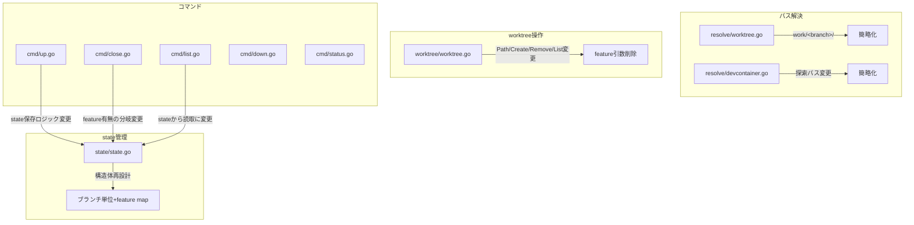

# Worktreeフォルダ構造の簡略化 — feature別フォルダ分離の廃止

## 背景 (Background)

### これまでの経緯

1. **CLI引数リオーダー実施済み** ([000-CLI-Argument-Reorder.md](file://prompts/phases/000-foundation/ideas/feat-remove-feature-name/000-CLI-Argument-Reorder.md)):
   - 引数順序を `<feature> [branch]` → `<branch> [feature]` に変更
   - worktreeパス構造を `work/<branch>/features/<feature>` と `work/<branch>/all/` の2系統に変更
   - feature省略時の動作（コンテナ操作スキップ）を追加

2. **Git Worktreeパス不整合修正実施済み** ([001-GitWorktree-FeaturePath-Fix.md](file://prompts/phases/000-foundation/ideas/fix-git/001-GitWorktree-FeaturePath-Fix.md)):
   - `.git`ファイルのオーバーライドマウント方式に切り替え
   - ホスト側の`.git`ファイルがコンテナ内パスで汚染されなくなった

### 現在の問題

現在のworktreeフォルダ構造は、feature指定の有無によって異なるパスを使い分けている：

| 条件 | 現在のパス |
|------|-----------|
| feature指定あり | `work/<branch>/features/<feature>/` |
| feature指定なし | `work/<branch>/all/` |

この構造について再考した結果、以下の整理に至った：

1. **`<branch>`は単一フォルダで扱うべきである** — いかなる`<feature>`とも共有して良い。feature別に分けたい場合は、`<branch>`の命名で対応すれば良い（例: `feat-auth-devctl`, `feat-auth-backend`）。
2. **`<feature>`の役割は「どのdevcontainerを作り、セットアップし、接続するか」を指定するもの**に過ぎない — フォルダ構造を決定するものではない。
3. この整理は、`<feature>`が任意指定であるという現在の設計とも整合する。

よって、**`work/<branch>/features/<feature>/`と`work/<branch>/all/`の2系統を廃止し、`work/<branch>/`に統一する**。

### stateファイルの設計変更

フォルダが`work/<branch>/`に統一されるため、stateファイルも統一が必要：

- **現在**: feature毎に個別ファイル（`work/<branch>/features/<feature>.state.yaml`、`work/<branch>/all.state.yaml`）
- **新方式**: ブランチ単位のファイル`work/<branch>.state.yaml`に統合し、ファイル内でfeature毎のステートを管理

## 要件 (Requirements)

### 必須要件

#### R1: worktreeフォルダ構造の統一

feature指定の有無にかかわらず、worktreeパスを`work/<branch>/`に統一する：

| 条件 | 変更前 | 変更後 |
|------|--------|--------|
| feature指定あり | `work/<branch>/features/<feature>/` | `work/<branch>/` |
| feature指定なし | `work/<branch>/all/` | `work/<branch>/` |

ディレクトリ構造例：
```
work/
├── feat-add-auth/          # ブランチ: feat-add-auth (featureの有無に関わらず同じ)
├── main/                   # ブランチ: main
└── fix-bug-123/            # ブランチ: fix-bug-123
```

#### R2: stateファイルのブランチ単位統合

stateファイルを`work/<branch>.state.yaml`に変更し、ファイル内でfeature毎のステートを管理する：

```yaml
# work/feat-add-auth.state.yaml
branch: feat-add-auth
created_at: 2026-03-08T16:00:00+09:00
features:
  devctl:
    status: active
    started_at: 2026-03-08T16:00:00+09:00
    connectivity:
      docker:
        enabled: true
        container_name: devctl-devctl
        devcontainer: true   # devcontainer.json で構成されたコンテナか
      ssh:
        enabled: false
  backend:
    status: stopped
    started_at: 2026-03-08T15:00:00+09:00
    connectivity:
      docker:
        enabled: true
        container_name: devctl-backend
        devcontainer: false
      ssh:
        enabled: true
        endpoint: "localhost:2222"
```

> [!NOTE]
> **`editor`フィールドは記録しない**。エディタは`open`コマンドの度に任意に選択可能であり、複数エディタの並行利用や任意の切断も可能なため、stateとして管理する意味がない。
> 代わりに**`connectivity`セクション**で接続方式に関する情報を構造化して記録する:
> - `docker:` — コンテナ名、devcontainer.json準拠かどうか
> - `ssh:` — SSH接続の有効/無効とエンドポイント情報

- feature毎のステータス(`active`, `stopped`, `closed`)を独立管理
- featureが指定されなかった場合（worktreeのみ作成）は、`features`マップにはエントリを追加しない
- 全featureが`closed`になるか、featureが0件の状態でworktreeが削除された場合にstateファイルも削除

#### R3: git worktreeの作成・削除ロジックの変更

同じブランチに対して複数featureを使う場合、worktreeは単一で共有されるため：

- **worktree作成**: ブランチ初回利用時のみ作成（既に存在する場合はスキップ）
- **worktree削除**: 全featureのコンテナが停止・削除された後にのみworktree削除を実行（他featureのコンテナがまだ稼働中であれば削除しない）

#### R4: `close`コマンドの動作変更

- `devctl close <branch>`: 全featureのコンテナを停止・削除した後、worktreeを削除する。**ただし、停止・削除に失敗したコンテナが1つでも残っている場合はworktree削除を行わない**
- `devctl close <branch> <feature>`: 指定featureのコンテナのみ停止・削除し、stateファイルから当該featureエントリを削除する。worktreeは保持する

#### R5: devcontainer設定の探索パス変更

devcontainer.jsonの探索パスから`work/<branch>/features/<feature>/`系パスを削除し、以下に簡略化：

1. `features/<feature>/.devcontainer/devcontainer.json`（リポジトリ定義）
2. `work/<branch>/.devcontainer/devcontainer.json`（worktree内定義）
3. フォールバック: `features/<feature>/Dockerfile`

#### R6: 後方互換fallbackの削除

`resolve/worktree.go`に残っている旧パス構造へのfallback（`work/<feature>/<branch>`、`work/<feature>`）を削除する。

#### R7: `list`コマンドの出力変更

`list`コマンドは、stateファイルの`features`マップを読み取ってfeature一覧を表示するように変更する（ファイルシステムの`work/<branch>/features/`ディレクトリをスキャンする方式を廃止）。

### 任意要件

#### O1: `up`コマンドでの同一ブランチ複数feature対応

同じブランチで複数featureを利用する場合のワークフロー：
```
devctl up feat-auth devctl    # worktree作成 + devctlコンテナ起動
devctl up feat-auth backend   # 既存worktree利用 + backendコンテナ起動
```

> [!IMPORTANT]
> これは現在の「feature別フォルダ」方式から「共有フォルダ」方式への変更であるため、**同一ブランチで複数のfeatureのコンテナが同時にworktreeをマウントする**状況が発生する。Dockerのバインドマウントは同一パスを複数コンテナで共有可能だが、書き込み競合の可能性があることをユーザーは認識する必要がある。

## 実現方針 (Implementation Approach)

### 影響範囲



### 主要コンポーネントの変更

#### 1. `worktree/worktree.go`

- `Path(feature, branch string)` → `Path(branch string)` に変更（featureパラメータ削除）
- `Create(feature, branch string)` → `Create(branch string)` に変更
- `Remove(feature, branch string, force bool)` → `Remove(branch string, force bool)` に変更
- `Exists(feature, branch string)` → `Exists(branch string)` に変更
- `List(branch string)` → stateファイルから情報取得に変更、またはworktreeフォルダの存在確認に簡略化

#### 2. `resolve/worktree.go`

- `Worktree(repoRoot, feature, branch string)` → `Worktree(repoRoot, branch string)` に変更
- fallbackロジック（旧パス構造）を削除
- パスは単純に`work/<branch>/`を返す

#### 3. `state/state.go`

- `StateFile`構造体を再設計:
  ```go
  type DockerConnectivity struct {
      Enabled       bool   `yaml:"enabled"`
      ContainerName string `yaml:"container_name"`
      Devcontainer  bool   `yaml:"devcontainer"` // devcontainer.json で構成されたか
  }

  type SSHConnectivity struct {
      Enabled  bool   `yaml:"enabled"`
      Endpoint string `yaml:"endpoint,omitempty"`
  }

  type Connectivity struct {
      Docker DockerConnectivity `yaml:"docker"`
      SSH    SSHConnectivity    `yaml:"ssh"`
  }

  type FeatureState struct {
      Status       Status       `yaml:"status"`
      StartedAt    time.Time    `yaml:"started_at"`
      Connectivity Connectivity `yaml:"connectivity"`
  }

  type StateFile struct {
      Branch    string                  `yaml:"branch"`
      CreatedAt time.Time               `yaml:"created_at"`
      Features  map[string]FeatureState `yaml:"features"`
  }
  ```
- `StatePath(repoRoot, feature, branch string)` → `StatePath(repoRoot, branch string)` に変更
- パス: `work/<branch>.state.yaml`
- feature状態の追加・更新・削除メソッドを追加

#### 4. `resolve/devcontainer.go`

- `work/<branch>/features/<feature>/`系の探索パスを削除
- `work/<branch>/.devcontainer/`への探索を追加

#### 5. `cmd/up.go`

- worktree作成で`ctx.Feature`パラメータを削除
- state保存でfeatureをMapに追加する方式に変更

#### 6. `cmd/close.go`

- featureなし: 全featureコンテナ停止 + worktree削除
- featureあり: 指定featureのコンテナのみ停止、stateから当該featureエントリ削除

#### 7. `cmd/list.go`

- `wm.List(branch)`の代わりにstateファイルを読み取る方式に変更

### 設計上の決定事項

- 同じブランチのworktreeは1つのみ存在（`work/<branch>/`）
- 複数featureのコンテナが同じworktreeを共有可能
- stateファイルはブランチ単位で1ファイル（`work/<branch>.state.yaml`）
- featureなし`close`は完全クリーンアップ（全コンテナ停止 + worktree削除）

## 検証シナリオ (Verification Scenarios)

### シナリオ1: featureなしでupコマンド実行

1. `devctl up feat-some-branch` を `--dry-run` で実行
2. worktreeが`work/feat-some-branch/`に作成される
3. container起動がスキップされる
4. stateファイルが`work/feat-some-branch.state.yaml`に保存される（featuresマップは空）

### シナリオ2: featureありでupコマンド実行

1. `devctl up feat-some-branch devctl` を `--dry-run` で実行
2. worktreeが`work/feat-some-branch/`に作成される（既存なら再利用）
3. container起動が行われる
4. stateファイル`work/feat-some-branch.state.yaml`のfeaturesマップに`devctl`エントリが追加される

### シナリオ3: 同一ブランチで複数feature起動

1. `devctl up feat-auth devctl` を実行 → worktree作成 + devctlコンテナ起動
2. `devctl up feat-auth backend` を実行 → worktree再利用 + backendコンテナ起動
3. stateファイルのfeaturesマップに`devctl`と`backend`の両方が`active`で記録される

### シナリオ4: featureありでcloseコマンド実行

1. シナリオ3の状態から `devctl close feat-auth devctl` を実行
2. devctlコンテナのみ停止・削除
3. stateファイルからdevctlエントリが削除される
4. worktreeは保持される（backendがまだ稼働中）

### シナリオ5: featureなしでcloseコマンド実行

1. `devctl close feat-some-branch` を実行
2. 全featureのコンテナが停止・削除される
3. worktreeが削除される
4. stateファイルが削除される

### シナリオ6: listコマンド

1. 複数featureが稼働中のブランチに対して`devctl list feat-auth`を実行
2. stateファイルから各featureのステータスが読み取られ表示される

### シナリオ7: パス解決の確認

1. feature有無に関わらず、`resolve.Worktree()`が`work/<branch>/`を返すことを確認
2. 旧パス構造（`work/<feature>/<branch>`）へのfallbackが存在しないことを確認

## テスト項目 (Testing for the Requirements)

### 単体テスト

| 要件 | テスト対象 | 検証内容 |
|------|-----------|---------|
| R1 | `resolve/worktree_test.go` | `Worktree()`が`work/<branch>/`を返すこと |
| R1 | `worktree/worktree_test.go` | `Path()`がfeatureに依存しないこと |
| R2 | `state/state_test.go` | `StatePath()`が`work/<branch>.state.yaml`を返すこと |
| R2 | `state/state_test.go` | featureマップの追加・更新・削除が正常に動作すること |
| R3 | `worktree/worktree_test.go` | worktree作成・削除のfeature引数が不要になっていること |
| R5 | `resolve/devcontainer_test.go` | 新しい探索パスが正しく動作すること |
| R6 | `resolve/worktree_test.go` | 旧パスfallbackが存在しないこと |

### 自動検証コマンド

```bash
# 全体ビルド & 単体テスト
scripts/process/build.sh

# 統合テスト
scripts/process/integration_test.sh
```

## 想定される問題点

> [!NOTE]
> ### 同一worktreeの複数コンテナ共有は意図的な設計
> 同一ブランチで複数featureのコンテナが`work/<branch>/`を共有するケースは意図的にサポートする。Dockerのバインドマウントは同一パスを複数コンテナで共有可能であり、書き込み競合のリスクはユーザー側の運用で管理する。

> [!NOTE]
> ### Git worktreeのオーバーライドマウント
> `.git`ファイルのオーバーライドマウント方式は、worktreeパスが`work/<branch>/`に統一されることで複数コンテナ間で共有されるが、各コンテナが同じ`.git`オーバーライドファイルを個別にマウントすれば問題ない。`CreateContainerGitFile()`はコンテナ起動毎に個別のtempファイルを生成するため、衝突は発生しない。

> [!IMPORTANT]
> ### 既存worktreeのマイグレーション
> 既存の`work/<branch>/features/<feature>/`や`work/<branch>/all/`形式で作成されたworktreeは、この変更後は認識されなくなる。手動でのクリーンアップ（`git worktree remove`）が必要になる可能性がある。
