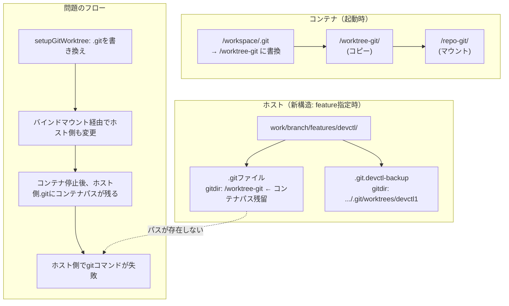

# feature指定時のGit Worktreeパス不整合の修正

## 背景 (Background)

### 以前の修正

[000-DevContainer-GitWorktree.md](file:///c:/Users/yamya/myprog/tokotachi/work/fix-git/all/prompts/phases/000-foundation/ideas/fix-git/000-DevContainer-GitWorktree.md) にて、Dev Container内でgit worktreeが正しく動作するよう修正を行った。この修正では以下のアプローチを採用した:

1. ホスト側のgit関連ディレクトリ（`.git/`, `.git/worktrees/<name>/`）をコンテナ内にマウント
2. コンテナ内の`.git`ファイルをコンテナ内パス（`/worktree-git`）に書き換え
3. 書き換え前に`.git.devctl-backup`としてバックアップを保存
4. 次回`DetectGitWorktree`実行時にバックアップから復元

### CLI引数リオーダーによるフォルダ構成変更

[000-CLI-Argument-Reorder.md](file:///c:/Users/yamya/myprog/tokotachi/work/fix-git/all/prompts/phases/000-foundation/ideas/feat-remove-feature-name/000-CLI-Argument-Reorder.md) にて、worktreeのパス構造が以下の通り変更された:

| 条件 | 変更前 | 変更後 |
|------|--------|--------|
| feature指定あり | `work/<feature>/<branch>` | `work/<branch>/features/<feature>` |
| feature指定なし | （未対応） | `work/<branch>/all/` |

### 現在の問題

feature指定なし（`work/<branch>/all/`）ではgitが正常に動作するが、**feature指定あり（`work/<branch>/features/<feature>/`）ではgitが動作しない**。

実際のフォルダ構造と`.git`ファイルの内容を調査した結果:

```
work/fix-git/all/.git
  → gitdir: C:/Users/yamya/myprog/tokotachi/.git/worktrees/all
  → ✅ 正常（ホストパスを指している）

work/docs-update/features/devctl/.git
  → gitdir: /worktree-git
  → ❌ 異常（コンテナ内パスのまま残っている）
```

### 問題の根本原因

`action.Up()`の`setupGitWorktree`関数は、コンテナ内で`docker exec`を使って`.git`ファイルを書き換えている。ただし、`.git`ファイルはバインドマウント（`-v opts.WorktreePath:/workspace`）で接続されているため、この書き換えは**ホスト側のファイルにも反映される**。

バックアップファイル（`.git.devctl-backup`）は作成されているが、コンテナ停止後にホスト側の`.git`ファイルはコンテナ内パス（`/worktree-git`）のままになる。次回`DetectGitWorktree`を呼び出した時点でバックアップから復元されるはずだが、何らかの理由で復元後に再度コンテナ側で書き換えられる、もしくは復元自体がタイミング的に不整合を起こしている。

> [!NOTE]
> **Git worktree名の内部命名について**: `git worktree add`はパスの最後のコンポーネントをworktree名として`.git/worktrees/`に使用する。同名が既にある場合は`devctl1`等のサフィックスが付くが、各worktreeの`.git`ファイルが正しい`.git/worktrees/<name>/`を参照していれば機能上の問題はない。これは内部命名の問題であり、根本原因ではない。

### 問題の構造図



## 要件 (Requirements)

### 必須要件

1. **R1**: feature指定時（`work/<branch>/features/<feature>/`）のworktreeフォルダで、ホスト側の`git status`, `git log`等のGitコマンドが正常に動作すること
2. **R2**: feature指定なし（`work/<branch>/all/`）のworktreeフォルダで、引き続きGitコマンドが正常に動作すること（後方互換）
3. **R3**: コンテナの起動・停止を繰り返しても、ホスト側の`.git`ファイルが常に正しい状態に維持されること（コンテナ内パスで汚染されないこと）
4. **R4**: Dev Container内で`git status`, `git commit`, `git push`等のGitコマンドが正常に動作すること

## 実現方針 (Implementation Approach)

### 方針A: ホスト側`.git`ファイルを書き換えない設計（推奨）

現在の実装は、バインドマウントされた`.git`ファイルを直接書き換えているため、ホスト側にコンテナ内パスが残留する根本的な問題がある。

**解決策**: コンテナ内で`.git`ファイルのバインドマウントを上書きする方法に切り替える。

1. コンテナ起動時に、正しいコンテナ内パスを持つ`.git`ファイルを**一時ファイルとして生成し、そのファイルを追加のバインドマウントでコンテナ内の`/workspace/.git`に上書きマウント**する
2. これにより、ホスト側の`.git`ファイルは一切変更されない
3. `.git.devctl-backup`の仕組みは不要になる

```
# 起動時の追加マウント
-v <tempfile>:/workspace/.git:ro
```

ただし、`.git`はファイル単体であり、dockerの`-v`マウントでは通常ディレクトリとして扱われるため、この方式が動作するか検証が必要。

### 方針B: コンテナ起動時にホスト側`.git`を復元する仕組みの改善

現在のバックアップ・復元方式を改善するアプローチ:

1. **コンテナ停止時のクリーンアップ**: `down`コマンドまたはコンテナ停止処理で、ホスト側の`.git`ファイルをバックアップから復元する
2. **起動前の復元保証**: `up`コマンドの冒頭で、`.git`ファイルがコンテナ内パスになっている場合はバックアップから復元してから`DetectGitWorktree`を呼び出す
3. **エラーハンドリング強化**: バックアップが存在しない場合でも、`gitdir`の内容から正しいパスを推測する

### 方針C: コンテナ内の`/workspace/.git`をシンボリックリンクに置き換え

1. `.git`ファイルのバインドマウントは変更しない（read-only）
2. コンテナ起動後、`/workspace/.git`を削除し、別の場所に新しい`.git`ファイルを作成してシンボリックリンクを張る

```bash
# コンテナ内のセットアップ
cp /workspace/.git /tmp/dot-git-backup
echo "gitdir: /worktree-git" > /tmp/dot-git-container
rm /workspace/.git  # bind mount上のファイル削除はホスト側にも影響
ln -s /tmp/dot-git-container /workspace/.git
```

この方針もバインドマウント上の操作がホスト側に影響するため、根本解決にならない可能性がある。

### 推奨方針: 方針Bの改善版

方針Aは理想的だが`-v`マウントの制約がある。方針Bを以下の改善を加えて実装する:

#### 改善1: `setupGitWorktree`でホスト側の`.git`ファイルを変更しないようロジック変更

- ワークスペースのバインドマウントをread-onlyにし、コンテナ内のworkspaceを別途writable overlayとして構成する方法を検討
- **または**、`docker run`実行前にホスト側の`.git`ファイルの内容を読み取り、コンテナ内パスに書き換えた一時ファイルを作成し、そのファイルを`workspace/.git`パスに個別マウントする

#### 改善2: `.git`ファイルの個別マウント

`docker run`コマンドに以下を追加:

```bash
# ホスト側で一時ファイルを生成
echo "gitdir: /worktree-git" > /tmp/container-dot-git

# ワークスペースの.gitファイルを個別にオーバーライドマウント
-v /tmp/container-dot-git:/workspace/.git
```

この方式なら:
- ホスト側の`.git`ファイルは変更されない
- コンテナ内では正しいパスが使われる
- バックアップ・復元の仕組みは不要
- `setupGitWorktree`関数の`.git`書き換え部分を削除できる

#### 改善3: worktree名の衝突防止

`git worktree add`実行時に、パスの最後のコンポーネントではなく、一意な名前（例: `<branch>-<feature>`や`<branch>--all`）を使用することは、`git worktree add`コマンドの仕様上直接制御できないが、以下の対策が可能:

- worktree作成後に`.git`ファイル内の`gitdir:`パスを読み取り、実際のworktree名（`devctl1`等）を正確に取得する
- `DetectGitWorktree`はこの実際のパスを使用するため、名前衝突の影響は最小限

### 変更対象ファイル

| ファイル | 変更内容 |
|---------|---------|
| `internal/action/up.go` | `setupGitWorktree`を変更: `.git`ファイル書き換えを廃止し、一時ファイルのマウント方式に切り替え |
| `internal/action/up.go` | `Up()`のdocker runコマンドに`.git`ファイルのオーバーライドマウントを追加 |
| `internal/resolve/gitworktree.go` | `.git.devctl-backup`関連のコードを簡素化または削除 |
| `cmd/up.go` | 一時ファイル生成ロジックを追加（`UpOptions`経由で渡す） |
| `cmd/open.go` | `--up`時の同様の修正 |

## 検証シナリオ (Verification Scenarios)

### シナリオ1: feature指定時のホスト側Git動作確認

1. `devctl up <branch> <feature>` でworktree + コンテナを起動する
2. ホスト側の`work/<branch>/features/<feature>/`ディレクトリで`git status`を実行
3. **コンテナ起動中**でも`git status`が正常に動作することを確認（`.git`ファイルがホスト側パスのまま）
4. `devctl down <branch> <feature>`でコンテナを停止
5. 停止後も`git status`が正常に動作することを確認

### シナリオ2: feature指定なし時の後方互換確認

1. `devctl up <branch>` でworktreeを作成
2. `work/<branch>/all/`ディレクトリで`git status`が正常に動作することを確認

### シナリオ3: コンテナ内のGit動作確認

1. `devctl up <branch> <feature>` でコンテナを起動
2. `devctl exec <branch> <feature> -- git status` でコンテナ内のGitが動作することを確認
3. `devctl exec <branch> <feature> -- git log --oneline -3` でコミット履歴が表示されることを確認

### シナリオ4: 繰り返し起動・停止の安定性確認

1. `devctl up <branch> <feature>` → `devctl down <branch> <feature>` を3回繰り返す
2. 各サイクルで、ホスト側の`git status`が正常に動作することを確認
3. `.git`ファイルの内容がコンテナ内パスに汚染されていないことを確認

## テスト項目 (Testing for the Requirements)

### 単体テスト

| 要件 | テスト対象 | 検証内容 |
|------|-----------|---------|
| R1, R4 | `internal/action/up_test.go` | `.git`ファイルマウントオーバーライドの確認 |
| R3 | `internal/action/up_test.go` | setupGitWorktreeがホスト側`.git`を変更しないこと |

### 自動検証コマンド

```bash
# 全体ビルド & 単体テスト
scripts/process/build.sh

# 統合テスト
scripts/process/integration_test.sh
```
