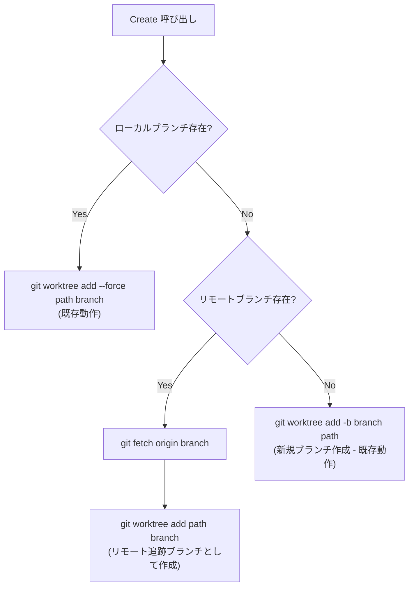

# リモートブランチ存在確認によるWorktree作成の改善

## 背景 (Background)

現在の `open` / `Create` コマンドは、ワークツリーを作成する際にローカルブランチの存在のみをチェックしている。ローカルに該当ブランチがなければ新規ブランチを作成し、あればそのブランチを利用してワークツリーを追加する。

しかし、リモートリポジトリに既に同名のブランチが存在する場合（例: 別の開発者が作成したブランチや、別マシンでプッシュしたブランチ）、現在の実装ではそのリモートブランチを無視して新しいローカルブランチを作成してしまう。これにより、リモートの変更が失われたり、後でマージコンフリクトが発生する原因となる。

### 現在の動作

`pkg/worktree/worktree.go` の `Create` メソッド:

1. `git rev-parse --verify <branch>` でローカルブランチの存在を確認
2. ローカルにあれば → `git worktree add --force <path> <branch>`
3. ローカルになければ → `git worktree add -b <branch> <path>` （新規ブランチ作成）

### 問題点

- リモートに `origin/<branch>` が存在していても、ローカルにない場合は新規ブランチとして作成される
- リモートの変更履歴がローカルブランチに反映されない

## 要件 (Requirements)

### 必須要件

1. **リモートブランチの確認**: ワークツリー作成前に、リモートリポジトリに同名ブランチが存在するか確認する
2. **リモートブランチのフェッチ**: リモートに同名ブランチがある場合、`git fetch` でリモートの最新情報を取得する
3. **リモートブランチからのワークツリー作成**: フェッチしたリモートブランチを追跡するローカルブランチとしてワークツリーを作成する
4. **既存動作の維持**: リモートにブランチがない場合は、従来通り新規ローカルブランチを作成する
5. **ローカルブランチ優先**: ローカルに既にブランチが存在する場合は、従来通りそのブランチを使用する（リモートとの同期はこの機能の範囲外）

### 判定フロー



### 任意要件

- fetch 失敗時にはワーニングを出力し、新規ブランチ作成にフォールバックする

## 実現方針 (Implementation Approach)

### 変更対象ファイル

1. **`pkg/worktree/worktree.go`** - `Create` メソッドの変更
   - リモートブランチの存在確認ロジック追加
   - リモートブランチのフェッチ処理追加
   - リモートブランチからのワークツリー作成ロジック追加

2. **`pkg/worktree/worktree_test.go`** - テストの追加
   - リモートブランチ存在時のテストケース
   - リモートブランチ不在時のテストケース（既存動作確認）

### 実装詳細

`Create` メソッドの変更（擬似コード）:

```go
func (m *Manager) Create(branch string) error {
    // ... ghost directory cleanup (既存コード) ...
    
    // 1. ローカルブランチの存在確認（既存コード）
    _, err := m.CmdRunner.RunWithOpts(cmdexec.CheckOpt(), gitCmd, "rev-parse", "--verify", branch)
    branchExists := err == nil

    if branchExists {
        // ローカルブランチが存在 → 既存動作
        args = []string{"worktree", "add", "--force", wtPath, branch}
    } else {
        // 2. リモートブランチの存在確認（新規）
        _, remoteErr := m.CmdRunner.RunWithOpts(cmdexec.CheckOpt(), gitCmd,
            "ls-remote", "--heads", "origin", branch)
        remoteBranchExists := remoteErr == nil && (出力が空でない)

        if remoteBranchExists {
            // 3. リモートからフェッチ
            m.CmdRunner.Run(gitCmd, "fetch", "origin", branch)
            // 4. リモート追跡ブランチとしてワークツリー作成
            args = []string{"worktree", "add", wtPath, branch}
        } else {
            // リモートにもない → 新規ブランチ作成（既存動作）
            args = []string{"worktree", "add", "-b", branch, wtPath}
        }
    }

    // ... git worktree add 実行（既存コード） ...
}
```

### 注意点

- `git ls-remote --heads origin <branch>` は、リモートにブランチが存在するかを確認する非破壊的な操作
- `git fetch origin <branch>` は、該当ブランチのみをフェッチするので効率的
- フェッチ後、`git worktree add <path> <branch>` でリモート追跡ブランチとしてワークツリーを作成すると、自動的に `origin/<branch>` をupstreamとして設定される

## 検証シナリオ (Verification Scenarios)

### シナリオ1: リモートにブランチが存在する場合

1. リモートリポジトリに `test-remote-branch` というブランチが存在する
2. ローカルには `test-remote-branch` が存在しない
3. `tt open test-remote-branch` を実行
4. リモートからフェッチが行われる
5. `test-remote-branch` のワークツリーが作成され、リモートの変更が反映されている

### シナリオ2: リモートにもローカルにもブランチが存在しない場合

1. リモートにもローカルにも `new-feature` というブランチが存在しない
2. `tt open new-feature` を実行
3. 新規ローカルブランチ `new-feature` が作成される
4. ワークツリーが作成される（従来通り）

### シナリオ3: ローカルに既にブランチが存在する場合

1. ローカルに `existing-branch` が既に存在する
2. `tt open existing-branch` を実行
3. ローカルブランチでワークツリーが作成される（従来通り、リモートチェックは行われない）

## テスト項目 (Testing for the Requirements)

### 単体テスト（`pkg/worktree/worktree_test.go`）

| 要件 | テストケース | 検証コマンド |
|------|-------------|-------------|
| リモートブランチがある場合 | `TestCreate_RemoteBranchExists` | `scripts/process/build.sh` |
| リモートブランチがない場合 | `TestCreate_NoRemoteBranch` (既存動作確認) | `scripts/process/build.sh` |
| `ls-remote` の出力解析 | `TestCreate_LsRemoteOutputParsing` | `scripts/process/build.sh` |
| フェッチ失敗時のフォールバック | `TestCreate_FetchFailsFallback` | `scripts/process/build.sh` |

### ビルド・テスト実行

```bash
# 全体ビルド＆単体テスト
scripts/process/build.sh

# 統合テスト
scripts/process/integration_test.sh
```

### テスト方法

dry-run モードの `cmdexec.Recorder` を使って、実行されるgitコマンドの順序と引数を検証する。実際のgitリポジトリ操作は不要。

- リモートブランチ存在時: `ls-remote` → `fetch` → `worktree add` の順序で記録されることを確認
- リモートブランチ不在時: `ls-remote` → `worktree add -b` の順序で記録されることを確認
- ローカルブランチ存在時: `rev-parse` → `worktree add --force` の順序で記録されることを確認（`ls-remote` が呼ばれないこと）
