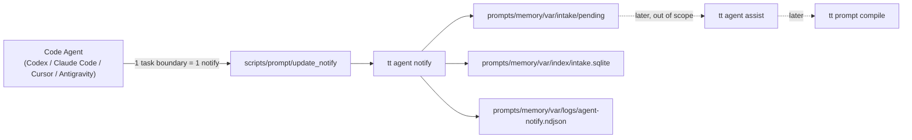
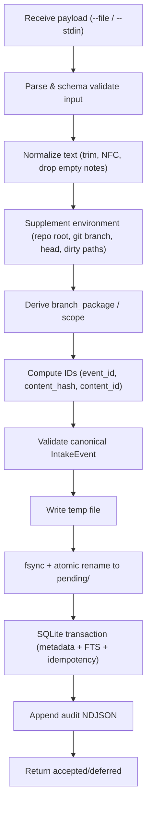

# 仕様書: Agentic Memory Intake (`tt agent notify`)

## 背景 (Background)

### 現状の課題

[調査レポート](../../refs/memory-compilation-investigation.md) により、以下の根本的な欠陥が判明した:

1. **Memory がスキルにならない**: `prompts/memory/` 配下の Memory ドキュメントは、コンパイルパイプラインにおいてスキルやルールに変換されない。Memory のメタデータ(フロントマター)は `index.md` のルーティングテーブルに集約されるのみで、本文はパイプラインを通過しない。
2. **「適切なタイミングでのトリガー」が効かない**: 当初の設計構想では、Memory がスキルになることで、スキルが持つ「パスマッチによる自動トリガー」機能に期待していた。しかし実際には Memory はスキルにならないため、知識の自動注入が機能しない。
3. **記録が非構造的で蓄積一方向**: 現在のメモリ運用は、スキルのプロンプト内でエージェントに「記録もせよ」と指示しているが、記録先やフォーマットが統一されていないため、ひたすら書き溜めるだけで後から活用しにくい。

### 設計方針の転換

これまではスキルのプロンプト内で記録まで依頼していたが、以下のように責務を分離する:

- **エージェント**: 記録に必要なデータを作るところまで
- **`tt` コマンド**: 格納について責任を持つ

本仕様書は、この分離の最初の段階として **Intake (raw event の deferred 保存)** のみを定義する。後段の知識整理(`tt agent assist`)、Knowledge Atom 化、prompt compile への統合は、本仕様のスコープ外である。

### 研究的背景

本設計は、以下の学術的知見を参考にしている:

| 研究 | 採用した設計原則 |
|:---|:---|
| A-MEM | raw interaction の原文・時刻・文脈・出所を損なわず保持する |
| SimpleMem | raw notes を原子的・短文・時刻明示で取る。多視点インデクシングに接続できるよう path や flags を保存 |
| EvolveMem | failure log・latency・duplicate ratio・pending age のような評価用メタデータを day one から残す |

### 本仕様の位置付け



---

## 要件 (Requirements)

### 必須要件 (MUST)

#### R1: `tt agent notify` コマンドの実装

- `tt agent` サブコマンドグループを新設し、`tt agent notify` を実装する
- `--file <path>` または `--stdin` で UTF-8 JSON ペイロードを受け取る
- 入力スキーマに対するバリデーションを行い、違反時は明確なエラーコードで拒否する
- raw event を `prompts/memory/var/intake/pending/` に atomic に保存する (temp file + fsync + rename)
- SQLite index (`prompts/memory/var/index/intake.sqlite`) にメタデータを記録する
- 監査ログを `prompts/memory/var/logs/agent-notify.ndjson` に追記する
- 結果を JSON で返す (exit code + structured response)

#### R2: 入力スキーマ (`agent-notify-payload.schema.json`)

必須フィールド:
- `version` (integer, const: 1)
- `source_type` (string, enum: `["coding_agent"]`)
- `agent` (string, enum: `["codex", "claude-code", "antigravity", "cursor", "unknown"]`)
- `task_summary` (string, 1-500 文字)
- `raw_notes` (string array, 1-32 項目, 各 1-500 文字)

推奨フィールド:
- `changed_paths` (string array)
- `flags` (object: `architecture_impact`, `memory_related`, `prompt_related`, `agent_behavior_related`, `requires_immediate_action`)
- `client_request_id` (string, 冪等性キー)
- `context` (object: `session_id`, `task_id`, `wrapper_version`)
- `extra` (object, 将来拡張用)

#### R3: 保存スキーマ (`intake-event.schema.json`)

入力ペイロードに加えて、`tt` が自動補完するフィールド:
- `event_id` (ULID, time-sortable)
- `instance_id` (Intake 段階では `event_id` と同一)
- `content_hash` (SHA-256, 完全同一 payload 検出用)
- `content_id` (prefix `RAWC-`, 意味の近い raw event を束ねる coarse fingerprint)
- `git` (branch, head_commit, is_dirty, merge_base, default_branch)
- `scope` (branch / session)
- `branch_package` (repo_id + branch_name + merge_base で安定化)
- `effective_changed_paths` (reported と observed の union)
- `timestamps` (created_at, stored_at)
- `provenance` (hostname, user, cwd, wrapper_version)

#### R4: ディレクトリレイアウトと Git 管理ポリシー

```text
prompts/memory/
  (既存ファイル群はそのまま)

  schemas/                  # Git 管理する / compile 対象外
    agent-notify-payload.schema.json
    intake-event.schema.json
    agent-notify-result.schema.json

  var/                      # Git 非管理 / compile 非対象
    intake/
      pending/
        YYYY/MM/DD/E-{ULID}.json
      processed/
      failed/
      ignored/
      _tmp/
    index/
      intake.sqlite
    logs/
      agent-notify.ndjson
      agent-notify-error.ndjson
    state/
      branch-packages.json
      maintenance.json
    reports/
      .gitkeep
```

| パス | Git 管理 | `tt prompt compile` 対象 | 用途 |
|:---|:---|:---|:---|
| `prompts/memory/*.md` | する | 既存どおり | canonical memory source |
| `prompts/memory/schemas/**` | する | 対象外 | schema と contract |
| `prompts/memory/var/**` | しない | 対象外 | raw intake / index / logs |

- `prompts/memory/.gitignore` に `var/` を追加する
- 既存の prompt compiler (`tt prompt compile/deploy/update`) が `prompts/memory/var/**` と `prompts/memory/schemas/**` を ignore するよう、ガード処理を追加する

#### R5: Wrapper スクリプト

- `scripts/prompt/update_notify.py` を正本、`scripts/prompt/update_notify.sh` を薄い shim として作成する
- Wrapper は以下の引数を受け付ける:

| 引数 | 必須 | 説明 |
|:---|:---|:---|
| `--agent <name>` | はい | canonical agent 名 |
| `--summary <text>` | 条件付き | 要約文字列 |
| `--summary-file <path>` | 条件付き | summary をファイルから読む |
| `--note <text>` | 条件付き | 1 note を追加 (複数指定可) |
| `--notes-file <path>` | 条件付き | 1 行 1 note |
| `--changed-path <path>` | 任意 | 明示 path (複数指定可) |
| `--changed-paths-from-git` | 任意 | git status/diff から path を収集 |
| `--architecture-impact` | 任意 | flag を立てる |
| `--memory-related` | 任意 | flag を立てる |
| `--prompt-related` | 任意 | flag を立てる |
| `--agent-behavior-related` | 任意 | flag を立てる |
| `--requires-immediate-action` | 任意 | flag を立てる |
| `--client-request-id <id>` | 推奨 | 冪等性キー |
| `--dry-run` | 任意 | payload を作るが `tt` は呼ばない |
| `--print-payload` | 任意 | canonical payload を stdout |
| `--tt <path>` | 任意 | `tt` binary location override |

- Wrapper は retry (exponential backoff, 最大 3 回) と `client_request_id` による冪等性を実装する
- エージェントに埋め込む instructions は常に `./scripts/prompt/update_notify.sh --agent <x>` で統一する

#### R6: 補助コマンド

| コマンド | 用途 |
|:---|:---|
| `tt agent status` | pending/processed/failed の件数、oldest age、index health を表示 |
| `tt agent intake list` | 1 行 1 event のテーブル/JSON 表示。フィルタ (`--status`, `--agent`, `--branch`, `--query`, `--path-prefix`, `--from`, `--to`) |
| `tt agent intake show <event-id>` | 完全な IntakeEvent を pretty JSON/YAML で表示 |

- `status` と `list` の既定スコープは current branch とする

#### R7: 結果スキーマとエラーハンドリング

| Exit code | status | code | 意味 | Retry |
|:---|:---|:---|:---|:---|
| 0 | `accepted` | `OK` | 正常保存 | 不要 |
| 0 | `accepted_with_warnings` | `INDEX_DEGRADED` / `NO_GIT_REPOSITORY` 等 | 保存済みだが補助処理に警告 | 条件次第 |
| 10 | `rejected` | `JSON_PARSE_ERROR` | JSON として読めない | 不可 |
| 11 | `rejected` | `SCHEMA_VALIDATION_ERROR` | 必須項目/型違反 | 不可 |
| 12 | `rejected` | `UNSUPPORTED_SCHEMA_VERSION` | wrapper / tt の版不整合 | 修正後 |
| 20 | `rejected` | `AGENT_ID_INVALID` | agent が canonical enum にない | 修正後 |
| 30 | `rejected` | `STORAGE_LOCK_TIMEOUT` | lock を取得できない | 可 |
| 31 | `rejected` | `STORAGE_WRITE_FAILED` | ファイル書き込み失敗 | 可 |
| 40 | `rejected` | `PERMISSION_DENIED` | 書き込み権限なし | 修正後 |

成功レスポンス例:

```json
{
  "status": "accepted",
  "code": "OK",
  "mode": "deferred",
  "event_id": "E-01JZABC123XYZ7890",
  "instance_id": "E-01JZABC123XYZ7890",
  "content_hash": "sha256:5be7c3...",
  "content_id": "RAWC-3d8f1c...",
  "stored_at": "prompts/memory/var/intake/pending/2026/06/07/E-01JZABC123XYZ7890.json",
  "index_state": "ok",
  "warnings": [],
  "next_action": "none"
}
```

#### R8: ID と Hash の戦略

| ID | 用途 | 生成方法 |
|:---|:---|:---|
| `event_id` | 個々の通知インスタンス識別 (監査・参照用) | ULID (time-sortable, 一意) |
| `content_hash` | 完全同一 payload の検出 (retry / 二重送信判定) | SHA-256 (正規化後 JSON + effective_changed_paths + flags + task_summary + raw_notes) |
| `content_id` | 意味の近い raw event を枝をまたいで束ねる | SHA-256 の prefix `RAWC-` (task_summary + raw_notes + 正規化 path prefix、branch/timestamp/wrapper version を除外) |

#### R9: 内部処理パイプライン



#### R10: Compiler Ignore Hardening

既存の prompt compiler パイプラインが `prompts/memory/var/**` と `prompts/memory/schemas/**` を処理対象外とするガード処理を追加する。これにより、raw intake データが各エージェント用 compile 対象に混入することを防ぐ。

#### R11: Branch Strategy

- `scope=branch` を既定とする
- Git がない場合や detached HEAD の場合は `scope=session` にフォールバック
- `branch_package` は `repo_id + branch_name + merge_base(default_branch)` で安定化
- branch rename 時は alias を追加し既存 package を再利用

### 任意要件 (SHOULD / MAY)

#### R12: Metrics / Observability (MAY)

以下のメトリクスを将来計測できるよう、データモデルに必要なフィールドを含める:
- intake frequency (日/週あたり event 数)
- events by agent
- avg raw_notes length (p50/p95)
- pending age (p50/p95)
- duplicate ratio (content_hash / content_id)
- failure rate

### 非要件 (NOT)

- `tt agent assist` (知識整理) は本仕様のスコープ外
- Knowledge Atom 化、A-MEM 的 link generation は本仕様のスコープ外
- `tt prompt compile` への統合は本仕様のスコープ外
- Intake 段階での重複排除は行わない (`content_id` を index に記録し後段で判定)
- アプリケーションレベルの署名・認証は MVP では不要 (OS filesystem permission に委ねる)

---

## 実現方針 (Implementation Approach)

### アーキテクチャ

#### コマンド層 (`features/tt/cmd/`)

- `agent.go`: `tt agent` サブコマンドグループの定義
- `agent_notify.go`: `tt agent notify` コマンド (入力受け取り、内部ロジック呼び出し、結果出力)
- `agent_status.go`: `tt agent status` コマンド
- `agent_intake.go`: `tt agent intake list` / `tt agent intake show` コマンド

#### 内部ロジック層 (`features/tt/internal/agent/`)

- `notify/`: notify 処理の中核ロジック
  - `handler.go`: パイプライン全体のオーケストレーション
  - `schema.go`: JSON Schema によるバリデーション
  - `normalize.go`: テキスト正規化 (NFC, trim, empty 除外)
  - `supplement.go`: Git 情報・環境情報の補完
  - `identity.go`: event_id (ULID)、content_hash、content_id の計算
  - `branch.go`: branch_package の導出と管理
- `storage/`: 保存層
  - `filestore.go`: pending ディレクトリへの atomic file write
  - `index.go`: SQLite index の管理 (WAL mode, FTS, idempotency)
  - `audit.go`: NDJSON 監査ログ
- `status/`: status / list / show コマンドのロジック
- `types.go`: `IntakeEvent`, `NotifyResult` 等の共通型定義

#### スキーマ (`prompts/memory/schemas/`)

- `agent-notify-payload.schema.json`: 入力スキーマ
- `intake-event.schema.json`: 保存スキーマ
- `agent-notify-result.schema.json`: 結果スキーマ

#### Wrapper (`scripts/prompt/`)

- `update_notify.py`: Python 正本 (JSON 生成, 引数解析, retry, schema version 管理)
- `update_notify.sh`: bash shim (`python3 update_notify.py "$@"`)

### 依存パッケージ (新規追加予定)

| パッケージ | 用途 |
|:---|:---|
| `github.com/oklog/ulid/v2` | ULID 生成 |
| `modernc.org/sqlite` (pure Go) または `github.com/mattn/go-sqlite3` (CGo) | SQLite index |

### Code Agent 側のプロンプト設計

常駐ルール (architecture-memory policy 等) に以下を追記:

```text
When architecture-impacting or agent-memory-relevant knowledge may have been created,
run `./scripts/prompt/update_notify.sh --agent <canonical-agent>` once per coherent task boundary.

Use notify only to store long-term memory candidates.
Do not edit canonical memory documents for intake.
Do not run `tt agent assist`, `tt prompt compile`, or `./scripts/prompt/update.sh`
unless the user explicitly asks for consolidation or deployment.
```

通知タイミングは「まとまりのある作業境界ごとに 1 回」とし、毎チャット・毎ツール呼び出しでの発火は禁止する。

### raw_notes の品質指針

| 種別 | 例 | 判定 |
|:---|:---|:---|
| 悪い raw note | `この方式でいく` | 文脈依存が強すぎる |
| 良い raw note | `tt agent notify は prompts/memory/var/intake/pending に raw event を deferred 保存する` | 自己完結で後処理しやすい |
| 悪い raw note | `次回もこれを使う` | 指示対象が不明 |
| 良い raw note | `scripts/prompt/update_notify.py を notify の唯一の安定エントリポイントにする` | 対象と判断が明確 |

---

## 検証シナリオ (Verification Scenarios)

### シナリオ 1: 正常系 -- ファイル入力による notify

1. 有効な JSON ペイロードを一時ファイルに書き出す
2. `tt agent notify --file /tmp/test-payload.json` を実行する
3. exit code が 0 であることを確認
4. stdout の JSON レスポンスに `"status": "accepted"`, `"code": "OK"`, `event_id`, `content_hash`, `stored_at` が含まれることを確認
5. `stored_at` で示されたパスに IntakeEvent ファイルが存在することを確認
6. ファイル内容が intake-event.schema.json に適合することを確認
7. SQLite index に該当 event_id のレコードが存在することを確認
8. 監査ログ NDJSON に該当 event_id のエントリが追記されていることを確認

### シナリオ 2: 正常系 -- stdin 入力による notify

1. `echo '{"version":1,...}' | tt agent notify --stdin` を実行する
2. シナリオ 1 と同様の検証を行う

### シナリオ 3: 異常系 -- 不正な JSON

1. `echo 'not json' | tt agent notify --stdin` を実行する
2. exit code が 10 であることを確認
3. stderr または stdout の JSON に `"status": "rejected"`, `"code": "JSON_PARSE_ERROR"` が含まれることを確認

### シナリオ 4: 異常系 -- スキーマ違反

1. 必須フィールド `raw_notes` を欠いた JSON を送信する
2. exit code が 11 であることを確認
3. `"code": "SCHEMA_VALIDATION_ERROR"` が返ることを確認

### シナリオ 5: 冪等性 -- 同一 client_request_id の再送

1. `client_request_id: "test-idempotent-001"` を含むペイロードで notify を実行する
2. 同一の `client_request_id` で再度 notify を実行する
3. 2 回目も `"status": "accepted"` が返り、同一の `event_id` が返ることを確認
4. pending ディレクトリにファイルが 1 つだけ存在することを確認

### シナリオ 6: Git 環境なしでの動作

1. Git リポジトリ外のディレクトリで `tt agent notify` を実行する
2. `"status": "accepted_with_warnings"`, `"warnings"` に `"NO_GIT_REPOSITORY"` が含まれることを確認
3. `scope` が `"session"` になっていることを確認

### シナリオ 7: 補助コマンド -- status

1. シナリオ 1 で 1 件保存後、`tt agent status` を実行する
2. `pending` の件数が 1 以上であることを確認

### シナリオ 8: 補助コマンド -- intake list / show

1. 複数の notify 実行後、`tt agent intake list --format json` を実行する
2. items が複数件返ることを確認
3. `tt agent intake show <event-id>` を実行し、完全な IntakeEvent が返ることを確認

### シナリオ 9: Wrapper 経由の notify

1. `./scripts/prompt/update_notify.sh --agent antigravity --summary "Test" --note "Note1" --dry-run --print-payload` を実行する
2. stdout に有効な JSON ペイロードが出力されることを確認
3. `--dry-run` を外して実行し、`tt agent notify` 経由で正常保存されることを確認

### シナリオ 10: Compiler Ignore Hardening

1. `prompts/memory/var/intake/pending/` に test event ファイルを配置する
2. `tt prompt compile` を実行する
3. `var/` 配下のファイルがコンパイル対象として処理されないことを確認 (エラーにならない、output に混入しない)

---

## テスト項目 (Testing for the Requirements)

### 単体テスト (Unit Test)

以下のパッケージについてテーブル駆動テストを作成する:

| パッケージ | テスト対象 | 主なテストケース |
|:---|:---|:---|
| `internal/agent/notify` | `schema.go` | 有効なペイロード、必須フィールド欠損、型不一致、境界値 (raw_notes 0件/33件, task_summary 501文字) |
| `internal/agent/notify` | `normalize.go` | NFC 正規化、空白圧縮、空ノート除外、trim |
| `internal/agent/notify` | `identity.go` | ULID 一意性、content_hash 同一性、content_id の branch/timestamp 非依存性 |
| `internal/agent/notify` | `branch.go` | branch_package 導出、Git なし時の session fallback、detached HEAD |
| `internal/agent/notify` | `handler.go` | パイプライン全体のオーケストレーション (mock storage) |
| `internal/agent/storage` | `filestore.go` | atomic write, ディレクトリ自動作成, パス構造 |
| `internal/agent/storage` | `index.go` | SQLite CRUD, FTS, idempotency (client_request_id 重複), WAL mode |
| `internal/agent/storage` | `audit.go` | NDJSON 追記、フォーマット検証 |
| `internal/agent/status` | 各コマンドロジック | pending 件数計算、branch フィルタ、show フォーマット |
| `internal/prompt/memory` | `frontmatter.go` 修正 | `var/` と `schemas/` のスキップ確認 |

### ビルド・全体検証

1. ビルド + 単体テスト:
   ```bash
   scripts/process/build.sh --skip-frontend --skip-etc
   ```

2. バックエンド統合テスト (agent notify 関連):
   ```bash
   scripts/process/integration_test.sh --categories "common" --specify "AgentNotify|AgentIntake|AgentStatus"
   ```

---
