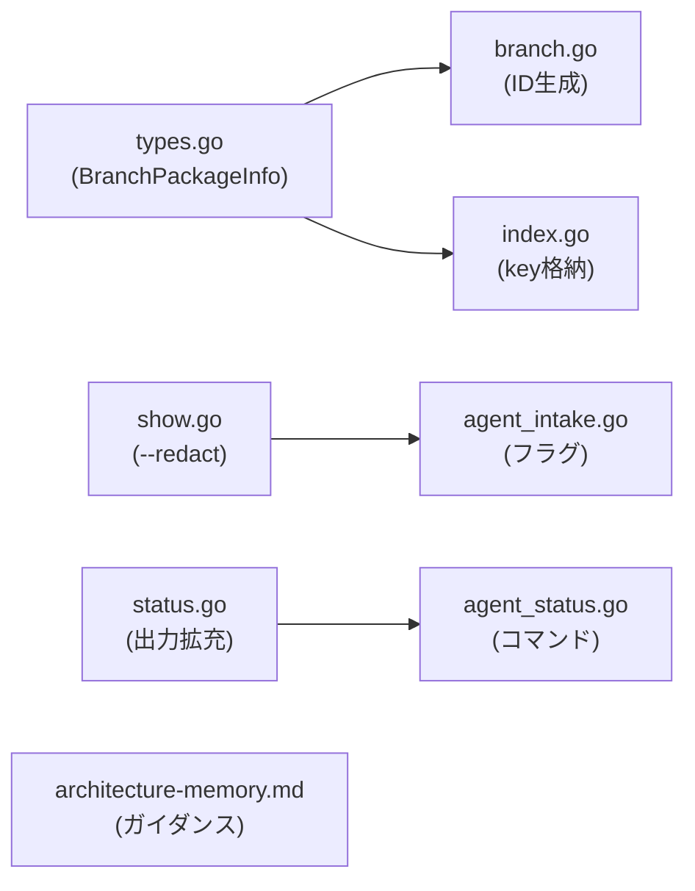

# 001-Intake-Quality-Improvements

## 背景 (Background)

Agentic Memory Intake パイプライン (Part 1 + Part 2) の初回動作確認を行った結果、5 つの改善点が特定された。
これらはいずれも「動作はするが、将来の拡張や運用品質を考えると早期に対処すべき」性質のものである。

## 要件 (Requirements)

### R1: `branch_package` のパス安全化 (必須)

**問題**: 現在の `branch_package` は `axsh/tokotachi:fix-memory-compiling:4a67ef5a...` という形式で、`/` と `:` を含む。Windows では `:` がパス名に使えないため、将来この値をディレクトリ名に使用するとクロスプラットフォーム互換性の問題が発生する。

**解決策**: `branch_package` を文字列からオブジェクトに拡張し、表示用 key とパス安全な id を分離する。

**変更前**:
```json
"branch_package": "axsh/tokotachi:fix-memory-compiling:4a67ef5a6457decad62348376de6a3547004fdb3"
```

**変更後**:
```json
"branch_package": {
  "key": "axsh/tokotachi:fix-memory-compiling:4a67ef5a6457decad62348376de6a3547004fdb3",
  "id": "BR-20260607-fix-memory-compiling-4a67ef5a",
  "branch": "fix-memory-compiling",
  "merge_base": "4a67ef5a6457decad62348376de6a3547004fdb3"
}
```

**id の命名規則**: `BR-{YYYYMMDD}-{branch_name}-{merge_base_short8}`
- `BR-` プレフィックス (Branch Package の略)
- `YYYYMMDD`: イベント生成日
- `branch_name`: ブランチ名 (そのまま。スラッシュは `-` に変換)
- `merge_base_short8`: merge_base の先頭 8 文字

**影響範囲**:
- `internal/agent/types.go`: `BranchPackage` フィールドを `string` から `*BranchPackageInfo` 構造体に変更
- `internal/agent/notify/branch.go`: `BranchPackageInfo` を生成するロジックに変更
- `internal/agent/storage/index.go`: `branch_package` カラムの扱いを `key` フィールドに統一
- `prompts/memory/schemas/intake-event.schema.json`: `branch_package` のスキーマを更新

### R2: raw_notes のベストプラクティスをプロンプトに記載 (必須)

**問題**: 現在の Coding Agent はパイプライン全体を 1 つの note にまとめる傾向がある。後段の Knowledge Atom 分解では、1 項目 1 命題が扱いやすい。

**対応**: Intake 段階のコードは変更しない。常駐ポリシー `architecture-memory.md` に「raw_notes は 1 項目 1 命題にする」旨のガイダンスを追加する。

**追加テキスト例**:
```
When writing --note values, keep each note as a single proposition or fact.
Do not pack multiple concepts into one note.
Bad:  --note "Pipeline: A -> B -> C -> D"
Good: --note "A validates input before B" --note "B normalizes text" --note "C stores to disk"
```

### R3: `created_at` の表示粒度統一 (任意)

**問題**: `tt agent intake list` では秒精度 (`2026-06-07T17:50:54Z`)、`tt agent intake show` ではナノ秒精度 (`2026-06-07T17:50:54.4761667Z`) で表示される。

**対応**: show (IntakeEvent JSON) は完全精度を維持する。list の `created_at` は表示時に秒精度に丸める (現在の動作を明示的に仕様化)。
コード上は、`ListItem.CreatedAt` を index からの `created_at` そのまま返す (現在は秒精度で格納しているため問題なし)。
将来 index 側の格納精度が上がった場合にも、list の表示は秒精度で丸めるルールとする。

**影響範囲**: 現時点ではコード変更不要。仕様として文書化するのみ。

### R4: `--redact` オプションの追加 (必須)

**問題**: `provenance` にはホスト名、ユーザー名、作業ディレクトリが含まれる。ローカル運用では問題ないが、レポート化・共有・Git 管理対象への昇格時にプライバシー情報が漏洩する。

**対応**: `tt agent intake show` に `--redact` フラグを追加する。

**動作**:
```bash
tt agent intake show E-... --redact
```

出力:
```json
{
  "provenance": {
    "hostname": "<redacted>",
    "user": "<redacted>",
    "cwd": "<redacted>"
  }
}
```

**redact 対象フィールド**:
- `provenance.hostname`
- `provenance.user`
- `provenance.cwd`

**影響範囲**:
- `features/tt/cmd/agent_intake.go`: `--redact` フラグの追加
- `features/tt/internal/agent/status/show.go`: redact ロジックの追加

### R5: `tt agent status` の出力拡充 (必須)

**問題**: 現在の `tt agent status` は最低限の情報 (`pending_count` 等) しか出力しない。`memory_root`, `current_branch`, ブランチ別カウントなど、運用上有用な情報が不足している。

**変更後の期待出力**:
```json
{
  "memory_root": "prompts/memory",
  "current_branch": "fix-memory-compiling",
  "counts": {
    "pending": 1,
    "processed": 0,
    "failed": 0,
    "ignored": 0
  },
  "current_branch_counts": {
    "pending": 1
  },
  "oldest_pending": "2026-06-07T17:50:54Z",
  "index_health": "ok"
}
```

**追加フィールド**:
- `memory_root`: メモリディレクトリのパス (`prompts/memory`)
- `current_branch`: 現在の Git ブランチ名
- `counts`: 全ブランチの合計カウント (既存フィールドを整理)
- `current_branch_counts`: 現在のブランチに限定したカウント
- `oldest_pending`: 最古の pending イベントのタイムスタンプ (ISO8601 秒精度)

**影響範囲**:
- `features/tt/internal/agent/status/status.go`: `StatusReport` 構造体と `GetStatus` ロジックの変更
- `features/tt/internal/agent/status/status_test.go`: テストの更新

## 実現方針 (Implementation Approach)

### アーキテクチャへの影響

- R1 は `types.go` の `IntakeEvent.BranchPackage` フィールドの型を `string` -> `*BranchPackageInfo` に変更する**破壊的変更**。ただし、まだ外部消費者がいない初期段階のため、互換性リスクは低い。
- R4, R5 は既存インターフェースへの追加であり、非破壊的。

### 変更対象コンポーネント



## 検証シナリオ (Verification Scenarios)

### シナリオ 1: BranchPackage の構造化

1. `tt agent notify --agent antigravity --summary "Test" --note "note1"` を実行
2. `tt agent intake show <event-id>` で出力を確認
3. `branch_package.key` が `owner/repo:branch:mergebase` 形式であること
4. `branch_package.id` が `BR-YYYYMMDD-branch-mergebase8` 形式であること
5. `branch_package.id` にはスラッシュ `:` が含まれないこと (Windows パス安全)

### シナリオ 2: --redact の動作

1. `tt agent intake show <event-id>` で通常出力を確認 (provenance にホスト名等あり)
2. `tt agent intake show <event-id> --redact` で redact 出力を確認
3. `provenance.hostname`, `user`, `cwd` がすべて `<redacted>` であること

### シナリオ 3: status 出力の拡充

1. `tt agent status` を実行
2. 出力に `memory_root`, `current_branch`, `counts`, `current_branch_counts`, `oldest_pending` が含まれること
3. `current_branch_counts.pending` が現在のブランチの pending 数と一致すること

## テスト項目 (Testing for the Requirements)

### R1: BranchPackageInfo テスト

- `branch_test.go`: `BuildBranchPackageInfo` が `BranchPackageInfo` 構造体を返し、`Key`, `ID`, `Branch`, `MergeBase` が正しいこと
- `branch_test.go`: `ID` にスラッシュ `:` が含まれないこと (Windows パス安全)
- `branch_test.go`: ブランチ名にスラッシュが含まれる場合 (`feature/foo`) は `-` に変換されること
- `handler_test.go`: パイプライン通過後の `IntakeEvent.BranchPackage` が構造体であること

### R4: --redact テスト

- `show_test.go`: `ShowWithRedact` が `provenance` の全フィールドを `<redacted>` にすること
- `show_test.go`: `Show` (redact なし) では元の値が返ること

### R5: status 出力テスト

- `status_test.go`: `GetStatus` が `MemoryRoot`, `CurrentBranch`, `Counts`, `CurrentBranchCounts` を返すこと
- `status_test.go`: ブランチ別カウントが正しいこと (複数ブランチのイベントを作成して確認)

### ビルド・全体検証

1. ビルド + 単体テスト:
   ```bash
   ./scripts/process/build.sh --backend-only
   ```

2. Prompt compile 確認 (R2 のポリシー変更):
   ```bash
   ./bin/tt.exe prompt compile --apply
   ```
