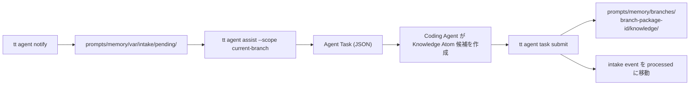

# 仕様書: Agentic Memory Assist MVP (`tt agent assist` / `tt agent task`)

## 背景 (Background)

### 現状

[000-Agentic-Memory-Intake](./000-Agentic-Memory-Intake.md) により、Coding Agent が `tt agent notify` で raw event を `prompts/memory/var/intake/pending/` に deferred 保存する仕組みが稼働している。

しかし、保存された Intake Event は pending ディレクトリに蓄積されるだけで、長期記憶として活用可能な形には変換されていない。「蓄積」から「長期記憶化」への橋渡しが必要である。

### 設計方針

本仕様は、Intake Event を **Knowledge Atom** (自己完結した知識の最小単位) に変換するための **協調ワークフロー** を定義する。重要な設計判断として、`tt` 自体は LLM 処理を行わない。代わりに:

1. `tt agent assist` が **Agent Task** を生成する (タスク記述のみ、LLM 呼び出しなし)
2. Coding Agent がタスクを読み取り、Knowledge Atom 候補を作成する
3. `tt agent task submit` が結果を検証し、保存する

この「タスク生成 → エージェント処理 → 結果検証」のパターンにより、`tt` は知識の品質管理と保存に集中し、知識の生成はエージェントに委ねる。

### 研究的背景

| 研究 | 採用する設計原則 |
|:---|:---|
| SimpleMem | Knowledge Atom を self-contained にする。"this", "that" 等の指示語を解決し、元のチャットコンテキストに依存しない |
| A-MEM | activation_hints (positive/negative) で検索時のトリガーヒントを付与。ただし relation generation は今回スコープ外 |

### 本仕様の位置付け



### スコープ外 (今回やらないこと)

以下は明確にスコープ外とする:

- CommitDistill 的な自動候補抽出
- A-MEM 的な relation generation (similar_to / supersedes / conflicts_with)
- 重複排除 (deduplication)
- prune (知識の剪定)
- retrieval 最適化
- `tt prompt compile` への完全統合
- Intake 段階での LLM 呼び出し

---

## 要件 (Requirements)

### 必須要件 (MUST)

#### R1: Knowledge Atom Schema の定義

Intake Event から生成される知識の最小単位 (Knowledge Atom) のスキーマを定義する。

**保存先**: `prompts/memory/schemas/knowledge-atom.schema.json`

**構造**:

```yaml
id: K-01K...             # ULID ベース (prefix: K-)
version: 1
type: Decision           # enum: Fact, Decision, Constraint, Pattern, Warning, Skill
title: "..."             # 自己完結したタイトル (1-200文字)
body: >                  # 自己完結した本文 (1-2000文字)
  tt agent notify は Knowledge Atom 化や prompt compile を行わず、
  prompts/memory/var/intake/pending に raw event として保存する。

status: draft            # enum: draft, active
importance: high         # enum: low, medium, high, critical
confidence: 0.86         # 0.0-1.0

activation_hints:
  positive:              # この知識が関連する状況 (1-10項目, 各1-200文字)
    - tt agent notify の仕様を変更するとき
  negative:              # この知識が無関係な状況 (0-10項目, 各1-200文字)
    - tt prompt compile の出力形式だけを変更するとき

source:
  event_ids:             # 元となった Intake Event の ID (1つ以上)
    - E-01K...
  branch_package_id: BR-fix-memory-compiling-4a67ef5a
  agent: antigravity     # Knowledge Atom を作成したエージェント
  git_branch: fix-memory-compiling

timestamps:
  created_at: 2026-06-07T18:30:00Z
```

**型の一覧**:

| type | 意味 | 例 |
|:---|:---|:---|
| `Fact` | 検証された事実 | "SQLite index は WAL mode で動作する" |
| `Decision` | 設計判断とその理由 | "tt agent notify は deferred 保存のみ行う" |
| `Constraint` | 技術的・ビジネス的制約 | "Intake 段階で LLM 呼び出しは禁止" |
| `Pattern` | 繰り返し使えるパターン | "atomic write は temp + fsync + rename" |
| `Warning` | 踏みやすい落とし穴 | "branch_package は merge_base で安定化しないと壊れる" |
| `Skill` | 操作手順・ノウハウ | "integration test は必ず build.sh の後に実行する" |

**self-contained 原則**: Knowledge Atom は自己完結していなければならない。"this", "that", "the above approach", "the previous design" 等の指示語に依存してはならない。元のチャットコンテキストなしで読んで理解できることが必須条件である。

#### R2: Knowledge Atom Batch Schema の定義

Coding Agent が submit する結果のバッチスキーマを定義する。

**保存先**: `prompts/memory/schemas/knowledge-atom-batch.schema.json`

**構造**:

```json
{
  "version": 1,
  "atoms": [
    {
      "type": "Decision",
      "title": "...",
      "body": "...",
      "importance": "high",
      "confidence": 0.86,
      "activation_hints": {
        "positive": ["..."],
        "negative": ["..."]
      },
      "source": {
        "event_ids": ["E-01K..."]
      }
    }
  ]
}
```

- `id`, `version`, `status`, `timestamps`, `source.branch_package_id`, `source.agent`, `source.git_branch` は `tt` が自動補完する
- `atoms` は 1 つ以上必須

#### R3: Agent Task Schema の定義

`tt agent assist` が Coding Agent に返すタスクのスキーマを定義する。

**保存先**: `prompts/memory/schemas/agent-task.schema.json`

**保存先 (インスタンス)**: `prompts/memory/var/tasks/pending/T-{ULID}.json`

**構造**:

```json
{
  "task_id": "T-01K...",
  "version": 1,
  "task_type": "distill_intake_to_knowledge",
  "scope": "current-branch",
  "branch_package_id": "BR-fix-memory-compiling-4a67ef5a",
  "branch_package_key": "axsh/tokotachi:fix-memory-compiling:4a67ef5a...",
  "instruction": "Convert the following intake events into self-contained Knowledge Atoms.\n\nEach Knowledge Atom must be self-contained.\nResolve references such as \"this\", \"that\", \"the above approach\", or \"the previous design\".\nDo not depend on the original chat context.\n\nFor each atom, provide: type, title, body, importance, confidence, activation_hints, and source.event_ids.",
  "events": [
    {
      "event_id": "E-...",
      "task_summary": "...",
      "raw_notes": ["..."],
      "changed_paths": ["..."],
      "flags": {
        "architecture_impact": true
      }
    }
  ],
  "output_schema_path": "prompts/memory/schemas/knowledge-atom-batch.schema.json",
  "submit_command": "tt agent task submit T-01K... --file result.json",
  "status": "pending",
  "created_at": "2026-06-07T18:30:00Z"
}
```

- `task_type` は当面 `distill_intake_to_knowledge` のみ
- `instruction` には self-contained 原則の指示を必ず含める

#### R4: `tt agent assist --scope current-branch` コマンド

Intake Event を直接 Knowledge Atom にするのではなく、Agent Task を生成するだけのコマンド。

**処理フロー**:

1. current git branch を取得
2. pending intake events を SQLite index から取得 (status=pending かつ current branch に属するもの)
3. 既存の未完了 task (同一 branch_package_id, status=pending) があれば再利用
4. Agent Task を生成し、`prompts/memory/var/tasks/pending/T-{ULID}.json` に保存
5. JSON で task 情報を返す

**戻り値**:

```json
{
  "status": "requires_agent",
  "task_id": "T-01K...",
  "task_type": "distill_intake_to_knowledge",
  "event_count": 3,
  "task_file": "prompts/memory/var/tasks/pending/T-01K....json",
  "next_command": "tt agent task show T-01K..."
}
```

**pending event が 0 件の場合**:

```json
{
  "status": "no_pending_events",
  "message": "No pending intake events found for the current branch."
}
```

**既存の未完了 task がある場合**:

```json
{
  "status": "existing_task",
  "task_id": "T-01K...",
  "task_file": "prompts/memory/var/tasks/pending/T-01K....json",
  "message": "An existing pending task was found. Use 'tt agent task show T-01K...' to view it."
}
```

**CLI フラグ**:

| フラグ | 必須 | 説明 |
|:---|:---|:---|
| `--scope <scope>` | はい | スコープ指定。当面 `current-branch` のみ |
| `--force` | いいえ | 既存の pending task を無視して新規作成 |

#### R5: `tt agent task show <task-id>` コマンド

Agent Task を表示する。Coding Agent がそのまま読める JSON 形式で出力する。

**処理**:

1. `task_id` に対応するファイルを `prompts/memory/var/tasks/pending/` から検索
2. 見つからない場合は `completed/` と `failed/` も検索
3. JSON を stdout に出力

**CLI フラグ**:

| フラグ | 必須 | 説明 |
|:---|:---|:---|
| `<task-id>` | はい | タスク ID (位置引数) |

#### R6: `tt agent task submit <task-id> --file result.json` コマンド

Coding Agent が作った Knowledge Atom batch を受け取り、検証して保存する。

**処理フロー**:

1. `task_id` に対応するファイルが `prompts/memory/var/tasks/pending/` に存在するか確認
2. task の status が `pending` であることを確認
3. `result.json` を `knowledge-atom-batch.schema.json` でバリデーション
4. 各 Knowledge Atom に `id` を採番 (ULID, prefix: `K-`)
5. `source.event_ids` が task の `events` に含まれるか検証 (含まれない event_id はエラー)
6. `source.branch_package_id`, `source.agent`, `source.git_branch` を task から補完
7. `status: draft` を設定
8. `timestamps.created_at` を現在時刻で設定
9. branch manifest (`prompts/memory/branches/<branch_package_id>/manifest.yaml`) が存在しなければ作成
10. 各 Knowledge Atom を `prompts/memory/branches/<branch_package_id>/knowledge/K-{ULID}.yaml` に保存
11. task を `prompts/memory/var/tasks/completed/` に移動し、status を `completed` に更新
12. 対象 intake event を `prompts/memory/var/intake/processed/` に移動し、SQLite index の status を `processed` に更新
13. 結果を JSON で返す

**戻り値**:

```json
{
  "status": "completed",
  "task_id": "T-01K...",
  "knowledge_created": 4,
  "knowledge_files": [
    "prompts/memory/branches/BR-fix-memory-compiling-4a67ef5a/knowledge/K-01K....yaml"
  ],
  "processed_events": [
    "E-01K..."
  ]
}
```

**CLI フラグ**:

| フラグ | 必須 | 説明 |
|:---|:---|:---|
| `<task-id>` | はい | タスク ID (位置引数) |
| `--file <path>` | はい | Knowledge Atom batch の JSON ファイルパス |

**エラーケース**:

| 状況 | Exit code | Code |
|:---|:---|:---|
| task_id が存在しない | 1 | `TASK_NOT_FOUND` |
| task が pending でない | 1 | `TASK_NOT_PENDING` |
| result.json のスキーマ違反 | 11 | `SCHEMA_VALIDATION_ERROR` |
| event_id が task に含まれない | 1 | `INVALID_EVENT_REFERENCE` |
| ファイル書き込み失敗 | 31 | `STORAGE_WRITE_FAILED` |

#### R7: Branch Manifest の自動作成

`tt agent task submit` 時に、Knowledge Atom の保存先ディレクトリの branch manifest が存在しなければ自動作成する。

**保存先**: `prompts/memory/branches/<branch_package_id>/manifest.yaml`

**構造**:

```yaml
id: BR-fix-memory-compiling-4a67ef5a
key: axsh/tokotachi:fix-memory-compiling:4a67ef5a...
branch: fix-memory-compiling
merge_base: 4a67ef5a6457decad62348376de6a3547004fdb3
default_branch: main
created_at: 2026-06-07T18:30:00Z
status: active
```

- `id`, `key`, `branch`, `merge_base` は task の `branch_package_id` / `branch_package_key` から導出
- `default_branch` は Git から取得 (取得不能な場合は `main`)

#### R8: Intake Event の processed 移行

`tt agent task submit` 成功時に、対象の intake event を pending から processed に移動する。

**処理**:

1. `prompts/memory/var/intake/pending/YYYY/MM/DD/E-{ULID}.json` を `prompts/memory/var/intake/processed/YYYY/MM/DD/E-{ULID}.json` に移動
2. SQLite index の `intake_events` テーブルで status を `processed` に更新
3. 物理削除はしない (provenance として残す)

#### R9: Wrapper スクリプト

既存の `scripts/code/agent/` に新しい wrapper を追加する。

**追加ファイル**:

| ファイル | `tt` コマンド |
|:---|:---|
| `scripts/code/agent/assist.sh` | `tt agent assist` |
| `scripts/code/agent/task.sh` | `tt agent task show` / `tt agent task submit` |

wrapper は既存の `_resolve_tool.sh` パターンに従い、`tt` 未インストール時は exit 0 で graceful skip する。

#### R10: ディレクトリレイアウト (追加分)

本仕様で追加するディレクトリとファイル:

```text
prompts/memory/
  branches/                           # Git 管理する
    BR-fix-memory-compiling-4a67ef5a/
      manifest.yaml
      knowledge/
        K-01K....yaml

  schemas/                            # Git 管理する (既存)
    knowledge-atom.schema.json        # 新規
    knowledge-atom-batch.schema.json  # 新規
    agent-task.schema.json            # 新規

  var/                                # Git 非管理 (既存)
    intake/
      pending/                        # 既存
      processed/                      # 新規 (submit 後の移動先)
      failed/                         # 既存 (未使用)
      ignored/                        # 既存構想 (未使用)
    tasks/                            # 新規
      pending/
      completed/
      failed/
```

| パス | Git 管理 | 用途 |
|:---|:---|:---|
| `prompts/memory/branches/**` | する | branch 別の Knowledge Atom 保管 |
| `prompts/memory/schemas/**` | する | スキーマ定義 |
| `prompts/memory/var/tasks/**` | しない | Agent Task の状態管理 |
| `prompts/memory/var/intake/processed/**` | しない | 処理済み intake event |

### 任意要件 (SHOULD)

#### R11: Knowledge Atom の status 管理

初期実装では全 Knowledge Atom を `status: draft` で保存する。

- `draft`: assist で生成されたが、人間レビュー済みではない
- `active`: compile 対象として正式利用する

MVP では draft も compile 対象外でよい。`active` への昇格は将来の `tt agent promote` 等で対応する。

### 非要件 (NOT)

- `tt prompt compile` への Knowledge Atom 統合は本仕様のスコープ外
- Knowledge Atom 間の relation (similar_to, supersedes, conflicts_with) は本仕様のスコープ外
- 自動的な Knowledge Atom 候補の生成 (LLM 呼び出し) は本仕様のスコープ外
- 重複排除は本仕様のスコープ外

---

## 実現方針 (Implementation Approach)

### アーキテクチャ

#### コマンド層 (`features/tt/cmd/`)

- `agent_assist.go`: `tt agent assist` コマンド (入力: `--scope`, 出力: JSON)
- `agent_task.go`: `tt agent task` サブコマンドグループ
  - `show`: タスク表示
  - `submit`: 結果の受け取り・検証・保存

#### 内部ロジック層 (`features/tt/internal/agent/`)

- `assist/`: assist 処理の中核ロジック
  - `handler.go`: pending event の収集、既存 task の検索、新規 task の生成
  - `task.go`: Agent Task の構造体定義と JSON シリアライズ
- `task/`: task show / submit のロジック
  - `show.go`: task ファイルの読み込みと表示
  - `submit.go`: batch バリデーション、Knowledge Atom 採番、保存、intake 移行
  - `knowledge.go`: Knowledge Atom の YAML シリアライズと保存
  - `manifest.go`: branch manifest の作成・更新

#### ストレージ層 (`features/tt/internal/agent/storage/`)

既存の `index.go` に以下を追加:

- `UpdateStatus`: intake event の status を更新するメソッド
- `ListPendingByBranch`: branch 指定で pending event を一覧取得するメソッド

既存の `filestore.go` に以下を追加:

- `MoveToProcessed`: pending から processed へファイルを移動するメソッド

#### 共通型 (`features/tt/internal/agent/types.go`)

以下の型を追加:

- `KnowledgeAtom`: Knowledge Atom の Go 構造体
- `KnowledgeAtomBatch`: バッチ入力の Go 構造体
- `AgentTask`: Agent Task の Go 構造体
- `AssistResult`: assist コマンドの戻り値
- `SubmitResult`: submit コマンドの戻り値
- `BranchManifest`: branch manifest の Go 構造体

### Knowledge Atom の YAML 保存形式

Knowledge Atom は YAML 形式で保存する。理由:

1. 人間が読みやすい (body の複数行テキストが自然)
2. Git diff で差分が見やすい
3. コメントを残せる

### SQLite index の拡張

既存の `intake_events` テーブルの `status` カラムを活用する。現在は常に `pending` だが、submit 時に `processed` に更新する。追加のテーブルやカラムは不要。

### Coding Agent に渡す instruction テンプレート

Agent Task の `instruction` フィールドに埋め込むテンプレート:

```text
Convert the following intake events into self-contained Knowledge Atoms.

## Rules

1. Each Knowledge Atom must be self-contained.
   Resolve references such as "this", "that", "the above approach", or "the previous design".
   Do not depend on the original chat context.

2. For each atom, specify:
   - type: one of Fact, Decision, Constraint, Pattern, Warning, Skill
   - title: a concise, self-contained title (max 200 chars)
   - body: a self-contained description (max 2000 chars)
   - importance: one of low, medium, high, critical
   - confidence: a float between 0.0 and 1.0
   - activation_hints.positive: list of situations where this knowledge is relevant
   - activation_hints.negative: list of situations where this knowledge is NOT relevant
   - source.event_ids: list of intake event IDs this atom was derived from

3. One intake event may produce zero or more Knowledge Atoms.
   Skip events that contain no meaningful long-term knowledge.

4. Output format must conform to the schema at: {output_schema_path}

## Submit

When done, save the result as a JSON file and run:
{submit_command}
```

---

## 検証シナリオ (Verification Scenarios)

### シナリオ 1: assist によるタスク生成

1. `tt agent notify` で pending intake event を 1 件以上保存する
2. `tt agent assist --scope current-branch` を実行する
3. exit code が 0 であることを確認
4. stdout の JSON に `"status": "requires_agent"`, `task_id`, `task_file`, `event_count` が含まれることを確認
5. `task_file` で示されたパスに Agent Task ファイルが存在することを確認
6. ファイル内に `instruction`, `events`, `output_schema_path`, `submit_command` が含まれることを確認

### シナリオ 2: assist で pending event が 0 件の場合

1. pending intake event が存在しない状態にする
2. `tt agent assist --scope current-branch` を実行する
3. `"status": "no_pending_events"` が返ることを確認

### シナリオ 3: assist で既存 task がある場合

1. シナリオ 1 でタスクを生成した後、再度 `tt agent assist --scope current-branch` を実行する
2. `"status": "existing_task"` が返り、同一の `task_id` が返ることを確認

### シナリオ 4: task show

1. シナリオ 1 で生成したタスクの `task_id` を取得する
2. `tt agent task show <task-id>` を実行する
3. JSON 出力に `task_id`, `instruction`, `events`, `output_schema_path`, `submit_command` が含まれることを確認

### シナリオ 5: task submit (正常系)

1. シナリオ 1 でタスクを生成する
2. `knowledge-atom-batch.schema.json` に適合する result.json を作成する
   - `source.event_ids` にはタスクの `events` に含まれる event_id を指定する
3. `tt agent task submit <task-id> --file result.json` を実行する
4. exit code が 0 であることを確認
5. `"status": "completed"` が返ることを確認
6. `knowledge_files` に示されたパスに YAML ファイルが存在することを確認
7. YAML ファイル内に `id`, `version`, `type`, `title`, `body`, `status: draft`, `source.branch_package_id` が含まれることを確認
8. branch manifest (`prompts/memory/branches/<branch_package_id>/manifest.yaml`) が存在することを確認
9. intake event が `prompts/memory/var/intake/processed/` に移動していることを確認
10. SQLite index で対象 event の status が `processed` になっていることを確認
11. task ファイルが `prompts/memory/var/tasks/completed/` に移動していることを確認

### シナリオ 6: task submit (source event validation エラー)

1. シナリオ 1 でタスクを生成する
2. task に含まれない event_id を `source.event_ids` に指定した result.json を作成する
3. `tt agent task submit <task-id> --file result.json` を実行する
4. exit code が 0 でないことを確認
5. `"code": "INVALID_EVENT_REFERENCE"` が返ることを確認

### シナリオ 7: task submit (スキーマ違反)

1. シナリオ 1 でタスクを生成する
2. 必須フィールド `type` を欠いた result.json を作成する
3. `tt agent task submit <task-id> --file result.json` を実行する
4. `"code": "SCHEMA_VALIDATION_ERROR"` が返ることを確認

### シナリオ 8: task submit 後の再 submit

1. シナリオ 5 で submit を完了する
2. 同一の task_id で再度 submit を試みる
3. `"code": "TASK_NOT_PENDING"` が返ることを確認

---

## テスト項目 (Testing for the Requirements)

### 単体テスト (Unit Test)

以下のパッケージについてテーブル駆動テストを作成する:

| パッケージ | テスト対象 | 主なテストケース |
|:---|:---|:---|
| `internal/agent/assist` | `handler.go` | pending events 収集、既存 task 再利用、新規 task 生成、pending 0 件 |
| `internal/agent/task` | `submit.go` | batch バリデーション、event_id 検証、Knowledge Atom 採番、status 更新 |
| `internal/agent/task` | `knowledge.go` | YAML シリアライズ、フィールド補完 (id, version, status, timestamps, source) |
| `internal/agent/task` | `manifest.go` | branch manifest の作成、既存 manifest の読み込み |
| `internal/agent/task` | `show.go` | task ファイル読み込み、pending/completed/failed の検索 |
| `internal/agent/storage` | `index.go` (追加分) | UpdateStatus (pending->processed)、ListPendingByBranch |
| `internal/agent/storage` | `filestore.go` (追加分) | MoveToProcessed (pending->processed ファイル移動) |
| `internal/agent` | `types.go` (追加分) | KnowledgeAtom, AgentTask のバリデーション |

### 統合テスト (Integration Test)

以下のシナリオを `tests/` 配下に統合テストとして実装する:

| テストファイル | テスト内容 |
|:---|:---|
| `common_agent_assist_test.go` | シナリオ 1-3: assist コマンドの E2E (notify -> assist -> task 生成) |
| `common_agent_task_test.go` | シナリオ 4-8: task show/submit の E2E (submit -> knowledge 保存 -> intake 移行) |

### ビルド・全体検証

1. ビルド + 単体テスト:
   ```bash
   scripts/process/build.sh --skip-frontend --skip-etc
   ```

2. バックエンド統合テスト (agent assist/task 関連):
   ```bash
   scripts/process/integration_test.sh --categories "common" --specify "AgentAssist|AgentTask"
   ```
