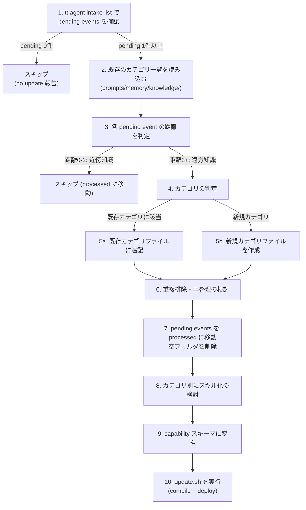

# 仕様書: 遠方知識のスキル化 (Far-Knowledge Skillification)

## 背景 (Background)

### 現状

[000-Agentic-Memory-Intake](./000-Agentic-Memory-Intake.md) および [003-Agentic-Memory-Assist-MVP](./003-Agentic-Memory-Assist-MVP.md) により、以下の仕組みが稼働している:

1. `tt agent notify` (本仕様で `tt agent record` に改名) で raw event を `prompts/memory/var/intake/pending/` に deferred 保存する (Phase 1: Intake)
2. `tt agent assist` / `tt agent task` が Agent Task を生成し、Coding Agent が Knowledge Atom に蒸留する (Phase 2: Distill)

しかし、以下の問題がある:

- **Phase 2 がワークフローに統合されておらず**、手動実行のみで事実上未使用。Agent Task / Knowledge Atom の中間ステップが複雑すぎる
- **Phase 1 の notify が「アーキテクチャ知識」に限定**されており、真に価値ある知識を収集できていない
- **Knowledge Atom がスキル化されるパイプラインが存在しない**ため、蒸留された知識がCoding Agentに還元されない

### 核心的な洞察: 遠方知識

Coding Agent は現在の作業ファイルの近傍をエージェンティックに検索・解析できる。従って、近傍で得られる知識をスキル化する価値は低い。真にスキル化すべきは「**遠方知識 (Far Knowledge)**」である:

| 距離 | 到達手段 | スキル化の価値 |
|:---|:---|:---|
| 距離0-2: 同パッケージ、import先/元 | grep、コード追跡で到達可能 | 低い |
| **距離3: 無関係なモジュール間の共通パターン** | 知らなければ探せない | **高い** |
| **距離4: 過去の判断・フィードバック** | 消えている | **非常に高い** |
| **距離5: エンジニアの好み・品質基準** | 言語化されていない | **最高** |

これは従来、同一エンジニアの暗黙知として自然に機能していたもの。「モジュールAを開発した経験が、無関係なモジュールBの開発時にも活きる」という現象のメカニズム化である。

### 本仕様の目標

「知識が自然に、自動で組み立てられる」状態を実現する:

1. **知識の種をためる** -- notify.sh で遠方知識となりうるものを蓄積する
2. **知識の種を体系化する** -- 独立ワークフローで、カテゴリ化・重複排除・整理を行う
3. **知識をスキルに変換する** -- capability スキーマ形式に変換する
4. **スキルを各 Coding Agent 向けに配備する** -- `tt prompt update` で `.agents/skills/` 等にデプロイする

### 本仕様と既存仕様の関係

| 既存仕様 | 本仕様での扱い |
|:---|:---|
| 000-Agentic-Memory-Intake | notify.sh の収集対象を拡張 (アーキテクチャ -> 遠方知識全般) |
| 003-Agentic-Memory-Assist-MVP | **廃止**。`tt agent assist` / `tt agent task` の3段階パイプラインは本仕様で置き換える。代わりに `tt agent intake` の拡張と `tt agent knowledge` の新設で対応 |

---

## 要件 (Requirements)

### 必須要件 (MUST)

#### R1: notify.sh の収集対象の拡張

現行の `record-architecture-knowledge` capability を拡張し、「アーキテクチャ知識」に限定されない**遠方知識全般**を収集対象にする。

**拡張するカテゴリフラグ**:

現行のフラグ (維持):
- `--architecture-impact` (アーキテクチャ影響)
- `--memory-related` (メモリシステム関連)
- `--prompt-related` (プロンプト関連)
- `--agent-behavior-related` (エージェント行動関連)

追加するフラグ:
- `--design-pattern` (横断的設計パターン: モジュール間で共有すべき設計判断)
- `--convention` (規約・スタイル: ログ形式、DB設計、API設計、コメントの書き方)
- `--lesson-learned` (過去の失敗/指摘からの学び)
- `--preference` (エンジニアの好み/品質基準)

**Good Note の例 (追加分)**:

```text
--design-pattern --note "Error responses in API handlers use pkg/apierror types; internal errors are logged but clients receive generic messages"
--convention --note "Integration test names follow TestXxx_Scenario format to allow --specify filtering"
--lesson-learned --note "Test for nil pointer on optional fields was missed in auth handler review; always check optional fields in validation"
--preference --note "Prefer explicit error wrapping with fmt.Errorf and %w over bare error returns for traceability"
```

**距離判定のガイドライン (Note Content Guidelines への追加)**:

Coding Agent は以下の基準で notify すべきか判断する:

1. **この知識は、現在の作業ファイルの近傍 (同パッケージ、import 先/元) を検索すれば得られるか?** -- はいなら、スキップ
2. **この知識は、無関係なモジュールの開発時にも適用できるか?** -- はいなら、`--design-pattern` で記録
3. **この知識は、過去の判断や指摘に基づいており、コードからは読み取れないか?** -- はいなら、`--lesson-learned` で記録
4. **この知識は、エンジニアの好みや品質基準に関するものか?** -- はいなら、`--preference` で記録

#### R2: capability の rename と拡張

現行の capability を以下のように変更する:

| 変更前 | 変更後 | 理由 |
|:---|:---|:---|
| `record-architecture-knowledge` | `record-far-knowledge` | 対象がアーキテクチャに限定されないため |
| `pre-push-architecture-check` | `pre-push-knowledge-check` | 同上 |
| `architecture-memory` policy | `far-knowledge-memory` policy | 同上 |

capability の `description` も更新し、遠方知識全般を対象とする旨を明記する。

#### R3: 知識の体系化ワークフロー (独立ワークフロー: systematize-far-knowledge)

体系化プロセスは `execute-implementation-plan` とは**独立したワークフロー**として定義する。`execute-implementation-plan` 内では notify による知識の記録のみを行い、体系化は別途実行する。

**ワークフロー名**: `systematize-far-knowledge`

**トリガー**: ユーザーが明示的に実行を指示した時 (例: `/systematize-far-knowledge`)

**処理フロー**:



**ステップ詳細**:

**ステップ 2: 既存カテゴリの読み込み**

カテゴリ別の遠方知識は以下に格納する:

```
prompts/memory/knowledge/
  error-handling.md
  test-patterns.md
  api-design.md
  ...
```

このディレクトリは Git 管理される (`.gitignore` の `var/` 外)。

**ステップ 3-4: 距離判定とカテゴリ判定**

Coding Agent が LLM の力で以下を判断する:
- この知識はエージェンティックな検索で到達可能か? (距離判定)
- どのカテゴリに属するか? 既存カテゴリか新規か?

**ステップ 5: カテゴリファイルへの埋め込み**

カテゴリファイルは以下の構造を持つ:

```markdown
---
category_id: error-handling
title: "エラーハンドリングパターン"
description: >-
  Go APIハンドラーにおけるエラーレスポンスの設計パターン、
  エラーラッピングの規約、バリデーションエラーの返却方法。
  APIハンドラーの実装時、エラーハンドリング設計時に参照すべき。
last_updated: 2026-06-15T00:00:00Z
source_event_ids:
  - E-01KTJM6PQ48MDZY13AJT6DMDF2
  - E-01KTxxx
---

# エラーハンドリングパターン

## パターン

1. エラーは必ず `pkg/apierror` の型を使って返す
2. 内部エラーの詳細はログに出し、クライアントには汎用メッセージを返す
3. バリデーションエラーはフィールド単位で返す

## 判断基準

- 新しいAPIエンドポイントを追加するときは、このパターンを必ず適用する

## コード例

- `internal/api/handler/user.go` の `handleCreateUser` 関数を参照

## 適用済みコード

- internal/api/handler/user.go
- internal/api/handler/project.go

## 過去の指摘・教訓

- 2026-06-10: auth handlerでnilチェック漏れを指摘された (E-01KTxxx)
```

**ステップ 6: 重複排除・再整理**

カテゴリは知識の蓄積に伴い進化する。以下の4段階のプロセスが自然発生する:

| 段階 | 名称 | トリガー | 操作 |
|:---|:---|:---|:---|
| 1 | 収集 | 最初の知識が入る | 新規カテゴリの作成 |
| 2 | 分類 (細分化) | 1つのカテゴリが肥大化し、異なる属性の知識が混在 | カテゴリの **分割 (split)** |
| 3 | 階層化 | 特定のサブ領域のメモが爆発的に増加 | 新規サブカテゴリの作成、知識の **移動 (move)** |
| 4 | 再構築 (統合) | 複数のカテゴリを横断する概念が登場し、既存の分類軸では収まらなくなる | カテゴリの **統合 (merge)**、 **名前変更 (rename)**、全体構造の見直し |

**段階4の再構築が最も重要かつ困難**。例えば、最初「エラーハンドリング」と「ログ設計」が別カテゴリだったが、「可観測性 (Observability)」という上位概念が見えてきたとき、両者を統合して再構築する必要がある。これは知識が深まり全体像が見えてきた証拠であり、避けるべきではなく積極的に行うべき操作である。

**再整理で必要な操作の定義**:

以下の4つの操作を定義する。いずれもファイルシステム上のカテゴリファイル (.md) に対する操作である。

| 操作 | 内容 | 例 |
|:---|:---|:---|
| **split** | 1つのカテゴリファイルを2つ以上に分割する | `error-handling.md` -> `error-response.md` + `error-wrapping.md` |
| **merge** | 2つ以上のカテゴリファイルを1つに統合する | `error-handling.md` + `logging.md` -> `observability.md` |
| **rename** | カテゴリファイルの名前と内容を更新する | `programming.md` -> `frontend.md` (分類軸の変更) |
| **move** | あるカテゴリ内の特定の知識項目を別のカテゴリに移動する | `backend.md` 内の「Docker環境構築」を `infrastructure.md` に移動 |

**ttコマンドとLLMの責務分離**:

再整理の操作は「何をすべきか (判断)」と「どうやるか (実行)」に分離する:

- **LLM (Coding Agent) の責務**: 現在のカテゴリ一覧を俯瞰し、どの操作 (split/merge/rename/move) が必要かを判断する。段階2-4のどの状態にあるかを見極め、操作対象と操作内容を決定する
- **tt コマンドの責務**: 決定された操作を確実に実行する。frontmatter の `source_event_ids`、`last_updated`、`category_id` の整合性を保ちながらファイル操作を行う

**tt コマンドの追加 (R8)**:

以下の `tt agent knowledge` サブコマンドを新設する:

```bash
# カテゴリ一覧と統計情報の表示
tt agent knowledge list
# 出力例: category_id, title, item_count, file_size, last_updated

# カテゴリファイルの分割
tt agent knowledge split <category-id> \
  --into <new-category-1> <new-category-2> \
  --plan <plan-file.json>
# plan-file.json: LLMが作成した分割計画 (どの項目をどちらに振り分けるか)

# カテゴリファイルの統合
tt agent knowledge merge <category-id-1> <category-id-2> \
  --into <new-category-id> \
  --plan <plan-file.json>
# plan-file.json: LLMが作成した統合計画 (統合後の構造)

# カテゴリの名前変更
tt agent knowledge rename <old-category-id> <new-category-id> \
  --title <new-title>

# 知識項目の移動
tt agent knowledge move \
  --from <source-category-id> \
  --to <target-category-id> \
  --items <item-identifiers>
```

tt コマンドは以下を保証する:
- frontmatter の `category_id` の一貫性
- `source_event_ids` の保持 (分割時は元のイベントIDを両方に引き継ぐ)
- `last_updated` の更新
- 対応する capability ファイル (`prompts/memory/branches/<branch-package-id>/skills/` 配下) の連動更新
- 操作ログの記録 (`var/logs/knowledge-ops.ndjson`)

**再整理の判断基準 (LLM向けガイドライン)**:

Coding Agent は以下の基準でどの操作が必要かを判断する:

1. **split が必要なとき**: 1つのカテゴリファイルが 3000 文字を超え、かつ2つ以上の明確に異なるサブトピックを含む場合
2. **merge が必要なとき**: 2つのカテゴリの知識が頻繁に相互参照され、単独では不完全な場合。または上位概念が見えてきた場合
3. **rename が必要なとき**: カテゴリ名がその内容を正確に表現しなくなった場合 (例: 知識が増えて当初の名前より広い範囲をカバーするようになった)
4. **move が必要なとき**: 特定の知識項目が現在のカテゴリよりも別のカテゴリに強く関連する場合
5. **何もしない**: 上記のいずれにも該当しない場合は、既存構造を維持する

**ステップ 7: クリーンアップ**

- 処理済みの intake event を `pending/` から `processed/` に移動する
  - `tt agent intake processed <event-id>` を使用
- 空になった日付ディレクトリを削除する
  - `find prompts/memory/var/intake/pending -type d -empty -delete` 相当の処理

**ステップ 8-9: スキル化**

カテゴリファイルの内容を、[capability.schema.json](file:///c:/Users/yamya/myprog/tokotachi/work/fix-memory-compiling/prompts/manifest/schemas/capability.schema.json) に準拠した形式に変換する:

```yaml
---
apiVersion: agent.meta/v1
kind: capability
id: __far-knowledge-error-handling
title: "エラーハンドリングパターン"
description: >-
  Go APIハンドラーにおけるエラーレスポンスの設計パターン。
  APIハンドラーの実装時、エラーハンドリング設計時、
  新しいエンドポイント追加時に参照すべき。
body: |
  # エラーハンドリングパターン

  ## パターン
  1. エラーは必ず pkg/apierror の型を使って返す
  ...
manual_only: false
user_visible: false
---
```

**スキル命名規約**:

- id には `__` (アンダーバー2個) をプレフィックスとして付与する (例: `__far-knowledge-error-handling`)
- これによりユーザーが手動でスキルを召喚しにくくなり、Coding Agent による自動召喚を前提とする
- `user_visible: false` を設定し、ユーザー向けのスキル一覧には表示されないようにする

**配置先**: `prompts/memory/branches/<branch-package-id>/skills/`

ユーザーが手動管理するスキル (`prompts/manifest/code_content/capabilities/`) とは**完全に分離**する。遠方知識から生成されたスキルは `prompts/memory/branches/` 配下にブランチごとに配置する:

```text
prompts/memory/branches/
  BR-fix-memory-compiling-4a67ef5a/
    manifest.yaml                         # 既存
    knowledge/                            # 既存 (Knowledge Atom)
    skills/                               # 新規: 遠方知識スキル
      __far-knowledge-error-handling.md
      __far-knowledge-test-patterns.md
      ...
```

**スキル分割の判断基準**:

- 1カテゴリ = 1スキル が基本
- ただし、以下の場合は分割する:
  - スキル本文が 4000 文字を超える場合
  - 2つ以上の明確に異なる知識ドメインを含む場合
    - 例: 「エラーハンドリング」と「ログ設計」が1つのカテゴリに混在 -> 分割

**ステップ 10: デプロイ**

```bash
./scripts/code/prompt/update.sh
```

`tt prompt update` を実行する。tt は `prompts/memory/branches/*/skills/` 配下のスキルファイルを集約し、通常の capability と同様に各ターゲット (`.agents/skills/`, `.cursor/skills/` 等) にデプロイする。

> [!IMPORTANT]
> この動作には `tt prompt update` の拡張 (R9) が必要。現行は `prompts/manifest/code_content/capabilities/` のみを compile 対象としているが、`prompts/memory/branches/*/skills/` も追加の入力ソースとして扱うようにする。

#### R4: execute-implementation-plan ワークフローの Section 3.3 の改訂

`execute-implementation-plan` では**知識の記録 (notify) のみ**を行い、体系化は行わない。

現行:

```
### 3.3 アーキテクチャメモリの記録 (Architecture Memory Intake)
-> record-architecture-knowledge スキルに従ってアーキテクチャ知識の記録を行う
```

改訂後:

```
### 3.3 遠方知識の記録 (Far-Knowledge Recording)

record-far-knowledge スキルに従って遠方知識を記録する。
体系化・スキル化は別途 systematize-far-knowledge ワークフローで実施する。
```

#### R5: ディレクトリレイアウト

本仕様で新規追加/変更するディレクトリとファイル:

```text
prompts/memory/
  knowledge/                              # 新規: カテゴリ別遠方知識 (Git管理)
    error-handling.md
    test-patterns.md
    api-design.md
    ...

  branches/
    BR-fix-memory-compiling-4a67ef5a/
      manifest.yaml                       # 既存
      knowledge/                          # 既存 (Knowledge Atom)
      skills/                             # 新規: 遠方知識から生成されたスキル
        __far-knowledge-error-handling.md  # capability スキーマ準拠
        __far-knowledge-test-patterns.md
        ...

prompts/manifest/code_content/capabilities/
  record-far-knowledge.md                 # 改名: record-architecture-knowledge -> record-far-knowledge
  pre-push-knowledge-check.md             # 改名: pre-push-architecture-check -> pre-push-knowledge-check
```

| パス | Git管理 | 用途 |
|:---|:---|:---|
| `prompts/memory/knowledge/` | する | カテゴリ化された遠方知識 (スキルの元ネタ) |
| `prompts/memory/branches/*/skills/` | する | 遠方知識から生成されたスキル (__プレフィックス付き) |
| `prompts/memory/var/intake/pending/` | しない | 未処理の知識の種 (既存) |
| `prompts/memory/var/intake/processed/` | しない | 処理済みの知識の種 (既存) |

### 任意要件 (SHOULD)

#### R6: カテゴリの自動提案

初回のassist処理で、以下の初期カテゴリを提案する:

- `error-handling` -- エラーハンドリング、エラーレスポンス設計
- `test-patterns` -- テスト設計、テスト観点、テスト命名規約
- `api-design` -- Web API設計、エンドポイント設計
- `db-design` -- データベース設計、クエリパターン
- `logging` -- ログ設計、ログレベル使い分け
- `code-style` -- コーディングスタイル、命名規約
- `review-lessons` -- レビュー指摘事項、チェック漏れの教訓

ただし、これは提案であり、実際のカテゴリは蓄積された知識の内容に応じて動的に決定される。

#### R7: 既存 Knowledge Atom のマイグレーション

現在 `prompts/memory/branches/BR-xxx/knowledge/` に保存されている Knowledge Atom (テストデータ3件) は、本仕様の `prompts/memory/knowledge/` カテゴリ構造には移行しない。テストデータのため削除しても良い。

### 非要件 (NOT)

- **`tt agent assist` / `tt agent task` の3段階パイプラインは廃止する**。Knowledge Atom の中間形式は使用しない。カテゴリファイル (.md) と capability スキーマで直接置き換える
- A-MEM 的な relation generation は本仕様のスコープ外
- `tt prompt compile` の Go コード変更は不要 (R9 は `tt prompt update` / emitter 層の変更のみ)

---

## 実現方針 (Implementation Approach)

### tt サブコマンドの改名・整理

`tt agent` 配下のサブコマンド名称を、実際の役割に合わせて整理する:

| 現行コマンド | 新コマンド | 変更種別 | 理由 |
|:---|:---|:---|:---|
| `tt agent notify` | `tt agent record` | **改名** | 「通知」ではなく「記録」が正確な役割 |
| `tt agent assist` | -- | **廃止** | Agent Task パイプラインの廃止 |
| `tt agent task show` | -- | **廃止** | Agent Task パイプラインの廃止 |
| `tt agent task submit` | -- | **廃止** | `tt agent intake processed` で代替 |
| `tt agent intake list` | `tt agent intake list` | 維持 | 変更なし |
| `tt agent intake show` | `tt agent intake show` | 維持 | 変更なし |
| -- | `tt agent intake processed` | **新設** | pending -> processed 移行 |
| `tt agent status` | `tt agent status` | 維持 | 変更なし |
| -- | `tt agent knowledge list` | **新設** | カテゴリ一覧表示 (R8) |
| -- | `tt agent knowledge split` | **新設** | カテゴリ分割 (R8) |
| -- | `tt agent knowledge merge` | **新設** | カテゴリ統合 (R8) |
| -- | `tt agent knowledge rename` | **新設** | カテゴリ名変更 (R8) |
| -- | `tt agent knowledge move` | **新設** | 知識項目の移動 (R8) |

> [!IMPORTANT]
> `tt agent notify` -> `tt agent record` の改名は破壊的変更。既存のワークフロー・capability 内のコマンド参照を全て更新する必要がある。Wrapper スクリプト (`record.sh`) がこの差分を吸収するため、ワークフロー側は `scripts/code/agent/record.sh` を呼び出す形に統一する。

### Go コードの変更

以下の4つの領域で Go コードの変更が必要:

1. **`tt agent notify` -> `tt agent record` の改名 + フラグ追加**: コマンド名を `record` に改名し、`--design-pattern`, `--convention`, `--lesson-learned`, `--preference` フラグを追加する
2. **`tt agent intake processed` サブコマンドの新設**: 指定した event-id の intake event を pending -> processed に移行する
3. **`tt agent knowledge` サブコマンドの新設**: カテゴリファイルの操作 (list/split/merge/rename/move) を提供するサブコマンド群を新規実装する (R8)
4. **`tt prompt update` の拡張**: `prompts/memory/branches/*/skills/` を追加の compile 入力ソースとして扱うように拡張する (R9)

### 変更対象のファイル一覧

#### Goコード変更

| ファイル | 変更内容 |
|:---|:---|
| `features/tt/cmd/agent_notify.go` | `agent_record.go` に改名。コマンド名を `record` に変更、新規フラグ追加 |
| `features/tt/internal/agent/notify/` | `features/tt/internal/agent/record/` に改名。内部パッケージ名も変更 |
| `prompts/memory/schemas/agent-notify-payload.schema.json` | `agent-record-payload.schema.json` に改名。`flags` に新規フィールド追加 |
| `features/tt/cmd/agent_intake.go` | `processed` サブコマンドの追加 |
| `features/tt/internal/agent/intake/` | pending -> processed 移行ロジック (既存 storage を流用) |
| `features/tt/cmd/agent_assist.go` | **[DELETE]** `tt agent assist` の廃止 |
| `features/tt/internal/agent/assist/` | **[DELETE]** assist ハンドラーの廃止 |
| `features/tt/cmd/agent_task.go` | **[DELETE]** `tt agent task` の廃止 |
| `features/tt/internal/agent/task/` | **[DELETE]** task ハンドラーの廃止 |
| `features/tt/cmd/agent_knowledge.go` | **[NEW]** `tt agent knowledge` サブコマンドグループ (R8) |
| `features/tt/internal/agent/knowledge/` | **[NEW]** カテゴリ操作ロジック (list/split/merge/rename/move) (R8) |
| `features/tt/internal/prompt/emitter/` | `prompts/memory/branches/*/skills/` からの集約 compile ロジック追加 (R9) |

#### プロンプト/ワークフロー変更

| ファイル | 変更内容 |
|:---|:---|
| `prompts/manifest/code_content/capabilities/record-architecture-knowledge.md` | `record-far-knowledge.md` に改名・内容拡張 |
| `prompts/manifest/code_content/capabilities/pre-push-architecture-check.md` | `pre-push-knowledge-check.md` に改名・内容拡張 |
| `prompts/manifest/code_content/policies/architecture-memory.md` | `far-knowledge-memory.md` に改名・内容拡張 |
| `prompts/manifest/code_content/procedures/execute-implementation-plan.md` | Section 3.3 を軽量化 (notify のみ) |

| ファイル | 用途 |
|:---|:---|
| `prompts/memory/knowledge/.gitkeep` | カテゴリ別遠方知識ディレクトリ (初期は空) |
| `prompts/manifest/code_content/procedures/systematize-far-knowledge.md` | 体系化ワークフロー (新規) |

#### Wrapper スクリプトの整理 (`scripts/code/agent/`)

Wrapper スクリプトはワークフローからの呼び出し I/F であり、内部で使う tt コマンドへの依存を下げる目的で存在する。`tt agent task` 廃止に伴い、以下の通り整理する:

**廃止するスクリプト**:

| スクリプト | 理由 |
|:---|:---|
| `assist.sh` | `tt agent assist` を廃止するため不要 |
| `task.sh` | `tt agent task` を廃止するため不要 |

**維持するスクリプト (変更あり)**:

| 現行名 | 新名称 | 変更内容 |
|:---|:---|:---|
| `notify.sh` | `record.sh` | **改名**。役割は「遠方知識を記録する」であり、notify (通知) より record (記録) が適切。新規フラグ (`--design-pattern`, `--convention`, `--lesson-learned`, `--preference`) の対応を追加 |
| `intake.sh` | `intake.sh` | 維持。`processed` サブコマンドを追加 (`intake.sh processed <event-id>`) |
| `status.sh` | `status.sh` | 維持。変更なし |

**新設するスクリプト**:

| スクリプト | 役割 |
|:---|:---|
| `knowledge.sh` | `tt agent knowledge` の Wrapper。カテゴリ操作 (list/split/merge/rename/move) を提供 |

**整理後のファイル構成**:

```text
scripts/code/
  _resolve_tool.sh        # 維持 (tt バイナリの解決)
  agent/
    record.sh             # 改名 (旧 notify.sh): 遠方知識の記録
    intake.sh             # 維持 + 拡張: pending 一覧・詳細・processed 移行
    status.sh             # 維持: メモリシステム状態表示
    knowledge.sh          # 新設: カテゴリ操作
  prompt/
    compile.sh            # 維持
    deploy.sh             # 維持
    update.sh             # 維持
```

### 体系化プロセスの実行方式

体系化は `execute-implementation-plan` とは**独立したワークフロー** (`systematize-far-knowledge`) として行う。

**execute-implementation-plan 内の処理 (軽量)**:
- Section 3.3 で `record-far-knowledge` スキルに従って notify.sh を実行するのみ
- 体系化やスキル化は行わない

**systematize-far-knowledge ワークフロー (別途実行)**:
1. Coding Agent が `tt agent intake list` で pending events を確認
2. pending events があれば、Coding Agent が `prompts/memory/knowledge/` を読み込む
3. Coding Agent が LLM の力でカテゴリ判定・体系化・スキル化を行う
4. 結果を `prompts/memory/knowledge/` と `prompts/memory/branches/<branch-package-id>/skills/` に書き出す
5. `tt agent intake processed <event-id>` で pending -> processed 移行
6. `update.sh` でデプロイ

`tt` バイナリは知識の保存/移行の実行エンジンとして機能し、体系化のロジック (何をどのカテゴリに分類するか、スキルにどう変換するか) は Coding Agent に委ねる。

### 新規ワークフロー定義

`prompts/manifest/code_content/procedures/systematize-far-knowledge.md` を新規作成する。

このワークフローは、スラッシュコマンド `/systematize-far-knowledge` としてユーザーが明示的に実行する。内容は R3 の処理フロー (ステップ 1-10) をそのまま手順化したものとする。

---

## 検証シナリオ (Verification Scenarios)

### シナリオ 1: 遠方知識の notify (フラグ追加)

1. `--design-pattern` フラグを付けて `tt agent record` を実行する
2. exit code が 0 であることを確認
3. 保存された JSON の `flags` に `design_pattern: true` が含まれることを確認
4. `--convention`, `--lesson-learned`, `--preference` でも同様に確認

### シナリオ 2: 体系化の実行 (新規カテゴリ)

1. pending に遠方知識の intake event を 2 件以上保存する (例: エラーハンドリング関連)
2. `prompts/memory/knowledge/` が空であることを確認
3. `systematize-far-knowledge` ワークフローを実行する
4. `prompts/memory/knowledge/error-handling.md` (例) が作成されることを確認
5. ファイル内に frontmatter (category_id, title, description, source_event_ids) が含まれることを確認
6. pending events が processed に移動していることを確認
7. 空の日付ディレクトリが削除されていることを確認

### シナリオ 3: 体系化の実行 (既存カテゴリへの追記)

1. シナリオ 2 の後、同じカテゴリに該当する新しい intake event を追加
2. `systematize-far-knowledge` ワークフローを実行する
3. 既存の `error-handling.md` に新しい知識が追記されることを確認
4. frontmatter の `source_event_ids` に新しい event_id が追加されることを確認

### シナリオ 4: スキル化とデプロイ

1. シナリオ 2 の後、体系化が完了した状態から開始
2. `prompts/memory/branches/<branch-package-id>/skills/__far-knowledge-error-handling.md` が作成されることを確認
3. capability スキーマ (apiVersion, kind, id, title, description, body) に準拠していることを確認
4. `./scripts/code/prompt/update.sh` を実行する
5. `.agents/skills/` に対応するスキルがデプロイされることを確認
6. デプロイされたスキルの `name` と `description` が検索可能な形式であることを確認

### シナリオ 5: record-far-knowledge capability の動作

1. Coding Agent が実装作業中に遠方知識を発見する
2. `record-far-knowledge` capability に従って notify.sh を実行する
3. 新しいフラグ (`--design-pattern` 等) が正しく使用されることを確認

---

## テスト項目 (Testing for the Requirements)

### Goコード変更分 (フラグ追加)

#### ビルド + 単体テスト

```bash
scripts/process/build.sh --skip-frontend --skip-etc
```

#### 統合テスト (notify フラグ追加)

```bash
scripts/process/integration_test.sh --categories "common" --specify "AgentNotify"
```

### プロンプト/ワークフロー変更分

#### capability のデプロイ確認

```bash
# compile + deploy の動作確認
./scripts/code/prompt/update.sh --dry-run
./scripts/code/prompt/update.sh
```

#### スキル配置の確認

以下のパスにファイルが正しくデプロイされることを手動確認:
- `.agents/skills/` 配下に `__far-knowledge-*` 系スキルが配置されること (branches/*/skills/ から集約・デプロイ)
- `.agents/rules/` 配下のポリシーが更新されること

> [!NOTE]
> 体系化プロセス自体 (カテゴリ化、重複排除、スキル化) は Coding Agent の LLM 処理であるため、自動テストの対象外とする。ワークフローの記述が正しいこと、デプロイパイプラインが機能することを検証する。

### ビルド・全体検証

1. ビルド + 単体テスト:
   ```bash
   scripts/process/build.sh --skip-frontend --skip-etc
   ```

2. バックエンド統合テスト (notify フラグ追加分):
   ```bash
   scripts/process/integration_test.sh --categories "common" --specify "AgentNotify"
   ```

---

## 調査レポートとの対応分析

### investigation_pending_processed_flow.md との対応

| レポートの指摘 | 本仕様での対応 |
|:---|:---|
| pending -> processed は単なるジョブキューのステータス管理 | R3 (systematize-far-knowledge ワークフロー) で体系化プロセスの一部として再定義。processed への移動は体系化完了の証跡 |
| ステップ3 (Knowledge Atom -> スキル変換) が完全に欠落 | R3 ステップ 8-9 でcapabilityスキーマへの変換を定義 |
| ステップ4 (配備) のパイプラインは存在するが入力がない | R3 ステップ 10 で update.sh 実行を義務付け |

### investigation_knowledge_systematization.md との対応

| レポートの指摘 | 本仕様での対応 |
|:---|:---|
| 「近傍知識はスキル化する価値が低い」 | R1 の距離判定ガイドラインで明文化 |
| 「横断的設計パターン」の類型化 | R1 のカテゴリフラグ追加 (--design-pattern 等) |
| 「アーキテクチャ知識」ではなく「エンジニアの観察記録」 | R2 で名前を変更 (architecture -> far-knowledge) |
| 体系化は「新規作成」だけでなく「既存への追記」も含む | R3 ステップ 6 で既存カテゴリへの追記を明示 |
| Knowledge Atom スキーマに「コード例」「適用済み一覧」が欠落 | カテゴリファイル (.md) で補完。KA スキーマは変更しない |
| 方向性A (簡略化) vs 方向性B (現行維持) | 方向性B をベースに、ワークフロー統合で実質的に自動化 |
