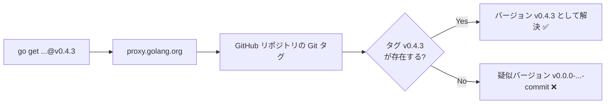

# Go モジュールバージョニングの修正

## 背景 (Background)

`scripts/dist/github-upload.sh` を使って GitHub にバイナリリリースを作成できるようになった。しかし、このスクリプトで作成されるバージョンタグは `tt-v1.2.3` のようにツールIDをプレフィックスとした形式であり、**Go モジュールシステムが認識するタグ形式ではない**。

そのため、外部プロジェクトが `go get` や `go.mod` でこのモジュールをインポートすると、バージョンは `v0.0.0-20260317....-{commit_hash}` のような疑似バージョン (pseudo-version) になってしまい、リリースされたバージョン番号（例: `v0.4.3`）を指定できない。

### 現状の問題点

| 項目 | 現在の状態 | あるべき状態 |
|------|-----------|-------------|
| GitHub Release タグ | `tt-v0.4.3` | `v0.4.3` |
| Go モジュール用タグ | **存在しない** | `v0.4.3`（同一タグ） |
| `go get` で指定できるバージョン | `v0.0.0-{timestamp}-{commit}` | `v0.4.3` |

### 根本原因

Go モジュールシステムがバージョンを解決するために必要な条件:

1. **Git タグが `vX.Y.Z` 形式であること** — `tt-v0.4.3` のようなプレフィックス付きタグは、ルートモジュールとしては認識されない
2. **タグが Git リポジトリに push されていること** — `go mod` は GitHub Releases ではなく Git タグを参照する

### 方針: `v1.2.3` 形式に統一

`tt-v1.2.3` のプレフィックス付き形式は Go モジュール互換にする上で必須ではないため、**`v1.2.3` 形式に統一する**。これにより:

- GitHub Release のタグがそのまま Go モジュールのバージョンとして機能する
- タグ管理がシンプルになる
- 2種類のタグを維持する複雑さを回避できる



## 要件 (Requirements)

### 必須要件

1. **タグ形式を `vX.Y.Z` に統一**: `publish.sh` が作成するタグを `tt-vX.Y.Z` → `vX.Y.Z` に変更する
2. **`github-upload.sh` のバージョン取得ロジックの修正**: `get_current_version()` 関数が新しいタグ形式 (`v*`) を正しく検索できるようにする
3. **`go get` による取得の実現**: 外部プロジェクトが以下のように利用できること:
   ```bash
   go get github.com/axsh/tokotachi@v0.4.3
   ```
4. **`go.mod` のモジュールパスは変更しない**: 現在の `module github.com/axsh/tokotachi` を維持する（`v0.x` / `v1.x` 範囲のため）

### 任意要件

5. **Go モジュールプロキシへの反映確認**: タグ push 後に `proxy.golang.org` でバージョンが利用可能になったことを確認する手順を文書化する

## 実現方針 (Implementation Approach)

### 変更対象ファイル

#### 1. [publish.sh](file://scripts/dist/publish.sh) の修正

タグ生成部分を変更:

```diff
-TAG="${TOOL_ID}-${VERSION}"
+TAG="${VERSION}"
```

`TITLE` は引き続きツールIDを含めて人間にわかりやすくする（タイトルは Go モジュールに影響しない）:

```
TITLE="${TOOL_ID} ${VERSION}"  # 変更なし
```

#### 2. [github-upload.sh](file://scripts/dist/github-upload.sh) の修正

`get_current_version()` 関数のタグ検索ロジックを変更:

```diff
-  tag=$(gh release list --limit 100 --json tagName --jq \
-    "[.[] | select(.tagName | startswith(\"${tool_id}-v\"))] | sort_by(.tagName) | last | .tagName // empty")
+  tag=$(gh release list --limit 100 --json tagName --jq \
+    "[.[] | select(.tagName | test(\"^v[0-9]\"))] | sort_by(.tagName) | last | .tagName // empty")
```

バージョン抽出部分も変更（プレフィックスを削除する処理が不要になる）:

```diff
   if [[ -z "$tag" ]]; then
     echo "v0.0.0"
   else
-    # Strip tool-id prefix: "tt-v1.0.0" → "v1.0.0"
-    echo "${tag#${tool_id}-}"
+    echo "$tag"
   fi
```

### 設計上の決定事項

| 決定事項 | 選択 | 理由 |
|----------|------|------|
| タグ形式 | `vX.Y.Z` に統一 | Go モジュール互換 + シンプルさ |
| `TITLE` | `{TOOL_ID} {VERSION}` を維持 | リリースの視認性（タグには影響なし） |

> [!IMPORTANT]
> 将来 `v2.0.0` 以上にバージョンアップする場合は、`go.mod` のモジュールパスに `/v2` サフィックスを追加する必要がある（例: `module github.com/axsh/tokotachi/v2`）。本仕様の対象外。

## 検証シナリオ (Verification Scenarios)

### シナリオ1: 新規リリース時のタグ形式

1. `github-upload.sh tt v0.5.0` を実行
2. GitHub Release のタグが `v0.5.0` であることを確認（`tt-v0.5.0` ではない）
3. `go get github.com/axsh/tokotachi@v0.5.0` で正しくバージョンが解決されることを確認

### シナリオ2: バージョンインクリメント

1. `github-upload.sh tt +v0.0.1` を実行（パッチバンプ）
2. `get_current_version()` が新しいタグ形式で最新バージョンを正しく取得できることを確認
3. インクリメント後のバージョンが正しく計算されることを確認

## テスト項目 (Testing for the Requirements)

### 自動検証

| # | 要件 | 検証方法 | コマンド |
|---|------|----------|----------|
| 1 | ビルドが通ること | 全体ビルド & 単体テスト | `scripts/process/build.sh` |
| 2 | `publish.sh` のタグが `vX.Y.Z` 形式であること | コードレビュー | `grep 'TAG=' scripts/dist/publish.sh` |
| 3 | `get_current_version()` が `v*` タグを検索すること | コードレビュー | `grep 'startswith\|test(' scripts/dist/github-upload.sh` |

### 手動検証

| # | 要件 | 手順 |
|---|------|------|
| 4 | Go モジュール用タグが機能すること | テスト用タグを作成 → push → 別プロジェクトで `go get github.com/axsh/tokotachi@vX.Y.Z` を実行 |
