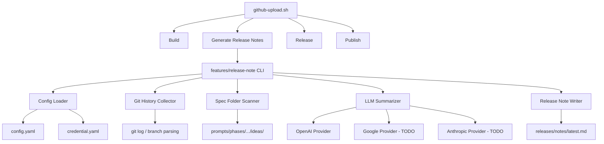

# リリースノート自動生成プログラム

## 背景 (Background)

現在の `scripts/dist/github-upload.sh` は Build → Release → Publish の3ステップでGitHub Releaseを作成する。Publishステップの `publish.sh` は `releases/notes/latest.md` をリリースノートとして使用するが、このファイルは手動で更新する必要がある（存在しない場合は `--generate-notes` でGitHub自動生成にフォールバックする）。

リリースのたびにリリースノートを手動で書くのは面倒であり、変更内容を網羅的に記述することが難しい。本プロジェクトでは、仕様書（`prompts/phases/{nnn}-{phase}/ideas/{branch}/` 以下のマークダウンファイル）が変更の意図と内容を詳細に記述しているため、これらを情報源としてLLMで自動要約し、リリースノートを生成する仕組みを構築する。

## 要件 (Requirements)

### 必須要件

#### R1: リリースノート生成CLIプログラム
- `features/release-note/` にGoプログラムとして実装する
- コマンドラインから実行し、リリースノートのマークダウンファイルを生成する
- 生成物は `releases/notes/latest.md` に出力し、既存の `publish.sh` から参照可能にする

#### R2: 設定管理
- `features/release-note/settings/config.yaml` で設定を管理する
- LLMプロバイダ名とモデル名を設定可能にする
- APIキーは `features/release-note/settings/secrets/credential.yaml` から動的に読み込む
- `config.yaml` から `credential.yaml` への参照パスを設定として保持する

現在の `config.yaml` 構造:
```yaml
# Global Application Configuration
credentials_path: "./secrets/credentials.yaml"
```

これを拡張し、LLMプロバイダ/モデルの指定を追加する:
```yaml
# Global Application Configuration
credentials_path: "./secrets/credential.yaml"

llm:
  provider: "openai"
  model: "gpt-4.1"
```

現在の `credential.yaml` 構造:
```yaml
llm:
  providers:
    google:
      api_key: "..."
    anthropic:
      api_key: "..."
    openai:
      api_key: "..."
```

#### R3: 情報収集 — Git履歴からブランチ名の特定
1. 前回リリースのコミットID（タグから取得）以降のgitコミットログを取得する
2. コミットログから関連するブランチ名を抽出する（マージコミットのメッセージやブランチ参照から）
3. 重複を排除したユニークなブランチ名リストを生成する

#### R4: 情報収集 — 仕様書フォルダの探索
1. `prompts/phases/` 配下のフェーズ `{nnn}-{phase_name}` 一覧を取得する
2. `{nnn}` が最大のフェーズから探索を開始する
3. そのフェーズの `ideas/` ディレクトリ内のフォルダ（= ブランチ名）一覧を取得する
4. R3で得たブランチ名リストと突合し、一致するフォルダをフィルタリングする
5. 一致するブランチが見つからない場合、フェーズ番号を1つ下げて再検索する
6. フェーズ番号が `000` に到達するか、最大フェーズ番号から5を引いた値以下になったら探索を打ち切る（そのブランチの情報は諦める）

#### R5: LLMによる要約 — 個別ブランチの変更要約
R4で特定された各ブランチフォルダ内のファイルを全て読み取り、LLMを用いて以下の3カテゴリに分類して要約する:

- **(1)【新規】**: 新しい機能、新しい設定などの登場
- **(2)【変更】**: 既存の機能・設定がどう変わるのか（Before → After）
- **(3)【削除】**: 廃止される機能、設定など

ユーザー（プログラムの利用者）が受ける影響に着目した「差分」を表現すること。

#### R6: LLMによる要約 — 最終統合要約
全ブランチの個別要約を連結した後、さらにLLMで最終統合要約を行う。

統合要約のルール:
- **中間状態の除去**: 「AがBになった」「BがCになった」→「AがCになった」と、最終状態のみ記述する
- **重複の統合**: 同じ項目への複数回の変更は、最終状態のみ記述する
- **削除と追加の統合**: 同名の項目が削除・追加された場合は「新しい挙動になった」等に統合する
- **関連項目のグルーピング**: 同一機能への複数変更は1つの説明にまとめる

> [!IMPORTANT]
> 要約は「結局最終的にどうなったのか」に着目すること。冗長な変更履歴の列挙ではなく、利用者にとって分かりやすい最終状態の差分を記述する。

#### R7: リリースノートの保存とGitHub連携
- 生成されたリリースノートを `releases/notes/latest.md` に保存する
- 既存の `releases/notes/templates/release-note.md.tmpl` テンプレートの `{{ .Changelog }}` 部分に挿入可能な形式で出力する
- `publish.sh` は変更不要（既にこのファイルを `--notes-file` で参照する仕組みが存在する）

#### R8: `github-upload.sh` への統合
- `github-upload.sh` の Build → Release → Publish フローの中に、リリースノート生成ステップを追加する
- Build完了後、Release前にリリースノート生成を実行する（Step 1.5 に相当）

#### R9: LLMプロバイダのファクトリーパターン
- LLMアクセスのインターフェースを定義し、プロバイダを切り替え可能な設計にする
- 今回はOpenAI実装のみ作成する
- Google (Gemini) と Anthropic の実装はToDo（スタブまたはインターフェース定義のみ）とする

#### R10: バージョン履歴の保存
- 生成されたリリースノートを `releases/notes/{version}.md` にもアーカイブとして保存する（将来参照用）

## 実現方針 (Implementation Approach)

### アーキテクチャ



### パッケージ構成

```
features/release-note/
├── main.go                    # エントリポイント
├── go.mod
├── go.sum
├── settings/
│   ├── config.yaml            # メイン設定
│   └── secrets/
│       └── credential.yaml    # API キー（.gitignore対象）
├── internal/
│   ├── config/
│   │   └── config.go          # 設定読み込み
│   ├── git/
│   │   └── history.go         # Git履歴収集・ブランチ名抽出
│   ├── scanner/
│   │   └── scanner.go         # 仕様書フォルダ探索
│   ├── llm/
│   │   ├── provider.go        # LLMプロバイダインターフェース
│   │   ├── factory.go         # プロバイダファクトリー
│   │   ├── openai/
│   │   │   └── client.go      # OpenAI実装
│   │   ├── google/
│   │   │   └── client.go      # Google実装（TODO stub）
│   │   └── anthropic/
│   │       └── client.go      # Anthropic実装（TODO stub）
│   ├── summarizer/
│   │   └── summarizer.go      # 要約エンジン (個別 + 統合)
│   └── writer/
│       └── writer.go          # リリースノートファイル出力
└── testdata/                  # テスト用データ
```

### 処理フロー

1. **設定読み込み**: `config.yaml` を読み込み、参照する `credential.yaml` からAPIキーを取得
2. **Git履歴収集**: 前回リリースタグ以降のコミットログからブランチ名を抽出
3. **仕様書フォルダ探索**: ブランチ名に対応する仕様書フォルダを `prompts/phases/` から検索
4. **個別要約**: 各ブランチの仕様書ファイルをLLMで3カテゴリ（新規/変更/削除）に要約
5. **統合要約**: 全ブランチの要約を連結し、LLMで最終的な統合要約を生成
6. **出力**: `releases/notes/latest.md` にリリースノートを書き出す

### LLMプロバイダインターフェース

```go
// Provider はLLMアクセスの共通インターフェース
type Provider interface {
    // Summarize はテキストを要約して返す
    Summarize(ctx context.Context, systemPrompt string, userContent string) (string, error)
}
```

### `github-upload.sh` への変更

Build完了後に以下のステップを追加:
```bash
# ─── Step 1.5: Generate Release Notes ──────────────────────────────
info "=== Step 1.5/4: Generate Release Notes ==="
RELEASE_NOTE_DIR="${REPO_ROOT}/features/release-note"
(cd "$RELEASE_NOTE_DIR" && go run . \
  --tool-id "$TOOL_ID" \
  --version "$NEW_VERSION" \
  --repo-root "$REPO_ROOT")
```

ステップ表記を 3→4 に変更:
- Step 1/4: Build
- Step 2/4: Generate Release Notes
- Step 3/4: Release
- Step 4/4: Publish

## 検証シナリオ (Verification Scenarios)

### シナリオ1: 設定読み込みの確認
1. `config.yaml` と `credential.yaml` が正しく読み込まれること
2. 指定されたプロバイダのAPIキーが取得されること
3. 存在しないプロバイダが指定された場合にエラーとなること

### シナリオ2: Git履歴からのブランチ名抽出
1. 指定ツールのリリースタグが存在する場合、そのタグ以降のコミットからブランチ名を取得できること
2. リリースタグが存在しない場合（初回リリース）、全コミットからブランチ名を取得すること
3. 重複するブランチ名が除去されること

### シナリオ3: 仕様書フォルダの探索
1. 最新フェーズの `ideas/` から対象ブランチのフォルダを発見できること
2. 最新フェーズに存在しない場合、番号を下げて前のフェーズを探索すること
3. フェーズ番号が下限に達した場合、そのブランチの探索を打ち切ること

### シナリオ4: LLM要約の実行
1. 仕様書ファイルを読み取り、新規/変更/削除の3カテゴリに分類した要約が生成されること
2. 複数ブランチの要約が統合され、中間状態が除去された最終要約が生成されること

### シナリオ5: リリースノートの出力
1. `releases/notes/latest.md` にリリースノートが出力されること
2. 出力ファイルの形式が `publish.sh` で参照可能なマークダウン形式であること

### シナリオ6: `github-upload.sh` 統合
1. `github-upload.sh` 実行時にリリースノート生成ステップが実行されること
2. リリースノート生成が失敗してもユーザーに警告が出て、パイプライン全体は続行すること（`--generate-notes` にフォールバック）

## テスト項目 (Testing for the Requirements)

### 単体テスト

| 要件 | テスト対象 | テスト内容 |
|------|-----------|-----------|
| R2 | `internal/config/` | `config.yaml` と `credential.yaml` のパース、APIキー取得 |
| R3 | `internal/git/` | gitログパース、ブランチ名抽出、重複排除 |
| R4 | `internal/scanner/` | フェーズディレクトリ探索、フォルダマッチング、フォールバック |
| R9 | `internal/llm/` | ファクトリーによるプロバイダ生成、未実装プロバイダのエラー |

```bash
# 単体テストの実行
cd features/release-note && go test ./...
```

### ビルド検証

```bash
# プロジェクト全体のビルドと単体テスト
scripts/process/build.sh
```

### 統合テスト

> [!NOTE]
> LLMを使用する統合テストは実際のAPIキーが必要。CI環境では環境変数またはモックによる代替を検討する。

```bash
# 統合テスト
scripts/process/integration_test.sh
```

### 手動検証

1. `features/release-note/` ディレクトリで `go run . --tool-id tt --version v0.1.0 --repo-root <project_root>` を実行
2. `releases/notes/latest.md` が生成され、内容が適切なリリースノート形式であることを確認
3. `scripts/dist/github-upload.sh tt` を実行し、リリースノート生成ステップが組み込まれていることを確認
