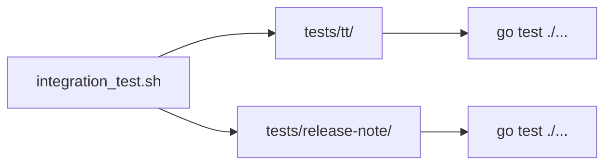

# 002 - 統合テスト再構成とリリースノート統合テスト

## 背景 (Background)

`tests/integration-test/` ディレクトリには現在 `tt` コマンド専用の統合テストが配置されている。今後 `release-note` プログラムの統合テストも追加するにあたり、テストをカテゴリ別に整理する必要がある。

`scripts/process/integration_test.sh` は `tests/` 配下のサブディレクトリを「カテゴリ」として自動検出し、各カテゴリのテストを実行する仕組みになっている。現在は `tests/integration-test/` が唯一のカテゴリだが、これを `tests/tt/` と `tests/release-note/` に分離することで、カテゴリフィルタリング (`--categories "tt"`, `--categories "release-note"`) が正しく機能するようになる。

### 現在の構成
```
tests/
└── integration-test/         ← tt専用テスト (カテゴリ名: "integration-test")
    ├── go.mod
    ├── go.sum
    ├── helpers_test.go
    ├── tt_create_delete_test.go
    ├── tt_doctor_test.go
    ├── tt_down_test.go
    ├── tt_editor_test.go
    ├── tt_env_option_test.go
    ├── tt_list_code_test.go
    ├── tt_open_close_syntax_test.go
    ├── tt_scaffold_test.go
    ├── tt_status_test.go
    ├── tt_up_git_test.go
    ├── tt_up_test.go
    └── docker_build_test.go
```

### 目標の構成
```
tests/
├── tt/                       ← tt専用テスト (カテゴリ名: "tt")
│   ├── go.mod                ← module名更新
│   ├── go.sum
│   ├── helpers_test.go       ← projectRoot()のパス解決を修正
│   ├── tt_*.go               ← 全既存テストファイル移動
│   └── docker_build_test.go
└── release-note/             ← リリースノート統合テスト (カテゴリ名: "release-note")
    ├── go.mod                ← 新規作成
    ├── helpers_test.go       ← 新規作成
    ├── config_load_test.go   ← 設定読み込みテスト
    ├── scanner_test.go       ← 仕様書探索テスト
    └── writer_test.go        ← リリースノート出力テスト
```

## 要件 (Requirements)

### 必須要件

- **R1: ttテストの移動**: `tests/integration-test/` の全ファイルを `tests/tt/` に移動する
  - `go.mod` の module 名を `github.com/axsh/tokotachi/tests/tt` に更新
  - `helpers_test.go` の `projectRoot()` のパス解決を修正（2階層上 → 変更なし）
  - 全既存テストが移動後もパスすること

- **R2: integration-test ディレクトリの削除**: 移動完了後、`tests/integration-test/` を削除する

- **R3: release-note統合テスト作成**: `tests/release-note/` にリリースノートプログラムの統合テストを作成する
  - 独立した `go.mod` を持つGoモジュールとする
  - `integration_test.sh --categories "release-note"` で実行可能であること

- **R4: テスト項目（最低限）**: 以下の統合テストを作成する
  - **設定読み込みテスト**: 実際の `features/release-note/settings/config.yaml` を読み込み、構造が正しいことを確認
  - **仕様書探索テスト**: 実際のプロジェクトの `prompts/phases/` ディレクトリをスキャンし、フェーズ構造が正しく検出されることを確認
  - **リリースノート出力テスト**: `writer` パッケージを使い、一時ディレクトリにリリースノートを生成し、`latest.md` と `{version}.md` の両方が作成されることを確認

- **R5: 既存テストの非破壊**: `tests/tt/` に移動後、全既存テストが `integration_test.sh --categories "tt"` で引き続きパスすること

## 実現方針 (Implementation Approach)

### 移動戦略

1. `tests/tt/` ディレクトリを作成
2. `tests/integration-test/` の全ファイルを `tests/tt/` にコピー
3. `go.mod` のモジュール名を更新
4. `helpers_test.go` のパス解決が正しく動くか確認（`tests/tt/` も `tests/integration-test/` と同じ2階層なので変更不要と思われるが確認が必要）
5. `tests/integration-test/` を削除

### release-note 統合テスト設計

- **外部依存を避ける**: LLM APIの呼び出しは統合テストでは行わない（APIキーが必要で、CI環境では利用不可のため）
- **実プロジェクト構造を使う**: 設定ファイルやフェーズディレクトリの存在を実プロジェクトに対して検証する
- **パッケージのインポート**: `features/release-note/internal/` パッケージを直接インポートするのではなく、CLIの `go build` と設定ファイルの読み込みを検証する独立テストとする



## 検証シナリオ (Verification Scenarios)

### シナリオ1: ttテストの移動と動作確認
1. `tests/integration-test/` の全ファイルを `tests/tt/` にコピー
2. `go.mod` のモジュール名を更新
3. `tests/integration-test/` を削除
4. `./scripts/process/integration_test.sh --categories "tt"` を実行
5. 全テストがパスすることを確認

### シナリオ2: release-note統合テストの実行
1. `tests/release-note/` に統合テストファイルを作成
2. `./scripts/process/integration_test.sh --categories "release-note"` を実行
3. 全テストがパスすることを確認

### シナリオ3: 全カテゴリの統合テスト実行
1. `./scripts/process/integration_test.sh` を実行（カテゴリ指定なし）
2. `tt` と `release-note` の両カテゴリが検出・実行されることを確認
3. 全テストがパスすることを確認

## テスト項目 (Testing for the Requirements)

| 要件 | 検証コマンド | 検証内容 |
|---|---|---|
| R1, R5 | `./scripts/process/integration_test.sh --categories "tt"` | 移動後のttテストが全パス |
| R3, R4 | `./scripts/process/integration_test.sh --categories "release-note"` | release-note統合テストが全パス |
| R2 | `ls tests/integration-test/` → エラー（存在しない） | 旧ディレクトリが削除済み |
| 全体 | `./scripts/process/integration_test.sh` | 全カテゴリが正常実行 |

> [!IMPORTANT]
> ttの統合テストはDocker依存のため、Docker環境が利用可能な場合のみ実行可能。release-note統合テストはDocker不要で実行可能な設計とする。
