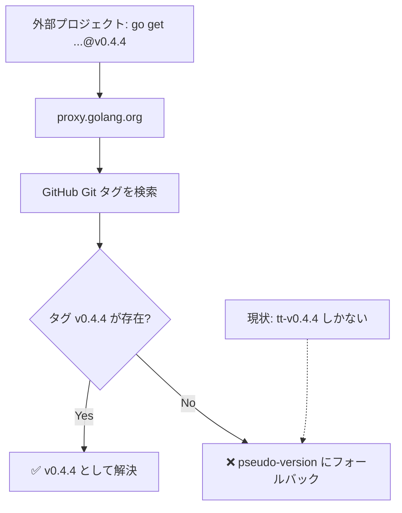

# Go モジュールバージョニングタグの修正（再実施）& リリースノート英語化

## 背景 (Background)

前回の仕様 [000-GoModuleVersioning.md](file://prompts/phases/000-foundation/ideas/fix-module-versioning/000-GoModuleVersioning.md) に基づき、GitHub Release のタグ形式を `tt-vX.Y.Z` から `vX.Y.Z` に変更するための実装計画が作成・実行された（PR `fix-module-versioning` はマージ済み）。

しかし、**実際のコードは修正されておらず、問題が解決していない**。

### 現状

| 項目 | 現在の状態 | 期待される状態 |
|------|-----------|---------------|
| `publish.sh` L41 | `TAG="${TOOL_ID}-${VERSION}"` | `TAG="${VERSION}"` |
| `github-upload.sh` L46 | `startswith("${tool_id}-v")` | `test("^v[0-9]")` |
| Git タグ | `tt-v0.4.4` のみ | `v0.4.4` が必要 |
| 外部プロジェクトでのバージョン指定 | `v0.0.0-20260317152622-8c4c2cc2c6a9`（pseudo-version） | `v0.4.4` |

### 根本原因

2つの問題が存在する:

1. **スクリプト未修正**: `publish.sh` と `github-upload.sh` のタグ生成ロジックがまだ `tt-v` プレフィックス付き形式のまま
2. **既存タグ未修正**: 過去にリリースされたタグ（`tt-v0.4.4` 等）に対応する `vX.Y.Z` 形式のタグが存在しない

Go モジュールシステムはリポジトリの **Git タグ** を参照してバージョンを解決するため、`vX.Y.Z` 形式のタグが存在しなければ pseudo-version にフォールバックする。

また、リリースノート生成機能（`features/release-note`）の `summarizer.go` 内の LLM プロンプトが日本語で記述されているため、生成されるリリースノートも日本語になっている。GitHub Release のリリースノートは英語で記述すべきである。



## 要件 (Requirements)

### 必須要件

1. **スクリプト修正**: `publish.sh` のタグ生成ロジックを `vX.Y.Z` 形式に変更する
2. **スクリプト修正**: `github-upload.sh` の `get_current_version()` が `vX.Y.Z` 形式のタグを検索するよう変更する
3. **既存タグの追加**: 現在の最新バージョン（`tt-v0.4.4`）と同じコミットに `v0.4.4` タグを作成し push する
4. **外部プロジェクトでの動作確認**: `go get github.com/axsh/tokotachi@v0.4.4` が成功すること
5. **リリースノートの英語化**: `summarizer.go` の LLM プロンプトを英語に変更し、出力されるリリースノートを英語にする

> [!NOTE]
> 過去の `tt-v*` タグはそのまま残っていて良い（削除しない）。

## 実現方針 (Implementation Approach)

### 変更対象

#### 1. [publish.sh](file://scripts/dist/publish.sh) の修正

```diff
-TAG="${TOOL_ID}-${VERSION}"
+TAG="${VERSION}"
```

`TITLE` は従来通り `${TOOL_ID} ${VERSION}` を維持（GitHub Release の表示名のみ）。

#### 2. [github-upload.sh](file://scripts/dist/github-upload.sh) の修正

`get_current_version()` 関数のタグ検索ロジック:

```diff
-  tag=$(gh release list --limit 100 --json tagName --jq \
-    "[.[] | select(.tagName | startswith(\"${tool_id}-v\"))] | sort_by(.tagName) | last | .tagName // empty")
+  tag=$(gh release list --limit 100 --json tagName --jq \
+    "[.[] | select(.tagName | test(\"^v[0-9]\"))] | sort_by(.tagName) | last | .tagName // empty")
```

バージョン抽出ロジック:

```diff
   if [[ -z "$tag" ]]; then
     echo "v0.0.0"
   else
-    # Strip tool-id prefix: "tt-v1.0.0" → "v1.0.0"
-    echo "${tag#${tool_id}-}"
+    echo "$tag"
   fi
```

#### 3. 既存タグの追加（手動作業）

`tt-v0.4.4` タグが指すコミットと同じ位置に `v0.4.4` タグを作成する:

```bash
# tt-v0.4.4 が指すコミットハッシュを取得
COMMIT=$(git rev-list -n 1 tt-v0.4.4)

# v0.4.4 タグを作成
git tag v0.4.4 $COMMIT

# push
git push origin v0.4.4
```

#### 4. Go モジュールプロキシの更新

タグ push 後、Go モジュールプロキシに反映されるのを確認する:

```bash
# プロキシに反映をリクエスト
GOPROXY=https://proxy.golang.org go list -m github.com/axsh/tokotachi@v0.4.4
```

> [!IMPORTANT]
> `go.mod` のモジュールパス (`module github.com/axsh/tokotachi`) は v0.x/v1.x 範囲のため変更不要。

#### 5. [summarizer.go](file://features/release-note/internal/summarizer/summarizer.go) の修正

LLM への system prompt を日本語から英語に変更する:

- `branchSummarySystemPrompt`: リリースノートのカテゴリ分類指示を英語化
  - カテゴリ名: 【新規】→ **[New]**、【変更】→ **[Changed]**、【削除】→ **[Removed]**
- `consolidateSystemPrompt`: 統合ルールと出力フォーマット指示を英語化

## 検証シナリオ (Verification Scenarios)

### シナリオ1: スクリプト修正の確認

1. `publish.sh` の `TAG` 変数が `${VERSION}` のみであること（`TOOL_ID` プレフィックスなし）を確認
2. `github-upload.sh` の `get_current_version()` が `test("^v[0-9]")` で検索していることを確認
3. `github-upload.sh` のバージョン抽出がプレフィックス除去なしでタグをそのまま返すことを確認

### シナリオ2: v0.4.4 タグの動作確認

1. `tt-v0.4.4` が指すコミットと同じ位置に `v0.4.4` タグを作成
2. `git push origin v0.4.4` で GitHub にタグを push
3. 外部プロジェクトで `go get github.com/axsh/tokotachi@v0.4.4` を実行
4. `go.mod` に `github.com/axsh/tokotachi v0.4.4` が記録されること（pseudo-version ではないこと）を確認

### シナリオ3: リリースノートの英語出力確認

1. `summarizer.go` のプロンプトが英語に変更されていることを確認
2. カテゴリ名が `[New]` / `[Changed]` / `[Removed]` であることを確認

## テスト項目 (Testing for the Requirements)

### 自動検証

| # | 要件 | 検証方法 | コマンド |
|---|------|----------|----------|
| 1 | ビルドが通ること | 全体ビルド & 単体テスト | `scripts/process/build.sh` |
| 2 | `publish.sh` のタグ形式 | grep による確認 | `grep -n 'TAG=' scripts/dist/publish.sh` |
| 3 | `get_current_version()` の検索ロジック | grep による確認 | `grep -n 'test\|startswith' scripts/dist/github-upload.sh` |
| 4 | `summarizer.go` のプロンプトが英語 | grep による確認 | `grep -n 'New\|Changed\|Removed' features/release-note/internal/summarizer/summarizer.go` |

### 手動検証

| # | 要件 | 手順 |
|---|------|------|
| 5 | `v0.4.4` タグが正しいコミットを指す | `git rev-list -n 1 v0.4.4` と `git rev-list -n 1 tt-v0.4.4` の出力が一致すること |
| 6 | 外部プロジェクトでバージョン指定が可能 | 外部プロジェクトで `go get github.com/axsh/tokotachi@v0.4.4` を実行し、pseudo-version ではなく `v0.4.4` が `go.mod` に記録されることを確認 |
