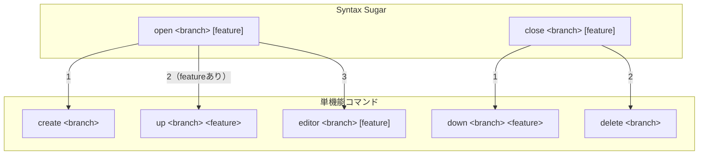

# コマンド体系の再構成

## 背景 (Background)

現在の `devctl`（リネーム後は `tt`）CLIは、以下のコマンドを持っている:

| コマンド | 説明 |
|---------|------|
| `up <branch> [feature]` | コンテナ起動＋worktree作成＋エディタ起動 |
| `down <branch> <feature>` | コンテナ停止 |
| `open <branch> [feature]` | エディタを開く |
| `close <branch> [feature]` | コンテナ停止→worktree削除→ブランチ削除 |
| `status <branch> [feature]` | 状態表示 |
| `list [branch]` | ブランチ/feature一覧 |
| `exec <branch> <feature> -- <cmd>` | コンテナ内コマンド実行 |
| `shell <branch> <feature>` | コンテナ内シェル |
| `pr <branch> [feature]` | GitHub PR作成 |
| `doctor` | 健全性チェック |
| `scaffold [category] [name]` | テンプレート生成 |
| `_update-code-status` | (内部用) コードステータス更新 |

### 課題

- `up` が「worktree作成 + コンテナ起動 + エディタ起動」を一つのコマンドで担っており、責務が大きすぎる
- worktreeの作成/削除とコンテナの起動/停止が分離されていないため、個別の操作が困難
- `open` と `up --editor` の役割が重複しており、使い分けが不明確

### 目標

コマンドを以下の5つの責務カテゴリに整理し、各コマンドの責務を単一にする:

1. **Worktreeの操作** — ブランチとworktreeのライフサイクル管理
2. **Dev Containerの操作** — コンテナのライフサイクル管理
3. **GitHubの操作** — GitHub連携
4. **Editorの操作** — エディタ起動
5. **Syntax Sugar** — 複数操作をまとめた便利コマンド

---

## 要件 (Requirements)

### 必須要件

#### R1. Worktreeの操作

| コマンド | 説明 |
|---------|------|
| `create <branch>` | ブランチを作成し、Worktreeを作成する |
| `delete <branch>` | Worktreeを削除し、ブランチを削除する |
| `status <branch> [feature]` | 現行と同じ動作 |
| `list [branch]` | 現行と同じ動作 |

##### `create <branch>`
- 指定されたブランチ名でGitブランチを作成する
- そのブランチのworktreeを作成する
- 予約ブランチ名（`main`, `master`）のバリデーションは現行通り

##### `delete <branch>`
- `--depth {n}` フラグ: ネストされたworktreeの再帰削除深度を指定（デフォルト: 10）
- `--yes` フラグ: 確認プロンプトをスキップ
- `--dry-run` フラグ（グローバル）対応: 実行せずに計画のみ表示
- **前提条件**: 対象ブランチに紐づくDev Container（feature）が一つでも起動中であれば、エラーを返して終了する（安全ガード）
- worktreeを削除し、ブランチを削除する
- 現行の `close` コマンドからworktree/ブランチ削除ロジックを移植

#### R2. Dev Containerの操作（Worktree作成後）

| コマンド | 説明 |
|---------|------|
| `up <branch> <feature>` | Dev Containerを起動する |
| `down <branch> <feature>` | Dev Containerを停止する |
| `exec <branch> <feature> -- <cmd>` | 現行と同じ動作 |
| `shell <branch> <feature>` | 現行と同じ動作 |

##### `up <branch> <feature>`
- `branch` のworktreeパスを解決し、その中のDev Containerを起動する
- worktreeが存在しない場合はエラーを返す（自動作成しない — `create` の責務）
- `feature` は必須引数（省略不可）
- 現行の `up` コマンドからコンテナ起動ロジックを移植（worktree自動作成部分を除去）
- `--ssh`, `--rebuild`, `--no-build` フラグは現行通り維持
- `--editor` フラグは廃止する（`open` コマンドまたは `editor` コマンドで代替）

##### `down <branch> <feature>`
- `branch` のworktreeパスを解決し、その中のDev Containerを停止する
- 現行の `down` コマンドと同じ動作

#### R3. GitHubの操作（Worktree作成後）

| コマンド | 説明 |
|---------|------|
| `pr <branch> [feature]` | 現行と同じ動作 |

#### R4. Editorの操作（Worktree作成後）

| コマンド | 説明 |
|---------|------|
| `editor <branch> [feature]` | エディタを開く |

##### `editor <branch> [feature]`
- 現行の `open` コマンドと同じ動作
- `--editor {name}` フラグでエディタ種類を指定（code/cursor/ag/claude）
- `--attach` フラグで稼働中コンテナへDevContainer接続
- `feature` が省略された場合はworktreeのみを対象にエディタを開く

#### R5. Syntax Sugar的な操作

| コマンド | 説明 |
|---------|------|
| `open <branch> [feature]` | `create` → `up` → `editor` の一連の操作 |
| `close <branch> [feature]` | `down` → `delete` の一連の操作 |

##### `open <branch> [feature]`
- `create` → `up` → `editor` の一連の操作をまとめたコマンド
- `--editor {name}` フラグ: エディタ種類を指定（省略時は環境変数 `TT_EDITOR` に指定されたエディタを使用）
- **必ず** `editor` が呼ばれる（これが現行 `up` との違い）
- `feature` が省略された場合: `create` → `editor` を実行（`up` はスキップ）
- 既にworktreeが存在する場合は `create` をスキップする
- 既にコンテナが起動中の場合は `up` をスキップする

##### `close <branch> [feature]`
- `feature` が **省略** された場合:
  1. `down` を対象ブランチに紐づく**全てのDev Container**に対して実行
  2. `delete` を実行
- `feature` が **指定** された場合:
  1. `down` を指定されたDev Containerに対して実行
  2. `delete` を実行（ただし、対象ブランチに紐づく全Dev Containerが停止していなければ、`delete` をスキップする）

#### R6. その他

| コマンド | 説明 |
|---------|------|
| `scaffold [category] [name]` | 現行と同じ動作 |
| `doctor` | 現行と同じ動作 |
| `_update-code-status` | 現行と同じ動作（内部用・非表示） |

---

## 実現方針 (Implementation Approach)

### コマンド実装構成

```
features/devctl/cmd/
├── root.go                    # ルートコマンド（変更: サブコマンド登録の更新）
├── common.go                  # 共通ロジック（変更なし）
├── common_test.go             # 共通テスト（変更なし）
├── create.go                  # [新規] create コマンド
├── delete.go                  # [新規] delete コマンド（旧 close のworktree部分）
├── up.go                      # [変更] worktree自動作成ロジックを除去、feature必須化
├── down.go                    # [変更なし]
├── open.go                    # [変更] Syntax Sugar: create→up→editor
├── close.go                   # [変更] Syntax Sugar: down→delete
├── editor.go                  # [新規] 旧 open のエディタ起動ロジックを移植
├── exec_cmd.go                # [変更なし]
├── shell.go                   # [変更なし]
├── pr.go                      # [変更なし]
├── status.go                  # [変更なし]
├── list.go                    # [変更なし]
├── doctor.go                  # [変更なし]
├── scaffold.go                # [変更なし]
└── update_code_status.go      # [変更なし]
```

### 変更方針の概要

1. **`create.go` (新規)**: 現行 `up.go` のworktree作成部分を抽出。`worktree.Manager.Create()` を呼ぶだけのシンプルなコマンド。

2. **`delete.go` (新規)**: 現行 `close.go` のworktree削除＋ブランチ削除ロジックを移植。起動中コンテナのチェック（state ファイルから判定）を追加。

3. **`editor.go` (新規)**: 現行 `open.go` のエディタ起動ロジックをそのまま移植。`--up` フラグは削除。

4. **`up.go` (変更)**: worktree自動作成部分を削除。worktreeが存在しない場合はエラー。`feature` を必須引数に変更。

5. **`open.go` (変更)**: Syntax Sugarとして書き直し。内部で `create` → `up` → `editor` の各ロジックを順番に呼び出す。

6. **`close.go` (変更)**: Syntax Sugarとして書き直し。内部で `down` → `delete` の各ロジックを順番に呼び出す。

7. **`root.go` (変更)**: `editorCmd`, `createCmd`, `deleteCmd` を追加登録。

### 処理フロー図



---

## 検証シナリオ (Verification Scenarios)

### シナリオ1: create → delete の基本フロー

1. `tt create my-branch` を実行
2. worktreeが作成され、ブランチ `my-branch` が存在することを確認
3. `tt delete my-branch` を実行
4. worktreeとブランチが削除されることを確認

### シナリオ2: delete の安全ガード

1. `tt create my-branch` を実行
2. `tt up my-branch devctl` でコンテナを起動
3. `tt delete my-branch` を実行
4. コンテナが起動中のためエラーが返ることを確認
5. `tt down my-branch devctl` でコンテナを停止
6. `tt delete my-branch` を再実行
7. 正常にworktreeとブランチが削除されることを確認

### シナリオ3: open のSyntax Sugar動作

1. `tt open my-branch devctl` を実行
2. worktreeが自動作成されること
3. Dev Containerが起動すること
4. エディタが開かれること

### シナリオ4: open (feature省略時)

1. `tt open my-branch` を実行（feature省略）
2. worktreeが自動作成されること
3. Dev Containerの起動はスキップされること
4. エディタが開かれること

### シナリオ5: close (feature省略時)

1. `tt create my-branch` → `tt up my-branch feat-a` → `tt up my-branch feat-b` で環境構築
2. `tt close my-branch` を実行（feature省略）
3. `feat-a` と `feat-b` 両方のDev Containerが停止されること
4. worktreeとブランチが削除されること

### シナリオ6: close (feature指定時、他のコンテナ起動中)

1. `tt create my-branch` → `tt up my-branch feat-a` → `tt up my-branch feat-b` で環境構築
2. `tt close my-branch feat-a` を実行
3. `feat-a` のDev Containerが停止されること
4. `feat-b` がまだ起動中のため、`delete`（worktree/ブランチ削除）はスキップされること

### シナリオ7: editor コマンド

1. `tt create my-branch` でworktreeを作成
2. `tt editor my-branch` を実行
3. エディタが開かれること（現行の `open` と同じ動作）

---

## テスト項目 (Testing for the Requirements)

### ビルドと単体テスト

```bash
./scripts/process/build.sh
```

- 全単体テストがパスすること
- `create`, `delete`, `editor` コマンドの単体テストを新規作成する

### 統合テスト

```bash
./scripts/process/integration_test.sh
```

- 既存の統合テストが引き続きパスすること
- 以下の新規統合テストを追加:
  - `create` → `delete` の基本フロー
  - `delete` で起動中コンテナがある場合のエラー
  - `open` のSyntax Sugar動作（create→up→editor）
  - `close` のSyntax Sugar動作（down→delete）

### コマンドヘルプの確認

```bash
# 各コマンドが正しく登録され、ヘルプが表示されること
tt --help
tt create --help
tt delete --help
tt up --help
tt down --help
tt editor --help
tt open --help
tt close --help
```
