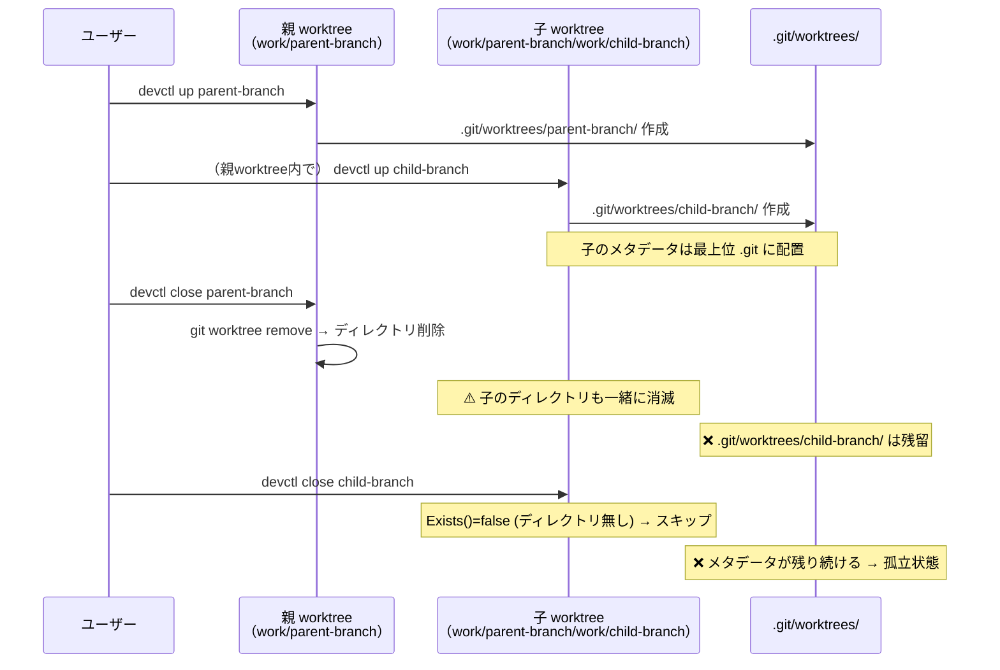

# ネストされた Worktree の削除問題

## 背景 (Background)

### 現在の構成

`devctl` は `work/<branch>/` 配下に Git worktree を作成して開発環境を構築する。worktree の中で `devctl up` を実行すると、さらにその中に子 worktree が作成される。

```
repo-root/
├── work/
│   └── parent-branch/          ← 親 worktree (git worktree add で作成)
│       ├── .git                ← gitdir ファイル
│       ├── work/
│       │   └── child-branch/   ← 子 worktree (親の中で devctl up して作成)
│       │       ├── .git        ← gitdir ファイル
│       │       └── ...
│       └── ...
└── .git/
    └── worktrees/
        ├── parent-branch/      ← 親 worktree のメタデータ
        └── child-branch/       ← 子 worktree のメタデータ
```

### 問題: 親 worktree の close 後に子 worktree が削除不能になる

worktree 内で更に worktree を作成（ネスト）した場合、親 worktree を `devctl close` すると、子 worktree が孤立し削除不能になる。

### なぜそうなるのか

1. **Git worktree の物理構造**: Git worktree は、主リポジトリの `.git/worktrees/<name>/` にメタデータを持ち、worktree ディレクトリ内の `.git` ファイルがそのメタデータへの参照を保持する
2. **子 worktree の参照パス**: 子 worktree の `.git` ファイルには `gitdir: ../../.git/worktrees/child-branch` のような**相対パス**が記録されている。しかし、この「`../../.git`」は実際には**親 worktree のリポジトリルート**ではなく、**最上位のリポジトリルート**の `.git` を指している
3. **親 worktree を close すると**: `git worktree remove` + `os.RemoveAll` で親 worktree のディレクトリが削除される。子 worktree のディレクトリも親の中にあるため、**物理ファイルは一緒に消える**
4. **メタデータは残る**: しかし、最上位リポジトリの `.git/worktrees/child-branch/` には子 worktree のメタデータが残り続ける。このメタデータが指す worktree パス（`gitdir` ファイルの内容）は、もう存在しないディレクトリを参照している
5. **`git worktree remove` が失敗**: メタデータが残っているため Git は子 worktree がまだ存在すると認識するが、実際のディレクトリは消えているため `git worktree remove` が失敗する
6. **`devctl close` も失敗**: `worktree.Manager.Exists()` は子 worktree のディレクトリが存在しないため `false` を返し、`git worktree remove` をスキップする。しかし、Git 内部のメタデータは残ったままなので、同名のブランチ/worktree を再利用できない状態になる




### 影響箇所

| ファイル | 問題 |
|---------|------|
| [close.go](file://features/devctl/internal/action/close.go) | ネストされた子 worktree の検出・再帰クリーンアップロジックがない |
| [worktree.go](file://features/devctl/internal/worktree/worktree.go) | `Remove()` が子 worktree の存在を考慮しない |
| [worktree.go](file://features/devctl/internal/worktree/worktree.go) | 孤立した Git メタデータをクリーンアップする手段がない |

## 要件 (Requirements)

### 必須要件

1. **R1: close 時のネスト worktree 検出と再帰的 close（深さ制限付き）**
   - `devctl close <branch>` 実行時、対象の worktree ディレクトリ内に子 worktree（`work/<child>/` ディレクトリ）が存在するか確認する
   - 子 worktree が検出された場合、**子 worktree を先に再帰的に close** してから親 worktree を close する
   - 子 worktree の close は、コンテナ停止 → worktree 削除 → ブランチ削除 → state 削除の通常フローに従う
   - `--depth <n>` オプションで再帰の最大深さを指定可能（デフォルト: 10）
   - 深さが `n` を超えた場合、再帰を停止し、深さ超過により残留する可能性がある子 worktree について警告ログを表示する

2. **R2: 孤立した worktree メタデータの強制クリーンアップ**
   - 子 worktree が消せなくなった場合のリカバリ手段として、`devctl close --force <branch>` に以下の機能を追加する
   - worktree ディレクトリが存在しなくても、`git worktree prune` を実行してリポジトリの `.git/worktrees/` から孤立したメタデータを削除する
   - `git worktree prune` は、実際のディレクトリが存在しない worktree エントリを自動的にクリーンアップする Git 標準のコマンド

3. **R3: close 処理のユーザーへのフィードバック改善**
   - ネスト worktree が検出された場合、ユーザーに明示的なログメッセージで通知する
   - 再帰的 close を行う旨と、対象の子 worktree 一覧をログに表示する

4. **R5: Dry-run 前提の確認プロンプト**
   - `devctl close` は削除対象の一覧をプレビュー表示した後、`[y/N]` 確認プロンプトでユーザーの承認を得てから実行する
   - ネスト worktree が存在する場合、プレビューに子 worktree の一覧も含める
   - 深さが `--depth` で指定した値を超える子 worktree が存在する場合、「深さ制限により残留する worktree がある可能性がある」旨の警告を添えた上で確認を求める
   - `--dry-run` の場合はプレビュー表示のみで確認プロンプトを表示せず終了する

5. **R6: `--yes` オプション**
   - `devctl close --yes` で確認プロンプトをスキップし、即座に実行する
   - CI/CD 環境やスクリプトからの呼び出しを想定

### 任意要件

6. **R4: `devctl up` 実行時のネスト警告**
   - worktree 内から `devctl up` を実行した場合（= ネスト worktree を作成する場合）、警告メッセージを表示する
   - ネスト worktree は「親の close 時に子が孤立するリスク」があることをユーザーに通知する

## 実現方針 (Implementation Approach)

### 1. ネスト worktree の検出 (R1)

`worktree.Manager` に子 worktree を検出するメソッドを追加する:

```go
// FindNestedWorktrees returns a list of child worktree branches
// found under the given branch's worktree directory.
func (m *Manager) FindNestedWorktrees(branch string) []string {
    wtPath := m.Path(branch)
    childWorkDir := filepath.Join(wtPath, "work")
    // childWorkDir 内のディレクトリを走査し、
    // .git ファイルが存在するもの（= 有効な worktree）を返す
}
```

### 2. close 処理の再帰化 (R1, R3)

`action.Close()` を修正し、worktree 削除前にネスト worktree を検出・再帰 close する:

```go
func (r *Runner) Close(opts CloseOptions, wm *worktree.Manager) error {
    // 既存処理の前に: ネスト worktree の検出
    nested := wm.FindNestedWorktrees(opts.Branch)
    if len(nested) > 0 {
        r.Logger.Info("Detected %d nested worktree(s): %v", len(nested), nested)
        for _, childBranch := range nested {
            r.Logger.Info("Recursively closing nested worktree: %s", childBranch)
            childOpts := CloseOptions{
                Branch:      childBranch,
                Force:       opts.Force,
                RepoRoot:    opts.RepoRoot,
                ProjectName: opts.ProjectName,
            }
            if err := r.Close(childOpts, wm); err != nil {
                r.Logger.Warn("Failed to close nested worktree %s: %v", childBranch, err)
            }
        }
    }
    // ... 既存の close 処理
}
```

### 3. 孤立メタデータのクリーンアップ (R2)

`worktree.Manager` に `git worktree prune` を実行するメソッドを追加する:

```go
// Prune runs 'git worktree prune' to clean up stale worktree metadata.
func (m *Manager) Prune() error {
    gitCmd := cmdexec.ResolveCommand("DEVCTL_CMD_GIT", "git")
    if _, err := m.CmdRunner.Run(gitCmd, "worktree", "prune"); err != nil {
        return fmt.Errorf("git worktree prune failed: %w", err)
    }
    return nil
}
```

`close` の `--force` オプション付き実行時に、worktree remove の後に `Prune()` を呼び出す:

```go
// close.go 内、worktree 削除後
if opts.Force {
    r.Logger.Info("Pruning stale worktree metadata...")
    if err := wm.Prune(); err != nil {
        r.Logger.Warn("Worktree prune failed: %v", err)
    }
}
```

### 変更対象ファイル

| ファイル | 変更内容 |
|---------|---------|
| `internal/worktree/worktree.go` | `FindNestedWorktrees()` と `Prune()` メソッドの追加 |
| `internal/worktree/worktree_test.go` | 新メソッドの単体テスト追加 |
| `internal/action/close.go` | `CloseOptions` に `Depth`, `Yes`, `Stdin` フィールド追加。ネスト worktree の検出・再帰 close ロジック、確認プロンプト、`--force` 時の prune 呼び出し追加 |
| `internal/action/close_test.go` | ネスト worktree close のテスト追加 |
| `cmd/close.go` | `--depth`, `--yes` フラグ追加。`CloseOptions` にフラグ値と `os.Stdin` を渡す |

## 検証シナリオ (Verification Scenarios)

### シナリオ 1: ネスト worktree がある状態で親を close する

1. `devctl up parent-branch` で親 worktree を作成する
2. 親 worktree のディレクトリに移動し、`devctl up child-branch` で子 worktree を作成する
3. `devctl close parent-branch` を実行する
4. **期待結果**:
   - 削除対象のプレビューが表示される（親 + 子 worktree の一覧）
   - `[y/N]` 確認プロンプトが表示される
   - `y` を入力すると、子 worktree が先に close される
   - 親 worktree が close される
   - `.git/worktrees/` に孤立メタデータが残らない

### シナリオ 2: すでに孤立した worktree メタデータを強制クリーンアップする

1. 孤立した worktree メタデータが `.git/worktrees/child-branch/` に存在する状態を作る（手動で親を削除する等）
2. `devctl close --force --yes child-branch` を実行する
3. **期待結果**:
   - `git worktree prune` が実行され、孤立メタデータが削除される
   - コマンドが正常終了する

### シナリオ 3: ネスト worktree がない通常の close（後方互換）

1. `devctl up normal-branch` でワークツリーを作成する
2. `devctl close --yes normal-branch` を実行する
3. **期待結果**: 既存の動作と同一（確認スキップ）。ネスト検出のオーバーヘッドのみ

### シナリオ 4: `--depth` を超えるネスト

1. 3段階ネストの worktree を作成する（親 → 子 → 孫）
2. `devctl close --depth 1 parent-branch` を実行する
3. **期待結果**:
   - プレビューに親と子の worktree が表示される
   - 「深さ制限(1)を超える worktree が残留する可能性があります」という警告が表示される
   - `[y/N]` 確認プロンプトで承認を求める

### シナリオ 5: `--yes` オプションで確認スキップ

1. `devctl close --yes parent-branch` を実行する
2. **期待結果**: 確認プロンプトなしで即座に close が実行される

### シナリオ 6: `--dry-run` でプレビューのみ

1. ネスト worktree がある状態で `devctl close --dry-run parent-branch` を実行する
2. **期待結果**: 削除対象のプレビューが表示されるが、確認プロンプトは表示されず、実際の削除も行われない

## テスト項目 (Testing for the Requirements)

### 自動テスト

| 要件 | テスト方法 | 検証コマンド |
|------|----------|------------|
| R1 | `worktree_test.go`: `FindNestedWorktrees()` が子 worktree ディレクトリ（`.git` ファイル有り）のブランチ名リストを返すことを確認 | `scripts/process/build.sh` |
| R1 | `worktree_test.go`: `FindNestedWorktrees()` が子 worktree がない場合に空リストを返すことを確認 | `scripts/process/build.sh` |
| R1 | `close_test.go`: ネスト worktree がある場合に子が先に close されることを確認（`Recorder` でコマンド順序を検証） | `scripts/process/build.sh` |
| R1 | `close_test.go`: 深さ制限を超えた場合に再帰が停止し、浅い子 worktree のみ close されることを確認 | `scripts/process/build.sh` |
| R2 | `worktree_test.go`: `Prune()` が `git worktree prune` コマンドを実行することを確認 | `scripts/process/build.sh` |
| R2 | `close_test.go`: `--force` で `Prune()` が呼ばれることを確認 | `scripts/process/build.sh` |
| R3 | `close_test.go`: ネスト検出時にログメッセージが出力されることを確認 | `scripts/process/build.sh` |
| R5 | `close_test.go`: `Yes=false, Stdin=strings.NewReader("y\n")` で確認承認後に close が実行されることを確認 | `scripts/process/build.sh` |
| R5 | `close_test.go`: `Yes=false, Stdin=strings.NewReader("N\n")` で close がキャンセルされることを確認 | `scripts/process/build.sh` |
| R6 | `close_test.go`: `Yes=true` で確認プロンプトをスキップして close が実行されることを確認 | `scripts/process/build.sh` |
| R1, R2 | 統合テスト: 実際の Git リポジトリでネスト worktree の作成・close・prune を検証 | `scripts/process/integration_test.sh` |
