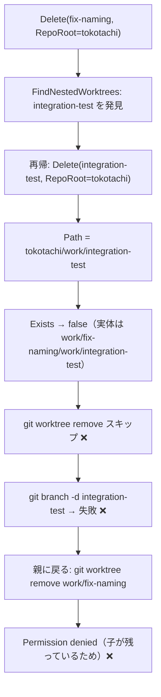
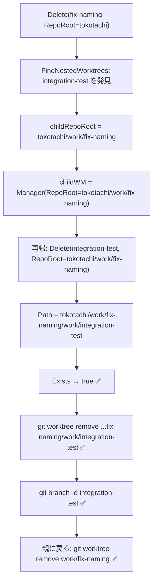

# ネストworktreeの再帰削除バグ修正

## 背景 (Background)

### 現在の動作

`tt close` / `tt delete` コマンドでワークツリーを削除する際、ネストされた子worktreeが検出されると再帰的に削除を試みる（[000-NestedWorktree-Deletion.md](file://prompts/phases/000-foundation/ideas/fix-nested-worktree-deletion/000-NestedWorktree-Deletion.md) で定義済みの機能）。

### 問題

再帰削除が実行されても、**子worktreeが実際には削除されない**。`tt close fix-naming` を実行した際のログ:

```
[INFO] Detected 1 nested worktree(s) under fix-naming: [integration-test]
[INFO] Recursively deleting nested worktree: integration-test
[INFO] Deleting branch integration-test...
[INFO] [CMD] git branch -d integration-test
error: Cannot delete branch 'integration-test' checked out at '.../work/fix-naming/work/integration-test'
```

**症状**:
- `git worktree remove` が実行されない（ブランチ削除だけが試みられる）
- worktreeが残っているためブランチ削除も失敗する
- 親 `fix-naming` の削除時にも `Permission denied` で失敗する

### 根本原因

[delete.go](file://features/tt/internal/action/delete.go) のPhase 3（94-111行目）で再帰呼び出しを行う際、`childOpts.RepoRoot` が**親と同じ値**のまま渡されている。また、子worktree用の `worktree.Manager` も親と同じインスタンスが使い回されている。

```go
// delete.go 98-107行目（問題箇所）
childOpts := DeleteOptions{
    Branch:      childBranch,
    Force:       opts.Force,
    RepoRoot:    opts.RepoRoot,      // ← 親のRepoRootのまま
    ProjectName: opts.ProjectName,
    Depth:       opts.Depth - 1,
    Yes:         true,
    Stdin:       nil,
}
if err := r.Delete(childOpts, wm); err != nil {  // ← wmも同じインスタンス
```

`Manager.Path()` は `<RepoRoot>/work/<branch>` としてパスを解決するため、`RepoRoot` が親のままだと子worktreeのパスが誤って解決される:

| | 期待するパス | 実際に参照されるパス |
|---|---|---|
| `integration-test` | `.../work/fix-naming/work/integration-test` | `.../work/integration-test` |

`Exists()` が `false` を返すため、Phase 4 の `git worktree remove` がスキップされ、ブランチ削除だけが実行される。

### 処理フロー図（現在のバグ動作）



## 要件 (Requirements)

### 必須要件

1. **R1: 再帰呼び出し時の `RepoRoot` 更新**
   - `Delete()` の再帰呼び出し時に、`childOpts.RepoRoot` を親worktreeのパス（`wm.Path(opts.Branch)`）に設定する
   - これにより、子の `Manager.Path()` が正しいパスを返すようになる

2. **R2: 子worktree用 `Manager` の新規作成**
   - 再帰呼び出し時に、新しい `worktree.Manager` を子の `RepoRoot` で作成して渡す
   - `worktree.Manager` の `CmdRunner` と `RepoRoot` は公開フィールドのため、`&worktree.Manager{CmdRunner: wm.CmdRunner, RepoRoot: childRepoRoot}` で作成可能

3. **R3: 既存テストの修正**
   - 既存テスト `TestDelete_WithNestedWorktrees_DeletesChildrenFirst` はこのバグを検出できていない
   - 子worktreeの `worktree remove` が正しいパス（子 `RepoRoot` ベース）で呼ばれていることを検証するテストを追加する

4. **R4: 後方互換性の維持**
   - ネストworktreeが存在しないケースの動作に影響を与えないこと
   - `Force`, `Depth`, `Yes` 等の既存オプションの動作を維持すること

## 実現方針 (Implementation Approach)

### 修正対象ファイル

| ファイル | 変更内容 |
|---------|---------|
| [delete.go](file://features/tt/internal/action/delete.go) | Phase 3 の再帰呼び出し部分で `RepoRoot` と `Manager` を更新 |
| [delete_test.go](file://features/tt/internal/action/delete_test.go) | 子worktreeが正しいパスで削除されることを検証するテストの追加・修正 |

### コード修正案

```diff
 // Phase 3: Recursively delete nested worktrees (children first)
 if len(nested) > 0 && opts.Depth > 0 {
     for _, childBranch := range nested {
         r.Logger.Info("Recursively deleting nested worktree: %s", childBranch)
+        childRepoRoot := wm.Path(opts.Branch)
         childOpts := DeleteOptions{
             Branch:      childBranch,
             Force:       opts.Force,
-            RepoRoot:    opts.RepoRoot,
+            RepoRoot:    childRepoRoot,
             ProjectName: opts.ProjectName,
             Depth:       opts.Depth - 1,
             Yes:         true,
             Stdin:       nil,
         }
-        if err := r.Delete(childOpts, wm); err != nil {
+        childWM := &worktree.Manager{
+            CmdRunner: wm.CmdRunner,
+            RepoRoot:  childRepoRoot,
+        }
+        if err := r.Delete(childOpts, childWM); err != nil {
             r.Logger.Warn("Failed to delete nested worktree %s: %v", childBranch, err)
         }
     }
 }
```

### 修正後のフロー



## 検証シナリオ (Verification Scenarios)

### シナリオ 1: ネストworktreeの再帰削除が正しいパスで実行される

1. `RepoRoot` = `/tmp/test-repo` とする
2. 親worktree `parent-branch` を `work/parent-branch/` に作成する（`.git` ファイルあり）
3. 子worktree `child-branch` を `work/parent-branch/work/child-branch/` に作成する（`.git` ファイルあり）
4. `Delete(branch="parent-branch", RepoRoot="/tmp/test-repo", Depth=10, Yes=true)` を実行する
5. **期待結果**:
   - 子worktreeの `worktree remove` コマンドに渡されるパスが `/tmp/test-repo/work/parent-branch/work/child-branch` である
   - 親worktreeの `worktree remove` コマンドに渡されるパスが `/tmp/test-repo/work/parent-branch` である
   - `worktree remove` の順序は子が先、親が後である

### シナリオ 2: ネストworktreeがない場合の後方互換

1. ネストworktreeが存在しない通常のworktreeを削除する
2. **期待結果**: 既存の動作と同一（`worktree remove` + `branch -d` + state削除）

## テスト項目 (Testing for the Requirements)

### 自動テスト

| 要件 | テスト内容 | 検証コマンド |
|------|----------|------------|
| R1, R2 | `delete_test.go`: 子worktreeの `worktree remove` に渡されるパスが `<parentDir>/work/<child>` であることを確認 | `scripts/process/build.sh` |
| R1, R2 | `delete_test.go`: 親worktreeの `worktree remove` に渡されるパスが `<RepoRoot>/work/<parent>` であることを確認 | `scripts/process/build.sh` |
| R4 | `delete_test.go`: 既存テスト群（`TestDelete_RemovesWorktreeAndBranch` 等）がすべてパスすること | `scripts/process/build.sh` |

### 検証コマンド

```bash
# 単体テスト + ビルド
scripts/process/build.sh
```
