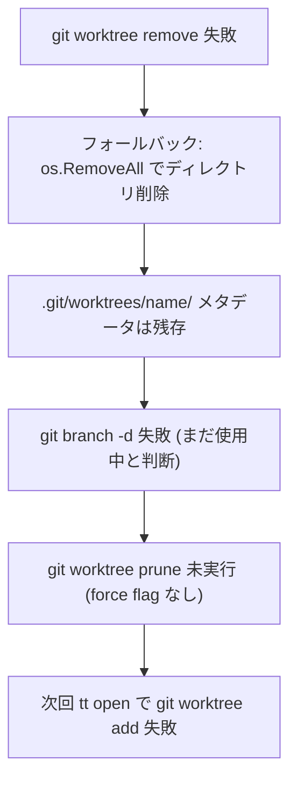

# 000: tt close の Worktree 削除失敗バグの修正

## 背景 (Background)

`tt open` で作成した worktree を `tt close` で削除しようとすると、`git worktree remove` が失敗し、以下のゴミが残る問題が発生している。

- `.git/worktrees/<name>/` のメタデータが残存する
- ブランチが削除できない (`git branch -d` が「ブランチは worktree で使用中」と判断)
- 次回 `tt open` で同じブランチ名を使おうとすると `git worktree add` が失敗する

### 発生する2つの失敗パターン

**パターンA: サブモジュール問題**

```
fatal: working trees containing submodules cannot be moved or removed
```

リポジトリに `.gitmodules` が定義されており、worktree 内で `git submodule init/update` が実行されると、`.git/worktrees/<name>/modules/` にサブモジュールメタデータが作成される。Git はサブモジュールを含む worktree の `git worktree remove` を拒否する。

**パターンB: ファイルロック問題 (Windows)**

```
error: failed to delete '.git/worktrees/fix-close': Invalid argument
```

エディタ (Antigravity IDE 等) が worktree 内のファイルをロックしている状態で `tt close` を実行すると、Git がメタデータディレクトリを削除できず `Invalid argument` エラーとなる。

### 連鎖障害の構造



### 関連コード

| ファイル | 役割 |
|----------|------|
| `pkg/worktree/worktree.go` | `Remove`, `Prune`, `Create` メソッド |
| `pkg/action/delete.go` | `Delete` アクション (Phase 4 でworktree/branch削除) |
| `pkg/action/close.go` | `Close` アクション (Delete への委譲) |

---

## 要件 (Requirements)

### 必須要件

#### R1: サブモジュールの事前解除

`worktree.Remove()` で `git worktree remove` を実行する前に、ワークツリー内にサブモジュールが存在するか検出し、存在する場合は `git submodule deinit --all -f` をワークツリーディレクトリ内で実行してサブモジュールを解除する。これにより、パターンA の根本原因を解消する。

#### R2: フォールバック削除時の worktree prune 実行

`delete.go` の Phase 4 で `git worktree remove` が失敗し、`os.RemoveAll` でフォールバック削除を行った場合、**force フラグの有無に関係なく** `git worktree prune` を実行する。これにより `.git/worktrees/<name>/` のメタデータが確実にクリーンアップされ、後続の `git branch -d` も成功するようになる。

#### R3: Remove メソッド内でのリトライロジック

`worktree.Remove()` で `git worktree remove` が失敗した場合、以下のリトライを試みる:

1. サブモジュールエラーの場合: `git submodule deinit --all -f` を実行してからリトライ
2. それ以外のエラーの場合: 一定時間待機 (500ms) してからリトライ (Windows のファイルロック対策)
3. リトライも失敗した場合: エラーを返す (呼び出し元のフォールバック削除に委ねる)

#### R4: Delete アクションの処理順序改善

`delete.go` の Phase 4 の処理順序を以下のように改善する:

```
(1) git worktree remove 実行
(2) 失敗時: os.RemoveAll + git worktree prune (force flag 不問)
(3) git branch -d (prune 後なのでメタデータは解消済み)
(4) state ファイル削除
```

現在の `effectiveForce` のみで prune を制御する条件を、「worktree remove のフォールバック削除が発生した場合は常に prune を呼ぶ」に変更する。ただし、`effectiveForce` が true の場合の既存の prune 呼び出しもそのまま維持する (二重実行しても害はない)。

#### R5: Create メソッドの堅牢性向上

`worktree.Create()` で `git worktree add` を試みる前に、ゴーストディレクトリだけでなく `.git/worktrees/<name>/` の stale メタデータも検出し、`git worktree prune` を実行してから worktree を作成する。これにより、過去の close 失敗によるゴミが残っていても open が成功するようになる。

### 任意要件

#### R6: リトライ回数・待機時間の設定

リトライの回数 (デフォルト: 1回) と待機時間 (デフォルト: 500ms) は定数として定義し、将来的に設定可能にする余地を残す。

---

## 実現方針 (Implementation Approach)

### 変更対象ファイル

#### 1. `pkg/worktree/worktree.go`

**`Remove` メソッドの改修:**

```go
func (m *Manager) Remove(branch string, force bool) error {
    wtPath := m.Path(branch)
    gitCmd := cmdexec.ResolveCommand("TT_CMD_GIT", "git")

    // Step 1: Deinit submodules if present
    m.deinitSubmodules(wtPath)

    // Step 2: Try git worktree remove
    args := []string{"worktree", "remove", wtPath}
    if force {
        args = []string{"worktree", "remove", "-f", wtPath}
    }

    _, err := m.CmdRunner.RunWithOpts(cmdexec.ToleratedOpt(), gitCmd, args...)
    if err != nil {
        // Step 3: Retry after short delay (for Windows file lock)
        time.Sleep(retryDelay)
        _, err = m.CmdRunner.RunWithOpts(cmdexec.ToleratedOpt(), gitCmd, args...)
    }

    if err != nil {
        return fmt.Errorf("git worktree remove failed: %w", err)
    }

    // Post-cleanup: remove remaining directory
    if _, statErr := os.Stat(wtPath); statErr == nil {
        os.RemoveAll(wtPath)
    }
    return nil
}
```

**新規メソッド `deinitSubmodules`:**

ワークツリーディレクトリ内に `.gitmodules` ファイルが存在するかチェックし、存在する場合は `git -C <wtPath> submodule deinit --all -f` を実行する。失敗しても WARN ログを出すだけで処理は継続する。

**新規メソッド `PruneIfStale`:**

指定ブランチの worktree メタデータが stale (ディレクトリは存在しないがメタデータが残っている) かを検出し、stale であれば `git worktree prune` を実行する。`Create` メソッドから呼び出す。

**`Create` メソッドの改修:**

ゴーストディレクトリのクリーンアップに加え、`git worktree prune` を事前に呼び出して stale メタデータを除去する。

#### 2. `pkg/action/delete.go`

**Phase 4 の改修:**

```go
// Phase 4: Remove worktree, branch, and state file
needsPrune := false
if wm.Exists(opts.Branch) {
    r.Logger.Info("Removing worktree work/%s...", opts.Branch)
    if err := wm.Remove(opts.Branch, effectiveForce); err != nil {
        r.Logger.Warn("Worktree remove failed: %v", err)
        // Fallback: remove directory directly
        wtPath := wm.Path(opts.Branch)
        if removeErr := os.RemoveAll(wtPath); removeErr != nil {
            r.Logger.Warn("Directory cleanup also failed: %v", removeErr)
        } else {
            r.Logger.Info("Cleaned up worktree directory directly")
            needsPrune = true  // NEW: must prune after manual removal
        }
    }
}

// Prune stale metadata: always after fallback, or when force flag is set
if needsPrune || effectiveForce {
    r.Logger.Info("Pruning stale worktree metadata...")
    if err := wm.Prune(); err != nil {
        r.Logger.Warn("Worktree prune failed: %v", err)
    }
}

// Branch delete (after prune, so metadata is cleared)
r.Logger.Info("Deleting branch %s...", opts.Branch)
if err := wm.DeleteBranch(opts.Branch, effectiveForce); err != nil {
    r.Logger.Warn("Branch delete failed: %v", err)
}
```

重要な変更点:
- `needsPrune` フラグで、フォールバック削除が発生した場合は force に関係なく prune を実行
- prune を branch delete の**前**に移動 (現在は後)
- `effectiveForce` 時の prune も維持 (既存動作との互換性)

### エラーメッセージの判定

サブモジュールエラーの検出は、`git worktree remove` のエラーメッセージに `submodule` が含まれるかで判定する。`Remove` メソッド内での `deinitSubmodules` は事前実行とし、エラーメッセージに基づくリトライは行わない (事前 deinit で十分)。

---

## 検証シナリオ (Verification Scenarios)

### シナリオ1: サブモジュール付き worktree の open-close サイクル

1. `tt open <branch>` で worktree を作成する
2. worktree 内で `git submodule init && git submodule update` を実行しサブモジュールを初期化する
3. `tt close <branch>` を実行する
4. worktree ディレクトリが削除されていることを確認する
5. `.git/worktrees/<branch>/` が存在しないことを確認する
6. `git branch` で当該ブランチが残っていないことを確認する

### シナリオ2: 通常の worktree の open-close サイクル

1. `tt open <branch>` で worktree を作成する
2. `tt close <branch>` を実行する
3. worktree ディレクトリが削除されていることを確認する
4. `.git/worktrees/<branch>/` が存在しないことを確認する
5. `git branch` で当該ブランチが残っていないことを確認する

### シナリオ3: close 失敗後の再 open

1. worktree ディレクトリを手動で削除 (close 失敗をシミュレート)
2. `tt open <branch>` を実行する
3. stale メタデータが自動的にクリーンアップされ、worktree が正常に作成されることを確認する

### シナリオ4: フォールバック削除が発生した場合の prune

1. `git worktree remove` が失敗する状況を作り出す
2. `tt close` がフォールバック削除 (`os.RemoveAll`) を実行する
3. `git worktree prune` が force flag に関係なく実行されることを確認する
4. 後続の `git branch -d` が成功することを確認する

---

## テスト項目 (Testing for the Requirements)

### 単体テスト (Unit Tests)

以下のテストケースを追加・修正する。全て dry-run モードでコマンド記録を検証する。

#### `pkg/worktree/worktree_test.go`

| テスト名 | 検証内容 | 対応要件 |
|----------|----------|----------|
| `TestRemove_DeinitsSubmodulesBeforeRemove` | `.gitmodules` が存在する場合、`git submodule deinit --all -f` が `git worktree remove` の前に記録される | R1 |
| `TestRemove_SkipsDeinitWhenNoSubmodules` | `.gitmodules` が存在しない場合、`submodule deinit` が記録されない | R1 |
| `TestRemove_RetriesOnFailure` | 初回失敗時にリトライコマンドが記録される (dry-run ではリトライを直接テストできないため、リトライ関連のヘルパーメソッドを個別テスト) | R3 |
| `TestCreate_PrunesStaleMetadata` | stale worktree が検出された場合、`git worktree prune` が `git worktree add` の前に記録される | R5 |

#### `pkg/action/delete_test.go`

| テスト名 | 検証内容 | 対応要件 |
|----------|----------|----------|
| `TestDelete_FallbackRemoval_RunsPrune` | `git worktree remove` が失敗し `os.RemoveAll` でフォールバック削除した場合、prune が実行される (effectiveForce=false でも) | R2, R4 |
| `TestDelete_PruneBeforeBranchDelete` | prune が branch delete の前に実行されることを確認 | R4 |

#### `pkg/action/close_test.go`

| テスト名 | 検証内容 | 対応要件 |
|----------|----------|----------|
| `TestClose_FallbackRemoval_RunsPrune` | close 経由で Delete が呼ばれた場合も、フォールバック時に prune が実行される | R2 |

### ビルド・全体検証

1. ビルド + 単体テスト:
   ```
   scripts/process/build.sh --skip-frontend --skip-etc
   ```

2. バックエンド統合テスト (リグレッション確認):
   ```
   scripts/process/integration_test.sh --categories "common"
   ```

   本修正は `pkg/worktree` と `pkg/action` に閉じたバックエンドの変更であり、フロントエンド (GUI) や LLM 関連のテストには影響しない。`common` カテゴリでバックエンド全般のリグレッションを確認する。
