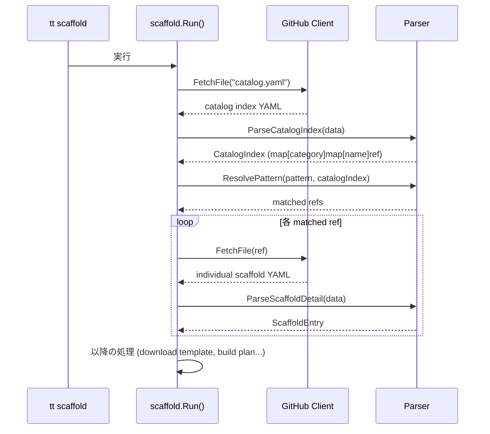

# Scaffold カタログパースエラーの修正

## 背景 (Background)

`tt scaffold --cwd` コマンド実行時に以下のエラーが発生する:

```
Error: failed to parse catalog: yaml: unmarshal errors:
  line 2: cannot unmarshal !!map into []scaffold.ScaffoldEntry
```

### 原因

リモートのテンプレートリポジトリ (`axsh/tokotachi-scaffolds`) の `catalog.yaml` のフォーマットが大幅に変更されたが、`tt` 側のパーサーが旧フォーマットにのみ対応しているため。

### 旧フォーマット (コードが期待する形式)

```yaml
version: "1.0.0"
default_scaffold: "default"
scaffolds:
  - name: "default"
    category: "root"
    description: "Standard project structure"
    template_ref: "templates/project-default"
    placement_ref: "placements/default.yaml"
    requirements:
      directories: []
      files: []
    options:
      - name: "Name"
        description: "Feature name"
        required: true
```

### 新フォーマット (リモートの実際の形式)

**catalog.yaml (インデックス形式)**:
```yaml
scaffolds:
    feature:
        axsh-go-kotoshiro-mcp: catalog/scaffolds/i/4/2/h.yaml
        axsh-go-standard: catalog/scaffolds/b/i/b/l.yaml
    project:
        axsh-go-standard: catalog/scaffolds/8/w/4/o.yaml
    root:
        default: catalog/scaffolds/6/j/v/n.yaml
```

**個別 scaffold YAML (例: `catalog/scaffolds/6/j/v/n.yaml`)**:
```yaml
scaffolds:
    - name: default
      category: root
      description: Tokotachi - The First of All
      template_ref: catalog/scaffolds/6/j/v/project-default.zip
      original_ref: catalog/originals/root/project-default
```

**個別 scaffold YAML (例: `catalog/scaffolds/b/i/b/l.yaml`)**:
```yaml
scaffolds:
    - name: axsh-go-standard
      category: feature
      description: AXSH Go Standard Feature
      depends_on:
        - category: project
          name: axsh-go-standard
      template_ref: catalog/scaffolds/b/i/b/go-standard-feature.zip
      original_ref: catalog/originals/axsh/go-standard-feature
      template_params:
        - name: module_path
          description: Go module path
          required: true
          default: github.com/axsh/tokotachi/features/myprog
          old_value: ""
        - name: program_name
          description: Program name
          required: true
          default: myprog
          old_value: ""
```

### フォーマット変更の差分まとめ

| 項目 | 旧 | 新 |
|---|---|---|
| `catalog.yaml` の `scaffolds` | `[]ScaffoldEntry` (リスト) | `map[category]map[name]ref` (2段マップ) |
| `version` フィールド | あり | なし (catalog.yaml レベル) |
| `default_scaffold` フィールド | あり | なし |
| テンプレート配信方式 | ディレクトリ (`FetchDirectory`) | ZIP ファイル (`template_ref` が `.zip` を指す) |
| placement 定義 | `placement_ref` で個別ファイル指定 | 廃止 (ZIP内に含まれると推測) |
| オプション定義 | `options` | `template_params` |
| オプション新フィールド | なし | `old_value` |
| 依存関係 | なし | `depends_on` が新設 |
| 元テンプレートの参照 | なし | `original_ref` が新設 |

## 要件 (Requirements)

### 必須要件

1. **カタログパーサーの新フォーマット対応**: `ParseCatalog` 関数が新しいインデックス形式の `catalog.yaml` を正しくパースできること
2. **個別 scaffold YAML の読み込み**: カタログインデックスから個別 YAML ファイルを参照・読み込みし、`ScaffoldEntry` 相当の情報を取得できること
3. **`ScaffoldEntry` 型の更新**: 新フィールド (`depends_on`, `template_params`, `original_ref`) に対応すること
4. **テンプレートの ZIP 対応**: `template_ref` が `.zip` を指す場合に ZIP をダウンロード・展開してテンプレートファイルとして扱えること
5. **デフォルト scaffold の解決**: `default_scaffold` フィールドがなくなったため、デフォルトの解決ロジックを更新すること (例: `root/default` をデフォルトとする)
6. **`--list` の動作**: `scaffold --list` が新フォーマットに対応して全テンプレートを一覧表示できること
7. **既存の `--cwd`, `--yes`, `--lang` フラグが引き続き正しく動作すること**

### 任意要件

- `depends_on` による依存関係チェック (将来のフェーズで実装可能)
- `original_ref` の活用 (現時点では保持するのみ)

## 実現方針 (Implementation Approach)

### 1. カタログパーサーの2段階読み込み



#### 変更対象ファイル

- `catalog.go`: `CatalogIndex` 新型追加、`ParseCatalogIndex` 新関数、`ResolvePattern` ロジック更新
- `scaffold.go`: `Run` / `List` 関数を新しいフローに対応
- `downloader.go` または `github.go`: ZIP ダウンロード・展開機能の追加

### 2. `ScaffoldEntry` 型の拡張

```go
type ScaffoldEntry struct {
    Name           string       `yaml:"name"`
    Category       string       `yaml:"category"`
    Description    string       `yaml:"description"`
    TemplateRef    string       `yaml:"template_ref"`
    OriginalRef    string       `yaml:"original_ref"`
    DependsOn      []Dependency `yaml:"depends_on"`
    TemplateParams []Option     `yaml:"template_params"`
    // 後方互換のため残すフィールド
    PlacementRef   string       `yaml:"placement_ref"`
    Requirements   Requirements `yaml:"requirements"`
    Options        []Option     `yaml:"options"`
}

type Dependency struct {
    Category string `yaml:"category"`
    Name     string `yaml:"name"`
}
```

### 3. ZIP テンプレートの処理

- `template_ref` が `.zip` で終わる場合、GitHub API で ZIP ファイルをダウンロード
- メモリ上で展開して `[]DownloadedFile` に変換
- placement 定義が ZIP 内に含まれている場合はそれを使用、なければファイルの相対パスをそのまま利用

### 4. デフォルト scaffold の解決

- `default_scaffold` フィールドが存在しないため、`category: root`, `name: default` のエントリをデフォルトとするロジックに変更
- または、`catalog.yaml` のインデックスから `root/default` を検索

## 検証シナリオ (Verification Scenarios)

### シナリオ 1: 基本的な scaffold 実行

1. 一時ディレクトリで Git リポジトリを初期化
2. `tt scaffold --cwd --yes` を実行
3. エラーなく完了し、期待されるディレクトリ構造が作成されること

### シナリオ 2: `--list` オプション

1. `tt scaffold --list` を実行
2. 全テンプレート (default, axsh-go-standard 等) が一覧表示されること

### シナリオ 3: ロケール指定

1. `tt scaffold --cwd --yes --lang ja` を実行
2. 日本語のREADMEが適用されること (ZIPのロケール対応がある場合)

### シナリオ 4: `--cwd` フラグ

1. Git リポジトリでないディレクトリで `tt scaffold --cwd --yes` を実行
2. カレントディレクトリにテンプレートが展開されること

## テスト項目 (Testing for the Requirements)

### 単体テスト

対象: `features/tt/internal/scaffold/catalog_test.go`

| 要件 | テストケース |
|---|---|
| 新カタログインデックスのパース | `TestParseCatalogIndex` — 新形式YAML の正常パース |
| 個別 scaffold YAML のパース | `TestParseScaffoldDetail` — 個別YAMLからScaffoldEntry への変換 |
| パターン解決 (デフォルト) | `TestResolvePattern_Default` — root/default が選ばれること |
| パターン解決 (名前指定) | `TestResolvePattern_ByName` — 名前で一致 |
| パターン解決 (カテゴリ) | `TestResolvePattern_ByCategory` — カテゴリでフィルタ |
| ZIP 展開 | ZIP バイト列から `[]DownloadedFile` への変換テスト |

検証コマンド:
```bash
./scripts/process/build.sh
```

### 統合テスト

対象: `tests/integration-test/tt_scaffold_test.go`

既存テスト4件すべてが新フォーマット対応後もパスすること:

| テスト | 検証内容 |
|---|---|
| `TestScaffoldDefault` | デフォルトテンプレートの適用、ディレクトリ構造、冪等性 |
| `TestScaffoldList` | `--list` による一覧表示 |
| `TestScaffoldDefaultLocaleJa` | 日本語ロケール対応 |
| `TestScaffoldCwdFlag` | `--cwd` フラグの動作 |

検証コマンド:
```bash
./scripts/process/build.sh
./scripts/process/integration_test.sh --specify TestScaffold
```

> [!IMPORTANT]
> 統合テストはリモートリポジトリへのネットワークアクセスが必要です。
> テスト期待値（ファイルパス、コンテンツ）は新フォーマットに合わせて更新が必要になる可能性があります。
