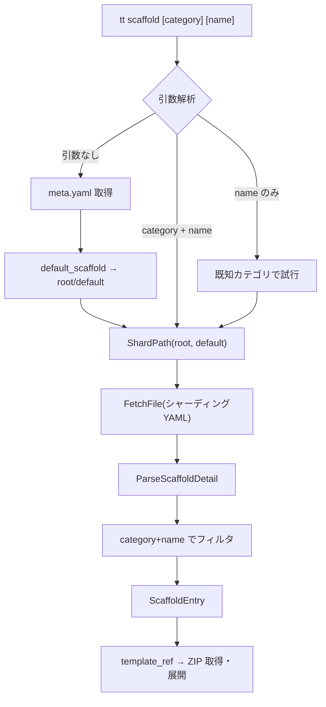

# 001-Remove-CatalogYaml-Dependency

## 背景 (Background)

先行タスク [000-Fix-Scaffold-CatalogParsing](file://prompts/phases/000-foundation/ideas/fix-scaffolds/000-Fix-Scaffold-CatalogParsing.md) で `catalog.yaml` の新フォーマット（インデックス形式）に対応したが、実はリモートリポジトリの仕様上、`catalog.yaml` のダウンロード自体が不要である。

[リモート仕様書 (001-HowToExtract.md)](https://raw.githubusercontent.com/axsh/tokotachi-scaffolds/refs/heads/main/prompts/specifications/001-HowToExtract.md) では、scaffold の取得方法として2方式が定義されている:

| 方式 | 説明 | API回数 |
|---|---|---|
| **方式A（推奨）** | `category` + `name` からハッシュ計算でシャーディングパスを直接算出 | 最小2回 |
| **方式B（フォールバック）** | `catalog.yaml` をダウンロードしてパスを検索 | 4回 |

本プログラム（`tt scaffold`）は方式A のアルゴリズムを実装可能であるため、`catalog.yaml` は不要。API コール数も削減できる。

### 現在のフロー（方式B ベース）

```
catalog.yaml → ParseCatalogIndex → ResolveFromIndex → FetchFile(ref) → ParseScaffoldDetail → ZIP
```

### 新しいフロー（方式A）

```
category + name からハッシュ算出 → FetchFile(シャーディングYAML) → scaffolds から特定 → ZIP
（引数なし → 定数 root/default を使用）
```

## 要件 (Requirements)

### 必須要件

1. **シャーディングパス算出アルゴリズムの実装**
   - FNV-1a 32bit ハッシュ → `% 1679616 (36^4)` → base36 4文字エンコード
   - パス: `catalog/scaffolds/{c0}/{c1}/{c2}/{c3}.yaml`
   - 入力: `key = category + "/" + name`
   - アルゴリズムの詳細:
     ```
     offset_basis = 2166136261
     prime = 16777619
     
     hash = offset_basis
     for byte in key:
         hash = hash XOR byte
         hash = hash * prime
         hash = hash & 0xFFFFFFFF  (32bit mask)
     
     reduced = hash % 1679616
     encoded = base36_4chars(reduced)  // 0-padded
     ```
   - 計算例:
     | category | name | path |
     |---|---|---|
     | `root` | `default` | `catalog/scaffolds/6/j/v/n.yaml` |
     | `feature` | `axsh-go-standard` | `catalog/scaffolds/b/i/b/l.yaml` |

2. **デフォルト scaffold の定数定義**
   - 引数なしの場合は定数 `DefaultCategory = "root"`, `DefaultName = "default"` を使用
   - `meta.yaml` の取得は不要（デフォルト値はハードコード）

3. **引数パターンごとの解決ロジック**

   引数は位置引数で `[category] [name]` の順。`<name>` のみのパターンは存在しない。

   | 入力 | 挙動 |
   |---|---|
   | `<category> <name>` | ハッシュ計算で直接取得（方式A） |
   | `<category>` のみ | `--list` フラグ付きの場合のみ有効 → `catalog.yaml` (キャッシュ付き) でカテゴリ内一覧を表示。`--list` なしの場合は `<name>` 未指定エラーを返す |
   | 引数なし | 定数 `DefaultCategory`/`DefaultName` (`root`/`default`) を使用してハッシュ計算で直接取得（方式A） |

   > **決定事項**:
   > - カテゴリリストは `var KnownCategories = []string{"root", "project", "feature"}` として定数定義
   > - デフォルトは `const DefaultCategory = "root"`, `const DefaultName = "default"` として定数定義

4. **シャーディングファイルからのエントリ特定**
   - シャーディングファイルはハッシュ衝突時に複数エントリを含む配列形式
   - `category` + `name` でフィルタして目的のエントリを取得する必要がある

5. **`catalog.yaml` フェッチの廃止**
   - 現在の `fetchAndResolveEntry` から `catalog.yaml` 関連処理を削除
   - `ParseCatalogIndex`, `ResolveFromIndex` は単体テスト用に残すが、`Run`/`Apply`/`List` からの呼び出しを削除

6. **`--list` の動作**
   - 全テンプレート一覧には `catalog.yaml` が必要
   - `--list` および `<category>` のみ指定時はフォールバックとして `catalog.yaml` を使用する

7. **`catalog.yaml` のキャッシュ機能**
   - `meta.yaml` の `updated_at` を利用して `catalog.yaml` のキャッシュ有効性を判定
   - キャッシュファイルの配置場所: `.git` があるディレクトリをルートとし、`.kotoshiro/tokotachi/.cache/catalog.yaml` に保存
   - `.kotoshiro/tokotachi/.cache/` ディレクトリは `.gitignore` に追加する（コミット対象外）
   - キャッシュファイル構造:
     ```yaml
     updated_at: "2026-03-10T19:00:00+09:00"  # meta.yaml の updated_at を記録
     catalog: ...  # catalog.yaml の内容
     ```
   - ロジック:
     1. `meta.yaml` を取得し `updated_at` を確認
     2. ローカルキャッシュの `updated_at` と比較
     3. 一致 → キャッシュから `catalog` を使用
     4. 不一致 or キャッシュなし → `catalog.yaml` をダウンロードしキャッシュを更新

8. **`.gitignore` 操作の共通ユーティリティ化**
   - 現在 `applier.go` 内の `applyGitignoreEntries` は単純な文字列マッチングで重複チェックを行っているが、`.gitignore` のシンタックス（コメント行、空行、ネゲーションパターン等）を考慮していない
   - 共通ユーティリティを作成し、scaffold およびキャッシュ機能の両方から使用する
   - 機能要件:
     - **エントリの追加**: 重複チェック付きでエントリを追加
     - **エントリの削除**: 指定パターンを削除
     - **シンタックス解析**: コメント行 (`#`)、空行、末尾のスペースを正しく処理
     - **ファイルの作成**: `.gitignore` が存在しない場合は新規作成
   - 配置先: `features/tt/internal/gitutil/` または `features/tt/internal/scaffold/` 内

### 任意要件

- `meta.yaml` の `updated_at` を利用したシャーディングYAMLやZIPのキャッシュ（今回のスコープ外）

## 実現方針 (Implementation Approach)

### 主要コンポーネント

1. **`shard.go` (新規)**: FNV-1a ハッシュ + base36 + パス算出、`KnownCategories`/`DefaultCategory`/`DefaultName` 定数定義
2. **`shard_test.go` (新規)**: 計算例に基づく検証テスト
3. **`cache.go` (新規)**: `catalog.yaml` のキャッシュ管理（`.kotoshiro/tokotachi/.cache/catalog.yaml`）
4. **`cache_test.go` (新規)**: キャッシュ読み書きテスト
5. **`gitignore.go` (新規)**: `.gitignore` 操作ユーティリティ（シンタックス解析付きの追加・削除）
6. **`gitignore_test.go` (新規)**: gitignore ユーティリティのテスト
7. **`scaffold.go` (変更)**: `fetchAndResolveEntry` を方式A に書き換え、`--list`/category指定時のフォールバック
8. **`applier.go` (変更)**: `applyGitignoreEntries` を新しい `gitignore.go` ユーティリティに置き換え
9. **`catalog.go` (変更なし)**: `ParseCatalogIndex` 等は `--list`/フォールバックで引き続き使用

### フロー図



## 検証シナリオ (Verification Scenarios)

1. **引数なし**: `tt scaffold --yes` → `meta.yaml` を取得し、root/default テンプレートが適用される
2. **category + name**: `tt scaffold feature axsh-go-standard --yes` → 該当テンプレートが適用される
3. **name のみ**: `tt scaffold axsh-go-standard --yes` → 自動的にカテゴリを特定して適用
4. **`--list`**: `tt scaffold --list` → 全テンプレート一覧が表示される
5. **`--cwd`**: `tt scaffold --cwd --yes` → CWDモードでも正常動作
6. **ハッシュ計算の精度**: `ShardPath("root", "default")` → `"catalog/scaffolds/6/j/v/n.yaml"` と一致

## テスト項目 (Testing for the Requirements)

### 単体テスト

| テストケース | 検証内容 |
|---|---|
| `TestShardPath_RootDefault` | `root/default` → `catalog/scaffolds/6/j/v/n.yaml` |
| `TestShardPath_FeatureGoStandard` | `feature/axsh-go-standard` → `catalog/scaffolds/b/i/b/l.yaml` |
| `TestShardPath_ProjectGoStandard` | `project/axsh-go-standard` → `catalog/scaffolds/8/w/4/o.yaml` |
| `TestShardPath_FeatureKotoshiroMcp` | `feature/axsh-go-kotoshiro-mcp` → `catalog/scaffolds/i/4/2/h.yaml` |

```bash
./scripts/process/build.sh
```

### 統合テスト

| テストケース | 検証内容 |
|---|---|
| `TestScaffoldDefault` | デフォルトテンプレートの適用 |
| `TestScaffoldList` | テンプレート一覧表示 |
| `TestScaffoldDefaultLocaleJa` | 日本語ロケール |
| `TestScaffoldCwdFlag` | CWDフラグの動作 |

```bash
./scripts/process/integration_test.sh --categories "integration-test" --specify "TestScaffold"
```
