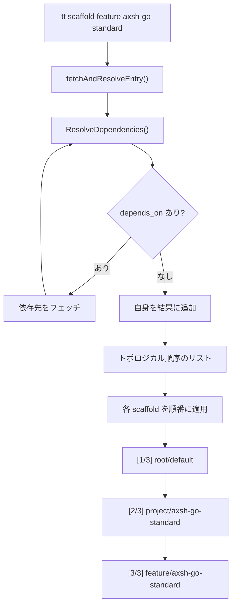

# 002-DependsOn-Resolution

## 背景 (Background)

`tt scaffold` コマンドでは、各 scaffold エントリが `depends_on` フィールドを持ち、他の scaffold への依存関係を宣言できる。しかし現在の実装では `depends_on` はパース・保持のみで、実際の依存解決処理は行われていない（[000-Fix-Scaffold-CatalogParsing](file://prompts/phases/000-foundation/ideas/fix-scaffolds/000-Fix-Scaffold-CatalogParsing.md) にて「将来のフェーズで実装可能」と記載）。

### 現在の依存関係チェーン（リモートリポジトリの実データ）

```
feature/axsh-go-standard
  └─ depends_on: project/axsh-go-standard
       └─ depends_on: root/default
            └─ (依存なし)
```

### 現在の動作

`tt scaffold feature axsh-go-standard` を実行すると、`feature/axsh-go-standard` の ZIP のみがダウンロード・展開される。依存先（`project/axsh-go-standard`、`root/default`）は無視される。

### 期待される動作

依存チェーンを再帰的に解決し、末端（依存なし）から順にすべての scaffold を適用する:

1. `root/default` の ZIP をダウンロード・展開
2. `project/axsh-go-standard` の ZIP をダウンロード・展開
3. `feature/axsh-go-standard` の ZIP をダウンロード・展開

## 要件 (Requirements)

### 必須要件

1. **依存チェーンの再帰的解決**
   - `ScaffoldEntry` の `depends_on` フィールドを読み取り、各依存先の scaffold エントリを再帰的に取得する
   - 取得方式は既存の方式A（シャーディングパス算出）を使用する
   - 再帰の終端条件: `depends_on` が空または `nil`

2. **トポロジカル順序での適用**
   - 依存チェーンの末端（依存なし）から順に適用する
   - 例: `root/default → project/axsh-go-standard → feature/axsh-go-standard`

3. **循環依存の検出**
   - 依存チェーンに循環がある場合、エラーを返す
   - 例: A → B → A のような循環

4. **重複の排除**
   - 同一の scaffold が複数の依存パスから参照されている場合、1回だけ適用する

5. **ユーザーへの表示**
   - 依存解決の結果（どの scaffold がどの順序で適用されるか）をユーザーに表示する
   - 各 scaffold の適用前に進捗を表示する（例: `[1/3] Applying root/default...`）

6. **既に適用済みの依存のスキップ**
   - 依存先 scaffold の `placement` 設定（`conflict_policy: skip`）に従い、既存ファイルがあればスキップする
   - 依存先の `requirements` チェックは行わない（依存チェーンの上位で充足されるため）

7. **オプション値の収集**
   - `template_params` を持つ scaffold については、それぞれ個別にオプション値を収集する
   - 依存先 scaffold のオプションについてもインタラクティブ入力 or `--default` / `--v` フラグを適用する
   - 各 scaffold のオプション入力時にはどの scaffold のオプションかを表示する

### 任意要件

- `--skip-deps` フラグ: 依存解決をスキップして直接指定された scaffold のみ適用（デバッグ・テスト用途）

## 実現方針 (Implementation Approach)

### 主要コンポーネント

1. **`dependency.go` (新規)**: 依存解決ロジック
   - `ResolveDependencies(downloader, entry) → []ScaffoldEntry`: 再帰的に依存チェーンを解決し、トポロジカル順序で返す
   - 循環依存検出（visited マップ）
   - 重複排除

2. **`dependency_test.go` (新規)**: 依存解決のテスト
   - 循環依存の検出テスト
   - チェーン解決テスト
   - 重複排除テスト

3. **`scaffold.go` (変更)**: `Run` 関数を拡張
   - 単一 scaffold 適用 → 依存チェーン全体の適用に変更
   - 各 scaffold ごとに ZIP ダウンロード・展開・適用を実行

### 依存解決アルゴリズム

```go
func ResolveDependencies(downloader *github.Client, entry *ScaffoldEntry, visited map[string]bool) ([]ScaffoldEntry, error) {
    key := entry.Category + "/" + entry.Name
    if visited[key] {
        return nil, fmt.Errorf("circular dependency detected: %s", key)
    }
    visited[key] = true

    var result []ScaffoldEntry

    // 先に依存先を再帰解決
    for _, dep := range entry.DependsOn {
        depEntry, err := fetchEntry(downloader, dep.Category, dep.Name)
        if err != nil {
            return nil, err
        }
        subDeps, err := ResolveDependencies(downloader, depEntry, visited)
        if err != nil {
            return nil, err
        }
        result = append(result, subDeps...)
    }

    // 自分自身を末尾に追加
    result = append(result, *entry)
    return dedup(result), nil
}
```

### フロー図



### 実行フロー（変更後）

```
tt scaffold feature axsh-go-standard --yes
     │
     ├─ 1. fetchAndResolveEntry: feature/axsh-go-standard のエントリを取得
     │
     ├─ 2. ResolveDependencies: 依存チェーンを再帰的に解決
     │      └─ [root/default, project/axsh-go-standard, feature/axsh-go-standard]
     │
     ├─ 3. 各 scaffold について順番に:
     │      ├─ [1/3] root/default
     │      │    ├─ ZIP ダウンロード・展開
     │      │    ├─ (template_params なし)
     │      │    ├─ 実行計画作成
     │      │    └─ ファイル適用
     │      ├─ [2/3] project/axsh-go-standard
     │      │    ├─ ZIP ダウンロード・展開
     │      │    ├─ (template_params なし)
     │      │    ├─ 実行計画作成
     │      │    └─ ファイル適用
     │      └─ [3/3] feature/axsh-go-standard
     │           ├─ ZIP ダウンロード・展開
     │           ├─ オプション入力 (module_path, program_name)
     │           ├─ 実行計画作成
     │           └─ ファイル適用
     │
     └─ 完了
```

## 検証シナリオ (Verification Scenarios)

### シナリオ 1: 依存チェーンの完全な適用

1. 一時ディレクトリで Git リポジトリを初期化
2. `tt scaffold feature axsh-go-standard --cwd --yes --default` を実行
3. 以下が順番に適用されることを確認:
   - (1) `root/default` のファイル群（プロジェクト基盤ファイル）
   - (2) `project/axsh-go-standard` のファイル群
   - (3) `feature/axsh-go-standard` のファイル群
4. 出力ログに `[1/3]`, `[2/3]`, `[3/3]` の進捗表示があること

### シナリオ 2: 依存なし scaffold の通常動作

1. `tt scaffold root default --cwd --yes` を実行
2. 依存チェーンなしで `root/default` のみが適用されること

### シナリオ 3: 既存ファイルのスキップ

1. `tt scaffold --cwd --yes` を実行（root/default 適用）
2. `tt scaffold feature axsh-go-standard --cwd --yes --default` を実行
3. 依存先 `root/default` のファイルは `conflict_policy: skip` に従い上書きされないこと
4. `project/axsh-go-standard` と `feature/axsh-go-standard` のファイルが正しく追加されること

## テスト項目 (Testing for the Requirements)

### 単体テスト

対象: `features/tt/internal/scaffold/dependency_test.go` (新規)

| テストケース | 検証内容 |
|---|---|
| `TestResolveDependencies_NoDeps` | 依存なし scaffold → 自身のみ返す |
| `TestResolveDependencies_SingleChain` | A → B → C のチェーン → [C, B, A] 順で返す |
| `TestResolveDependencies_CircularDependency` | A → B → A の循環 → エラーを返す |
| `TestResolveDependencies_DiamondDependency` | A → B, A → C, B → D, C → D → D は1回だけ含む |

検証コマンド:
```bash
./scripts/process/build.sh
```

### 統合テスト

対象: `tests/integration-test/tt_scaffold_test.go`

| テストケース | 検証内容 |
|---|---|
| `TestScaffoldWithDependencies` | `feature/axsh-go-standard` の依存チェーン適用 |

検証コマンド:
```bash
./scripts/process/integration_test.sh --categories "integration-test" --specify "TestScaffold"
```

> [!IMPORTANT]
> 統合テストはリモートリポジトリ（`axsh/tokotachi-scaffolds`）へのネットワークアクセスが必要です。
