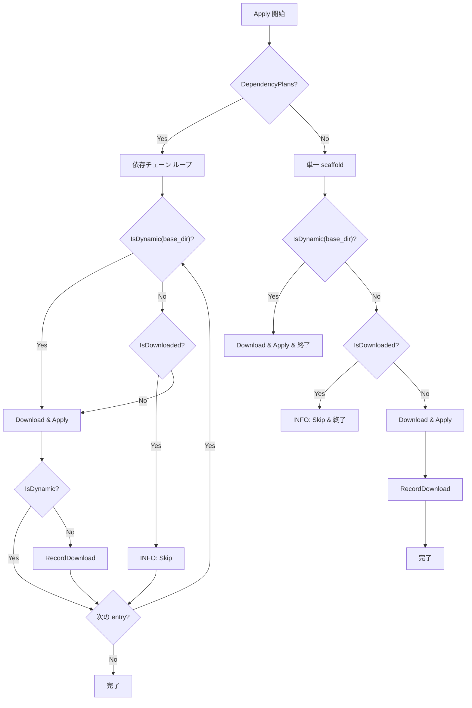

# Scaffold ダウンロード履歴管理

## 背景 (Background)

`depends_on` による依存チェーン解決が実装されたことで、`tt scaffold feature axsh-go-standard` のような実行時に `root/default → project/axsh-go-standard → feature/axsh-go-standard` の3段階が自動的にダウンロード・適用される。

しかし、一度ダウンロード済みの scaffold を再度実行すると、既にファイルが存在する scaffold のダウンロードまで毎回行われる。これは以下の問題を引き起こす：

- **不要なネットワークアクセス**: 既に適用済みの `root/default` や `project/axsh-go-standard` を毎回再ダウンロードする
- **処理時間の増加**: 依存チェーンが深いほど、不要なダウンロードによる待ち時間が増える
- **API レート制限リスク**: GitHub API への不要なリクエストが蓄積する

## 要件 (Requirements)

### 必須要件

1. **ダウンロード履歴ファイル**
   - ファイルパス: `.kotoshiro/tokotachi/downloaded.yaml`
   - scaffold の適用が成功した後に、`category` と `name` をダウンロード日時（UTC）とともに記録する
   - YAML 形式:
     ```yaml
     history:
       "root":
         "default":
           downloaded_at: "2026-03-12T09:00:00Z"
       "project":
         "axsh-go-standard":
           downloaded_at: "2026-03-12T09:00:05Z"
     ```

2. **重複ダウンロードのスキップ**
   - `Apply` フロー（`applyDependencyChain` / `applySingleScaffold`）で、各 scaffold の適用前に `downloaded.yaml` を参照する
   - `history` 内に該当 `category/name` のエントリが存在する場合、そのダウンロードと適用をスキップする
   - スキップ時にはユーザーへ情報メッセージを表示する（例: `[INFO] Skipping root/default (already downloaded)`）

3. **ダウンロード履歴の記録タイミング**
   - 各 scaffold の `ApplyFiles` + `ApplyPostActions` が成功した **後** に記録する
   - 適用中にエラーが発生した scaffold は記録しない（再実行時にリトライされる）

4. **動的 `base_dir` を持つ scaffold の除外**
   - scaffold の `placement.base_dir` に `{{...}}`（テンプレート変数）を含む場合、その scaffold は**履歴に記録しない**
   - 理由: `base_dir` にテンプレート変数を含む scaffold は、ユーザーが異なるパラメータで何度も展開することが意図されている（例: `features/{{feature_name}}`）
   - 判定方法: `strings.Contains(placement.BaseDir, "{{")`
   - この条件に該当する scaffold は、`IsDownloaded` チェックも行わない（常にダウンロード・適用される）

5. **`--force` フラグによる強制再ダウンロード**
   - `--force` フラグを指定した場合、ダウンロード履歴を無視してすべての scaffold を再ダウンロード・再適用する
   - 履歴ファイル自体はリセットせず、適用成功後に通常通り記録を更新する

## 実現方針 (Implementation Approach)

### 新規ファイル: `download_history.go`

`cache.go` と同様のパターンで、`.kotoshiro/tokotachi/downloaded.yaml` を管理する構造体を作成する。

```go
// DownloadHistoryDir is the base directory for history files.
const DownloadHistoryDir = ".kotoshiro/tokotachi"

// DownloadHistoryFileName is the name of the history file.
const DownloadHistoryFileName = "downloaded.yaml"

// DownloadRecord represents a single download record.
type DownloadRecord struct {
    DownloadedAt string `yaml:"downloaded_at"`
}

// DownloadHistory represents the history file structure.
type DownloadHistory struct {
    History map[string]map[string]DownloadRecord `yaml:"history"`
}

// DownloadHistoryStore manages reading/writing of download history.
type DownloadHistoryStore struct {
    repoRoot string
}
```

**主要メソッド:**
- `Load() (*DownloadHistory, error)` — ファイルが存在しない場合は空の `DownloadHistory` を返す
- `Save(history *DownloadHistory) error` — YAML としてファイルに書き込む
- `IsDownloaded(category, name string) bool` — 該当エントリが `history` に存在するか確認
- `RecordDownload(category, name string) error` — 現在日時（UTC）で記録を追加して保存
- `IsDynamic(placement *Placement) bool` — `base_dir` に `{{` を含むか判定

### 既存ファイルの変更: `scaffold.go`

- `applyDependencyChain`: 各 scaffold の適用前に以下のロジックを実行:
  1. `IsDynamic(placement)` → `true` なら常にダウンロード・適用（履歴チェック・記録なし）
  2. `IsDownloaded(category, name)` → `true` ならスキップ
  3. それ以外 → ダウンロード・適用後に `RecordDownload` で記録
- `applySingleScaffold`: 同様のロジック

### フロー図



## 検証シナリオ (Verification Scenarios)

### シナリオ 1: 初回ダウンロードで履歴記録

1. 空のリポジトリで `tt scaffold feature axsh-go-standard --yes --default --v feature_name=test` を実行
2. `root/default`, `project/axsh-go-standard`, `feature/axsh-go-standard` の3つがダウンロード・適用される
3. `.kotoshiro/tokotachi/downloaded.yaml` が作成される
4. `root/default` と `project/axsh-go-standard` は `base_dir` に `{{` を含まないため記録される
5. `feature/axsh-go-standard` は `base_dir: "features/{{feature_name}}"` のため**記録されない**

### シナリオ 2: 再実行で静的 scaffold がスキップ、動的 scaffold は再適用

1. シナリオ1の完了後、同じコマンドを再実行する（パラメータ `feature_name=test2` に変更）
2. `root/default` と `project/axsh-go-standard` はスキップメッセージが表示される
3. `feature/axsh-go-standard` は動的 scaffold のためスキップされず、新パラメータで再ダウンロード・適用される

### シナリオ 3: 新しい scaffold のみダウンロード

1. `root/default` が履歴に存在する状態で、`tt scaffold project axsh-go-standard --yes --default` を実行
2. `root/default` はスキップされ、`project/axsh-go-standard` のみダウンロード・適用される
3. 履歴ファイルに `project/axsh-go-standard` が追加されること

### シナリオ 4: 単一 scaffold（依存なし）の動的 scaffold は常に適用

1. 動的 `base_dir` を持つ scaffold を直接実行
2. 履歴に関わらず常にダウンロード・適用されること

## テスト項目 (Testing for the Requirements)

### 単体テスト (`download_history_test.go`)

| テストケース | 検証内容 |
|---|---|
| `TestLoadHistory_NotFound` | ファイル未存在時に空 `DownloadHistory` が返る |
| `TestSaveAndLoad_Roundtrip` | 保存→読み込みでデータが一致 |
| `TestIsDownloaded_Found` | 既存エントリに対して `true` を返す |
| `TestIsDownloaded_NotFound` | 未存在エントリに対して `false` を返す |
| `TestRecordDownload_NewEntry` | 新規エントリの追加と保存 |
| `TestRecordDownload_ExistingCategory` | 既存カテゴリへの名前追加 |
| `TestIsDynamic_WithTemplate` | `base_dir` に `{{` を含む場合 `true` を返す |
| `TestIsDynamic_WithoutTemplate` | `base_dir` に `{{` を含まない場合 `false` を返す |

### 統合テスト (`tt_scaffold_test.go`)

| テストケース | 検証内容 |
|---|---|
| `TestScaffoldDownloadHistory` | 初回実行で `downloaded.yaml` が作成され、静的 scaffold のみ記録される |
| `TestScaffoldSkipAlreadyDownloaded` | 2回目実行で静的 scaffold がスキップされ、動的 scaffold は再適用される |

### 検証コマンド

```bash
# 単体テスト
./scripts/process/build.sh

# 統合テスト
./scripts/process/integration_test.sh --categories "integration-test" --specify "TestScaffoldDownloadHistory"
./scripts/process/integration_test.sh --categories "integration-test" --specify "TestScaffoldSkipAlreadyDownloaded"
```
