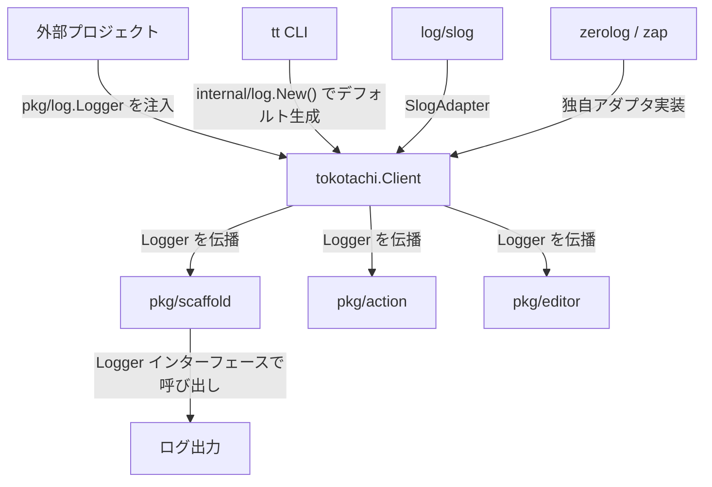

# Logger インターフェース公開設計

## 背景 (Background)

Tokotachi の公開 API パッケージ (`tokotachi.go`) を外部プロジェクトからライブラリとして利用する際、Logger が `internal/log` パッケージに定義された具象 struct 型 (`*log.Logger`) であるため、外部プロジェクトから以下のことができない:

1. **Logger を注入できない** — `internal/` 配下の型は Go の仕様上、外部モジュールから import 不可
2. **出力先やフォーマットをカスタマイズできない** — 外部プロジェクトが独自の Logger (例: `log/slog`, `zerolog`, `zap`) を使っている場合でも、Tokotachi 固有の Logger を使うしかない

### 現状の構造

```
tokotachi.go (外部API)
├── internal/log/logger.go      ← 具象 Logger struct (外部から import 不可)
├── internal/cmdexec/cmdexec.go ← *log.Logger を直接利用
├── pkg/scaffold/scaffold.go   ← RunOptions.Logger が *log.Logger 型
├── pkg/action/runner.go       ← Runner.Logger が *log.Logger 型
└── pkg/editor/editor.go       ← LaunchOptions.Logger が *log.Logger 型
```

`pkg/` （公開パッケージ）が `internal/log` を直接 import しているため、外部プロジェクトが `pkg/scaffold` 等を利用する場合も同じ制約を受ける。

## 要件 (Requirements)

### 必須要件

1. **外部プロジェクトが独自の Logger を渡せること**
   - Go 標準ライブラリの `log/slog.Logger` や、`zerolog`、`zap` 等のサードパーティ Logger を注入可能にする
   - Logger を指定しない場合は、Tokotachi のデフォルト Logger が使われること

2. **Tokotachi のカスタムフォーマット（レベルプレフィックス付き出力）を維持できること**
   - 現在の `[INFO]`, `[WARN]`, `[ERROR]`, `[DEBUG]` 形式の出力は引き続きサポートする

3. **既存の内部利用に影響を与えないこと**
   - `features/tt/cmd/` からの呼び出し（CLI コマンド）は既存のまま動作すること
   - 内部パッケージ間の呼び出しに破壊的な変更を最小限に抑えること

4. **Logger インターフェースは `internal/` の外に配置すること**
   - 外部プロジェクトが import 可能な場所（プロジェクトルートの `tokotachi.go` または `pkg/` 配下）に定義する

### 任意要件

5. **Go 標準の `log/slog` への直接アダプタを提供する**
   - 外部プロジェクトが `slog.Logger` をそのまま渡せるヘルパー関数があると便利

## 実現方針 (Implementation Approach)

### 設計パターン: Interface + Adapter パターン

Go では「インターフェースは利用側が定義する」のが慣習的だが、本ケースではロギングインターフェースを **公開パッケージに配置** して、外部・内部両方から利用可能にする。

#### 1. Logger インターフェースの定義

`tokotachi.go` と同じパッケージレベル（もしくは専用の `pkg/ttlog/` パッケージ）に Logger インターフェースを定義する:

```go
// Logger はログ出力を抽象化するインターフェース。
// 外部プロジェクトは独自の Logger 実装を注入可能。
type Logger interface {
    Info(format string, args ...any)
    Warn(format string, args ...any)
    Error(format string, args ...any)
    Debug(format string, args ...any)
}
```

#### 2. 配置方針の選択肢

| 配置方式 | メリット | デメリット |
|---------|---------|-----------|
| **A: `tokotachi.go` 内に定義** | シンプル。外部利用者は `tokotachi.Logger` で参照 | `pkg/scaffold/` 等が `tokotachi` パッケージを import すると循環参照の恐れ |
| **B: `pkg/log/` パッケージに定義** | 循環参照なし。全パッケージから利用可能 | パッケージが増える |

> [!IMPORTANT]
> **方式 B (`pkg/log/`) を採用**。`pkg/scaffold/` や `pkg/action/` が Logger を使う必要があるため、循環参照を避けるには独立パッケージが適切。

#### 3. 既存 Logger のアダプタ化

`internal/log/logger.go` の既存構造体は **`pkg/log.Logger` インターフェースを満たす実装** として維持する。外部からは `pkg/log.Logger` インターフェースのみが見え、内部実装は引き続き `internal/log` に配置される。

#### 4. `Client` への Logger 注入

```go
// Client に Logger フィールドを追加
type Client struct {
    RepoRoot string
    Verbose  bool
    DryRun   bool
    Stdout   io.Writer
    Stderr   io.Writer
    Stdin    io.Reader
    Logger   ttlog.Logger  // 外部から注入可能 (ttlog = "github.com/axsh/tokotachi/pkg/log")
}
```

Logger が `nil` の場合は `internal/log.New()` でデフォルト Logger を生成する。

#### 5. `log/slog` アダプタ

```go
// SlogAdapter は *slog.Logger を pkg/log.Logger に変換する。
type SlogAdapter struct {
    Logger *slog.Logger
}

func (a *SlogAdapter) Info(format string, args ...any)  { a.Logger.Info(fmt.Sprintf(format, args...)) }
func (a *SlogAdapter) Warn(format string, args ...any)  { a.Logger.Warn(fmt.Sprintf(format, args...)) }
func (a *SlogAdapter) Error(format string, args ...any) { a.Logger.Error(fmt.Sprintf(format, args...)) }
func (a *SlogAdapter) Debug(format string, args ...any) { a.Logger.Debug(fmt.Sprintf(format, args...)) }
```

### 処理フロー



### 変更対象ファイル (概要)

| カテゴリ | ファイル | 変更内容 |
|---------|---------|---------|
| 新規 | `pkg/log/logger.go` | `Logger` インターフェース定義 |
| 新規 | `pkg/log/slog_adapter.go` | `log/slog` 用アダプタ |
| 変更 | `tokotachi.go` | `Client.Logger` フィールド追加、`newContext()` で Logger を伝播 |
| 変更 | `pkg/scaffold/scaffold.go` | `RunOptions.Logger` を `pkg/log.Logger` に変更 |
| 変更 | `pkg/action/runner.go` | `Runner.Logger` を `pkg/log.Logger` に変更 |
| 変更 | `pkg/editor/editor.go` | `LaunchOptions.Logger` を `pkg/log.Logger` に変更 |
| 変更 | `internal/cmdexec/cmdexec.go` | `Runner.Logger` を `pkg/log.Logger` に変更 |
| 変更 | `internal/log/logger.go` | 変更なし（既存の `*Logger` は `pkg/log.Logger` を自動的に満たす） |

## 検証シナリオ (Verification Scenarios)

1. **外部プロジェクトからの利用シナリオ**
   - (1) 外部プロジェクトが `tokotachi.NewClient()` で Client を生成する
   - (2) `client.Logger = &ttlog.SlogAdapter{Logger: slog.Default()}` でカスタム Logger を設定する
   - (3) `client.Scaffold("go", "web-api", ...)` を呼び出す
   - (4) Scaffold 内部のログ出力がカスタム Logger を通じて出力される

2. **デフォルト Logger シナリオ**
   - (1) 外部プロジェクトが `client.Logger` を設定しない
   - (2) `client.Scaffold()` を呼び出す
   - (3) Tokotachi のデフォルト Logger (`[INFO]` プレフィックス形式) でログが出力される

3. **CLI からの利用シナリオ (既存動作の維持)**
   - (1) `tt scaffold go web-api --verbose` を実行する
   - (2) 従来通り `[INFO]`, `[DEBUG]` 形式でログが出力される

## テスト項目 (Testing for the Requirements)

### 自動テスト

| 要件 | テスト内容 | 検証方法 |
|-----|-----------|---------|
| 1. Logger 注入 | カスタム Logger を `RunOptions.Logger` に設定して `Scaffold` を実行し、出力が Logger に流れることを確認 | `scripts/process/build.sh` (単体テスト) |
| 2. デフォルト Logger | Logger を nil にして実行し、デフォルト出力形式を確認 | `scripts/process/build.sh` (単体テスト) |
| 3. SlogAdapter | `slog.Logger` をラップしたアダプタで Info/Warn/Error/Debug が正しく呼ばれることを確認 | `scripts/process/build.sh` (単体テスト) |
| 4. 既存 CLI 動作 | 既存の統合テストが引き続きパスすること | `scripts/process/integration_test.sh` |
