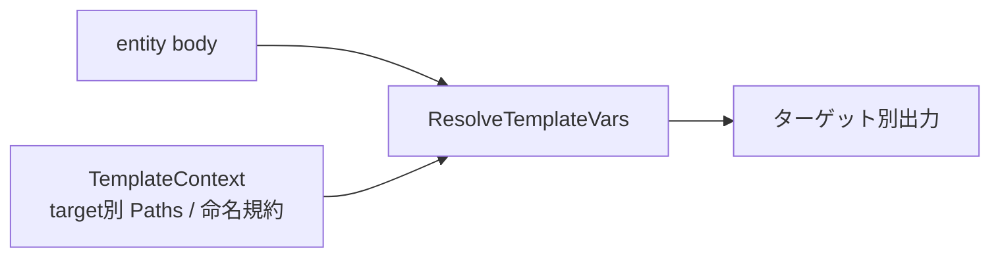

# 000: 全ターゲットでのプロンプトテンプレート変数解決と可搬パス参照の修正

## 背景 (Background)

`tt prompt compile` / `deploy` / `update` によるエージェント向けプロンプト展開で、次の不具合が確認されている。

1. **`{{policy:...}}` 等のテンプレート変数が置換されない**  
   Antigravity 向け出力では `{{policy:testing-rules}}` が `.agent/rules/testing-rules.md` に展開されるが、Claude / Codex / Cursor 向けではプレースホルダが生のまま残る。

2. **`build-pipeline.md` が Claude / Codex で見当たらないように見える**  
   procedure 自体は `.claude/skills/build-pipeline/SKILL.md` 等として emit 済みである。しかし policy 本文が `.agent/workflows/build-pipeline.md` をハードコードしているため、エージェントがそのパスを開こうとして失敗する。

### 調査で確定した根本原因

| 現象 | 原因 |
|---|---|
| テンプレート未置換 | `ResolveTemplateVars` の呼び出しが `AntigravityEmitter` のみ。`ClaudeCodeEmitter` / `CodexEmitter` / `CursorEmitter` は未呼び出し |
| パスが見つからない | ソース policy に Antigravity 固有パス（`.agent/workflows/...`）が直書きされており、他ターゲットへそのままコピーされる |

詳細: 調査レポート `tmp/investigation-tt-compile-bugs.md`（調査時点の成果物）。

### 関連する既存仕様

- `030-Restructure-Agent-Target-Paths.md`: `{{procedure:id}}` はターゲット設定に応じたパスへ解決されること
- `006-tt-prompt-compile-deploy.md` R7: `--target all` 時も各エミッター実行コンテキストでテンプレート変数を解決すること

現状は上記契約を Antigravity のみが満たしている。

### 関連ファイル

- `features/tt/internal/prompt/emitter/template.go`（`ResolveTemplateVars` / `resolveRef` / `resolvePolicyPath`）
- `features/tt/internal/prompt/emitter/antigravity.go`（呼び出し済み）
- `features/tt/internal/prompt/emitter/claude_code.go`（未呼び出し）
- `features/tt/internal/prompt/emitter/codex.go`（未呼び出し）
- `features/tt/internal/prompt/emitter/cursor.go`（未呼び出し）
- `prompts/manifest/code_content/policies/*.md`（ハードコードパス）
- `catalog/originals/axsh/go-standard-project/base/prompts/manifest/code_content/policies/`（カタログ側の同内容があれば同期）

---

## 要件 (Requirements)

### 必須要件

#### R1: 全ターゲットでテンプレート変数を解決する

Claude / Codex / Cursor の各 `Emit` でも、Antigravity と同様に policy / capability / procedure の body に対して `ResolveTemplateVars` を適用すること。

対象プレースホルダ:

- `{{policy:id}}`
- `{{procedure:id}}`
- `{{capability:id}}`
- `{{target:name}}` / `{{target:meta_dir}}`（既存仕様どおり）

`--target all` 実行時は、各エミッターが自ターゲットのパスで解決すること（他ターゲットのパスを埋め込まない）。

#### R2: 解決結果パスは実ファイル配置と一致する

単純移植では次の食い違いが起きるため、ターゲット別のファイル名規約に合わせて解決すること。

| ターゲット | policy 拡張子 | `project-instructions` のファイル名 | procedure の解決先 |
|---|---|---|---|
| antigravity | `.md` | `instructions.md`（現状どおり） | `{workflows}/{id}.md` |
| claude-code | `.md` | `project-instructions.md`（リネームしない） | `{skills}/{id}/SKILL.md` |
| codex | `.md` | `project-instructions.md`（リネームしない） | `{skills}/{id}/SKILL.md` |
| cursor | `.mdc` | `project-instructions.mdc`（リネームしない） | `{skills}/{id}/SKILL.md` |

`TargetPaths`（rules / skills / workflows）は各ターゲット YAML の `paths`（なければデフォルト）から構築する。Workflows が空のターゲットでは `{{procedure:id}}` は skills パスへ解決する（既存 `resolveRef` の仕様を維持）。

#### R3: ソース policy のハードコードパスをテンプレート変数へ置換する

少なくとも次をターゲット中立な参照に置き換えること。

| 現状（例） | 置換後（例） |
|---|---|
| `.agent/workflows/build-pipeline.md` | `{{procedure:build-pipeline}}` |
| `.agent/workflows/create-specification.md` 等の個別 workflow リンク | 対応する `{{procedure:...}}` |
| 「`.agent/workflows/` 配下に定義されたワークフロー」のようなディレクトリ直書き | テンプレート変数またはターゲット中立な表現 |

対象ソース（ワークスペース）:

- `prompts/manifest/code_content/policies/project-instructions.md`
- `prompts/manifest/code_content/policies/coding-rules.md`
- `prompts/manifest/code_content/policies/testing-rules.md`
- `prompts/manifest/code_content/policies/planning-rules.md`

カタログオリジナルに同一内容がある場合は同期更新すること。

#### R4: 再デプロイ後、成果物に未展開プレースホルダと誤パスが残らない

`tt prompt update`（または同等の compile+deploy）後:

1. `.claude/` / `.codex/` / `.cursor/` / `.agent/` の生成コンテンツに、解決可能な `{{policy:|procedure:|capability:}}` が残らないこと
2. Claude / Codex / Cursor の rules に `.agent/workflows/` への誤参照が残らないこと
3. Antigravity の既存の正しい展開（例: `.agent/rules/testing-rules.md`、`.agent/workflows/build-pipeline.md`）が回帰しないこと

#### R5: 単体テストで全ターゲットの展開を固定する

少なくとも次を自動化テストで断言すること。

1. Claude: `{{policy:testing-rules}}` → `.claude/rules/testing-rules.md`
2. Codex: 同様に `.codex/rules/testing-rules.md`
3. Cursor: `{{policy:testing-rules}}` → `.cursor/rules/testing-rules.mdc`
4. 各ターゲットで `{{procedure:build-pipeline}}` が当該ターゲットの実配置パスへ解決されること
5. Antigravity 既存ケースの回帰（`instructions.md` リネーム、workflows パス）

### 任意要件

#### O1: `.agents/` 残骸の扱い

旧 Codex 出力と思われる `.agents/` が残っている場合、意図的な互換出力でない限り orphan 掃除またはドキュメントでの廃止明記を検討する。本仕様の必須範囲外とする。

#### O2: 未知プレースホルダの扱い

現状どおり、未知の `kind` / 解決不能な参照はプレースホルダをそのまま残してよい。ただし解決可能な参照を落としてはならない。

---

## 実現方針 (Implementation Approach)

### 方針概要

1. **共通解決ロジックの拡張**  
   `resolvePolicyPath`（および必要なら周辺）をターゲット別の拡張子・`project-instructions` 命名に対応させる。`TemplateContext` にターゲット種別、または「policy 拡張子」「instructions リネーム有無」を渡せるようにする。

2. **各 emitter への適用**  
   Antigravity と同様、body の `stripFrontmatter` / 改行正規化の直後（または直前で一貫した位置）に `ResolveTemplateVars` を呼ぶ。`Check`（dry-run 比較）経路も同じ `Emit` を通るため、呼び出し追加でドリフト検出も正しい期待値を使う。

3. **ソース可搬化**  
   policy 内の `.agent/workflows/...` 直書きを `{{procedure:...}}` に置換。一般言及は「ワークフロー（procedure）」等の中立表現、または解決可能なテンプレート参照に寄せる。

4. **カタログ同期**  
   go-standard-project テンプレート側に同ファイルがあれば同一変更を入れる。

### 設計上の決定事項

- テンプレート解決は **emit 時** に行い、ソース manifest 上では `{{kind:id}}` を維持する（現状方針の継続）。
- procedure の Claude/Codex/Cursor 出力形状（`skills/{id}/SKILL.md`）は変更しない。見え方の問題は参照パスの修正で解消する。
- Antigravity の `instructions.md` リネームは維持する。他ターゲットへは広げない。

### 主要な変更箇所（想定）

| 領域 | 内容 |
|---|---|
| `emitter/template.go` | ターゲット別 policy パス解決 |
| `emitter/claude_code.go` / `codex.go` / `cursor.go` | `TemplateContext` 構築と `ResolveTemplateVars` 呼び出し |
| `emitter/*_test.go` | 全ターゲットの展開アサーション |
| `prompts/manifest/code_content/policies/*.md` | ハードコード除去 |
| catalog originals（該当時） | 同上の同期 |

---

## 検証シナリオ (Verification Scenarios)

調査で確認した再現手順を、修正後の期待結果として残す。

1. ソース `prompts/manifest/code_content/procedures/build-pipeline.md` に `{{policy:testing-rules}}` が含まれることを確認する。
2. `tt prompt update --target all`（またはプロジェクト標準の compile/deploy ラッパー）を実行する。
3. **Antigravity**: `.agent/workflows/build-pipeline.md` 内の参照が `.agent/rules/testing-rules.md` になっていること。`{{policy:testing-rules}}` が残っていないこと。
4. **Claude**: `.claude/skills/build-pipeline/SKILL.md` 内の参照が `.claude/rules/testing-rules.md` になっていること。`{{policy:...}}` が残っていないこと。
5. **Codex**: `.codex/skills/build-pipeline/SKILL.md` についても同様（`.codex/rules/...`）。
6. **Cursor**: `.cursor/skills/build-pipeline/SKILL.md` 内の参照が `.cursor/rules/testing-rules.mdc` になっていること。
7. Claude / Codex / Cursor の `project-instructions`（または同等 rules）を開き、`.agent/workflows/build-pipeline.md` へのリンクが無く、当該ターゲットの procedure 実パス（例: `.claude/skills/build-pipeline/SKILL.md`）を指していること。
8. エージェント視点で「build-pipeline を開け」と指示した場合に、解決後パス上のファイルが実在すること。

---

## テスト項目 (Testing for the Requirements)

### ビルド・全体検証

1. ビルド＋単体テスト:
   `scripts/process/build.sh`

2. emitter / template 関連の単体テスト（パッケージ直実行の補助確認）:
   `go test ./features/tt/internal/prompt/emitter/ -count=1`

3. プロンプトコンパイラ周辺の統合テスト（影響カテゴリに限定）:
   `scripts/process/integration_test.sh --categories "template"`

4. template カテゴリが空振り、または不足する場合の追加絞り込み例:
   `scripts/process/integration_test.sh --categories "common" --specify "Emit|Template|prompt"`

### 要件との対応

| 要件 | 検証手段 |
|---|---|
| R1 / R2 | `emitter` パッケージの単体テスト（Claude/Codex/Cursor/Antigravity のパス解決アサーション） |
| R3 | ソース grep（`.agent/workflows` が policies に残らない）＋ emit 後成果物のパス確認を単体/統合でカバー |
| R4 | update/deploy 後の成果物を読むテスト、または既存 catalog template 統合テストの拡張 |
| R5 | 新規/拡張する `*_test.go` が CI（`build.sh`）で失敗すれば検知 |

### 手動確認の位置づけ

検証シナリオ 3〜8 は実装計画・レビュー時の確認観点として残すが、完了判定は上記自動化（`build.sh` および該当統合テスト）の成功を必須とする。
