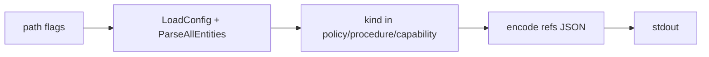

# 001: tt prompt refs — コンパイル前の参照カタログ JSON 出力

## 背景 (Background)

プロンプト本文では `{{policy:coding-rules}}` / `{{procedure:build-pipeline}}` などのテンプレート参照を書く。著者・レビューア・エージェントが「どのソース md をどの記法で指せるか」を知る手段が現状なく、既存の `tt prompt compile --dry-run` は resolved manifest の YAML 全文 dump であり用途が異なる。

調査（`tmp/investigation-tt-prompt-refs-dryrun.md`）により、参照記法は frontmatter の `kind` + `id` から一意に決まり、解決後の相対パスを出さなければ `--workspace` / `--prompts-dir` 等のパス系オプションの影響をほぼ受けないことが分かっている。

### 関連ファイル

- `features/tt/cmd/prompt.go`（CLI）
- `features/tt/internal/prompt/manifest/parser.go`（`ParseAllEntities`）
- `features/tt/internal/prompt/emitter/template.go`（参照記法の正）
- `prompts/manifest/project.yaml`（sources globs）

---

## 要件 (Requirements)

### 必須要件

#### R1: 参照カタログを JSON で stdout に出力するコマンドを追加する

次のいずれかの形で提供する（推奨は A）:

- **A（推奨）**: サブコマンド `tt prompt refs`
- **B**: `tt prompt compile --list-refs`（emit せず早期 return）

既存 `compile --dry-run`（YAML dump）の挙動は変更しない。

#### R2: 出力対象はファイル紐付きの参照可能エンティティのみ

第1版の列挙対象:

| kind | ソース | 参照記法 |
|---|---|---|
| `policy` | `sources.policies` | `{{policy:<id>}}` |
| `procedure` | `sources.procedures` | `{{procedure:<id>}}` |
| `capability` | `sources.capabilities` | `{{capability:<id>}}` |

含めないもの（第1版）:

- `guard` / `worker` / `bundle` / `skip` / `target` エンティティ（`{{kind:id}}` 解決対象外）
- 解決後の相対パス（例: `.claude/rules/coding-rules.md`）
- `{{target:name|meta_dir|rules|skills|workflows}}` の値付き解決結果（任意要件へ）

#### R3: JSON スキーマ（第1版）

stdout は JSON オブジェクト 1 つ。最低限次の形とする:

```json
{
  "refs": [
    {
      "file": "coding-rules.md",
      "kind": "policy",
      "id": "coding-rules",
      "ref": "{{policy:coding-rules}}"
    }
  ]
}
```

フィールド定義:

| フィールド | 型 | 内容 |
|---|---|---|
| `file` | string | ソースのベースファイル名（パス区切りを含まない。例: `coding-rules.md`） |
| `kind` | string | `policy` / `procedure` / `capability` |
| `id` | string | frontmatter の `id`（ファイル名ではなく id が正） |
| `ref` | string | ``{{`` + kind + `:` + id + `}}`` |

- `refs` の並びは安定させる（推奨: kind 順 → id 昇順）。
- 余計なログを stdout に混ぜない（進捗・警告は stderr）。

#### R4: パス系オプションと参照記法の独立性

- `ref` 文字列は `--workspace` / `--prompts-dir` / `--project` / `--build-dir` / `--deploy-root` / `--target` によって変化してはならない。
- `--prompts-dir`（等）の変更は **どのエンティティが発見されるか** にのみ影響してよい。
- 第1版では解決パスを出さないことで、パスオプション懸念を仕様上排除する。

#### R5: エンティティ発見は既存 parser を再利用する

- `LoadConfig` + `ParseAllEntities`（既存）でソースを読む。
- emit / digest / 成果物書き込みは行わない。
- フル compile パイプライン全体の実行は不要（必要最小限の load/parse）。

#### R6: 既定の列挙集合

- 既定: 発見できた policy/procedure/capability **すべて**（タグ未適用＝「書ける参照」の最大集合）。
- `--tags` / `--tag-refs` を受け取る場合の挙動は任意要件 R-opt1。

#### R7: 終了コード

- 成功: exit 0、stdout に JSON。
- project.yaml 欠落・parse 不能など致命的エラー: 非 0、メッセージは stderr。
- 個別エンティティの軽微な parse 失敗をどう扱うかは実装計画で具体化する（少なくともコマンド全体が黙って成功しないこと）。

### 任意要件

#### R-opt1: `--selected-only`

`--tags` 適用後に `Selected == true` のエンティティだけを出す。未指定時は R6 どおり全発見。

#### R-opt2: `target_vars` 配列

ファイル非紐付きの記法カタログを別配列で併記する（値は出さない）:

```json
{
  "refs": [ ... ],
  "target_vars": [
    { "ref": "{{target:name}}" },
    { "ref": "{{target:meta_dir}}" },
    { "ref": "{{target:rules}}" },
    { "ref": "{{target:skills}}" },
    { "ref": "{{target:workflows}}" }
  ]
}
```

#### R-opt3: `--pretty`

JSON をインデント付きで出力する。

---

## 実現方針 (Implementation Approach)

### CLI

推奨: **`tt prompt refs`** を `features/tt/cmd/prompt.go` に追加。

- path フラグは既存 `addPromptPathFlags` を流用（ソース発見のため）。
- `--target` は第1版では不要（解決パスを出さないため）。ヘルプに「参照記法は target 非依存」と明記。
- wrapper: 必要なら `scripts/code/prompt/` 配下に薄いラッパーを追加（他サブコマンドに合わせる）。

### 処理フロー



1. `ResolvePaths` で workspace / project.yaml を決定
2. `ParseAllEntities`
3. kind フィルタ → `{file, kind, id, ref}` 生成
4. 安定ソート → JSON エンコード → stdout

### 設計上の決定

| 決定 | 内容 |
|---|---|
| 既存 dry-run 非破壊 | YAML dump の意味を変えない |
| 解決パス非出力 | パスオプション影響を避ける（ユーザー要望） |
| id が正 | `file` は便宜上の表示。`ref` は常に frontmatter `id` |
| 合成変数は任意 | `{{target:*}}` は R-opt2 |

### 主要な変更箇所（想定）

| 領域 | 内容 |
|---|---|
| `features/tt/cmd/prompt.go` | `refs` サブコマンド |
| `features/tt/internal/prompt/...` | 一覧生成の純関数（compiler または小さな新パッケージ） |
| `features/tt/cmd/prompt_*_test.go` / `tests/tt/` | 単体・統合テスト |
| `scripts/code/prompt/` | 任意で wrapper |

---

## 検証シナリオ (Verification Scenarios)

1. リポジトリルートで `tt prompt refs`（または採用したコマンド）を実行する。
2. stdout が単一の JSON であり、`refs` 配列を含むことを確認する。
3. `coding-rules.md` に対応する要素が `ref: "{{policy:coding-rules}}"` を持つことを確認する。
4. `build-pipeline.md` に対応する要素が `ref: "{{procedure:build-pipeline}}"` を持つことを確認する。
5. 出力に `.claude/rules/` や `.agent/workflows/` などの **解決済み相対パスが含まれない**ことを確認する。
6. `--prompts-dir` をデフォルトのまま変えず、`--workspace` を明示しても、同一ソース集合に対する各 `ref` 文字列が変わらないことを確認する。
7. 既存 `tt prompt compile --dry-run --target cursor` が従来どおり resolved YAML を出し、壊れていないことを確認する。

---

## テスト項目 (Testing for the Requirements)

### ビルド・全体検証

1. ビルド＋単体テスト:
   `scripts/process/build.sh`

2. tt カテゴリの統合テスト（本機能に限定）:
   `scripts/process/integration_test.sh --categories "tt" --specify "PromptRefs"`

3. 既存 prompt 系のリグレッション（必要最小）:
   `scripts/process/integration_test.sh --categories "tt" --specify "PromptTags|PromptTemplateVars"`

### 要件との対応

| 要件 | 検証手段 |
|---|---|
| R1 / R5 | CLI 統合テストでサブコマンドが JSON を返す |
| R2 / R3 | 単体テストでサンプル Entity から JSON フィールドを断言 |
| R4 | 同一 fixture で path フラグを変えても `ref` が不変であることをテスト |
| R6 | タグ付き/無し fixture で全件が出ることを確認 |
| R7 | 不正 project で非 0 終了を統合または単体で確認 |
| 既存 dry-run | リグレッション（YAML dump が残ること） |

カテゴリ注記: 本リポジトリの統合テストカテゴリは `tests/` 配下ディレクトリ名に従う。本機能は `tt` を使用する（スキル文面の `common`/`template` 等は本リポジトリでは該当しない場合がある）。
