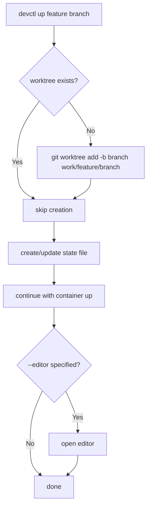

# devctl Git Worktreeライフサイクル管理 仕様書

## 背景 (Background)

### 課題

現在の devctl は `devctl <feature> [flags]` という CLI 構造を採用しており、以下の課題がある。

1. **worktree が事前に存在することを前提としている**: `--up` 実行前に手動で `git worktree add` を行う必要がある
2. **feature と branch の関係が曖昧**: 1つのfeatureに対して複数のブランチで作業する場合を想定していない
3. **開発ライフサイクル全体をカバーしていない**: worktree の作成からコンテナ起動・停止までは対応するが、PR作成やブランチ削除・worktree クリーンアップは手動操作が必要
4. **状態管理がない**: どのfeature/branchが稼働中か、どのような設定で起動したかを追跡する手段がない
5. **フラグの競合**: `--up`, `--down`, `--shell` 等は相互排他的だが、フラグとして並列に定義されているため矛盾する組み合わせを防げない

### 目指す姿

devctl を**feature 開発の全ライフサイクルをカバーするツール**に拡張する。
`git worktree` の作成から、コンテナ管理、PR作成、ブランチ削除までを一貫して管理する。
また、CLI をサブコマンド体系に再設計し、操作の意図を明確にする。

```
create worktree → up container → develop → down → PR → close/cleanup
```

---

## 要件 (Requirements)

### 必須要件

#### R1: サブコマンド体系への変更

CLI をフラグベースからサブコマンドベースに変更する。

##### コマンド一覧

```
devctl up     <feature> [branch] [flags]    # コンテナ起動 (+worktree自動作成)
devctl down   <feature> [branch]            # コンテナ停止・削除
devctl open   <feature> [branch] [flags]    # エディタ起動
devctl status <feature> [branch]            # ステータス表示
devctl shell  <feature> [branch]            # コンテナ内シェル
devctl exec   <feature> [branch] -- <cmd>   # コンテナ内コマンド実行
devctl pr     <feature> [branch]            # PR 作成
devctl close  <feature> [branch] [--force]  # クローズ
devctl list   <feature>                     # ブランチ一覧
```

- `[branch]` は省略可能。省略時は feature 名をブランチ名として使用する
  - 例: `devctl up myfeature` → branch=`myfeature`
- worktree パスは `work/<feature>/<branch>` とする
  - 例: `devctl up devctl test-001` → `work/devctl/test-001/`

##### サブコマンド別フラグ

| フラグ | 適用サブコマンド | 説明 |
|---|---|---|
| `--editor <name>` | `up`, `open` | エディタ指定 (`code`/`cursor`/`ag`/`claude`) |
| `--ssh` | `up` のみ | SSH モードで起動 |
| `--rebuild` | `up` のみ | イメージ再ビルド |
| `--no-build` | `up` のみ | ビルドスキップ |
| `--attach` | `open` のみ | 稼働中コンテナへの DevContainer attach を試行 |
| `--force` | `close` のみ | マージ未完了でも強制削除 |

**`up --editor` の挙動**: `up` サブコマンドで `--editor` を指定すると、コンテナ起動後に自動的にエディタも起動する

**`open --attach` の挙動**: 稼働中コンテナへの DevContainer attach を試行する。失敗時はローカル worktree を開くフォールバック。`--attach` なしの場合はローカル worktree を直接開く

##### グローバルフラグ（全サブコマンド共通）

| フラグ | 説明 |
|---|---|
| `--verbose` | デバッグログ出力 |
| `--dry-run` | 実行せずに計画表示 |
| `--report <file>` | 実行レポートを Markdown ファイルに出力 |

#### R2: Worktree 自動作成

- `up` サブコマンド実行時、対象の worktree が存在しない場合は自動で作成する
  - 内部で `git worktree add -b <branch> work/<feature>/<branch>` を実行する
- worktree がすでに存在する場合はスキップし、通常の up 処理を続行する
- ブランチがリモートに既に存在する場合は、`-b` ではなく既存ブランチで worktree を作成する

#### R3: 状態ファイル管理

- worktree 単位の状態を `work/<feature>/<branch>.state.yaml` で管理する
- 状態ファイルには以下を記録する:
  - `feature`: feature 名
  - `branch`: ブランチ名
  - `created_at`: worktree 作成日時
  - `container_mode`: 使用中のコンテナモード
  - `editor`: 使用中のエディタ
  - `status`: 現在の状態 (`active`, `stopped`, `closed`)
- `up` 時に作成/更新、`down` 時に更新、`close` 時に削除

#### R4: PR 作成 (`pr`)

- `pr` サブコマンドで GitHub へのプルリクエスト作成を支援する
- 内部で `gh pr create` (GitHub CLI) を呼び出す
- worktree ディレクトリを cwd にして実行する
- PR テンプレートの存在を確認し、あれば使用する
- コマンド名は環境変数 `DEVCTL_CMD_GH` で上書き可能（デフォルト: `gh`）

#### R5: クローズ (`close`)

- `close` サブコマンドで以下を順序実行する:
  1. コンテナが稼働中であれば `down` 相当の処理を行う
  2. `git worktree remove work/<feature>/<branch>` で worktree を削除する
  3. `git branch -d <branch>` でローカルブランチを削除する（マージ済みの場合のみ）
  4. 状態ファイルを削除する
- `--force` と併用した場合はマージ未完了でも強制削除する（`git branch -D`）

#### R6: 既存コマンドの worktree パス変更対応

- `internal/resolve/worktree.go` の検索パスを `work/<feature>/<branch>` に変更する
- 後方互換のため、`work/<feature>` も検索フォールバックとして維持する
- `status` サブコマンドは feature 配下の全ブランチの状態を一覧表示する

### 任意要件

#### R7: 外部コマンド実行の共通化とログ出力

- 全ての外部コマンド実行を共通関数（`internal/cmdexec/` パッケージ）に統一する
  - `Run(logger, dryRun, name string, args ...string) (stdout string, err error)`
- 実行前にコマンドラインを stdout に `[CMD]` プレフィックス付きで出力する
  - 例: `[CMD] git worktree add -b test-001 work/devctl/test-001`
  - 例: `[CMD] docker run -d --name myproj-devctl ...`
- `--dry-run` 時は `[DRY-RUN]` プレフィックスで出力し、実行はしない
- 実行結果（成功/失敗、exit code）もログ出力する
- 各コマンド実行は `ExecRecord`（コマンドライン、結果、実行時間）として記録し、実行レポート（R10）で利用する

> [!NOTE]
> この要件は Part 1/Part 2 で実装済みの既存コマンド実行（`internal/action/runner.go`, `internal/editor/*.go`）にも遡及適用する。

#### R8: ブランチ一覧 (`list`)

- `devctl list <feature>` で、対象 feature の全 worktree/ブランチを一覧表示する
- 各ブランチのコンテナ状態も表示する

#### R9: worktree 間切り替え

- 将来的に `devctl switch <feature> <branch>` でエディタの接続先を切り替えることも検討する（本仕様では対象外）

#### R10: 実行レポート

- devctl 終了時に、実行した内容のサマリーレポートを stdout に出力する
- レポートには以下を含む:
    - 実行日時
    - 対象 feature / branch
    - 参照した環境変数の一覧（変数名と設定値。未設定の場合はデフォルト値を表示）
    - 検出した環境（OS, Editor, ContainerMode）
    - 実行した各ステップの一覧（時系列順）
    - 各外部コマンドの実行内容と結果（exit code、成功/失敗）
    - 全体の結果（成功/失敗）
- `--report <filename>` フラグで Markdown 形式のファイルに出力可能
    - ファイルが指定されない場合は stdout のみ
    - 出力例:
        ```markdown
        # devctl Execution Report
        - **Date**: 2026-03-07 14:25:00
        - **Feature**: devctl
        - **Branch**: test-001

        ## Environment Variables
        | Variable | Value |
        |---|---|
        | DEVCTL_EDITOR | *(not set, default: cursor)* |
        | DEVCTL_CMD_CODE | *(not set, default: code)* |
        | DEVCTL_CMD_CURSOR | /usr/local/bin/cursor |
        | DEVCTL_CMD_AG | *(not set, default: antigravity)* |
        | DEVCTL_CMD_CLAUDE | *(not set, default: claude)* |
        | DEVCTL_CMD_GIT | *(not set, default: git)* |
        | DEVCTL_CMD_GH | *(not set, default: gh)* |

        ## Detected Environment
        - **OS**: windows, **Editor**: cursor, **ContainerMode**: docker-local

        ## Steps
        1. ✅ Worktree creation: `git worktree add -b test-001 work/devctl/test-001`
        2. ✅ Container up: `docker run -d --name myproj-devctl ...`
        3. ✅ Editor open: `cursor work/devctl/test-001`

        ## Result: **SUCCESS**
        ```

---

## 実現方針 (Implementation Approach)

### ディレクトリ構造の変更

```
work/
├── devctl/
│   ├── test-001/          # git worktree (work/<feature>/<branch>)
│   │   ├── .devcontainer/
│   │   ├── go.mod
│   │   └── ...
│   ├── test-001.state.yaml  # state file
│   └── fix-bug/           # another branch
│       └── ...
└── ...
```

### 新規パッケージ

#### `internal/cmdexec/` — 外部コマンド実行の共通化

- 全ての外部コマンド実行を統一するパッケージ
- `ExecRecord` 構造体でコマンド実行履歴を記録
- `--dry-run` / `[CMD]` ログ出力をここで一元管理

#### `internal/worktree/` — Git Worktree 操作

- `Create(repoRoot, feature, branch string) error` — worktree 作成
- `Remove(repoRoot, feature, branch string, force bool) error` — worktree 削除
- `Exists(repoRoot, feature, branch string) bool` — 存在確認
- `List(repoRoot, feature string) ([]WorktreeInfo, error)` — 一覧

Git コマンド名は環境変数 `DEVCTL_CMD_GIT` で上書き可能（デフォルト: `git`）。

#### `internal/state/` — 状態ファイル管理

- `StateFile` 構造体: feature, branch, created_at, container_mode, editor, status
- `Load(path string) (StateFile, error)`
- `Save(path string, state StateFile) error`
- `Remove(path string) error`
- `StatePath(repoRoot, feature, branch string) string` — パス生成

#### `internal/report/` — 実行レポート

- `Report` 構造体: 実行履歴、環境情報を集約
- `Print(w io.Writer)` — stdout 出力
- `WriteMarkdown(path string) error` — Markdown ファイル出力

#### `internal/action/pr.go` — PR 作成アクション

- `Runner.PR(worktreePath string) error`
- 環境変数 `DEVCTL_CMD_GH` → デフォルト `gh`

#### `internal/action/close.go` — クローズアクション

- `Runner.Close(...)` — down → worktree remove → branch delete → state remove

### 既存パッケージの変更

#### `cmd/` — cobra サブコマンド化

- `cmd/root.go` — グローバルフラグ定義 (`--verbose`, `--dry-run`, `--report`)
- `cmd/up.go` — `up` サブコマンド (`--open`, `--editor`, `--ssh`, `--rebuild`, `--no-build`)
- `cmd/down.go` — `down` サブコマンド
- `cmd/open.go` — `open` サブコマンド (`--editor`)
- `cmd/status.go` — `status` サブコマンド
- `cmd/shell.go` — `shell` サブコマンド
- `cmd/exec.go` — `exec` サブコマンド
- `cmd/pr.go` — `pr` サブコマンド
- `cmd/close.go` — `close` サブコマンド (`--force`)
- `cmd/list.go` — `list` サブコマンド

#### `internal/resolve/worktree.go`

- `Worktree(repoRoot, feature, branch string) (string, error)` にシグネチャ変更
- 検索順序: `work/<feature>/<branch>` → `work/<feature>`（後方互換）

### 処理フロー（`up` の場合）



---

## 検証シナリオ (Verification Scenarios)

### シナリオ1: 新規 worktree 作成 + コンテナ起動

```bash
devctl up devctl test-001 --dry-run --verbose
```

1. `work/devctl/test-001/` が存在しないことを確認する
2. `git worktree add -b test-001 work/devctl/test-001` を実行する（dry-run ではログのみ）
3. 状態ファイル `work/devctl/test-001.state.yaml` を作成する
4. コンテナ起動処理に進む

### シナリオ2: コンテナ起動 + エディタ起動

```bash
devctl up devctl test-001 --editor cursor
```

1. worktree 確認/作成
2. コンテナを起動する
3. `--editor` が指定されているので、Cursor を起動し attach を試行する

### シナリオ3: エディタのみ起動（ローカル）

```bash
devctl open devctl test-001 --editor code
```

1. ローカル worktree `work/devctl/test-001/` を VSCode で開く

### シナリオ4: 稼働中コンテナへのエディタ再接続

```bash
devctl open devctl test-001 --editor code --attach
```

1. コンテナが稼働中であることを確認する
2. VSCode で DevContainer attach を試行する
3. 失敗時はローカル worktree を開くフォールバック

### シナリオ5: コンテナ停止

```bash
devctl down devctl test-001
```

1. 対象コンテナを停止・削除する
2. 状態ファイルを更新する

### シナリオ6: PR 作成

```bash
devctl pr devctl test-001
```

1. `work/devctl/test-001/` を cwd として `gh pr create` を実行する

### シナリオ7: クローズ（マージ済み）

```bash
devctl close devctl test-001
```

1. コンテナが稼働中であれば停止・削除する
2. `git worktree remove work/devctl/test-001` を実行する
3. `git branch -d test-001` を実行する
4. 状態ファイルを削除する

### シナリオ8: 一覧表示

```bash
devctl list devctl
```

1. `work/devctl/` 配下の全ブランチと状態を表示する

### シナリオ9: branch 省略時

```bash
devctl up myfeature
```

1. branch 省略のため `myfeature` をブランチ名として使用する
2. `work/myfeature/myfeature/` に worktree を作成する

---

## テスト項目 (Testing for the Requirements)

### ユニットテスト（関数単位）

| テスト対象 | 検証内容 | 対応要件 |
|---|---|---|
| `worktree.Exists` | 存在確認が正しく動作すること | R2 |
| `worktree.Create` (dry-run/mock) | 正しい git コマンドが構築されること | R2 |
| `worktree.Remove` (dry-run/mock) | 正しい git コマンドが構築されること | R5 |
| `state.Load` / `state.Save` | YAML の読み書きが正しいこと | R3 |
| `state.StatePath` | パス生成が正しいこと | R3 |
| `resolve.Worktree` (3引数) | 新パスと後方互換パスの検索が正しいこと | R6 |
| `cmdexec.Run` | コマンドログ出力、dry-run、ExecRecord 記録 | R7 |
| `report` | Markdown 出力、環境変数一覧 | R10 |
| サブコマンドパース | feature + branch の解析が正しいこと | R1 |

### 検証コマンド

```bash
# ビルド・ユニットテスト
./scripts/process/build.sh

# 統合テスト（Docker 環境必須、将来対応）
./scripts/process/integration_test.sh --categories "devctl"
```
