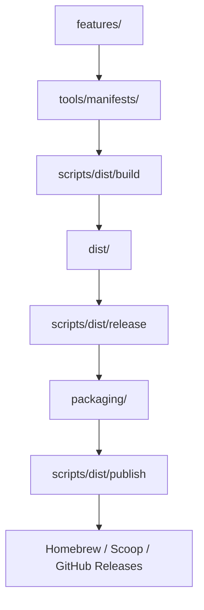

# 007 — 開発支援ツール基盤: リポジトリ構成仕様

## 背景 (Background)

本リポジトリは、CLIツールの実装から配布までを一貫して管理する**開発支援ツール基盤**である。現在、`features/` を中心としたツール実装は既に存在するが、以下の仕組みが未整備のため、ツールを**各種プラットフォームへインストール可能な形で配布する**ための基盤が欠けている:

- CLIツールの配布メタデータ管理
- クロスプラットフォーム向けビルド・パッケージング定義
- Homebrew / Scoop などのパッケージマネージャ向けインストーラーテンプレート
- リリースチャンネルとバージョン管理
- ブートストラップインストーラー

本仕様は、これらの配布基盤を導入するための**リポジトリ全体のディレクトリ構成**を定義する。

### 対象プラットフォーム

| OS      | アーキテクチャ |
|---------|--------------|
| Linux   | amd64, arm64 |
| macOS   | amd64, arm64 |
| Windows | amd64        |

### 対象開発ツール

- VSCode
- Cursor
- Antigravity
- Claude Code

---

## 要件 (Requirements)

### 必須要件

1. **Feature中心のアーキテクチャ**
   - すべての実行可能な機能は `features/` 配下にFeatureモジュールとして実装する
   - CLIツール・サービス・自動化コンポーネント・ビルドユーティリティを含む
   - 各Featureは自己完結したモジュールとし、`feature.yaml` でメタデータを定義する

2. **責務の分離**
   - 以下のレイヤーごとにディレクトリを分離する:

   | レイヤー        | 責務                     |
   |----------------|--------------------------|
   | `features/`    | ツール実装               |
   | `tools/`       | 配布メタデータ           |
   | `packaging/`   | ビルドパッケージング構成 |
   | `releases/`    | リリース履歴             |
   | `dist/`        | 生成成果物               |
   | `scripts/dist/` | 実行エントリーポイント |

3. **クロスプラットフォーム配布**
   - すべてのCLIツールを Linux / macOS / Windows に配布可能とする
   - サポートアーキテクチャ: amd64, arm64

4. **ツールチェーン非依存**
   - エンドユーザーがGoをインストールせずにツールを利用できるよう、**プリコンパイル済みバイナリ**で配布する

5. **配布メタデータの管理**
   - `tools/manifests/` でツール登録・プラットフォーム対応・リリースポリシーを一元管理する

6. **インストーラーテンプレート**
   - Homebrew / Scoop / ブートストラップインストーラーのテンプレートを提供する

7. **リリースチャンネルの管理**
   - `stable` / `experimental` 等のリリースチャンネルをサポートする

### 任意要件

- GoReleaserによるビルド自動化
- チェックサムポリシーの定義
- アーカイブレイアウト規則

---

## 実現方針 (Implementation Approach)

### リポジトリ全体構造

```
repo/
  README.md
  .gitignore
  .editorconfig

  catalog/              # Featureテンプレート
  docs/                 # ドキュメント
  environments/         # 開発・テスト環境定義
  features/             # ツール実装 (既存)
  shared/               # 共有ライブラリ (既存)
  work/                 # 開発ワークツリー (既存)

  tools/                # 配布メタデータ (新規)
  packaging/            # パッケージング定義 (新規)
  releases/             # リリースメタデータ (新規)
  dist/                 # ビルド成果物 (新規, gitignore対象)

  scripts/
    tools/              # ツール操作スクリプト (新規)
```

---

### 新規ディレクトリ詳細

#### `tools/` — 配布メタデータ

```
tools/
  manifests/            # ツール登録・マニフェスト
    tools.yaml          # グローバルツールレジストリ
    devctl.yaml         # 個別ツールマニフェスト
    featurectl.yaml
  installers/           # インストーラーテンプレート
    homebrew/
      Formula/
        devctl.rb.tmpl
    scoop/
      devctl.json.tmpl
    bootstrap/
      install.sh.tmpl
      install.ps1.tmpl
  metadata/             # グローバル設定
    release-policy.yaml
    naming.yaml
```

**`tools.yaml` (グローバルレジストリ) 例:**

```yaml
tools:
  - id: devctl
    feature_path: features/devctl
    type: go-cli
    binary_name: devctl
    release: true
```

**個別マニフェスト (`devctl.yaml`) 例:**

```yaml
id: devctl
feature_path: features/devctl
type: go-cli
binary_name: devctl
main_package: ./cmd/devctl

platforms:
  - os: linux
    arch: amd64
  - os: linux
    arch: arm64
  - os: darwin
    arch: amd64
  - os: darwin
    arch: arm64
  - os: windows
    arch: amd64

release:
  archive: zip
  checksum: true

install:
  homebrew: true
  scoop: true
```

---

#### `packaging/` — ビルドパッケージング定義

```
packaging/
  goreleaser/
    base.yaml           # 共通GoReleaser設定
    devctl.yaml          # ツール別設定
  archives/
    layout.yaml          # アーカイブレイアウト規則
  checksums/
    policy.yaml          # チェックサムポリシー
```

**`layout.yaml` 例:**

```yaml
include:
  - LICENSE
  - README.md
structure:
  root: <tool>-<version>
```

**`policy.yaml` 例:**

```yaml
algorithm: sha256
filename: checksums.txt
```

---

#### `releases/` — リリースメタデータ

```
releases/
  changelogs/
    devctl.md
    featurectl.md
  notes/
    templates/
    latest.md
  channels/
    stable.yaml
    experimental.yaml
```

**`stable.yaml` 例:**

```yaml
stable:
  devctl: v1.4.2
```

---

#### `dist/` — ビルド成果物 (gitignore対象)

```
dist/
  devctl/
    v1.4.2/
      devctl_linux_amd64.tar.gz
      devctl_darwin_arm64.tar.gz
      checksums.txt
```

> [!IMPORTANT]
> `dist/` は `.gitignore` に追加し、コミット対象外とすること。

---

#### `scripts/dist/` — 実行エントリーポイント

```
scripts/dist/
  dev                 # 開発環境起動
  build               # CLIツールビルド
  release             # リリース成果物作成
  publish             # リリース公開 (GitHub Releases, Homebrew, Scoop)
  install-tools       # 開発者ツールのローカルインストール
  bootstrap-tools     # 初期セットアップ
```

---

### Feature構造の標準化

各CLIフィーチャーは以下の構造に従う:

```
features/<feature-name>/
  README.md
  feature.yaml
  go.mod
  go.sum
  cmd/
    <binary-name>/
      main.go
  internal/
  pkg/
  .devcontainer/
```

**`feature.yaml` 例:**

```yaml
name: devctl
kind: cli
language: go
entrypoint: ./cmd/devctl
release:
  enabled: true
install:
  expose_as: devctl
```

| フィールド         | 説明                     |
|-------------------|--------------------------|
| `name`            | 論理的なFeature名        |
| `kind`            | Featureの種別            |
| `language`        | 実装言語                 |
| `entrypoint`      | メインの実行パス         |
| `release.enabled` | 配布対象かどうか         |
| `install.expose_as` | インストール時のバイナリ名 |

---

### アーティファクトフロー



---

### 既存ディレクトリ（変更なし / 軽微な変更）

| ディレクトリ      | 現状                     | 変更事項 |
|------------------|--------------------------|----------|
| `catalog/`       | Featureテンプレート       | 変更なし |
| `docs/`          | 未整備                   | 構造定義のみ (architecture/, tooling/ 等) |
| `environments/`  | compose等                | 変更なし |
| `features/`      | ツール実装済み            | `feature.yaml` の追加を推奨 |
| `shared/`        | 共有ライブラリ           | 変更なし |
| `work/`          | ワークツリー             | 変更なし |

---

## 検証シナリオ (Verification Scenarios)

1. 新規ディレクトリ (`tools/`, `packaging/`, `releases/`, `scripts/dist/`) が仕様通りの階層で作成されていること
2. `dist/` が `.gitignore` に含まれていること
3. `tools/manifests/tools.yaml` にツールが登録され、YAMLとしてパース可能であること
4. `features/devctl/feature.yaml` が仕様通りのフィールドを含むこと
5. `tools/manifests/devctl.yaml` が全対象プラットフォームを網羅していること
6. インストーラーテンプレート (`homebrew/`, `scoop/`, `bootstrap/`) のファイルが存在すること
7. `scripts/dist/` 配下の各スクリプトが実行可能権限を持つこと

---

## テスト項目 (Testing for the Requirements)

| 要件 | 検証方法 |
|---|---|
| ディレクトリ構造の正確性 | `find` / `tree` コマンドで仕様と照合 |
| `.gitignore` に `dist/` 含む | `grep dist .gitignore` |
| YAMLファイルの妥当性 | `./scripts/process/build.sh` (ビルド時にYAMLパースチェックを組み込む想定) |
| Feature構造の準拠 | `feature.yaml` の存在チェックスクリプトを `scripts/dist/` 内に作成 |
| スクリプト実行権限 | `ls -la scripts/dist/` で権限確認 |

> [!NOTE]
> 本仕様はディレクトリ構成とメタデータファイルの定義が中心であるため、自動テストは主にファイル・ディレクトリの存在チェックとYAMLの構文検証となる。ビルド・リリースの実機検証は、個別の実装計画で定義する。
