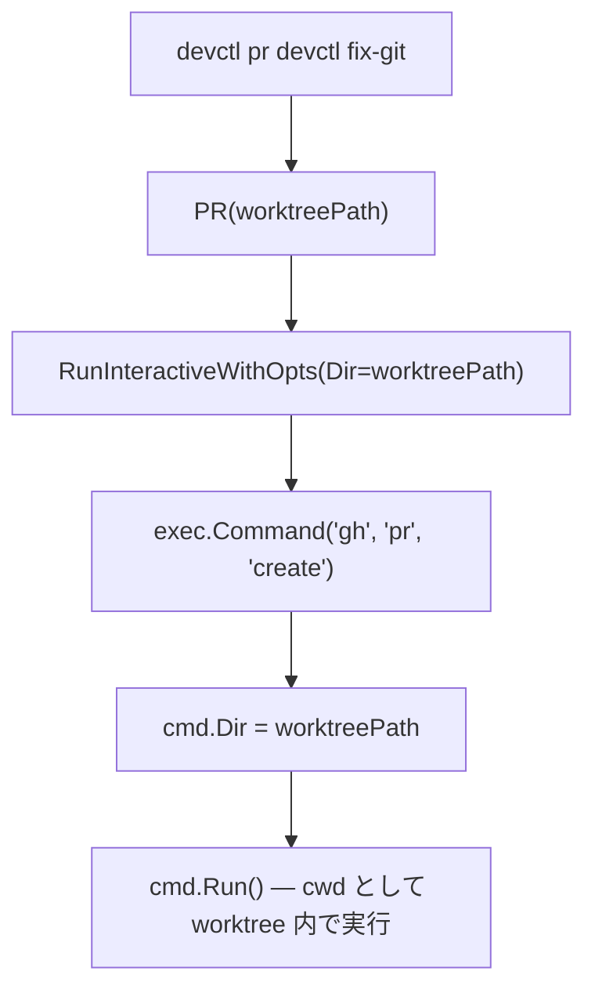

# devctl pr コマンド修正 — cwd サポートの追加

## 背景 (Background)

### 課題

`devctl pr` コマンドが `gh pr create` を実行する際、`gh` CLI に存在しない `--repo-dir` フラグを使用しているため、実行が必ず失敗する。

```
$ ./bin/devctl pr devctl fix-git
[INFO] [CMD] gh pr create --repo-dir C:\Users\yamya\myprog\tokotachi\work\devctl\fix-git
unknown flag: --repo-dir
[ERROR] [FAIL] gh pr create --repo-dir ... (exit=1)
```

### 根本原因

元仕様 [001-WorktreeLifecycle.md](file:///c:/Users/yamya/myprog/tokotachi/prompts/phases/000-foundation/ideas/main/001-WorktreeLifecycle.md) の R4 では以下のように記載されている：

> - worktree ディレクトリを cwd にして実行する

しかし、現在の `cmdexec.RunInteractive` / `RunInteractiveWithOpts` には **`exec.Cmd.Dir` を設定する仕組みがない**。そのため [pr.go](file:///c:/Users/yamya/myprog/tokotachi/features/devctl/internal/action/pr.go) の実装では、代替手段として `--repo-dir` フラグを使おうとしたが、`gh` CLI にはそのようなフラグは存在しない。

```go
// pr.go (現在の実装 - バグ)
if err := r.CmdRunner.RunInteractive(ghCmd, "pr", "create", "--repo-dir", worktreePath); err != nil {
```

## 要件 (Requirements)

### 必須要件

#### R1: RunOption に Dir (作業ディレクトリ) フィールドを追加

- `cmdexec.RunOption` 構造体に `Dir string` フィールドを追加する
- `Dir` が設定されている場合、`exec.Cmd.Dir` にその値を設定する
- `Dir` が空文字列の場合は従来通り（プロセスの cwd を使用）
- `RunWithOpts` と `RunInteractiveWithOpts` の両方で対応する

#### R2: pr.go の修正

- `--repo-dir` フラグの使用を削除する
- `RunOption.Dir` に `worktreePath` を設定して `RunInteractiveWithOpts` を呼び出す
- `gh pr create` はインタラクティブ（ユーザー入力を受け付ける）コマンドのため `RunInteractiveWithOpts` を使用する

#### R3: DryRun 時のログ出力

- `DryRun` 時に `Dir` が設定されている場合、ログに作業ディレクトリを表示する
- 例: `[DRY-RUN] (in /path/to/dir) gh pr create`

### 任意要件

なし。

## 実現方針 (Implementation Approach)

### 変更対象ファイル

#### 1. `features/devctl/internal/cmdexec/cmdexec.go`

`RunOption` 構造体に `Dir` フィールドを追加：

```go
type RunOption struct {
    FailLevel    log.Level
    FailLevelSet bool
    FailLabel    string
    QuietCmd     bool
    Dir          string  // Working directory for command execution
}
```

`RunWithOpts` と `RunInteractiveWithOpts` で `cmd.Dir` を設定：

```go
cmd := exec.Command(name, args...)
if opts.Dir != "" {
    cmd.Dir = opts.Dir
}
```

#### 2. `features/devctl/internal/action/pr.go`

`RunInteractiveWithOpts` を使用して `Dir` を指定：

```go
func (r *Runner) PR(worktreePath string) error {
    ghCmd := cmdexec.ResolveCommand("DEVCTL_CMD_GH", "gh")
    r.Logger.Info("Creating PR from %s...", worktreePath)

    opts := cmdexec.RunOption{Dir: worktreePath}
    if err := r.CmdRunner.RunInteractiveWithOpts(opts, ghCmd, "pr", "create"); err != nil {
        return fmt.Errorf("gh pr create failed: %w", err)
    }
    return nil
}
```

### 処理フロー



## 検証シナリオ (Verification Scenarios)

### シナリオ1: DryRun での確認

```bash
./bin/devctl pr devctl fix-git --dry-run
```

1. `[DRY-RUN]` ログに `gh pr create` が表示される
2. `--repo-dir` フラグが含まれていないことを確認
3. 作業ディレクトリ情報がログに表示される

### シナリオ2: 実際の PR 作成

```bash
./bin/devctl pr devctl fix-git
```

1. `gh pr create` が `work/devctl/fix-git/` を cwd として実行される
2. `gh` のインタラクティブプロンプトが表示される（タイトル入力など）
3. `unknown flag: --repo-dir` エラーが発生しない

## テスト項目 (Testing for the Requirements)

### ユニットテスト

| テスト対象 | 検証内容 | 対応要件 |
|---|---|---|
| `RunWithOpts` (Dir 設定あり) | `cmd.Dir` が正しく設定されること | R1 |
| `RunWithOpts` (Dir 未設定) | `cmd.Dir` が空のままであること | R1 |
| `RunInteractiveWithOpts` (Dir 設定あり) | `cmd.Dir` が正しく設定されること | R1 |
| DryRun + Dir | ログに作業ディレクトリが表示されること | R3 |

### 検証コマンド

```bash
# ビルド・ユニットテスト
./scripts/process/build.sh

# DryRun での動作確認
./bin/devctl pr devctl fix-git --dry-run
```
