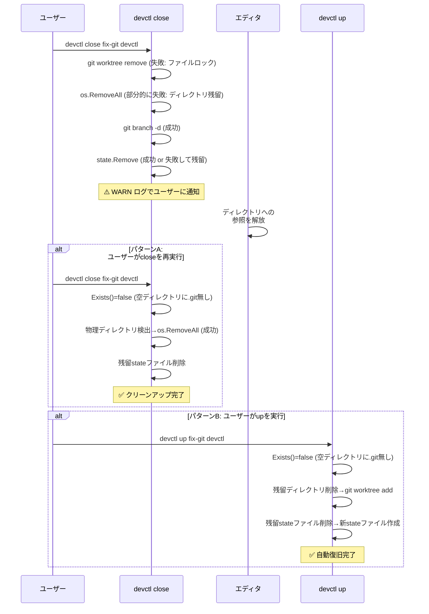

# ワークツリー残留物による再作成失敗の修正

## 背景 (Background)

### 現在の構成

`devctl up <branch> [feature]` は、ワークツリーが存在しない場合に自動的に `git worktree add` でワークツリーを作成する。ワークツリーの存在判定は `worktree.Manager.Exists()` メソッドで行われている。

```go
// worktree.go L34-38
func (m *Manager) Exists(feature, branch string) bool {
    info, err := os.Stat(m.Path(feature, branch))
    return err == nil && info.IsDir()
}
```

ワークツリーのパス構造（CLI引数リオーダー後）:
- feature指定あり: `work/<branch>/features/<feature>`
- feature指定なし: `work/<branch>/all`

stateファイルは以下のパスに配置される:

```go
// state.go L34-38
func StatePath(repoRoot, feature, branch string) string {
    if feature == "" {
        return filepath.Join(repoRoot, "work", branch, "all.state.yaml")
    }
    return filepath.Join(repoRoot, "work", branch, "features", feature+".state.yaml")
}
```

### 問題1: 空ディレクトリ残留によるワークツリー再作成失敗

`devctl close` でワークツリーを削除する際、エディタ（VSCode/Cursor/Antigravity 等）がワークツリーのディレクトリを開いていると、以下の連鎖的な失敗が発生する:

1. `git worktree remove` がファイルロックにより失敗する
2. フォールバックの `os.RemoveAll()` もエディタによるロックで失敗、またはファイルは削除されるがディレクトリ本体が残る
3. 結果として、**空のディレクトリだけが残留する**

その後、`devctl up <branch> [feature]` で再度ワークツリーを作成しようとすると:

1. `Exists()` が空ディレクトリの存在のみで `true` を返す
2. ワークツリー作成がスキップされる
3. コンテナは起動するが、**マウントされるワークツリーが空** → ソースコードなし

### 問題2: stateファイルの残留

`devctl close` は指定されたブランチ・featureの stateファイルのみ削除する。しかし以下の場合に stateファイルが残留する:

- close処理でワークツリーの削除が失敗し、stateファイルの削除も何らかの理由で失敗した場合
- ワークツリーディレクトリは`os.RemoveAll`で削除されたが、stateファイルはワークツリーディレクトリの外部（同階層）にあるため削除されない

実際に `work/` に以下のような残留物が確認された:

```
work/
└── fix-git/
    └── features/
        └── devctl/          # 空ディレクトリ（問題1）
```

### 問題の流れ



### 影響箇所

| ファイル | 問題 |
|---------|------|
| [worktree.go](file:///c:/Users/yamya/myprog/tokotachi/features/devctl/internal/worktree/worktree.go) L34-38 | `Exists()` がディレクトリの存在だけでworktreeの有無を判定 |
| [up.go](file:///c:/Users/yamya/myprog/tokotachi/features/devctl/cmd/up.go) L67-77 | `Exists()` の結果でワークツリー作成をスキップ |
| [close.go](file:///c:/Users/yamya/myprog/tokotachi/features/devctl/internal/action/close.go) L36-48 | ワークツリー削除失敗時に空ディレクトリが残留しうる |
| [state.go](file:///c:/Users/yamya/myprog/tokotachi/features/devctl/internal/state/state.go) L34-38 | stateファイルがワークツリーディレクトリ外に配置されるため、ディレクトリ削除では消えない |

### 対処する不整合パターン

正常な状態は「1.有, 2.有, 3.有, 4.有」（すべて揃っている: up済み）または「1.無, 2.無, 3.無, 4.無」（すべて無い: close済み/未作成）。以下の2パターンを**不整合状態**として検出・復旧の対象とする:

| # | コンテナ | git worktree登録 | ディレクトリ | YAML | 発生原因 | close再実行 | up実行 |
|---|---------|----------------|------------|------|---------|------------|--------|
| A | 無 | 無 | **有（空）** | 有 or 無 | エディタがロック中にclose → 空ディレクトリ残留 | ✅ 空ディレクトリ+YAML削除 | ✅ 空ディレクトリ+YAML削除後、新規作成 |
| B | 無 | 無 | 無 | **有** | close処理中のstate削除が失敗、またはディレクトリは消えたがYAMLだけ残った | ✅ YAML削除 | ✅ YAML削除後、新規作成 |

> [!CAUTION]
> **安全制約**: 不整合パターンの前提条件は「**1. コンテナ** と **2. git worktree登録** の両方が「無」であること」。いずれか一方でも「有」の場合、それは正規の状態であり不整合ではないため、**残骸クリーンアップロジックは絶対に実行してはならない**。実装時には、残留ディレクトリやstateファイルの削除を行う前に、コンテナの存在チェックおよび git worktree の登録チェックをガード条件として必ず確認すること。

#### close再実行時の各ステップ動作

| ステップ | パターンA | パターンB |
|---------|----------|----------|
| Step 1: コンテナ停止 | スキップ（無し） | スキップ（無し） |
| Step 2: ワークツリー削除 | `Exists()=false` → 物理ディレクトリを `os.RemoveAll` で削除 | スキップ（ディレクトリ無し） |
| Step 3: ブランチ削除 | tolerated failure（既に削除済み） | tolerated failure（既に削除済み） |
| Step 4: stateファイル削除 | YAML削除（存在する場合） | ✅ YAML削除 |

#### up実行時の復旧動作

| ステップ | パターンA | パターンB |
|---------|----------|----------|
| `Exists()` チェック | `false`（.git無し） | `false`（ディレクトリ無し） |
| 残留ディレクトリ検出 | 空ディレクトリを `os.RemoveAll` で削除 | スキップ（ディレクトリ無し） |
| 残留stateファイル検出 | YAML削除（存在する場合） | ✅ YAML削除 |
| ワークツリー作成 | `git worktree add` 実行 | `git worktree add` 実行 |
| 新stateファイル作成 | 新規作成 | 新規作成 |


## 要件 (Requirements)

### 必須要件

1. **R1**: `devctl up` 実行時、ワークツリーのディレクトリが存在していても中身が空（git worktreeとして無効）であれば、既存ディレクトリを削除した上で `git worktree add` を実行すること
2. **R2**: `devctl close` 実行時、ワークツリーの削除が何らかの理由で失敗した場合（エディタによるロック等）、ユーザーに状況をわかりやすくWARNログで通知すること。また、ユーザーがロックを解除した後に再度 `devctl close` を実行すると、残留ディレクトリおよびstateファイルが正常に削除されること
3. **R3**: 正常なワークツリー（`.git` ファイルが存在し、gitとして有効な状態）が存在している場合は、既存の動作どおりワークツリー作成をスキップすること
4. **R4**: `devctl up` 実行時、対応するワークツリーディレクトリが存在しない残留stateファイルを検出・クリーンアップすること

### 任意要件

5. **R5**: `Exists()` メソッドを、**gitワークツリーとして有効かどうか**を判定するロジックに改善すること（ディレクトリの存在だけでなく、`.git` ファイルまたはディレクトリの存在を確認する）

## 実現方針 (Implementation Approach)

### 1. `worktree.Manager.Exists()` の改善 (R3, R5)

現在のディレクトリ存在確認に加え、`.git` ファイルまたはディレクトリの存在を確認する:

```go
func (m *Manager) Exists(feature, branch string) bool {
    wtPath := m.Path(feature, branch)
    info, err := os.Stat(wtPath)
    if err != nil || !info.IsDir() {
        return false
    }
    // .git ファイルまたはディレクトリが無ければ有効なworktreeではない
    _, err = os.Stat(filepath.Join(wtPath, ".git"))
    return err == nil
}
```

### 2. `action/close.go` の残留ディレクトリクリーンアップ追加 (R2)

`close` の Step 2 で `Exists()` が `false` を返しても、物理ディレクトリが残っている場合はクリーンアップを試みる:

```go
// Step 2: Remove worktree (tolerated failure)
wtPath := wm.Path(opts.Feature, opts.Branch)
if wm.Exists(opts.Feature, opts.Branch) {
    // 既存パス: 有効なworktreeが存在する場合 (変更なし)
} else if info, err := os.Stat(wtPath); err == nil && info.IsDir() {
    // 新規パス: Exists()=false だが物理ディレクトリが残っている
    r.Logger.Info("Removing stale worktree directory %s...", wtPath)
    if err := os.RemoveAll(wtPath); err != nil {
        r.Logger.Warn("Stale directory cleanup failed: %v", err)
    }
}
```

### 3. `cmd/up.go` のワークツリー自動復旧ロジック追加 (R1, R4)

```go
if !wm.Exists(ctx.Feature, ctx.Branch) {
    wtPath := wm.Path(ctx.Feature, ctx.Branch)
    // 残留ディレクトリのクリーンアップ
    if info, err := os.Stat(wtPath); err == nil && info.IsDir() {
        ctx.Logger.Info("Stale worktree directory found, cleaning up %s...", wtPath)
        _ = os.RemoveAll(wtPath)
    }
    // 残留stateファイルのクリーンアップ
    staleStatePath := state.StatePath(ctx.RepoRoot, ctx.Feature, ctx.Branch)
    if _, err := os.Stat(staleStatePath); err == nil {
        ctx.Logger.Info("Removing stale state file: %s", staleStatePath)
        _ = state.Remove(staleStatePath)
    }
    // git worktree add を実行...
}
```

### 変更対象ファイル

| ファイル | 変更内容 |
|---------|---------|
| `internal/worktree/worktree.go` | `Exists()` でディレクトリ内の `.git` の存在を追加確認する |
| `internal/worktree/worktree_test.go` | `Exists()` の新ロジックのテスト追加 |
| `internal/action/close.go` | `Exists()=false` 時の残留ディレクトリクリーンアップ + WARNメッセージ改善 |
| `cmd/up.go` | 残留ディレクトリの自動クリーンアップ + 残留stateファイルのクリーンアップロジック追加 |

## 検証シナリオ (Verification Scenarios)

### シナリオ 1: 空ディレクトリが残留した状態での `devctl up` 

1. `devctl up fix-git devctl` で正常にワークツリーとコンテナを起動する
2. `devctl close fix-git devctl` でクローズする  
3. エディタなどの影響で `work/fix-git/features/devctl/` ディレクトリ（空）が残留している状態を再現する
4. `devctl up fix-git devctl` を再度実行する
5. **期待結果**: 空ディレクトリが検出・削除され、ワークツリーが正常に作成される

### シナリオ 2: エディタを閉じた後にclose再実行で残骸を削除

1. `devctl up fix-git devctl` で正常にワークツリーとコンテナを起動する
2. エディタで開いた状態で `devctl close fix-git devctl` を実行する
3. **期待結果**: WARNログが表示され、close自体は SUCCESS を返す
4. エディタを閉じる
5. 再度 `devctl close fix-git devctl` を実行する
6. **期待結果**: 残留ディレクトリが削除され、残留stateファイルも削除される

### シナリオ 3: stateファイルだけが残留した状態での `devctl up`

1. stateファイルだけが残っている状態を再現する
2. `devctl up fix-git devctl` を実行する
3. **期待結果**: 残留stateファイルが検出・削除され、新しいワークツリーとstateファイルが正常に作成される

### シナリオ 4: 正常なワークツリーが存在する場合（後方互換）

1. 正常にワークツリーとコンテナが存在する状態で再度 `devctl up fix-git devctl` を実行する
2. **期待結果**: ワークツリーの作成はスキップされる

### シナリオ 5: ワークツリーが一度も作られていない状態での `devctl up`

1. `devctl up new-branch devctl` を実行する
2. **期待結果**: ワークツリーが正常に新規作成される

## テスト項目 (Testing for the Requirements)

### 自動テスト

| 要件 | テスト方法 | 検証コマンド |
|------|----------|------------|
| R1, R5 | `worktree_test.go`: 空ディレクトリのみの場合に `Exists()` が `false` を返す | `scripts/process/build.sh` |
| R3, R5 | `worktree_test.go`: `.git` ファイルが存在する場合に `Exists()` が `true` を返す | `scripts/process/build.sh` |
| R3 | 既存テストケースが引き続きパスすること | `scripts/process/build.sh` |
| R1 | 統合テスト: 空ディレクトリが残留した状態での `devctl up` が正常動作すること | `scripts/process/integration_test.sh` |
| R2 | 統合テスト: close再実行で残留ディレクトリが削除されること | `scripts/process/integration_test.sh` |
| R4 | 統合テスト: stateファイルが残留した状態での `devctl up` が正常動作すること | `scripts/process/integration_test.sh` |
