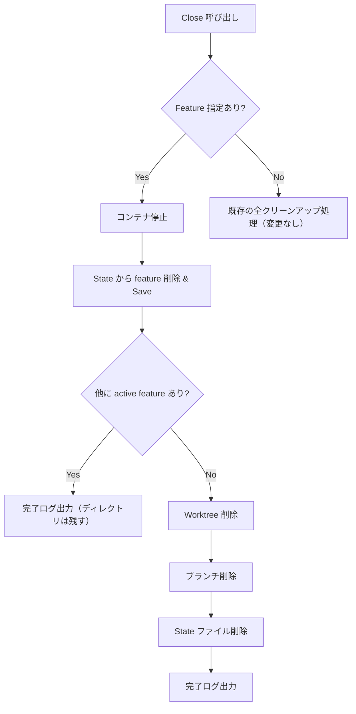

# 014: Feature Close 時の Worktree 自動クリーンアップ

## 背景 (Background)

`devctl close <branch> <feature>` を実行した際、コンテナの停止と state ファイルからの feature 削除は行われるが、`work/<branch>/` ディレクトリ（git worktree）は削除されない。

これは現在の `close.go` の設計が以下の2パスに分かれていることに起因する:

1. **Feature 指定あり**: コンテナ停止 → state から feature 削除 → **終了（ディレクトリは残る）**
2. **Feature 指定なし**: 全コンテナ停止 → worktree 削除 → ブランチ削除 → state ファイル削除

### 問題

Feature 指定で close した後、そのブランチに紐づく全ての feature が inactive になっても、worktree ディレクトリと state ファイルが残り続ける。ユーザーは「close したのにディレクトリが消えない」と混乱する。

### 再現手順

```bash
# feature を1つだけ持つブランチの場合
./bin/devctl close feat-devctl-list-up devctl --verbose
# → コンテナ停止・state 更新は成功するが、work/feat-devctl-list-up/ ディレクトリは残る
```

### 関連コード

| ファイル | 役割 |
|---|---|
| `features/devctl/internal/action/close.go` | Close アクションのメインロジック |
| `features/devctl/internal/state/state.go` | StateFile 管理（`HasActiveFeatures()` メソッドあり） |
| `features/devctl/internal/worktree/worktree.go` | Git worktree 操作（`Remove()`, `Exists()`） |
| `features/devctl/cmd/close.go` | Cobra コマンド定義 |

## 要件 (Requirements)

### 必須要件

1. **自動クリーンアップ**: Feature 指定 close 後、state ファイル内に active な feature が残っていない場合、以下を自動的に実行する:
   - git worktree の削除 (`wm.Remove`)
   - ブランチの削除 (`wm.DeleteBranch`)
   - state ファイルの削除 (`state.Remove`)

2. **安全性**: active な feature が残っている場合は、worktree の削除を行わない（現在の feature 削除のみ行う）。

3. **`--force` フラグの適用**: `--force` フラグが指定されている場合は、worktree 削除とブランチ削除にも `force` を伝播する。

4. **既存のfeature未指定closeの動作はそのまま**: `devctl close <branch>`（feature未指定）の動作は変更しない。

### 任意要件

5. **ログ出力**: 自動クリーンアップが発生した場合、その旨をログに出力する（例: `[INFO] No active features remaining. Cleaning up worktree...`）

## 実現方針 (Implementation Approach)

### 変更対象

`features/devctl/internal/action/close.go` の **feature 指定 close パス**（line 26〜49）に、クリーンアップロジックを追加する。

### 処理フロー



### 実装の詳細

`Close()` 関数の feature 指定パス（`if opts.Feature != ""` ブロック内）で、state 保存後に以下のチェックを追加:

```go
// After removing feature from state and saving...
if !sf.HasActiveFeatures() {
    // All features closed - auto cleanup
    r.Logger.Info("No active features remaining. Cleaning up worktree...")
    
    // Remove worktree (same logic as feature-less close)
    if wm.Exists(opts.Branch) {
        r.Logger.Info("Removing worktree work/%s...", opts.Branch)
        if err := wm.Remove(opts.Branch, opts.Force); err != nil {
            r.Logger.Warn("Worktree remove failed: %v", err)
            wtPath := wm.Path(opts.Branch)
            if removeErr := os.RemoveAll(wtPath); removeErr != nil {
                r.Logger.Warn("Directory cleanup also failed: %v", removeErr)
            } else {
                r.Logger.Info("Cleaned up worktree directory directly")
            }
        }
    }

    // Delete branch
    r.Logger.Info("Deleting branch %s...", opts.Branch)
    if err := wm.DeleteBranch(opts.Branch, opts.Force); err != nil {
        r.Logger.Warn("Branch delete failed: %v", err)
    }

    // Remove state file
    if err := state.Remove(statePath); err != nil {
        r.Logger.Warn("State file remove failed: %v", err)
    }
}
```

### コードの重複抑止

Feature 未指定 close パス（line 52〜107）と同じクリーンアップ処理を使うため、共通の内部関数 `cleanupWorktree()` に抽出することを検討する。

```go
func (r *Runner) cleanupWorktree(opts CloseOptions, wm *worktree.Manager, statePath string) {
    // worktree 削除
    // ブランチ削除
    // state ファイル削除
}
```

## 検証シナリオ (Verification Scenarios)

### シナリオ1: Feature 指定 close で最後の feature を閉じた場合

1. `devctl up <branch> <feature>` で環境をセットアップ
2. `devctl close <branch> <feature>` を実行
3. **期待結果**: コンテナ停止 → state 更新 → worktree 削除 → ブランチ削除 → state ファイル削除
4. `work/<branch>/` ディレクトリが存在しないこと
5. `work/<branch>.state.yaml` が存在しないこと

### シナリオ2: Feature 指定 close で他の active feature が残っている場合

1. `devctl up <branch> feature-A` で環境をセットアップ
2. `devctl up <branch> feature-B` で別の feature も追加
3. `devctl close <branch> feature-A` を実行
4. **期待結果**: feature-A のコンテナのみ停止 → state から feature-A 削除 → worktree は残る
5. `work/<branch>/` ディレクトリが存在すること
6. `work/<branch>.state.yaml` に feature-B が残っていること

### シナリオ3: Feature 未指定 close は従来通り動作する

1. `devctl up <branch> <feature>` で環境をセットアップ
2. `devctl close <branch>` を実行（feature 未指定）
3. **期待結果**: 全コンテナ停止 → worktree 削除 → ブランチ削除 → state ファイル削除（従来と同じ）

## テスト項目 (Testing for the Requirements)

### 単体テスト

close のロジックをテストする単体テストファイル `features/devctl/internal/action/close_test.go` を新規作成する。

| テストケース | 検証内容 | 対応要件 |
|---|---|---|
| `TestClose_WithFeature_LastFeature_CleansUpWorktree` | 最後の feature close 時に worktree が削除されること | 要件1 |
| `TestClose_WithFeature_OtherFeaturesRemain_KeepsWorktree` | 他の active feature がある場合は worktree を残すこと | 要件2 |
| `TestClose_WithFeature_Force_PropagatedToCleanup` | `--force` フラグが worktree/branch 削除に伝播すること | 要件3 |
| `TestClose_WithoutFeature_Unchanged` | feature 未指定 close の動作が従来通りであること | 要件4 |

### 自動検証コマンド

```bash
# 全体ビルド & 単体テスト
scripts/process/build.sh
```

### 手動検証

シナリオ1〜3を `devctl` バイナリで手動実行し、ディレクトリとファイルの残留状況を確認する。
