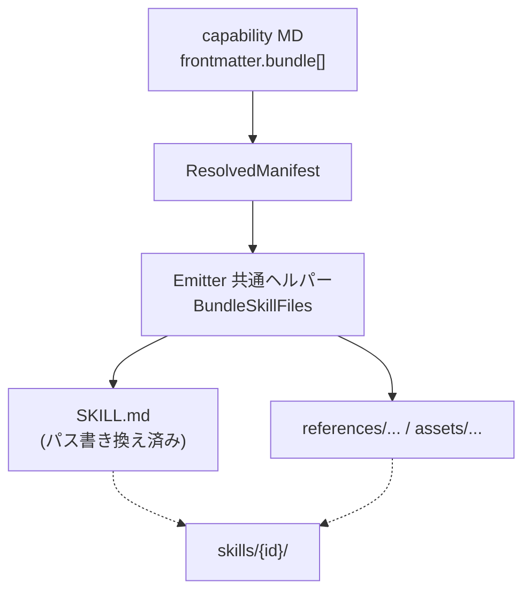

# Capability の bundle アトリビュートによるスキルフォルダ同梱

## 背景 (Background)

Agent Skills（Cursor / agentskills.io ほか）は、スキルをフォルダ単位で扱い、任意で
`scripts/`・`references/`・`assets/` を同梱し、`SKILL.md` からスキル相対パスで
オンデマンド参照する設計である。

一方、現行の `tt prompt compile` / `deploy` / `update` は次の状態にある:

1. **ソース**は `prompts/manifest/code_content/capabilities/{id}.md` の単一 Markdown
2. **Emit** 時に初めて `{skillsDir}/{id}/SKILL.md` のフォルダ形式になるが、中身は
   `SKILL.md` のみ
3. capability スキーマの `references` / `scripts` は存在するが、**emitter は未使用**
4. branch skills（`prompts/memory/branches/*/skills/`）も `SKILL.md` のみコピーする

`references` を同梱用途に流用すると、次の性質の異なる参照が混ざる:

| 種別 | 例 | 同梱の適否 |
| :--- | :--- | :--- |
| ドキュメント・スキーマ | `prompts/memory/schemas/agent-record-payload.schema.json` | 同梱すべき |
| 他 capability / procedure | `.../capabilities/record-far-knowledge.md` | 不可（別スキルとしてデプロイ済み。二重管理になる） |
| リポジトリ共通スクリプト | `scripts/code/agent/record.sh` | 不可（cwd・相対依存で壊れやすい） |

そのため、**スキルフォルダへ物理同梱する対象専用のアトリビュート**を新設し、
既存の `references` / `scripts` は「案内用メタデータ」として残す。

なお、target / bundle エンティティは既に `includes` を別意味で使用しているため、
capability 側では **`bundle`** という名称を採用する（命名衝突の回避）。

## 要件 (Requirements)

### 必須要件

#### R1: capability スキーマに `bundle` を追加する

- `prompts/manifest/schemas/capability.schema.json`（およびカタログ原本・testdata の同スキーマ）に
  `bundle` プロパティを追加する
- `bundle` はオプション。未指定時は現行どおり `SKILL.md` のみ emit する（後方互換）
- 各要素は少なくとも次を表現できること:
  - `src`: ワークスペース相対のソースパス（必須）
  - `dest`: スキルルート相対の配置先パス（必須）
- `dest` はスキルルート内に収まること（`..` や絶対パスを禁止）
- `additionalProperties: false` を維持する

> **Review Point (2026-09-03)**: スキーマ改変を先行適用済み。
> `prompts/manifest/schemas/capability.schema.json` およびカタログ原本・testdata の同ファイルに
> `bundle`（`src`/`dest` 必須）を追加し、`references` / `scripts` の description を
> 「同梱しない案内用」と明記した。実装計画では emitter 実装とテストを中心とする。

スキーマ形状:

```yaml
bundle:
  - src: prompts/memory/schemas/agent-record-payload.schema.json
    dest: references/agent-record-payload.schema.json
```

#### R2: Emit 時に `bundle` 対象をスキルフォルダへ同梱する

- Cursor / Claude Code / Codex / Antigravity の全 capability emitter で、
  selected な capability について:
  1. 従来どおり `{skillsDir}/{id}/SKILL.md` を書く
  2. `bundle` の各エントリについて `{skillsDir}/{id}/{dest}` へ `src` の内容をコピーする
- `src` が存在しない場合は **エラー**（silent skip 禁止）
- コピー結果は `EmittedFiles` に登録し、immune モードの orphan 削除対象から除外する
- procedure をスキルとして emit する場合、本仕様のスコープ外とする（将来拡張可）。
  ただし共通ヘルパーを capability と共有できる設計にしてよい

#### R3: `SKILL.md` 本文内のパスをスキル相対に書き換える

- capability body 内に、`bundle[].src` と一致するワークスペース相対パス表記がある場合、
  対応する `bundle[].dest`（スキル相対、必要なら `./` 付き）へ置換する
- 置換対象は少なくとも次の表記をカバーする:
  - バッククォート囲みのインラインコード（portable-file-references 規約）
  - Markdown リンクのパス部分（存在する場合）
- `bundle` に無いパス（他スキル名、`./scripts/...` など）は変更しない
- frontmatter の `references` / `scripts` 自体は同梱・書き換えの対象にしない
  （案内メタデータのまま残す）

#### R4: `references` / `scripts` の意味を維持する（非同梱）

- `references`: 「関連ドキュメントへの案内」。Emit では同梱しない
- `scripts`: 「リポジトリ上の実行入口の案内」。Emit では同梱・コピーしない
- ドキュメントおよびスキーマ description で、同梱は **`bundle` のみ**であることを明記する

#### R5: Drift / Check が companion ファイルを扱う

- `Check()` および orphan cleanup が、`SKILL.md` 以外の同梱ファイルも
  「期待される成果物」として扱うこと
- 非 `.md` ファイル（例: `.json`）も drift 比較または少なくとも
  「欠落 / 余剰」を検出できること

#### R6: 既存 capability のうち同梱意図があるものを移行する

- 少なくとも `record-far-knowledge` の
  `prompts/memory/schemas/agent-record-payload.schema.json` を
  `references` から `bundle` へ移す（または `bundle` に追加し、
  body 内パスを `references/...` 相対表記に更新する）
- peer capability / procedure を指す `references`、および
  `scripts/code/agent/*.sh` を指す `scripts` は **`bundle` に移さない**

### 任意要件

#### O1: Branch skills のディレクトリ丸ごとコピー

- `EmitBranchSkills` が `SKILL.md` 以外の同ディレクトリ配下ファイルもコピーする
- 本仕様の必須範囲ではないが、Agent Skills 規約との整合のため推奨

#### O2: `dest` 省略時のデフォルト配置

- `dest` 省略時に拡張子や種別から `references/<basename>` 等へ自動配置する
- 必須ではない。初回実装では `dest` 必須の方が検証しやすい

#### O3: ソース側のフォルダ形式（`capabilities/{id}/SKILL.md`）

- 長期的にはソースもフォルダ形式へ寄せられるとよいが、本仕様のスコープ外とする

## 実現方針 (Implementation Approach)

### 設計方針



1. **意味の分離**
   - `bundle` = 物理同梱 + body パス書き換え
   - `references` / `scripts` = 文書的関連（現状維持）
2. **共通ヘルパー**
   - `features/tt/internal/prompt/emitter/` に
     `RewriteBundlePaths(body, entries) string` と
     `EmitBundledFiles(skillDir, workspaceRoot, entries, opts) (emitted map, error)`
     を置き、各ターゲット emitter から呼ぶ
3. **パス解決**
   - `src` は workspace root（emitter の `RootDir`）基準
   - `dest` はスキルディレクトリ基準。`filepath.Clean` 後にスキル外へ出ないことを検証
4. **カタログ同期**
   - `catalog/originals/.../capability.schema.json` と
     compiler testdata 内スキーマも同じ変更を入れる
5. **TDD**
   - ヘルパーと各 emitter（または共通経路）の単体テストを先に書く
   - fixture に `bundle` 付き capability を置き、deploy/check で companion を検証する

### 非目標

- ソース capability をフォルダ形式へ強制移行すること
- プロジェクト共通スクリプトをスキル内へ複製すること
- peer capability / procedure の内容を別スキルへ埋め込むこと
- `includes` という名前の capability アトリビュートを導入すること

## 検証シナリオ (Verification Scenarios)

### S1: bundle 未指定は現行互換

1. `bundle` を持たない既存 capability を compile / deploy する
2. 出力はこれまでどおり `{skillsDir}/{id}/SKILL.md` のみである
3. orphan cleanup で既存スキルが誤削除されない

### S2: bundle 同梱と相対パス書き換え

1. テスト用 capability に次を定義する:
   - `bundle`: `src=testdata/foo.schema.json`, `dest=references/foo.schema.json`
   - body 内に `` `testdata/foo.schema.json` `` を含む
2. deploy（または emit apply）する
3. `{skillsDir}/{id}/SKILL.md` が存在し、本文のパスが
   `` `references/foo.schema.json` ``（または `./references/foo.schema.json`）に置換されている
4. `{skillsDir}/{id}/references/foo.schema.json` が存在し、内容がソースと一致する

### S3: src 欠落はエラー

1. `bundle[].src` に存在しないパスを指定する
2. compile/deploy/emit が非ゼロ終了し、対象パスを示すエラーを出す
3. 不完全なスキルフォルダを成功扱いにしない

### S4: dest トラバーサル拒否

1. `dest: ../other-skill/evil.json` または絶対パスを指定する
2. Emit がエラーになる（スキル外書き込みなし）

### S5: references / scripts だけでは同梱されない

1. `references` と `scripts` のみを持つ capability（`bundle` なし）を deploy する
2. スキルフォルダに companion ファイルが増えない
3. body 内の `./scripts/...` パスは書き換えられない

### S6: drift / orphan が companion を認識する

1. S2 の成果物がある状態で `prompt deploy --check`（または同等の Check）を実行し、drift なし
2. companion ファイルを削除して Check すると欠落を検出する
3. 手動で余分な companion を置いた状態で immune deploy すると orphan として除去される
   （または Check が untracked として報告する）

### S7: 実 capability 移行（record-far-knowledge）

1. `record-far-knowledge` に schema を `bundle` した状態で update/deploy する
2. 各ターゲットの `skills/record-far-knowledge/` に
   `SKILL.md` と schema ファイルが存在する
3. `SKILL.md` 内の当該スキーマ参照がスキル相対になっている
4. `pre-push-knowledge-check` の peer 参照や `scripts` エントリは同梱されていない

## テスト項目 (Testing for the Requirements)

| 要件 | 検証手段 |
| :--- | :--- |
| R1 | スキーマ fixture による validator 単体テスト（合法 / 不正 dest / 欠落 src フィールド） |
| R2 | emitter 単体テスト + deploy fixture（全ターゲット、または共通ヘルパー + 代表1ターゲット） |
| R3 | `RewriteBundlePaths` のテーブル駆動単体テスト |
| R4 | S5 相当の単体/統合テスト（references/scripts のみでは companion が増えない） |
| R5 | Check / CleanOrphanFiles の単体テスト（非 md companion） |
| R6 | カタログ/現行 capability の内容確認テスト、または deploy 後ファイル存在アサーション |
| S1–S7 | 下記ビルドおよび `tt` 統合テスト |

### ビルド・全体検証

1. ビルド＋単体テスト（prompt/emitter 変更の中心検証）:

   ```text
   scripts/process/build.sh --skip-frontend --skip-etc
   ```

2. `tt` 統合テスト（compile / deploy / emit / tags 周辺のリグレッション）:

   ```text
   scripts/process/integration_test.sh --categories "tt" --specify "Prompt|Emit|Deploy|Compile|Capability|Bundle|Tag"
   ```

3. 影響が `tt` に閉じるため、`gui` / `llm` / `taskengine` / `template` カテゴリは本仕様の必須検証に含めない。
   Nightly 相当の全カテゴリ実行は任意とする。
