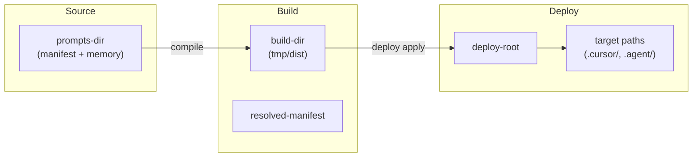

# tt prompt コマンドのパス指定オプション拡張

## 背景 (Background)

現状、`tt prompt compile` / `deploy` / `update` は、リポジトリ直下の `prompts/` をソースとし、`project.yaml` の設定に従って `tmp/dist/` に中間成果物を出力し、`deploy` ではエディタ向け設定（`.cursor/`、`.agent/` 等）を**同一リポジトリルート**へ展開する前提で動作している。

この前提は tokotachi 本体リポジトリでは十分だが、以下のような用途拡張には対応できない。

- プロンプト定義だけ別ディレクトリ／別リポジトリに置き、アプリケーション側へ deploy したい
- 中間成果物（resolved manifest や build 出力）を `tmp/dist/` 以外へ出したい
- deploy 先（エディタ設定の配置ルート）を compile 元と別のワークスペースにしたい
- monorepo や scaffold 生成物のように、`prompts/` 以外のパス構成を使いたい

現状の CLI・設定でどこまで指定可能かを整理し、不足するオプションを追加する。

## 現状調査: 既存のパス関連オプション

### CLI フラグ（`tt prompt` サブコマンド）

| コマンド | フラグ | デフォルト | 役割 |
|---|---|---|---|
| compile / deploy / update | `--project <path>` | `prompts/manifest/project.yaml` | `project.yaml` へのパス。CWD からの相対パス |
| compile / deploy / update | `--target <name>` | `TT_TARGET` 環境変数、未設定時 `all` | エミッタターゲット（`antigravity`, `cursor`, `claude-code`, `codex`, `all`） |
| compile | `--dry-run` | false | ファイルを書き出さず stdout に resolved manifest を出力 |
| compile | `--apply` | false | 生成物をターゲットディレクトリへ直接配置（deploy 相当の apply モード） |
| deploy | `--force` | false | ダイジェスト一致時も強制実行 |
| deploy | `--dry-run` | false | シミュレーション実行 |
| deploy | `--mode <mode>` | `overwrite` | `overwrite` / `immune` / `skip` |
| update | `--force` | false | git 変更検知・メタデータチェックをバイパス |
| update | `--dry-run` | false | シミュレーション実行 |

**グローバルフラグ**（全サブコマンド）: `--verbose`, `--dry-run`, `--report <file>`

**参考**: `scaffold` コマンドには `--root <path>` があり、Git ルートの代わりに展開先ルートを明示指定できる。`prompt` コマンドには同等のフラグはない。

### 環境変数

| 変数 | 用途 | デフォルト |
|---|---|---|
| `TT_TARGET` | `prompt` 系のデフォルト `--target` | `all` |
| `TT_TOOL` | ラッパースクリプトが呼び出す `tt` バイナリのパス | PATH / `bin/tt` |

パス（workspace / prompts / dist / deploy 先）を上書きする環境変数は**現状存在しない**。

### `project.yaml` による設定（ワークスペースルートからの相対パス）

`prompts/manifest/project.yaml` の例:

```yaml
sources:
  policies: prompts/manifest/code_content/policies/**/*.md
  memory_docs: prompts/memory/**/*.md
outputs:
  resolved_manifest: tmp/dist/manifest.resolved.yaml
defaults:
  build_dir: tmp/dist/
```

| 設定項目 | 役割 |
|---|---|
| `sources.*` | 各エンティティ種別のソース glob（`prompts/` 配下を前提としたパターン） |
| `outputs.resolved_manifest` | resolved manifest の出力先 |
| `defaults.build_dir` | エミッタの build 出力ルート（compile 時の staging 領域） |

### 暗黙のパス解決（CLI では指定不可）

以下はコード上ハードコードまたは `--project` から**暗黙推論**される。

| 項目 | 現状の解決方法 | 実装箇所 |
|---|---|---|
| **ワークスペースルート** | `--project` の 3 階層上を root とみなす（`{root}/prompts/manifest/project.yaml` 前提） | `ResolveProjectRoot()` |
| **スキーマディレクトリ** | `{root}/prompts/manifest/schemas` 固定 | `compiler.Compile()` |
| **deploy 先ルート** | ワークスペースルートと同一（`apply=true` 時） | 各 Emitter の `RootDir` |
| **build 出力先** | `{root}/{defaults.build_dir}` | `compiler.Compile()`, `Deploy()` |
| **ターゲット配下パス** | target エンティティの `paths`（例: `.cursor/rules/`） | `prompts/manifest/targets/*.yaml` |
| **update の git 監視パス** | `prompts/manifest/`, `prompts/memory/` 固定 | `CheckForChanges()` |
| **update メタデータ配置** | `{root}/.cursor/.meta/` 等、ターゲット別固定 | `pkg/resolve.MetaDir()` |

### ラッパースクリプト（`scripts/code/prompt/*.sh`）

`compile.sh` / `deploy.sh` / `update.sh` は `--force`, `--verbose`, `--dry-run` のみ `tt` に転送する。

`--project`, `--target`, `--apply`, `--mode` 等は**転送されない**（直接 `tt prompt ...` を呼べば利用可能）。

### 現状で可能なこと・不可能なこと

**可能（間接的）**:

- 別の `project.yaml` を `--project path/to/project.yaml` で指定（ただし root は `project.yaml` 位置から 3 階層上と推論される）
- `project.yaml` 内で `sources` / `build_dir` / `resolved_manifest` をカスタムパスに変更
- target エンティティの `paths` で deploy 先サブディレクトリ（`.cursor/rules/` 等）を変更

**不可能（CLI / 環境変数レベル）**:

- ワークスペースルートを `project.yaml` 位置と独立して指定
- deploy 先ルートを compile 元ワークスペースと分離
- `prompts/` ディレクトリ名・位置の共通上書き（スキーマパス・update 監視パス含む）
- `build_dir` / `resolved_manifest` の CLI 上書き
- ラッパースクリプト経由でのパス系オプション指定

## 要件 (Requirements)

### 必須要件

#### R1. ワークスペースルートの明示指定

- 新フラグ `--workspace <path>` を `prompt compile` / `deploy` / `update` に追加する
- 対応環境変数 `TT_WORKSPACE` を追加する（フラグが優先）
- デフォルト: 従来通り `--project` から `ResolveProjectRoot()` で推論
- `--workspace` 指定時:
  - `--project` が相対パスの場合、`{workspace}/{project}` として解決
  - deploy メタデータ（`.cursor/.meta/` 等）、Emitter の `RootDir`（apply 時）、digest 計算の root 基準に使用

#### R2. プロンプトソースルート（`prompts/` 相当）の指定

- 新フラグ `--prompts-dir <path>` を追加する
- 対応環境変数 `TT_PROMPTS_DIR` を追加する（デフォルト: `prompts`）
- 効果:
  - デフォルト `--project` を `{workspace}/{prompts-dir}/manifest/project.yaml` に解決（`--project` 明示時はそちらを優先）
  - スキーマディレクトリを `{workspace}/{prompts-dir}/manifest/schemas` に変更
  - `prompt update` の git 変更監視を `{prompts-dir}/manifest/`, `{prompts-dir}/memory/` に変更
- `project.yaml` の `sources` glob は従来通り workspace 相対パスとして解釈する（既存 project.yaml との互換維持）。`--prompts-dir` を使う場合は、project.yaml 側のパスも整合させる必要がある旨をドキュメント化する

#### R3. ビルド出力ディレクトリ（`tmp/dist/` 相当）の CLI 上書き

- 新フラグ `--build-dir <path>` を追加する
- 対応環境変数 `TT_BUILD_DIR` を追加する
- 指定時は `project.yaml` の `defaults.build_dir` より CLI/環境変数を優先
- resolved manifest 出力先は、従来どおり `outputs.resolved_manifest` を使うが、`--build-dir` 指定時に `--resolved-manifest` 未指定なら `{build-dir}/manifest.resolved.yaml` をデフォルトとする（後述 R3b）

#### R3b. resolved manifest 出力先の CLI 上書き（任意だが推奨）

- 新フラグ `--resolved-manifest <path>` を追加する
- 対応環境変数 `TT_RESOLVED_MANIFEST` を追加する
- `project.yaml` の `outputs.resolved_manifest` より優先

#### R4. deploy 先ルートの指定

- 新フラグ `--deploy-root <path>` を追加する
- 対応環境変数 `TT_DEPLOY_ROOT` を追加する
- デフォルト: `--workspace`（または推論された workspace）
- `deploy` / `compile --apply` / `update` で Emitter が `apply=true` のとき、target エンティティ `paths`（`.cursor/rules/` 等）の基準ルートとして使用
- compile の staging（`apply=false`）は従来通り `--build-dir` 配下

#### R5. 優先順位の統一

各パス設定の優先順位を以下に統一する。

```
CLI フラグ > 環境変数 > project.yaml > 組み込みデフォルト
```

#### R6. ラッパースクリプトの更新

`scripts/code/prompt/compile.sh`, `deploy.sh`, `update.sh` が新フラグを透過的に `tt` へ転送できるようにする。

- 転送対象: `--workspace`, `--prompts-dir`, `--build-dir`, `--resolved-manifest`, `--deploy-root`, `--project`, `--target`, `--apply`, `--mode` および既存フラグ
- 未知引数はエラーにせず `tt` に渡す方式（`compile.sh` 等の case 文を拡張、または `"$@"` 透過）を採用

#### R7. 後方互換性

- 新フラグ・環境変数未指定時は現行挙動と同一結果になること
- 既存の `project.yaml` および `ResolveProjectRoot()` の推論ロジックは維持

#### R8. `--help` におけるパス系フラグの説明文

`tt prompt compile|deploy|update --help` および `tt prompt --help` で、フォルダ／パス指定フラグの意味・基準・デフォルト・環境変数が**一貫した形式**で読めること。

- デフォルト値は **パス式**（例: `{workspace} + {prompts-dir} + manifest/project.yaml`）で記述する
- 主要パスの解決式一覧（仕様書「パス式」節）と help 文言を一致させる

説明文は実行時に動的生成しない（Cobra `Flags().StringVar(..., help)` のリテラル文字列として実装する）。デフォルト値の変更はフラグ定義側の default 引数と help 文字列をセットで更新する。

### 任意要件

- `tt-user-manual.md` に新フラグ・環境変数の説明を追記
- `ResolveProjectRoot()` を `--workspace` + `--project` ベースの明示解決に段階的移行（将来 `--project` のみでの root 推論を非推奨化）

## 実現方針 (Implementation Approach)

### パス解決モデル

4 つの論理パスを分離する。



### 新パッケージ: パス解決ヘルパー

`features/tt/internal/prompt/compiler/paths.go`（仮）に `PathConfig` を導入する。

```go
type PathConfig struct {
    Workspace         string // 推論または --workspace
    ProjectYAML       string // 解決済み project.yaml 絶対パス
    PromptsDir        string // 相対: workspace 基準
    BuildDir          string // 相対: workspace 基準
    ResolvedManifest  string // 相対: workspace 基準
    DeployRoot        string // deploy apply 時のルート
}
```

`ResolvePaths(opts PathOptions) (PathConfig, error)` で CLI / 環境変数 / project.yaml をマージする。

### 変更対象

| ファイル | 変更内容 |
|---|---|
| `features/tt/cmd/prompt.go` | 新フラグ定義、`PathConfig` 解決呼び出し、各 `CompileOptions` / `DeployOptions` / `UpdateOptions` へ伝播 |
| `features/tt/internal/prompt/compiler/compiler.go` | `CompileOptions` に `PathConfig` 追加。スキーマ・buildDir・resolved manifest 書き込みを `PathConfig` 参照に変更 |
| `features/tt/internal/prompt/compiler/deploy.go` | digest パス、Emitter `RootDir` を `DeployRoot` / `BuildDir` に分離 |
| `features/tt/internal/prompt/compiler/update.go` | `CheckForChanges()` の監視パスを `PromptsDir` から生成 |
| `features/tt/internal/prompt/compiler/config.go` | `ResolveProjectRoot` を `PathConfig` 解決に統合（後方互換維持） |
| `features/tt/internal/prompt/emitter/*.go` | Emitter 構造体に `DeployRoot` を渡す（現 `RootDir` の意味を deploy apply 専用に明確化） |
| `scripts/code/prompt/*.sh` | 新フラグ透過 |
| `docs/manual/tt-user-manual.md` | ドキュメント追記 |

### CLI フラグ一覧（追加後）

```
tt prompt compile|deploy|update \
  [--workspace <path>] \
  [--prompts-dir <path>] \
  [--project <path>] \
  [--build-dir <path>] \
  [--resolved-manifest <path>] \
  [--deploy-root <path>] \
  [--target <name>] \
  ...既存フラグ...
```

### `--help` パス系フラグ説明文の組み立て規則

Cobra の flag help（第 4 引数）を、次のテンプレートで統一する。

#### テンプレート

```
{役割の一文}. {相対基準}. Default: {デフォルト式}. Env: {TT_XXX} (flag wins).
```

| プレースホルダ | 記述ルール |
|---|---|
| `{役割の一文}` | 英語・能動態・1文。何のパスか（入力／出力／deploy 先）を先に書く |
| `{相対基準}` | 相対パス時の基準を `Relative to <anchor> unless absolute.` の形で明記。絶対パスはそのまま使用可能であることはこの句で暗黙に含める |
| `{デフォルト式}` | 未指定時に効く値。**パス式**（後述）で `{workspace} + {prompts-dir}` のように記述する。`project.yaml` 由来は `{workspace} + project.yaml defaults.build_dir` のように出典を混在可 |
| `{TT_XXX}` | 対応する環境変数名。無い場合は `Env: (none).` とする |
| `(flag wins)` | 固定句。CLI フラグが環境変数より優先されることを示す（R5 と一致） |

**相対基準（anchor）の対応表**:

| フラグ | anchor 文言（help 内） | 実際の解決 |
|---|---|---|
| `--workspace` | `Relative to CWD unless absolute` | CWD 基準 |
| `--prompts-dir` | `Relative to workspace unless absolute` | workspace 基準 |
| `--project` | `Relative to workspace if set, else CWD unless absolute` | workspace 未設定時は CWD |
| `--build-dir` | `Relative to workspace unless absolute` | workspace 基準 |
| `--resolved-manifest` | `Relative to workspace unless absolute` | workspace 基準 |
| `--deploy-root` | `Relative to CWD unless absolute` | CWD 基準（別 checkout 指定を想定） |

**文字列組み立ての禁止・推奨**:

- 禁止: help 内で Go 式や関数呼び出し風の記法（例: `filepath.Join(...)`）
- 禁止: 日本語 help（CLI help は英語。ユーザーマニュアルで日本語説明を補足）
- 推奨: デフォルト式は実際の flag default 値と矛盾しないこと
- 推奨: 依存関係があるフラグは、デフォルト式内で **パス式** を使い、実装の `ResolvePaths` と同じ用語に揃える

#### パス式（Path Expression）

help の `Default:` およびユーザーマニュアルで、解決後パスを次の記法で表す。

**記法**:

```
{論理名} + {論理名} + ... + リテラルセグメント
```

| 要素 | 意味 |
|---|---|
| `{workspace}` | 解決済み workspace ルート（`--workspace` または `--project` から推論） |
| `{prompts-dir}` | 解決済み prompts ソースルート（デフォルト: リテラル `prompts`） |
| `{build-dir}` | 解決済み build 出力ルート（デフォルト: `project.yaml defaults.build_dir` または `tmp/dist/`） |
| `{resolved-manifest}` | 解決済み resolved manifest ファイルパス |
| `{deploy-root}` | 解決済み deploy 先ルート（デフォルト: `{workspace}`） |
| `{cwd}` | コマンド実行時のカレントディレクトリ |
| `+` | パス結合（help 上の概念記号。実装では OS ネイティブの join に相当） |
| リテラルセグメント | `manifest/project.yaml`, `.cursor/rules/` 等。先頭 `/` またはドライブ文字付きは絶対パス |

**絶対パスの扱い**（help の `{相対基準}` と対応）:

- オペランドが絶対パスなら、式全体はその絶対パス（左側の `{workspace}` 等は無視）
- help では `unless absolute` で一言で触れ、式自体は相対形で示す

**主要パスの解決式一覧**（help / マニュアル / 実装で共通の参照表）:

| 用途 | パス式 |
|---|---|
| prompts ソースルート | `{workspace} + {prompts-dir}` |
| project.yaml（デフォルト） | `{workspace} + {prompts-dir} + manifest/project.yaml` |
| スキーマディレクトリ | `{workspace} + {prompts-dir} + manifest/schemas` |
| update git 監視（manifest） | `{workspace} + {prompts-dir} + manifest/` |
| update git 監視（memory） | `{workspace} + {prompts-dir} + memory/` |
| build 出力ルート | `{workspace} + {build-dir}` |
| resolved manifest（フォールバック） | `{workspace} + {build-dir} + manifest.resolved.yaml` |
| digest ファイル | `{workspace} + {build-dir} + .compile-digest[-{target}]` |
| deploy 先（apply、例: cursor rules） | `{deploy-root} + .cursor/rules/` |
| compile staging（apply=false、例） | `{workspace} + {build-dir} + cursor/.cursor/rules/` |

**help 内でのパス式の書き方**:

- `Default:` では上表の式をそのまま使う（例: `Default: {workspace} + {prompts-dir} + manifest/project.yaml.`）
- 単一論理名のみのデフォルトは `{prompts-dir}` のように `{}` のみ可（暗黙の `{workspace} +` は `{相対基準}` 句で補う）
- 式が長い場合は help 1 行に収めるため、末尾セグメントのみ省略可（例: `Default: {workspace} + {prompts-dir} (default segment: prompts).`）— ただし `--project` / `--build-dir` は完全式を推奨

#### 各フラグの help 文字列（確定案）

`features/tt/cmd/prompt.go` の `Flags().StringVar` 第 4 引数にそのまま設定する。

```go
// 共有定数（prompt compile / deploy / update で同一文字列を使う）
const (
    helpWorkspace = "Workspace root for path resolution. Relative to CWD unless absolute. Default: inferred from --project (see path expr: {workspace}). Env: TT_WORKSPACE (flag wins)."
    helpPromptsDir = "Prompts source root (manifest and memory). Relative to workspace unless absolute. Default: {workspace} + {prompts-dir} (segment: prompts). Env: TT_PROMPTS_DIR (flag wins)."
    helpProject = "Path to project.yaml. Relative to workspace if set, else CWD unless absolute. Default: {workspace} + {prompts-dir} + manifest/project.yaml. Env: (none)."
    helpBuildDir = "Build output directory for staging and digests. Relative to workspace unless absolute. Default: {workspace} + {build-dir} (from project.yaml defaults.build_dir or tmp/dist/). Env: TT_BUILD_DIR (flag wins)."
    helpResolvedManifest = "Resolved manifest output path. Relative to workspace unless absolute. Default: {workspace} + {resolved-manifest} (from project.yaml outputs.resolved_manifest or {build-dir} + manifest.resolved.yaml). Env: TT_RESOLVED_MANIFEST (flag wins)."
    helpDeployRoot = "Root directory for editor config deployment in apply mode. Relative to CWD unless absolute. Default: {deploy-root} = {workspace}. Env: TT_DEPLOY_ROOT (flag wins)."
)
```

**既存フラグ `--project` の help 更新**: 現行 `"Path to project.yaml"` を上記 `helpProject` に置き換える。

#### コマンド Long への補足（任意）

各サブコマンドの `Long` フィールド末尾に、パス解決の概要を 2 行追加してもよい。

```
Path flags resolve in order: --workspace, --prompts-dir, --project, --build-dir,
--resolved-manifest, --deploy-root. Paths compose as {workspace} + {prompts-dir} + ...
See --help for defaults and TT_* env vars.
```

#### help 表示の検証

1. `tt prompt compile --help` で上記 6 フラグ（＋更新済み `--project`）の説明がテンプレート形式で表示されること
2. `tt prompt deploy --help` / `tt prompt update --help` でも compile と同一文言であること（共有定数利用）
3. 単体テストで help 文字列定数のスナップショット、または `grep` による存在確認を `paths_test.go` または `prompt_test.go` に追加してもよい（任意）

### 使用例

**例 1: 同一リポジトリ（現行互換、変更なし）**

```bash
tt prompt deploy --target cursor
```

**例 2: プロンプト定義を `catalog/prompts/` に置く**

```bash
tt prompt deploy \
  --workspace . \
  --prompts-dir catalog/prompts \
  --project catalog/prompts/manifest/project.yaml
```

**例 3: 中間成果物だけ別ディレクトリへ**

```bash
tt prompt compile \
  --build-dir .cache/tt-dist \
  --target cursor
```

**例 4: 別ワークスペースへ deploy**

```bash
tt prompt deploy \
  --workspace ./prompt-repo \
  --deploy-root ../app-checkout \
  --target cursor
```

## 検証シナリオ (Verification Scenarios)

1. **後方互換**: 新フラグなしで `tt prompt deploy --target cursor` を実行し、従来と同一の `.cursor/` 出力および `tmp/dist/` 生成が行われること
2. **build-dir 上書き**: `--build-dir .cache/tt-dist` 指定時、resolved manifest と digest が `.cache/tt-dist/` 配下に生成され、`tmp/dist/` は変更されないこと
3. **deploy-root 分離**: `--deploy-root /path/to/other-ws` 指定時、`.cursor/rules/` 等が other-ws 側に出力され、prompt ソース側 workspace の `prompts/` は読み取り専用で触られないこと
4. **prompts-dir 変更**: `--prompts-dir custom/prompts` 指定時、スキーマ読み込み・update の git 監視パスが `custom/prompts/manifest/` / `custom/prompts/memory/` になること
5. **環境変数優先**: `TT_BUILD_DIR=env-dist TT_WORKSPACE=. tt prompt compile --build-dir cli-dist` で `cli-dist` が使われること（CLI > env）
6. **ラッパー透過**: `scripts/code/prompt/deploy.sh --deploy-root /tmp/ws --target cursor` が `tt` に正しく渡ること

## テスト項目 (Testing for the Requirements)

### ビルド・全体検証

1. ビルド＋単体テスト:
   ```
   scripts/process/build.sh
   ```

2. コンパイラ・パス解決の単体テスト（新規）:
   - `features/tt/internal/prompt/compiler/paths_test.go` で `ResolvePaths` の優先順位・デフォルト推論を検証
   - 既存 `compiler_test.go`, `deploy_test.go`, `update_test.go` に `--build-dir` / `--deploy-root` ケースを追加

3. 統合テスト（prompt コンパイラ関連）:
   ```
   scripts/process/integration_test.sh --categories "common" --specify "PromptCompile|PromptDeploy|ResolvePaths"
   ```

   影響範囲が `common` カテゴリに該当テストが無い場合は、上記 `--specify` で追加した Go 単体テストを `scripts/process/build.sh` の実行で代替確認する。

### 要件とテストの対応

| 要件 | 検証方法 |
|---|---|
| R1 workspace | `paths_test.go`: workspace 推論・CLI 上書き |
| R2 prompts-dir | `update_test.go`: git 監視パス生成、`compiler_test.go`: schemas パス |
| R3 build-dir | `deploy_test.go`: digest ファイル位置 |
| R3b resolved-manifest | `compiler_test.go`: 出力ファイルパス |
| R4 deploy-root | `deploy_test.go` + emitter テスト: apply 先 RootDir |
| R5 優先順位 | `paths_test.go`: flag > env > yaml |
| R6 ラッパー | shell スクリプトの引数透過テスト（可能なら bats、最低限手動シナリオ 6） |
| R7 後方互換 | 既存 `compiler/testdata/valid` による regression |
| R8 help 文言 | `tt prompt compile --help` 出力確認、または help 定数の Go テスト |
