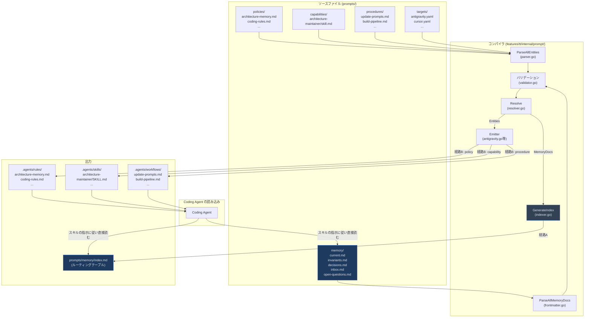

# Project Memory のコンパイルプロセス -- 調査レポート

## 調査概要

**目的**: `prompts/memory/` 配下の Project Memory ドキュメントが、`tt prompt compile/deploy` によってどのように処理され、最終的に Coding Agent が利用する形式（スキル、ルール等）として配備されるかを、ソースコードレベルでトレースする。

**スコープ**: `features/tt/internal/prompt/` パッケージ群 (compiler, manifest, memory, emitter)

---

## 調査結果

### 核心的な発見: memory は「スキルそのもの」にはならない

まず重要な事実として、**memory ドキュメント自体はスキルやルールに変換されるわけではない**。
memory ドキュメントはコンパイルパイプラインの中で**2つの異なる経路**を通る:

| 経路 | 処理内容 | 出力 |
|:---|:---|:---|
| **経路A: index.md の生成** | memory ドキュメントのフロントマターを集約してルーティングテーブルを生成 | `prompts/memory/index.md` (Coding Agentが直接参照) |
| **経路B: memory を参照するエンティティの変換** | memory を参照・制御するポリシーやスキル(capability)が、エミッターによって各Agent形式に変換 | `.agents/rules/*.md`, `.agents/skills/*/SKILL.md` 等 |

つまり、Coding Agentが「スキル」として認識するのは、**memory そのものではなく、memory を操作するための指示書 (architecture-maintainer, architecture-memory 等)** である。

---

## コンパイルパイプラインの詳細トレース

### フェーズ 1: 設定読み込みとプロジェクトルート算出

**ファイル**: [compiler.go L32-45](file:///c:/Users/yamya/myprog/tokotachi/work/fix-open-close-bug/features/tt/internal/prompt/compiler/compiler.go#L32-L45)

```go
// 1. Load config
cfg, err := LoadConfig(opts.ProjectPath)
// 2. Resolve project root
rootDir, err := ResolveProjectRoot(opts.ProjectPath)
```

[project.yaml](file:///c:/Users/yamya/myprog/tokotachi/work/fix-open-close-bug/prompts/manifest/project.yaml) を読み込み、以下の情報を取得する:

```yaml
sources:
  policies: prompts/manifest/code_content/policies/**/*.md
  procedures: prompts/manifest/code_content/procedures/**/*.md
  capabilities: prompts/manifest/code_content/capabilities/**/skill.md
  memory_docs: prompts/memory/**/*.md     # <-- memory ドキュメントのソース
outputs:
  memory_index: prompts/memory/index.md   # <-- 生成される index.md のパス
```

### フェーズ 2: ソースファイルの解析 (Entity と MemoryDoc の分離)

**ファイル**: [compiler.go L47-58](file:///c:/Users/yamya/myprog/tokotachi/work/fix-open-close-bug/features/tt/internal/prompt/compiler/compiler.go#L47-L58)

ここでソースファイルが **2つの異なるデータ構造**にパースされる:

```go
// 3. Parse all entities (policies, procedures, capabilities, targets, etc.)
entities, parseErrors := manifest.ParseAllEntities(cfg, rootDir)

// 4. Parse all arch docs (memory documents)
archPattern := cfg.Sources["memory_docs"]
memDocs, fmErrors = memory.ParseAllMemoryDocs(rootDir, archPattern)
```

#### Entity のパース (policies, procedures, capabilities)

**ファイル**: [parser.go L131-166](file:///c:/Users/yamya/myprog/tokotachi/work/fix-open-close-bug/features/tt/internal/prompt/manifest/parser.go#L131-L166)

`ParseAllEntities` は `memory_docs` ソースを**明示的にスキップ**する:

```go
for sourceName, pattern := range cfg.Sources {
    // Skip non-entity sources (memory docs are handled separately)
    if sourceName == "memory_docs" || sourceName == "memory_config" {
        continue
    }
    // policies, procedures, capabilities 等をパース
}
```

各 Entity はフロントマター(YAML) + 本文(Markdown body) として読み込まれる:

```go
// parser.go L54-57
if hasFrontmatter {
    if strings.TrimSpace(bodyText) != "" {
        raw["body"] = bodyText  // 本文は Raw["body"] に格納
    }
}
```

Entity の構造体:

```go
type Entity struct {
    APIVersion string
    Kind       string         // "policy", "procedure", "capability", "target" 等
    ID         string
    Title      string
    FilePath   string
    Raw        map[string]any // フロントマター全体 + body
}
```

#### MemoryDoc のパース

**ファイル**: [frontmatter.go L93-121](file:///c:/Users/yamya/myprog/tokotachi/work/fix-open-close-bug/features/tt/internal/prompt/memory/frontmatter.go#L93-L121)

memory ドキュメントは `MemoryDoc` という**別の構造体**にパースされる:

```go
type MemoryDoc struct {
    ID           string   // 例: "current-overview", "invariants"
    Kind         string   // "memory"
    Title        string   // 例: "Current Project Overview"
    Status       string   // "current", "question", "deprecated" 等
    Topics       []string // 例: ["overview", "modules", "structure"]
    Triggers     []string // 例: ["onboarding to the project", ...]
    DependsOn    []string
    Evidence     []string
    LastReviewed string
    FilePath     string
}
```

> [!IMPORTANT]
> `MemoryDoc` はフロントマター（メタデータ）のみをパースする。Markdown 本文は MemoryDoc 構造体に含まれない。
> つまり、`current.md` の「Repository Structure」等の本文内容は、コンパイルパイプラインでは処理されない。

生成済みファイル (`index.md`) は自動スキップされる:

```go
// frontmatter.go L125-131
func isGeneratedFile(path string) bool {
    data, _ := os.ReadFile(path)
    return strings.Contains(string(data), "GENERATED FILE -- DO NOT EDIT")
}
```

### フェーズ 3: バリデーション

**ファイル**: [compiler.go L60-82](file:///c:/Users/yamya/myprog/tokotachi/work/fix-open-close-bug/features/tt/internal/prompt/compiler/compiler.go#L60-L82)

Entity と MemoryDoc の両方に対して以下の検証が行われる:

1. JSON Schema によるバリデーション (Entity のみ)
2. ID 一意性チェック (Entity + MemoryDoc 全体)
3. 参照整合性チェック (`depends_on` 等)

### フェーズ 4: 解決 (Resolve)

**ファイル**: [resolver.go L16-30](file:///c:/Users/yamya/myprog/tokotachi/work/fix-open-close-bug/features/tt/internal/prompt/manifest/resolver.go#L16-L30)

Entity を `kind` 別にグループ化し、`ResolvedManifest` を構築する:

```go
type ResolvedManifest struct {
    Version    int
    ProjectID  string
    Entities   map[string][]*Entity  // "policy" -> [...], "capability" -> [...], ...
    MemoryDocs []*MemoryDoc          // memory ドキュメントのメタデータ一覧
}
```

### フェーズ 5: index.md の生成 (経路A)

**ファイル**: [indexer.go L17-93](file:///c:/Users/yamya/myprog/tokotachi/work/fix-open-close-bug/features/tt/internal/prompt/memory/indexer.go#L17-L93)

`MemoryDoc` のメタデータから `prompts/memory/index.md` を自動生成する。
これが **memory ドキュメントがコンパイルされる唯一の成果物**である。

生成内容:
1. **GENERATED FILE バナー** + SHA-256 ダイジェスト
2. **Recommended Reading Order**: `status: current` のドキュメントを優先順位付きで表示
3. **Document Routing Table**: 全ドキュメントのメタデータ一覧 (ID, Path, Status, Topics, Triggers, Last Reviewed)
4. **Fallback**: inbox.md, open-questions.md への誘導
5. **Update Rules**: memory 更新時のルール

```
入力: prompts/memory/current.md (frontmatter部分のみ)
      prompts/memory/invariants.md (frontmatter部分のみ)
      prompts/memory/decisions.md (frontmatter部分のみ)
      prompts/memory/inbox.md (frontmatter部分のみ)
      prompts/memory/open-questions.md (frontmatter部分のみ)

出力: prompts/memory/index.md (ルーティングテーブル)
```

> [!NOTE]
> `index.md` はプロジェクトルート内の `prompts/memory/` に直接書き出される。
> Coding Agent のターゲットディレクトリ (`.agents/` 等) には配備されない。
> Coding Agent は、スキルやポリシーの指示に従って `prompts/memory/index.md` を**直接ファイルとして読む**。

### フェーズ 6: エミッター呼び出し (経路B)

**ファイル**: [compiler.go L120-147](file:///c:/Users/yamya/myprog/tokotachi/work/fix-open-close-bug/features/tt/internal/prompt/compiler/compiler.go#L120-L147)

ターゲットが指定されている場合、対応するエミッターが `ResolvedManifest` を受け取り、ターゲット固有のファイルを生成する:

```go
switch opts.Target {
case "antigravity":
    emitObj = emitter.NewAntigravityEmitter(rootDir)
case "cursor":
    emitObj = emitter.NewCursorEmitter(rootDir)
// ...
}
emitObj.Emit(resolved, buildDir, apply, emitOpts)
```

#### Antigravity エミッターの処理

**ファイル**: [antigravity.go L67-251](file:///c:/Users/yamya/myprog/tokotachi/work/fix-open-close-bug/features/tt/internal/prompt/emitter/antigravity.go#L67-L251)

エミッターは `ResolvedManifest.Entities` を kind 別に処理し、ターゲット固有のファイルを生成する:

```
1. Emit Policies    → .agents/rules/*.md
2. Emit Capabilities → .agents/skills/*/SKILL.md
3. Emit Procedures  → .agents/workflows/*.md
```

**重要**: エミッターは `ResolvedManifest.MemoryDocs` を直接使わない。MemoryDocs はフェーズ5の `index.md` 生成でのみ消費される。

##### 具体例: architecture-maintainer (capability → skill)

ソースファイル: [architecture-maintainer/skill.md](file:///c:/Users/yamya/myprog/tokotachi/work/fix-open-close-bug/prompts/manifest/code_content/capabilities/architecture-maintainer/skill.md)

エミッター処理 ([antigravity.go L138-191](file:///c:/Users/yamya/myprog/tokotachi/work/fix-open-close-bug/features/tt/internal/prompt/emitter/antigravity.go#L138-L191)):

```go
for _, skill := range resolved.Entities["capability"] {
    // 1. body (Markdown本文) を取得
    body = skill.Raw["body"].(string)
    
    // 2. フロントマターを除去
    body = stripFrontmatter(body)
    
    // 3. テンプレート変数を解決
    body = ResolveTemplateVars(body, tmplCtx)
    //    例: {{target:name}} → "antigravity"
    
    // 4. Antigravity用のスキルフロントマターを生成
    fm := SkillFrontmatter{
        Name:                   skill.ID,        // "architecture-maintainer"
        Description:            desc,
        Paths:                  paths,            // ["features/**/*", ...]
        DisableModelInvocation: manualOnly,       // false
    }
    
    // 5. フロントマター + 本文を結合
    content = fmt.Sprintf("---\n%s---\n\n%s", fmBytes, body)
    
    // 6. .agents/skills/architecture-maintainer/SKILL.md に書き出し
    outputPath = filepath.Join(skillsDir, skill.ID, "SKILL.md")
}
```

##### 具体例: architecture-memory (policy → rule)

ソースファイル: [architecture-memory.md](file:///c:/Users/yamya/myprog/tokotachi/work/fix-open-close-bug/prompts/manifest/code_content/policies/architecture-memory.md)

エミッター処理 ([antigravity.go L84-132](file:///c:/Users/yamya/myprog/tokotachi/work/fix-open-close-bug/features/tt/internal/prompt/emitter/antigravity.go#L84-L132)):

```go
for _, policy := range resolved.Entities["policy"] {
    // 1. body を取得・クリーンアップ
    body = policy.Raw["body"].(string)
    body = stripFrontmatter(body)
    body = ResolveTemplateVars(body, tmplCtx)
    
    // 2. activation.mode == "always" の場合、Antigravity用のトリガーを付与
    if mode == "always" {
        content = "---\ntrigger: always_on\n---\n\n" + body
    }
    
    // 3. .agents/rules/architecture-memory.md に書き出し
    outputPath = filepath.Join(rulesDir, policy.ID + ".md")
}
```

### テンプレート変数の解決

**ファイル**: [template.go L30-65](file:///c:/Users/yamya/myprog/tokotachi/work/fix-open-close-bug/features/tt/internal/prompt/emitter/template.go#L30-L65)

エミッターは本文中のテンプレート変数 `{{kind:id}}` を解決する:

```go
func resolveRef(kind, id string, ctx *TemplateContext) string {
    switch kind {
    case "policy":    return ctx.Paths.Rules + id + ".md"
    case "procedure": return ctx.Paths.Workflows + id + ".md"
    case "capability": return ctx.Paths.Skills + id + "/SKILL.md"
    case "memory":    return ctx.MemBase + "/" + id + ".md"  // ← memory参照の解決
    case "target":    return resolveTargetVar(id, ctx)       // ← target:name 等
    }
}
```

実例: architecture-maintainer のスキル本文に含まれる `{{target:name}}` は、Antigravity 向けにエミットされる際に `antigravity` に解決される。

---

## 全体のデータフロー図



---

## 分析・考察

### memory ドキュメントの本文はコンパイルされない

`ParseAllMemoryDocs` がパースするのは**フロントマター（メタデータ）のみ**であり、Markdown 本文は処理対象外である。
`current.md` に記載されたリポジトリ構造図や、`invariants.md` に記載された不変条件の詳細テキストは、コンパイルパイプラインを通過しない。

Coding Agent は、スキル (`architecture-maintainer`) やポリシー (`architecture-memory`) の指示に従って、`prompts/memory/index.md` → 各 memory ドキュメントを**直接ファイルとして読み取る**。

### memory のメタデータは index.md に集約される

フロントマターの `id`, `title`, `status`, `topics`, `triggers`, `last_reviewed` が `index.md` のルーティングテーブルとして集約される。
このテーブルにより、Coding Agent は「どの状況で、どの memory ドキュメントを読むべきか」を判断できる。

### memory を「スキル」として認識させる間接的な仕組み

memory 自体はスキルにならないが、以下の3つのエンティティがコンパイル・デプロイされることで、Coding Agent に memory の操作方法を指示する:

| ソース (kind) | デプロイ先 | 役割 |
|:---|:---|:---|
| `architecture-memory` (policy) | `.agents/rules/architecture-memory.md` | 「memory を参照・更新せよ」という常時有効なルール |
| `architecture-maintainer` (capability) | `.agents/skills/architecture-maintainer/SKILL.md` | memory 更新の具体的手順 + tt コマンド実行指示 |
| `update-prompts` (procedure) | `.agents/workflows/update-prompts.md` | tt prompt update の実行手順 |

### テンプレート変数によるターゲット固有の動作

`architecture-maintainer` スキルの本文に含まれる `{{target:name}}` は、エミット時にターゲット名に解決される。
これにより、Antigravity 向けにデプロイされたスキルは `--target antigravity`、Cursor 向けなら `--target cursor` を実行するようになる。

---

## まとめ

| 質問 | 回答 |
|:---|:---|
| memory ドキュメントはスキルに変換されるか? | されない。memory のメタデータは `index.md` に集約され、本文は変換されない |
| memory を操作するスキルはどこから来るか? | `prompts/manifest/code_content/capabilities/architecture-maintainer/skill.md` がエミッターで変換される |
| memory の本文はどう Coding Agent に届くか? | Coding Agent がスキルの指示に従って `prompts/memory/*.md` を直接読む |
| index.md は何のためにあるか? | memory ドキュメントのルーティングテーブル。Agentが「どのドキュメントをいつ読むべきか」を判断するための目次 |
